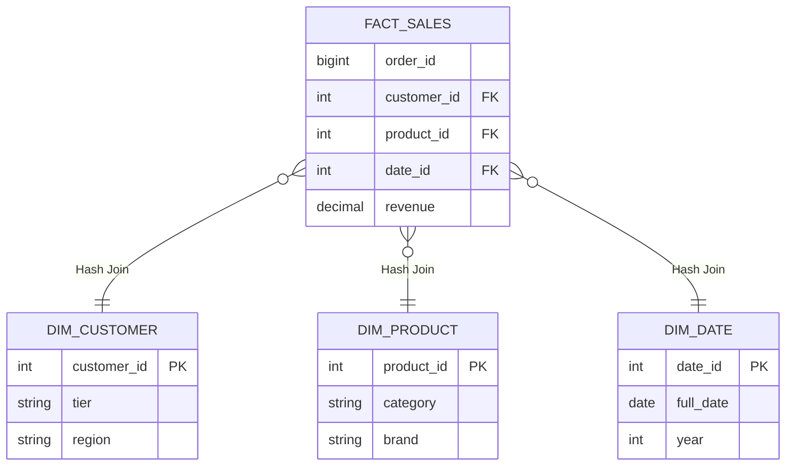

Trong thiết kế kho dữ liệu hiện đại, **Star Schema (Lược đồ hình sao)** hay Dimensional Modeling của Ralph Kimball không chỉ là một khái niệm logic. Trong kỷ nguyên của Cloud Data Warehouse và Lakehouse, nó là bài toán tối ưu hóa Physical Execution (thực thi vật lý) trên các Distributed Compute Engines (như Spark, Snowflake, BigQuery) và là trái tim của lớp **Gold Layer** trong kiến trúc Medallion.

Thay vì những định nghĩa sách giáo khoa nhàm chán "Bảng Fact là gì? Bảng Dim là gì?", bài viết này sẽ mổ xẻ cấu trúc vật lý của Star Schema, các sự cố tràn RAM (`Spill-to-disk` / `OOM`) khi thực thi truy vấn, và cách các engine hiện đại xử lý chúng.

---

## 1. Vai trò trong Kiến Trúc Medallion (Lakehouse)

Các hệ thống hiện đại (như Databricks) áp dụng kiến trúc Medallion gồm 3 lớp:
1. **Bronze (Raw):** Chứa dữ liệu gốc (JSON/CSV) vừa ingest từ Kafka/CDC.
2. **Silver (Cleansed):** Dữ liệu được làm sạch, deduplicate, thường tổ chức dưới dạng Data Vault hoặc 3NF.
3. **Gold (Presentation):** Lớp này **bắt buộc** phải thiết kế theo **Star Schema**. Đây là lớp cung cấp dữ liệu trực tiếp cho BI Tools (PowerBI, Tableau) hoặc Machine Learning. Star Schema giúp giảm thiểu các phép JOIN phức tạp, mang lại hiệu năng truy vấn (Query Performance) cao nhất và trải nghiệm trực quan nhất cho Data Analysts.

---

## 2. Kiến trúc Thực thi Vật lý (Physical Execution)

Về mặt logic, Star Schema là một Fact Table khổng lồ ở trung tâm bao quanh bởi các Dimension Tables nhỏ bé. Nhưng ở tầng vật lý, khi người dùng chạy một lệnh `SELECT`, Compute Engine phải giải quyết một trong những bài toán tốn kém nhất của khoa học máy tính: **Distributed Join** (Kết nối phân tán).



### Vũ khí Tối thượng: Broadcast Hash Join (BHJ)
Trong môi trường phân tán (ví dụ: Apache Spark / Databricks), Star Schema cực kỳ tỏa sáng nhờ cơ chế **Broadcast Hash Join**. 

Vì các bảng Dimension thường rất nhỏ (vài MB đến vài chục MB), Engine sẽ sao chép (Broadcast) toàn bộ bảng Dimension này lên RAM của tất cả các Worker nodes trong Cluster. 
Bảng Fact (có thể lến tới vài chục Terabytes) sẽ được chia nhỏ thành các Partitions và đọc song song (Stream) qua các Worker. Khi Stream đến đâu, dữ liệu Fact sẽ tra cứu (Lookup) vào bảng Dimension đang nằm sẵn trên RAM đến đó.

**Kết quả:** Hoàn toàn KHÔNG xảy ra hiện tượng **Network Shuffle** đối với bảng Fact. Dữ liệu chỉ đọc lên và trả về, cho Latency siêu thấp.

```yaml
# Cấu hình Spark/Databricks để ép buộc Broadcast Join
# Tăng ngưỡng broadcast lên 100MB (Mặc định là 10MB) để nạp lọt các bảng Dim lớn
spark.sql.autoBroadcastJoinThreshold: 104857600 
```

---

## 3. Rủi ro Vận hành (Operational Risks & Incidents)

Dù lý thuyết thiết kế rất đẹp, khi Scale hệ thống lên hàng tỷ records, Star Schema sẽ gặp những sự cố "đẫm máu" thực tế sau:

### 3.1. OOMKilled & Spill-to-Disk (Khi BHJ Thất Bại)
Khi một bảng Dimension phình to vượt quá giới hạn RAM cấp phát của một Worker node (ví dụ bảng `dim_users` của một ứng dụng toàn cầu lên tới 100 triệu bản ghi tương đương 10GB), quá trình Broadcast sẽ thất bại (văng lỗi OOM). Engine buộc phải tự động fallback (chuyển lùi) về thuật toán **Sort-Merge Join (SMJ)**.

Lúc này, toàn bộ bảng Fact khổng lồ sẽ bị ép phải `Shuffle` (bay qua lại) trên mạng lưới để gom các keys về cùng một node tiến hành Sort. 
**Hậu quả:**
1. **Network I/O Bottleneck:** Hàng Terabyte dữ liệu bị đẩy qua lại giữa các node, làm bão hòa băng thông mạng của Cluster.
2. **Spill-to-disk:** Vùng nhớ RAM của Worker bị đầy, dữ liệu phải xả tạm (Spill) xuống ổ cứng (Disk). Lệnh truy vấn bình thường chạy 5 giây nay biến thành 5 tiếng.

**Khắc phục thực chiến:**
- **Databricks:** Áp dụng **Liquid Clustering** trên các khóa ngoại (Foreign Keys) của bảng Fact. Liquid Clustering tự động sắp xếp layout dữ liệu vật lý theo cụm, giảm thiểu cực lớn lượng dữ liệu phải scan khi SMJ xảy ra.
- **Snowflake:** Cấu hình **Automatic Clustering** trên khóa ngoại để kích hoạt Micro-partition Pruning (Cắt tỉa phân vùng).

### 3.2. Sự cố Cartesian Explosion (Bùng nổ tích Đề-các)
Sự cố này thường xảy ra khi quản lý Dimension bằng SCD Type 2 (Lưu vết lịch sử). Nếu thiết kế Khóa nhân tạo (Surrogate Key) không chuẩn, hoặc Data Engineer quên viết mệnh đề lọc khoảng thời gian (`valid_from <= fact.date < valid_to`), một dòng Fact có thể join trúng 3 versions lịch sử của cùng một bản ghi Dimension. Kết quả bảng Output bị x3, x10 dung lượng, tính sai doanh thu và làm sập (Crash) toàn bộ luồng BI phía sau.

---

## 4. Code Thực Chiến: Cập nhật Dimension với SCD Type 2

Khi thiết kế Star Schema, bài toán hóc búa nhất (và tốn I/O nhất) là xử lý sự thay đổi của bảng chiều (Slowly Changing Dimensions - SCD). 
Dưới đây là một pattern `MERGE` kinh điển (Snowflake/Databricks SQL) để xử lý SCD Type 2: Lưu giữ toàn bộ lịch sử thay đổi thông tin khách hàng mà không ghi đè dữ liệu cũ.

```sql
-- Pattern thực tế tại các Enterprise Data Warehouse để upsert SCD Type 2
MERGE INTO target.dim_customer t
USING (
    SELECT 
        customer_id,
        tier,
        region,
        current_timestamp() as updated_at
    FROM staging.raw_customer_cdc
) s
ON t.customer_id = s.customer_id 
   AND t.is_active = TRUE
   
WHEN MATCHED AND (t.tier != s.tier OR t.region != s.region) THEN 
    -- Bước 1: Đóng băng bản ghi cũ (Expire) thay vì xóa bỏ
    UPDATE SET 
        is_active = FALSE,
        valid_to = s.updated_at

WHEN NOT MATCHED THEN 
    -- Bước 2: Insert bản ghi hoàn toàn mới (hoặc version mới của khách cũ)
    INSERT (customer_id, tier, region, is_active, valid_from, valid_to)
    VALUES (s.customer_id, s.tier, s.region, TRUE, s.updated_at, '9999-12-31');
```
*(Lưu ý: Trong quy trình ELT hiện đại với dbt (data build tool), logic loằng ngoằng này được đóng gói tự động bằng tính năng `dbt snapshots`).*

---

## 5. Systemic Trade-offs: Star Schema vs. OBT (One Big Table)

Trong kỷ nguyên của Cloud Data Warehouse nơi giá Storage rẻ như cho (như BigQuery, Snowflake), một mô hình đối nghịch đang lên ngôi: **One Big Table (OBT)** - gom toàn bộ Fact và Dimension thành một bảng siêu rộng (Denormalization hoàn toàn) với hàng trăm cột.

Dưới góc nhìn thiết kế hệ thống, đây là bảng so sánh lõi:

| Tiêu Chí |" Star Schema (Normalized Dimensions) "| One Big Table (OBT) |
| :--- | :--- | :--- |
| **Compute Cost (CPU)** |" Cao (Tốn Compute Cycle để Join liên tục tại Runtime). "| Thấp (Dữ liệu đã dẹt, CPU chỉ việc tuần tự SCAN và Aggregation). |
| **Storage Cost & I/O** |" Thấp (Dữ liệu Dimension không bị lặp lại). "| Rất Cao (Thông tin text của Dimension lặp lại hàng tỷ lần, tăng Disk I/O). |
| **Data Consistency** |" Tuyệt đối (Cập nhật 1 lần ở Dimension là toàn bộ Fact nhận ngữ cảnh mới). "| Yếu (Cập nhật 1 Region của Customer phải quét và UPDATE lại hàng triệu dòng Fact, gây Write Amplification). |

**Thiết kế chuẩn mực (Architecture Best Practice):** 
Các công ty công nghệ có quy mô data siêu lớn (Uber, Netflix) thường áp dụng mô hình **Hybrid (Lai)**:
Họ duy trì `Gold Layer` bằng **Star Schema** để đảm bảo Governance, Data Quality, và Single Source of Truth. Tuy nhiên, trước khi đẩy dữ liệu ra Data Mart phục vụ Machine Learning Feature Store hoặc bảng Dashboard (Tableau), họ thiết kế một Data Pipeline cuối cùng để flatten (làm dẹt) Star Schema thành các OBT. Điều này giúp hệ thống phục vụ các truy vấn Point-in-time cho BI Users cực nhanh (không tốn time JOIN).

---

## 6. Tối ưu Chi phí (FinOps) cho Lược đồ Hình Sao

Nếu hệ thống của bạn sử dụng Snowflake hoặc Databricks Serverless, join Star Schema sai cách có thể đốt hàng ngàn USD tiền Compute mỗi tháng:
- **Nguyên tắc "Just enough":** Tuyệt đối cấm thói quen `SELECT *` qua nhiều bảng Dimension. Càng lấy nhiều cột string từ Dimension, kích thước dữ liệu [Payload] khi Join càng lớn, đẩy lượng Memory Usage của Worker lên cao và rất dễ gây ra hiện tượng `Spill to Remote Storage` (tràn RAM).
- **Tận dụng Join Elimination:** Optimizer của Databricks/Snowflake rất thông minh. Nếu bạn JOIN Fact với `Dim_Product` ở mệnh đề `FROM`, nhưng trong mệnh đề `SELECT` cuối cùng không gọi bất kỳ cột nào của `Dim_Product`, Engine sẽ tự động **cắt bỏ (Eliminate)** lệnh Join đó khỏi đồ thị thực thi (DAG) để tiết kiệm tiền. Hãy lợi dụng tính năng này khi xây dựng các `Semantic Views` khổng lồ dùng chung cho toàn công ty.

---

## Nguồn Tham Khảo (References)
* [Databricks: Five Best Practices for Data Modeling on Delta Lake][https://www.databricks.com/blog/2022/05/20/five-best-practices-for-data-modeling-on-delta-lake.html]
* [Snowflake: Understanding Micro-partitions and Automatic Clustering][https://docs.snowflake.com/en/user-guide/tables-clustering-micropartitions]
* [Netflix Tech Blog: Data Mesh & Dimensional Modeling Patterns][https://netflixtechblog.com/]
* [dbt Labs: Star Schema vs OBT in modern cloud architectures](https://www.getdbt.com/blog/star-schema-vs-obt/]
