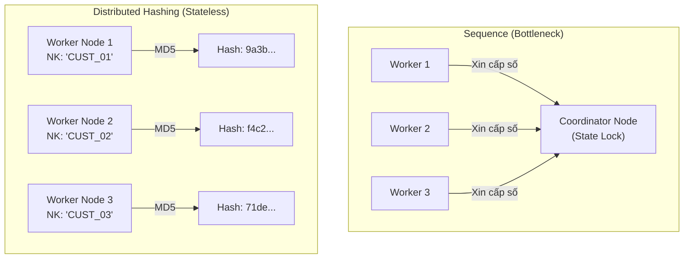

Trong môi trường Data Warehouse phân tán (Distributed Data Warehouse), việc liên kết các chiều dữ liệu (Dimensions) và bảng sự kiện (Facts) đòi hỏi một khóa định danh duy nhất. Khác với OLTP (nơi dùng Natural/Business Key như `user_id` hay `email`), Data Warehouse phải quản lý lịch sử (Slowly Changing Dimensions - SCD) và giải quyết tính không đồng nhất từ nhiều nguồn. Đây là lúc **Surrogate Key (Khóa thay thế)** phát huy tác dụng.

Tuy nhiên, dưới lăng kính của một Staff Data Engineer, bài toán thực sự không nằm ở việc "tạo ra một ID tự tăng" (`AUTO_INCREMENT`), mà là làm sao để tạo ra hàng tỷ ID một cách song song trên một cụm máy chủ MPP (Massively Parallel Processing) khổng lồ mà không gây nghẽn mạng (Network Bottleneck) ở bộ định tuyến trung tâm.

## 1. Physical Execution: Sequence Generators vs. Hash-Based Keys

Trong các hệ quản trị cơ sở dữ liệu truyền thống (SMP - Symmetric Multiprocessing như SQL Server hay PostgreSQL), Surrogate Key thường được sinh ra bằng cấu trúc `IDENTITY(1,1)` hoặc `SEQUENCE`. Cơ sở dữ liệu sẽ khóa (lock) một state nội bộ, cấp phát số nguyên tiếp theo, và nhả lock.

Nhưng khi chuyển sang nền tảng MPP (Snowflake, BigQuery, Databricks), cấu trúc này trở thành một "thảm họa" về hiệu suất.

### The Distributed Coordinator Bottleneck (Nút thắt cổ chai Phân tán)
Nếu bạn có 100 worker nodes cùng insert dữ liệu vào một bảng, việc sử dụng `SEQUENCE` đòi hỏi các nodes phải liên tục giao tiếp với một Coordinator node trung tâm (hoặc Leader node) để xin cấp phát dải số tiếp theo. Điều này phá vỡ tính chất "Shared-Nothing" của MPP, tạo ra độ trễ mạng (Network Latency) khổng lồ và Lock Contention.



### Giải pháp: Deterministic Hashing [Băm tất định]
Để loại bỏ sự phụ thuộc vào trạng thái trung tâm (Stateless Generation), xu hướng Modern Data Stack (đặc biệt là khi dùng dbt) chuyển sang sử dụng **Hash-based Surrogate Keys**. Các worker nodes có thể băm (hash) Natural Key kết hợp với các thuộc tính nghiệp vụ (như `source_system`) bằng một hàm thuật toán (MD5, SHA-256) một cách hoàn toàn độc lập và song song.

## 2. Code Thực chiến: Implement Surrogate Key trong Cloud DWH

Dưới đây là cách triển khai Surrogate Key sử dụng Hashing thông qua **dbt (Data Build Tool)** và các hàm native của Cloud Data Warehouse.

### Sử dụng dbt Macro
dbt cung cấp macro `generate_surrogate_key` giúp chuẩn hóa việc tạo Hash Key, xử lý các vấn đề nhức nhối như Null values và Type casting ngầm (ngăn chặn việc hash giá trị NULL thành chuỗi rỗng một cách không kiểm soát).

```sql
-- models/dimensions/dim_customers.sql
{{ config(materialized='table') }}

WITH source_data AS (
    SELECT 
        customer_id,
        source_system,
        email,
        updated_at
    FROM {{ ref('stg_salesforce_customers') }}
)

SELECT 
    -- Tạo Hash Key bằng MD5 kết hợp Natural Key và Source System
    {{ dbt_utils.generate_surrogate_key(['customer_id', 'source_system']] }} AS customer_sk,
    customer_id AS business_key,
    email,
    -- Phục vụ SCD Type 2
    updated_at AS valid_from,
    LEAD(updated_at) OVER (PARTITION BY customer_id ORDER BY updated_at) AS valid_to
FROM source_data;
```

### Native Cloud DWH Functions
Nếu không dùng dbt, mỗi engine có một hàm băm tối ưu riêng:
- **BigQuery:** Ưu tiên dùng `FARM_FINGERPRINT()` vì nó trả về số nguyên `INT64` (chiếm 8 bytes) thay vì chuỗi string (MD5 chiếm 32 bytes). Join trên số nguyên trên BigQuery giúp tăng tốc độ CPU và giảm Memory Shuffle lên cực nhiều.
  ```sql
  -- Tối ưu cho BigQuery
  SELECT FARM_FINGERPRINT(CONCAT(CAST(customer_id AS STRING), '|"', source_system)) AS customer_sk
  ```
- **Snowflake:** `MD5()` trả về VARCHAR(32). Mặc dù Join trên chuỗi chậm hơn số nguyên, nhưng kiến trúc Micro-partition của Snowflake nén (dictionary encoding) chuỗi rất tốt, khiến sự chênh lệch này không quá đáng kể.

## 3. Systemic Trade-offs: Hashing vs. Sequence

Quyết định sử dụng Hash hay Sequence là một bài toán trade-off (đánh đổi) kinh điển trong System Design:

"| Tiêu chí |" Hash-based Key (MD5 / FARM_FINGERPRINT) "| Sequence-based Key (Identity / Auto-increment) |
| :--- | :--- | :--- |
| **Idempotency (Tính luỹ đẳng)** |" **Tuyệt đối.** Chạy lại (Backfill) 100 lần vẫn ra cùng một chuỗi Hash cho cùng một dòng dữ liệu. Rất quan trọng trong hệ thống ELT. "| **Kém.** Nếu bạn truncate bảng và load lại, các dòng cũ sẽ nhận ID mới, làm gãy toàn bộ bảng Fact đang tham chiếu. |
| **Storage / RAM footprint** | Khá cao. MD5 String chiếm 32 bytes. Nếu Fact table có 50 tỷ dòng, dung lượng lưu trữ và RAM khi load vào bộ nhớ để JOIN sẽ phình to rõ rệt. | **Cực thấp.** INT hoặc BIGINT (4-8 bytes). Tối ưu cho bộ nhớ và CPU Cache (Data Locality). |
| **Network Shuffle / Bottleneck** | Không có Bottleneck. Hỗ trợ Compute scale-out tuyến tính. | Gây Lock Contention ở Coordinator node. Có thể làm giảm Write Throughput. |

### Rủi ro: Hash Collisions (Đụng độ Hash)
Theo **Nghịch lý Ngày sinh (Birthday Paradox)**, hàm MD5 (128-bit) có khả năng sinh ra hai chuỗi Hash giống nhau từ hai đầu vào khác nhau. Tuy nhiên, tỷ lệ này là cực kỳ thiên văn (khoảng 1 trên $2^{64}$). Trong các tập dữ liệu dưới vài trăm tỷ dòng, xác suất đụng độ là không đáng kể. 

## 4. Rủi ro Vận hành (Operational Risks): Early Arriving Facts

Trong Data Streaming hoặc Micro-batching, bạn sẽ gặp một "ác mộng" kinh điển: **Early Arriving Facts** (hay Late Arriving Dimensions).

Giả sử một giao dịch thanh toán (Fact) của khách hàng `CUST-999` đẩy vào Kafka và load thẳng vào DWH. Tuy nhiên, thông tin chi tiết của khách hàng `CUST-999` từ hệ thống CRM (Dimension) bị trễ mạng (Network Delay) và chưa có trong bảng `dim_customers`. 

Nếu ETL job của bảng Fact cố gắng lấy Natural Key (`CUST-999`) đi Hash và JOIN để kiểm tra, nó sẽ không tìm thấy trong Dimension, trả về `NULL` Surrogate Key và phá vỡ Referential Integrity (Toàn vẹn tham chiếu). Hệ lụy là Dashboard bị mất doanh thu của giao dịch đó.

### Giải pháp: Ghost Rows (Dòng Bóng ma)
Luôn khởi tạo các dòng "Bóng ma" mang Negative Surrogate Keys (hoặc Hash đặc biệt) trong bảng Dimension:
- `SK = '-1' / 'md5(-1)'`: Dành cho các Early Arriving Facts (Unknown). Giao dịch sẽ map với khách hàng "Unknown". Khi dữ liệu Dimension đến sau, bạn chỉ cần UPDATE lại thông tin vào dòng `-1` (hoặc cấu trúc lại logic SCD).
- `SK = '-2'`: Not Applicable (Giao dịch không yêu cầu khách hàng).

```sql
-- Khởi tạo Dummy Rows cho Dim_Customers trên Snowflake
INSERT INTO dim_customers (customer_sk, business_key, email, status)
VALUES 
  (MD5('-1'), 'UNKNOWN', 'unknown@system.local', 'N/A'),
  (MD5('-2'), 'NOT_APPLICABLE', 'none', 'N/A');
```
Kỹ thuật này đảm bảo mọi truy vấn `INNER JOIN` sẽ không làm "bốc hơi" [drop] các dòng Fact bị thiếu Dimension, giữ cho Metric tổng doanh thu (Sum of Revenue) luôn chính xác 100%.

## 5. Tổng kết

Việc chọn thiết kế Surrogate Key phản ánh độ trưởng thành của hệ thống Data Platform:
- Nếu bạn ở quy mô nhỏ, dùng PostgreSQL hoặc Redshift đời đầu, `IDENTITY` (Sequence) mang lại hiệu năng JOIN siêu việt với chi phí storage thấp.
- Nếu bạn xây dựng hệ thống MPP phân tán hiện đại, ưu tiên tính Idempotency và độ ổn định của ELT Pipelines, **Deterministic Hashing** thông qua dbt (hoặc `FARM_FINGERPRINT` trên BigQuery) là con đường kỹ thuật tốt nhất (Engineering Best Practice). Đừng sợ chi phí lưu trữ của Hash String; các định dạng Columnar (Parquet, Snowflake micro-partitions) nén chuỗi lặp lại rất hiệu quả.

## 6. Nguồn Tham Khảo (References)
* [Databricks Blog - Identity Columns to Generate Surrogate Keys](https://www.databricks.com/blog/2022/08/08/identity-columns-to-generate-surrogate-keys.html)
* [dbt Labs - A complete guide to surrogate keys and why they matter](https://docs.getdbt.com/blog/guide-to-surrogate-keys)
* [Google Cloud BigQuery Documentation: Hash Functions](https://cloud.google.com/bigquery/docs/reference/standard-sql/hash_functions)
* Kleppmann, M. (2017). *Designing Data-Intensive Applications*. O'Reilly Media.
