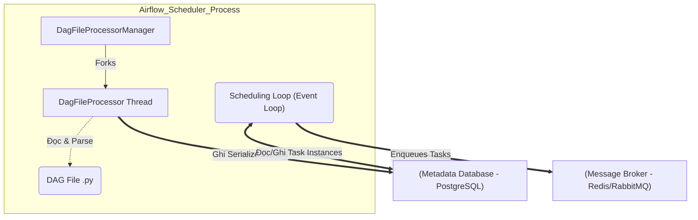

Thay vì định nghĩa chung chung kiểu "Scheduler là bộ não lên lịch", ở góc nhìn System Engineering, **Airflow Scheduler** thực chất là một tiến trình Python chạy vòng lặp vô hạn (Infinite Loop). Nhiệm vụ cốt lõi của nó là phân tích (Parse) cấu trúc đồ thị có hướng (DAG), duy trì State Machine của các Task, và tranh giành tài nguyên để nạp task vào hàng đợi (Queue) cho Executor xử lý.

Từ phiên bản Airflow 2.0, Scheduler không còn là Điểm chết chùm (Single Point of Failure - SPOF) nhờ thiết kế **High Availability (HA)**. Dưới đây, chúng sẽ mổ xẻ cách cỗ máy này vận hành dưới hạ tầng vật lý.

---

## 1. Kiến trúc Thực thi Vật lý (Physical Execution)

Một Scheduler process không làm việc một mình. Để tránh bị block, nó tách hệ thống thành 2 vòng lặp (Loops) chạy song song:



1. **Parsing Loop (`DagFileProcessor`)**: Trình quản lý này liên tục quét thư mục `dags/`. Nó fork ra các tiến trình con để thực thi code Python, biên dịch thành cấu trúc đồ thị (DAG) và ghi dưới dạng dữ liệu tuần tự hóa (Serialized DAG) vào Database. Việc bật tính năng `store_serialized_dags = True` giúp các Webserver và Scheduler khác chỉ cần đọc cấu trúc từ DB thay vì phải liên tục đọc file, giảm tải CPU cực lớn.
2. **Scheduling Loop**: Vòng lặp chính liên tục query bảng `task_instance` (TI) trong Database, kiểm tra xem các TIs nào đã thỏa mãn dependencies (upstream success) để đẩy trạng thái sang `Scheduled`, sau đó ném vào Queue (như Celery qua Redis) để Executor phân phối cho Worker thực thi.

---

## 2. High Availability (HA) và Cơ chế SKIP LOCKED

Trong kiến trúc Active-Active HA, bạn sẽ chạy 2 hoặc nhiều Pods Scheduler đồng thời. Vấn đề kinh điển của hệ thống phân tán xuất hiện: **Làm sao để 2 Schedulers không gắp (pick) cùng một Task Instance rồi đẩy vào hàng đợi 2 lần?**

Airflow giải quyết bằng cơ chế **Row-level locking** tại tầng Database (bắt buộc dùng PostgreSQL 9.6+ hoặc MySQL 8.0+), cụ thể là câu lệnh `SELECT ... FOR UPDATE SKIP LOCKED`.

Khi Scheduler 1 quét DB để tìm các task sẵn sàng chạy:
```sql
SELECT * FROM task_instance 
WHERE state = 'scheduled' 
ORDER BY priority_weight DESC 
FOR UPDATE SKIP LOCKED 
LIMIT 32;
```
Câu lệnh này báo cho PostgreSQL: *"Hãy khóa (lock) 32 tasks này lại cho tôi xử lý. Nếu có dòng (row) nào đang bị Scheduler 2 khóa rồi, hãy bỏ qua (SKIP LOCKED) và lấy dòng tiếp theo"*. 

**Đánh đổi (Trade-off):** Mọi gánh nặng (bottleneck) về IOPS và Concurrency giờ đây dồn hết về Metadata Database. Nếu Database chậm, toàn bộ luồng Scheduling sẽ bị thắt cổ chai.

---

## 3. Cái bẫy "Top-level Code" (DDoS CPU Scheduler)

Do vòng lặp Parsing Loop diễn ra liên tục (mặc định mỗi 30 giây nó sẽ đọc và thực thi lại toàn bộ file trong thư mục `dags/`), **bất kỳ đoạn logic nào nằm ngoài các khối Operators** đều sẽ bị chạy đi chạy lại.

### ❌ Bad Practice (Gây sập CPU)
Đoạn code dưới đây thực hiện gọi API HTTP hoặc truy vấn Pandas ngay cấp cao nhất của file. Hậu quả: Dù DAG chưa đến lịch chạy, API này vẫn bị gọi 2880 lần/ngày (cứ 30s gọi 1 lần). CPU của Scheduler chạm đỉnh 100%.

```python
from airflow import DAG
from airflow.operators.python import PythonOperator
from datetime import datetime
import requests

# TOP-LEVEL CODE TỒI TỆ: Bị thực thi liên tục bởi Parsing Loop!
api_response = requests.get("https://api.external.com/data")
data_list = api_response.json()

def process_data():
    for item in data_list:
        print(item)

with DAG("bad_dag_design", start_date=datetime(2023, 1, 1), schedule_interval="@daily") as dag:
    task = PythonOperator(task_id="process", python_callable=process_data)
```

### ✅ Good Practice (Lazy Execution)
Bắt buộc đẩy toàn bộ logic "nặng" (Import thư viện nặng, gọi API, truy vấn DB) vào bên trong callable của Operator. Lúc này, Parsing Loop chỉ đọc "cấu trúc hàm" mà không thực thi nó.

```python
def process_data():
    # LAZY EXECUTION: Logic này chỉ chạy khi Worker thực sự nhận lệnh chạy Task
    import pandas as pd
    api_response = requests.get("https://api.external.com/data")
    # ... logic xử lý ...

with DAG("good_dag_design", start_date=datetime(2023, 1, 1), schedule_interval="@daily") as dag:
    task = PythonOperator(task_id="process", python_callable=process_data)
```

---

## 4. Rủi ro Vận hành (Operational Risks) & Trade-offs

Dưới đây là các sự cố hệ thống thực tế (Incidents) thường gặp khi vận hành Airflow ở quy mô lớn (hàng ngàn DAGs) và cách xử lý.

### 4.1. Database Lock Contention (Nút thắt cổ chai DB)
* **Triệu chứng:** Task bị kẹt ở trạng thái `Scheduled` rất lâu. Scheduler log xuất hiện cảnh báo *"DAG scheduling was skipped, probably because the DAG record was locked"*. Bảng `task_instance` phình to.
* **Nguyên nhân:** Khi chạy quá nhiều Schedulers hoặc tăng `max_tis_per_query` lên quá cao, lượng truy vấn `FOR UPDATE` đổ dồn về RDS/Cloud SQL làm cạn kiệt Connection Pool hoặc gây Lock Timeout.
* **Khắc phục:** 
  - Bắt buộc phải chạy **PgBouncer** (Connection Pooler) đứng trước PostgreSQL.
  - Sử dụng lệnh `airflow db clean` định kỳ để dọn rác lịch sử. 
  - Đảm bảo tính năng `autovacuum` của PostgreSQL được bật, hoặc chạy `VACUUM ANALYZE` định kỳ trên bảng `task_instance`.

### 4.2. Zombie Tasks và "Zombie Killer"
* **Triệu chứng:** Task có trạng thái `Running` trên giao diện UI, nhưng tiến trình Worker vật lý xử lý nó (trên Celery/K8s) đã chết queo (ví dụ Node bị OOMKilled hoặc Spot Instance bị thu hồi).
* **Nguyên nhân:** Worker chết đột ngột nên không kịp báo trạng thái `Failed` về Database.
* **Cơ chế xử lý:** Scheduler có một luồng chạy ngầm gọi là **Zombie Killer**. Nó kiểm tra nhịp tim (heartbeat) của các task đang chạy. Nếu quá ngưỡng `scheduler_zombie_task_threshold` không thấy cập nhật, nó sẽ mạnh tay chém task đó thành `Failed` và kích hoạt luồng Retry. 

### 4.3. Lỗi Visibility Timeout của Celery Executor
* **Sự cố:** Task dài bị chạy lại 2 lần (Duplicate runs). 
* **Nguyên nhân:** Celery đẩy task vào Broker (Redis/RabbitMQ). Broker có cấu hình `visibility_timeout` (mặc định vài giờ). Nếu Task chạy quá lâu vượt qua khoảng thời gian này, Broker tưởng Worker đã chết, bèn cho task "hiện hình" lại để Worker khác gắp.
* **Khắc phục:** Đảm bảo `visibility_timeout` trong `celery_broker_transport_options` phải lớn hơn thời gian chạy của Task dài nhất trong toàn hệ thống.

---

## 5. Tối ưu Cấu hình Scheduler (Performance Tuning)

Để tối ưu, bạn phải cân bằng giữa **Độ trễ thấp (Low Latency)** và **Tải CPU (FinOps)**.

| Tham số cấu hình | Ý nghĩa & Trade-off |
| :--- | :--- |
| `parsing_processes` | Số lượng luồng con parse DAG file. Tăng lên giúp phát hiện code mới nhanh, nhưng ngốn CPU. Công thức chuẩn: `2 * CPU_cores - 1`. |
| `min_file_process_interval` | Thời gian nghỉ trước khi parse lại một file. Mặc định `30`s. Nếu DAG ít thay đổi, hãy tăng lên `60` hoặc `120` để giảm áp lực cho CPU. Đánh đổi: Code mới push sẽ mất 1-2 phút mới cập nhật. |
| `worker_concurrency` | (Phía Celery) Số lượng task tối đa mà một Worker Node được chạy song song. Tăng quá cao sẽ gây OOMKilled trên Worker. |
| `max_tis_per_query` |" Số task bốc từ DB mỗi vòng lặp Scheduler (Batch size). Tăng lên sẽ đẩy task vào Queue nhanh hơn, nhưng dễ gây Database Lock Contention. "|

```yaml
# Helm values.yaml cho Airflow Scheduler Tuning
scheduler:
  resources:
    requests:
      cpu: "1000m"
      memory: "2Gi"
    limits:
      cpu: "2000m"
      memory: "4Gi" # Đảm bảo đủ RAM cho Parsing Loop chống OOM
config:
  scheduler:
    min_file_process_interval: 60 
    parsing_processes: 4
    max_tis_per_query: 512
```

---

## Nguồn Tham Khảo [References]
* [Apache Airflow Architecture Overview][https://airflow.apache.org/docs/apache-airflow/stable/core-concepts/overview.html]
* [Airflow Scheduler Internals & High Availability][https://airflow.apache.org/docs/apache-airflow/stable/administration-and-deployment/scheduler.html]
* [Astronomer: Airflow Components and Architecture Tuning][https://docs.astronomer.io/learn/airflow-components]
* [Designing Data-Intensive Applications (O'Reilly]](https://dataintensive.net/)
