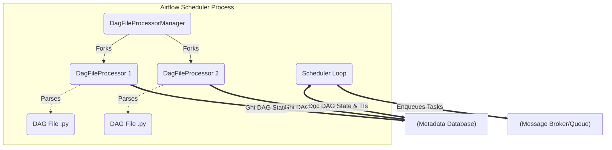

Thay vì định nghĩa chung chung kiểu "Scheduler là bộ não lên lịch", ở góc nhìn System Engineering, **Airflow Scheduler** thực chất là một tiến trình chạy vòng lặp vô hạn (infinite loop) bằng Python. Nhiệm vụ cốt lõi của nó là tính toán đồ thị có hướng (DAG), quản lý State Machine của các Task, và tranh giành tài nguyên để nạp task vào hàng đợi (Queue) cho Executor xử lý.

Từ Airflow 2.0, Scheduler không còn là Single Point of Failure (SPOF) nhờ thiết kế High Availability (HA). Chúng ta sẽ mổ xẻ cách hệ thống này vận hành dưới hạ tầng vật lý.

---

## Kiến trúc Thực thi Vật lý (Physical Execution)

### 1. Phân rã tiến trình Scheduler

Một Scheduler process không làm việc một mình. Nó sinh ra (fork) các tiến trình con thông qua module **DagFileProcessorManager**:



Hai vòng lặp chạy song song độc lập trong Scheduler:
1. **Parsing Loop (`DagFileProcessor`)**: Quét thư mục `dags/`, thực thi các file Python, xây dựng cấu trúc DAG và ghi metadata (Serialized DAG) vào Database.
2. **Scheduling Loop**: Liên tục query bảng `task_instance` (TI) trong Database, kiểm tra xem các TIs nào đã thỏa mãn dependencies (upstream success) để đẩy trạng thái sang `Scheduled`, sau đó ném vào Queue (Celery/Kubernetes) để Executor thực thi.


### 2. High Availability (HA) và Cơ chế SKIP LOCKED

Trong kiến trúc Active-Active HA, bạn chạy 2 hoặc nhiều Scheduler nodes đồng thời. Vấn đề kinh điển của hệ thống phân tán xuất hiện: **Làm sao để hai Schedulers không gắp (pick) cùng một Task Instance rồi đẩy vào hàng đợi 2 lần?**

Airflow giải quyết bằng cơ chế **Row-level locking** tại tầng Database (bắt buộc dùng PostgreSQL 9.6+ hoặc MySQL 8.0+), cụ thể là câu lệnh `SELECT ... FOR UPDATE SKIP LOCKED`.

Khi Scheduler 1 quét DB để tìm task chạy:
```sql
SELECT * FROM task_instance 
WHERE state = 'scheduled' 
ORDER BY priority_weight DESC 
FOR UPDATE SKIP LOCKED 
LIMIT 32;
```
Câu lệnh này báo cho PostgreSQL: "Hãy khóa (lock) 32 tasks này lại cho tôi xử lý. Nếu có dòng nào đang bị Scheduler khác khóa, hãy bỏ qua (SKIP LOCKED) và lấy dòng tiếp theo". 
* **Đánh đổi (Trade-off):** Mọi gánh nặng (bottleneck) về IOPS và Concurrency giờ đây dồn hết về Metadata Database.

---

## Kẻ thù số 1: "Top-level Code" trong DAG

Do vòng lặp Parsing Loop diễn ra liên tục (mặc định mỗi 30 giây nó sẽ parse lại toàn bộ thư mục `dags/`), **bất kỳ đoạn logic nào nằm ngoài các Operators** đều sẽ bị chạy đi chạy lại.

### ❌ Bad Practice (Gây sập CPU Scheduler)
Đoạn code dưới đây sẽ thực hiện API HTTP request hoặc truy vấn Database *mỗi lần Scheduler quét file* (30s/lần), kể cả khi DAG không hề được kích hoạt. Hậu quả là CPU của Scheduler chạm 100% hoặc gây DDoS cho hệ thống API bên thứ ba.

```python
from airflow import DAG
from airflow.operators.python import PythonOperator
from datetime import datetime
import requests

# TOP-LEVEL CODE: Bị gọi liên tục bởi DagFileProcessor!
api_response = requests.get("https://api.external.com/data")
data_list = api_response.json()

def process_data():
    for item in data_list:
        print(item)

with DAG("bad_dag_design", start_date=datetime(2023, 1, 1), schedule_interval="@daily") as dag:
    task = PythonOperator(
        task_id="process",
        python_callable=process_data
    )
```

### ✅ Good Practice (Lazy Execution)
Đẩy toàn bộ logic "nặng" vào bên trong callable của Operator hoặc sử dụng Airflow Variables/Connections. Lúc này, Parsing Loop chỉ đọc cấu trúc hàm mà không thực thi nó.

```python
def process_data():
    # Lúc này API chỉ được gọi khi Worker thực sự chạy Task này
    api_response = requests.get("https://api.external.com/data")
    data_list = api_response.json()
    for item in data_list:
        print(item)

with DAG("good_dag_design", start_date=datetime(2023, 1, 1), schedule_interval="@daily") as dag:
    task = PythonOperator(
        task_id="process",
        python_callable=process_data
    )
```

---

## Rủi ro Vận hành (Operational Risks) & Trade-offs

Dưới đây là các sự cố hệ thống thực tế (Incidents) thường gặp khi vận hành Airflow ở quy mô lớn (hàng nghìn DAGs) và cách xử lý.

### 1. Database Lock Contention (Nút thắt cổ chai DB)
* **Triệu chứng:** Task bị kẹt ở trạng thái `Scheduled` rất lâu. Trong log của Scheduler xuất hiện cảnh báo *"DAG scheduling was skipped, probably because the DAG record was locked"*.
* **Nguyên nhân:** Khi chạy quá nhiều Schedulers (HA) hoặc tăng `max_dagruns_per_loop_to_schedule` lên quá cao, lượng truy vấn `SELECT ... FOR UPDATE` đổ dồn về RDS/Cloud SQL làm cạn kiệt IOPS hoặc gây lock timeout.
* **Khắc phục:** 
  - Scale up cấu hình của Metadata DB.
  - Chỉnh `scheduler_idle_sleep_time` hoặc giới hạn `parsing_processes` để giảm tần suất query.

### 2. Zombie Tasks và "Zombie Killer"
* **Triệu chứng:** Task có trạng thái `Running` trên giao diện UI, nhưng tiến trình Worker vật lý xử lý nó đã chết queo (ví dụ Node bị OOMKilled hoặc Spot Instance bị preempted).
* **Nguyên nhân:** Worker không kịp báo trạng thái `Failed` về Database.
* **Cơ chế xử lý:** Scheduler có một luồng chạy ngầm gọi là `Zombie Killer`. Nó so sánh thời gian Worker cập nhật (heartbeat). Nếu sau khoảng thời gian `scheduler_zombie_task_threshold` (mặc định 5 phút) không thấy động tĩnh, nó sẽ mạnh tay chém task đó thành `Failed` và kích hoạt luồng Retry. 

### 3. OOMKilled trên DagFileProcessor
* **Triệu chứng:** Container Scheduler liên tục bị Kubernetes khởi động lại (CrashLoopBackOff) với lý do OOM (Out of Memory).
* **Nguyên nhân:** Thường xảy ra khi bạn dùng kỹ thuật **Dynamic DAG Generation** (sinh DAG động từ vòng lặp `for`). Trình FileProcessor phải ngốn một lượng lớn RAM để giữ toàn bộ cấu trúc các DAG động này trong bộ nhớ trước khi Serialize vào DB.
* **Khắc phục:** 
  - Tránh sinh DAG động quá phức tạp (Cartesian Explosion).
  - Sử dụng cấu hình Terraform/Helm để cô lập tài nguyên cho Scheduler:

```yaml
# Helm values.yaml cho Airflow Scheduler
scheduler:
  resources:
    requests:
      cpu: "1000m"
      memory: "2Gi"
    limits:
      cpu: "2000m"
      memory: "4Gi" # Tăng RAM cho DagFileProcessor
config:
  scheduler:
    min_file_process_interval: 60 # Giãn thời gian parse (giảm tải CPU)
    parsing_processes: 4 # Dựa trên số lượng Cores hiện có
```

---

## Tối ưu Cấu hình Scheduler (Tuning)

Tùy vào việc bạn ưu tiên **Độ trễ thấp (Low Latency)** hay **Tiết kiệm CPU (FinOps)**, hệ thống bắt buộc phải có sự đánh đổi.

| Tham số cấu hình | Ý nghĩa & Trade-off |
| :--- | :--- |
| `parsing_processes` | Số lượng worker con parse DAG file. Tăng lên giúp phát hiện code mới nhanh, nhưng ngốn CPU. Cân nhắc công thức: `2 * CPU_cores - 1`. |
| `min_file_process_interval` | Tần suất parse lại một file (giây). Mặc định là `30`. Nếu DAG ít thay đổi, tăng lên `60` hoặc `120` để giảm áp lực cho CPU. Đánh đổi: Code mới push lên sẽ mất 1-2 phút mới hiện trên UI. |
| `max_tis_per_query` | Số task bốc từ DB mỗi vòng lặp (Batch size). Tăng lên sẽ đẩy task vào Queue nhanh hơn, nhưng dễ gây Lock Contention. |
| `parallelism` | Ngưỡng chặn trên cùng: Số lượng Task Instances chạy song ví song trên **toàn bộ** cụm Airflow. |

---

## Nguồn Tham Khảo
- [Apache Airflow Architecture Overview](https://airflow.apache.org/docs/apache-airflow/stable/core-concepts/overview.html)
- [Airflow Scheduler Internals & High Availability](https://airflow.apache.org/docs/apache-airflow/stable/administration-and-deployment/scheduler.html)
- [Astronomer: Airflow Components and Architecture](https://docs.astronomer.io/learn/airflow-components)
- [Designing Data-Intensive Applications (O'Reilly)](https://dataintensive.net/)
