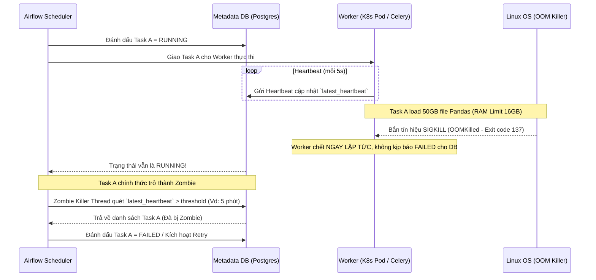
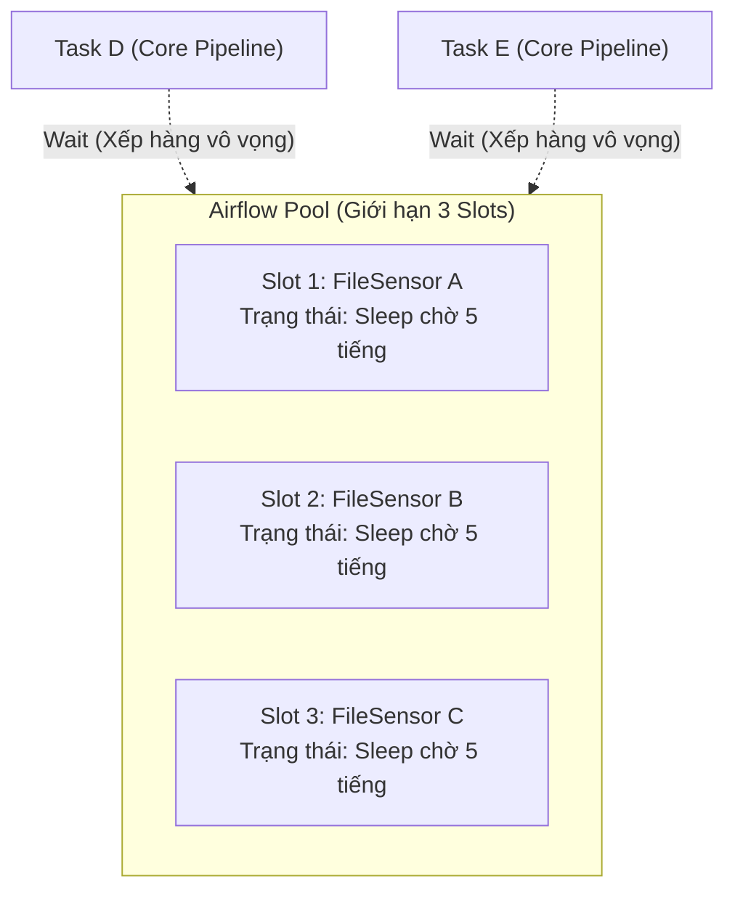

Trong quá trình Scale hệ thống Apache Airflow lên hàng ngàn DAGs (Directed Acyclic Graphs), bạn sẽ sớm đối mặt với hai thảm họa kiến trúc phổ biến nhất: **Zombie Tasks** (Tiến trình thây ma) và **Pool Starvation** (Đói tài nguyên/Thắt cổ chai). 

Đây không phải là lỗi code thông thường (Syntax Error) mà là hệ quả trực tiếp của các **Distributed System Trade-offs**: sự bất đồng bộ giữa Scheduler, Metadata Database và Executor/Worker. Bài viết này sẽ mổ xẻ nguyên lý vật lý (Physical Execution) đằng sau hai hiện tượng này, từ cấp độ hệ điều hành (OS) cho đến giải pháp cấu hình chuẩn Enterprise để giữ cho Data Platform của bạn không bị sập (Downtime).

---

## 1. Zombie Tasks: Khi State Bị Lệch Pha (State Synchronization Failure)

Trong kiến trúc phân tán của Airflow, **Zombie Task** là một Task Instance được Metadata DB (Postgres/MySQL) đánh dấu là `RUNNING`, nhưng thực tế trên Worker (Celery, Kubernetes), tiến trình vật lý đã bị huỷ diệt hoàn toàn.

Về bản chất, đây là lỗi **Split-Brain** (Não phân liệt) nhẹ giữa Worker và Database: Worker chết quá nhanh, không kịp gửi tín hiệu "Tôi chết rồi" (Status: `FAILED`) về cho DB. Do không ai báo lỗi, Scheduler vẫn ngây thơ nghĩ task đang chạy bình thường. Hậu quả là toàn bộ Pipeline đứng im vĩnh viễn (hoặc treo cho đến khi hết timeout).

### Sơ Đồ Kiến Trúc: Cơ Chế Sinh Ra Zombie Task



### 1.1. Rủi Ro Vận Hành & Nguyên Nhân Gốc (Root Causes)

- **OOMKilled (Out of Memory):** (Nguyên nhân chiếm 90%). Code Python xử lý dữ liệu lớn trực tiếp trên RAM (ví dụ: Pandas, xả file JSON khổng lồ). Khi Container/Worker vượt quá Memory Limit, Hệ điều hành (Kernel) tung ra lệnh **SIGKILL** tàn bạo. Tiến trình bị bắn bỏ ngay lập tức, không có cơ hội chạy block `finally` hay Graceful Shutdown để báo cáo FAILED.
- **Network Partition (Đứt mạng):** Worker hoàn thành task nhưng mất kết nối đến DB đúng lúc đó (ví dụ: DB connection pool cạn kiệt, lỗi DNS). Worker đóng process thành công nhưng DB không ghi nhận được trạng thái.
- **Node Eviction / Spot Instance Interruption:** Khi dùng `KubernetesExecutor` trên hạ tầng Cloud Spot Instances (giá rẻ), Node bị thu hồi thình lình, Pod bị "bốc hơi" mang theo tiến trình đang chạy.

### 1.2. Giải Pháp Cấu Hình Mức Hệ Thống

**A. Thiết lập Timeout cho MỌI Task (Thiết Yếu)**

Đừng bao giờ để Task chạy vô hạn. Nếu không có `execution_timeout`, một task kẹt mạng có thể treo hệ thống mãi mãi.

```python
from datetime import timedelta
from airflow.operators.python import PythonOperator

def heavy_processing():
    # Xử lý Pandas/Spark
    pass

# BEST PRACTICE: Bắt buộc giới hạn thời gian chạy tuyệt đối
task_a = PythonOperator(
    task_id='process_data',
    python_callable=heavy_processing,
    execution_timeout=timedelta(hours=2), # Sau 2h, tự động bị SIGTERM ngắt
    retries=3,
    retry_delay=timedelta(minutes=5)
)
```

**B. Cấu hình Resource Limits & K8s Executor**

Nếu dùng Kubernetes, hãy sử dụng `KubernetesPodOperator` hoặc cấu hình K8s Executor và xác định rõ Resource Requests/Limits. Tránh việc K8s "vô tình" Evict Pod khi Node chịu tải cao.

```yaml
# Cấu hình Pod Template trong Kubernetes Executor (pod_template.yaml)
apiVersion: v1
kind: Pod
metadata:
  name: airflow-worker
spec:
  containers:
    - name: base
      resources:
        requests:
          memory: "2Gi"
          cpu: "1"
        limits:
          memory: "8Gi" # Khống chế RAM tuyệt đối, tránh làm sập cả Node vật lý
          cpu: "2"
```

**C. Tối ưu Zombie Killer Configuration [airflow.cfg]**

Nếu pipeline của bạn có đặc thù chạy task rất nặng, dễ rớt mạng tạm thời, bạn có thể tune lại tham số timeout của Scheduler để tránh đánh dấu nhầm thành Zombie (False Positive):

```ini
[scheduler]
# Định kỳ bao lâu [giây] Thread của Scheduler sẽ đi quét tìm Zombie
zombie_detection_interval = 20

# MA THUẬT: Task không gửi heartbeat sau bao lâu (giây) thì bị coi là Zombie.
# Mặc định là 5 phút (300s). Nếu network hay chập chờn, tăng lên 600s.
scheduler_zombie_task_threshold = 300

[celery]
# Rất quan trọng để tránh Memory Leak trên Celery Worker:
# Bắt Worker phải restart (tạo process mới) sau khi chạy xong 100 tasks, 
# giúp giải phóng hoàn toàn RAM tích tụ.
worker_autoscale = 16,8
max_active_tasks_per_child = 100
```

---

## 2. Pool Starvation: Tắc Nghẽn Tài Nguyên (Concurrency Limits)

Nếu Zombie biểu hiện bằng các Task xanh lá (`RUNNING`) nhưng đã kẹt cứng, thì **Pool Starvation** biểu hiện bằng hàng trăm Task màu xám nhạt (`QUEUED`) nằm mòn mỏi mà không bao giờ được đưa vào chạy.

### Bản chất của Airflow Pools

Airflow Pools là một cơ chế Semaphore (Đèn giao thông) giới hạn mức độ đồng thời (Concurrency) để bảo vệ các hệ thống đích (Database, API Rate Limit) hoặc cụm Worker. Nếu Pool `api_limit` có 10 slots, Airflow chỉ cho phép tối đa 10 tasks mang nhãn đó chạy đồng thời.

**Starvation (Đói tài nguyên)** xảy ra khi toàn bộ các Slots bị chiếm giữ bởi các tasks "Vô dụng" (chạy quá lâu, hoặc chỉ đang đứng Sleep chờ một file). Hệ quả là các tasks trọng yếu khác không có Slot để khởi chạy. Đáng sợ nhất là khi Zombie Tasks vẫn giữ Slots của Pool (do DB tưởng vẫn đang RUNNING).

### Sơ Đồ Kiến Trúc: Pool Starvation do Sensor (Poke Mode)



### 2.1. Trade-off Giữa Các Cơ Chế Chờ Đợi (Waiting Mechanisms)

Lỗi kinh điển nhất gây ra Pool Starvation là sử dụng **Airflow Sensors** ở chế độ mặc định (`mode='poke'`). Sự đánh đổi hệ thống ở đây là giữa Memory/CPU của Worker và I/O của Metadata Database.

1. **Poke Mode (Mặc định):** Sensor chạy vòng lặp `time.sleep()` ngay trên Worker. Nó **GIỮ CHẶT SLOT** trong Pool suốt quá trình chờ. Hao phí Memory và CPU vô ích. Dễ gây Starvation.
2. **Reschedule Mode:** Sensor thức dậy, kiểm tra điều kiện. Nếu False, ném ngoại lệ `AirflowRescheduleException`, **TRẢ LẠI SLOT** cho Pool, và đi ngủ chờ Scheduler gọi lại sau. *Trade-off*: Giải phóng Memory nhưng tăng tải I/O lên Airflow DB do liên tục đổi State (Queued -> Running -> Up_for_reschedule).
3. **Deferrable Operators (Airflow 2.2+):** Cứu cánh thực sự! Đẩy task chờ thành một tiến trình bất đồng bộ (`asyncio`) trên một Node chuyên biệt gọi là **Triggerer**. Giải phóng hoàn toàn Slot cho Worker, I/O cực thấp, có thể duy trì hàng vạn task chờ cùng lúc trên 1 Triggerer duy nhất.

### 2.2. Cấu Hình Khắc Phục Starvation Thực Chiến

**A. Đổi Mode của Sensors (Quick Win - Chữa cháy)**

```python
from airflow.sensors.filesystem import FileSensor

# ANTI-PATTERN: Dễ gây sập Pool nếu file 5 tiếng sau mới xuất hiện
bad_sensor = FileSensor(
    task_id='wait_for_file_poke',
    filepath='/data/input.csv',
    poke_interval=60,
    mode='poke', # TỘI ĐỒ: GIỮ SLOT CỦA POOL!
)

# GOOD PRACTICE: Trả Slot lại cho Pool khi chờ
good_sensor = FileSensor(
    task_id='wait_for_file_reschedule',
    filepath='/data/input.csv',
    poke_interval=60,
    mode='reschedule', # GIẢI PHÓNG SLOT!
)
```

**B. Sử Dụng Deferrable Operators (Async) - Giải Pháp Tối Thượng**

Thay vì dùng Sensor tốn Worker Slot, hãy bật Triggerer Component và dùng các bản thể `Async` (`TimeSensorAsync`, `S3KeySensorAsync`).

```python
from airflow.sensors.time_sensor import TimeSensorAsync
from datetime import datetime

# Nhiệm vụ chờ đợi sẽ được ném sang hệ thống Triggerer (chạy bằng Event Loop asyncio)
# KHÔNG CHIẾM SLOT trên Celery/K8s Worker truyền thống.
async_wait = TimeSensorAsync(
    task_id="wait_async",
    target_time=datetime(2026, 6, 26, 17, 0, 0)
)
```

**C. Phân Lập Pool (Pool Isolation) & Độ Ưu Tiên (Priority Weight)**

Không dùng `default_pool` cho mọi tác vụ. Hãy tách Pool để cô lập tầm ảnh hưởng của sự cố (Blast Radius). Nếu Dev test code làm sập một Pool, Core Pipeline vẫn chạy bình thường ở Pool khác.

```python
# Đưa Pipeline báo cáo tài chính quan trọng vào Pool riêng biệt
core_pipeline_task = PythonOperator(
    task_id='generate_revenue_report',
    python_callable=generate_report,
    pool='critical_financial_pool', # Pool riêng (đảm bảo không bao giờ bị giành giật slot)
    priority_weight=1000 # Trọng số cao nhất để Scheduler luôn ưu tiên đưa vào Queue
)
```

---

## 3. Tổng Kết Kiến Trúc (Architecture Takeaways)

- **Zombie Tasks** là hệ quả của **State Desynchronization (Split-brain)** giữa Metadata DB và tiến trình vật lý (Thường do OS OOMKilled hoặc đứt mạng). Giải quyết bằng cách giới hạn Memory (`limits` trong K8s), dùng `max_active_tasks_per_child` để chống Leak, thiết lập `execution_timeout` và tuning `scheduler_zombie_task_threshold`.
- **Pool Starvation** là vấn đề **Concurrency Bottlenecks**, thường do Sensor ở chế độ `poke` hoặc Zombie Tasks chiếm dụng Slots vĩnh viễn. Giải quyết triệt để bằng cách nâng cấp lên kiến trúc **Deferrable Operators** (Triggerer), chuyển Sensor sang chế độ `reschedule`, và áp dụng chiến lược Pool Isolation.

Hiểu thấu đáo về các cơ chế vật lý (Memory, Scheduler Loops, Concurrency Locks) giúp Staff Engineer xây dựng nền tảng Data Orchestration bền bỉ, dễ dàng vận hành hàng chục ngàn Data Pipelines mà không gặp tình cảnh bị "Dựng dậy lúc 3h sáng" vì hệ thống kẹt cứng.

## 4. Nguồn Tham Khảo [References]

1. [Apache Airflow Architecture Overview](https://airflow.apache.org/docs/apache-airflow/stable/core-concepts/overview.html)
2. [Airflow Concepts: Pools & Concurrency](https://airflow.apache.org/docs/apache-airflow/stable/core-concepts/pools.html)
3. [Deferrable Operators & Triggers - Airflow Docs](https://airflow.apache.org/docs/apache-airflow/stable/authoring-and-scheduling/deferring.html)
4. [Astronomer: Handling Zombie Tasks and Optimization](https://www.astronomer.io/docs/learn/)
5. [Datadog: Monitoring Apache Airflow At Scale](https://www.datadoghq.com/blog/monitor-airflow-with-datadog/)
