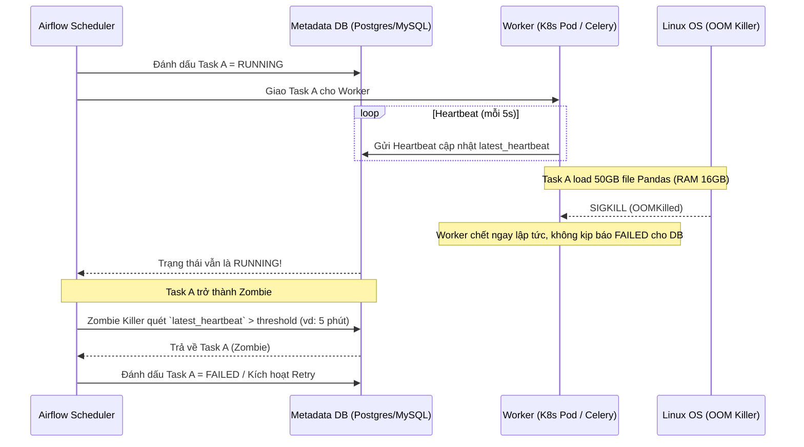

Trong quá trình scale hệ thống Apache Airflow lên hàng ngàn DAGs (Directed Acyclic Graphs), bạn sẽ sớm đối mặt với hai thảm họa kiến trúc phổ biến nhất: **Zombie Tasks** (Tiến trình thây ma) và **Pool Starvation** (Đói tài nguyên). 

Đây không phải là lỗi code thông thường mà là hệ quả của các **Distributed System Trade-offs**: sự bất đồng bộ giữa Scheduler, Metadata Database và Executor/Worker. Bài viết này sẽ mổ xẻ nguyên lý vật lý (Physical Execution) đằng sau hai hiện tượng này và cách cấu hình hệ thống chuẩn Enterprise để tránh sập (Downtime).

## 1. Zombie Tasks: Khi State Lệch Pha (State Synchronization Failure)

Trong kiến trúc Airflow, **Zombie Task** là một task instance được Metadata DB đánh dấu là `RUNNING`, nhưng thực tế trên Worker (Celery, Kubernetes), tiến trình vật lý đã bị huỷ diệt.

Về bản chất, đây là lỗi **Split-Brain** nhẹ giữa Worker và DB: Worker không kịp gửi tín hiệu "Tôi chết rồi" (Status: `FAILED`) về cho DB. Do không ai báo lỗi, Scheduler vẫn ngây thơ nghĩ task đang chạy. Hậu quả là toàn bộ Pipeline đứng im vĩnh viễn (hoặc cho đến khi hết timeout).

### Sơ Đồ Kiến Trúc: Cơ Chế Sinh Ra Zombie Task



### 1.1 Rủi Ro Vận Hành & Nguyên Nhân Gốc (Root Causes)

- **OOMKilled (Out of Memory):** (Nguyên nhân phổ biến nhất). Code Python xử lý dữ liệu lớn trên RAM (ví dụ: Pandas). Container/Worker vượt quá Memory Limit. Hệ điều hành tung ra SIGKILL tàn bạo, tiến trình chết ngay lập tức (không có Graceful Shutdown).
- **Network Partition (Đứt kết nối mạng):** Worker hoàn thành task nhưng mất kết nối đến DB (ví dụ: DB connection pool cạn kiệt, DNS resolution lỗi). Worker đóng process nhưng DB không ghi nhận được trạng thái cuối cùng.
- **Node Eviction / Spot Instance Interruption:** Khi dùng KubernetesExecutor trên hạ tầng Spot (giá rẻ), Node bị thu hồi thình lình, Pod bị bốc hơi mang theo tiến trình đang chạy.

### 1.2 Giải Pháp Cấu Hình Mức Hệ Thống

**A. Thiết lập Timeout cho mọi Task (Thiết yếu)**

Đừng bao giờ để Task chạy vô hạn. Nếu không có `execution_timeout`, Zombie task có thể treo vĩnh viễn.

```python
from datetime import timedelta
from airflow.operators.python import PythonOperator

def heavy_processing():
    pass

# BẮT BUỘC: Giới hạn thời gian chạy
task_a = PythonOperator(
    task_id='process_data',
    python_callable=heavy_processing,
    execution_timeout=timedelta(hours=2), # Sau 2h, tự động bị SIGTERM
    retries=3,
    retry_delay=timedelta(minutes=5)
)
```

**B. Cấu hình Resource Limits & K8s Executor**

Nếu dùng Kubernetes, hãy sử dụng `KubernetesPodOperator` hoặc K8s Executor và xác định rõ Resource Limits để K8s không "vô tình" evict Pod khi Node chịu tải.

```yaml
# Cấu hình Pod Template trong Kubernetes Executor (pod_template.yaml)
apiVersion: v1
kind: Pod
metadata:
  name: airflow-worker
spec:
  containers:
    - name: base
      resources:
        requests:
          memory: "2Gi"
          cpu: "1"
        limits:
          memory: "4Gi" # Khống chế RAM, tránh làm sập Node
          cpu: "2"
```

**C. Tối ưu Zombie Killer Configuration (airflow.cfg)**

Nếu pipeline của bạn có đặc thù chạy task siêu lâu (vài giờ), bạn có thể tune lại tham số timeout của Scheduler để tránh đánh dấu nhầm Zombie:

```ini
[scheduler]
# Định kỳ bao lâu (giây) Scheduler sẽ đi săn Zombie
zombie_detection_interval = 10

# Task không gửi heartbeat sau bao lâu (giây) thì bị coi là Zombie
scheduler_zombie_task_threshold = 300
```

---

## 2. Pool Starvation: Tắc Nghẽn Tài Nguyên (Concurrency Limits)

Nếu Zombie biểu hiện bằng các Task xanh (`RUNNING`) nhưng đã kẹt cứng, thì **Pool Starvation** biểu hiện bằng hàng trăm Task màu xám (`QUEUED`) mãi mãi không chịu chạy.

### Bản chất của Airflow Pools

Airflow Pools là một cơ chế Semaphore giới hạn mức độ đồng thời (concurrency) để bảo vệ các hệ thống đích (Database, API Rate Limit) hoặc cụm Worker. Nếu Pool `api_limit` có 10 slots, Airflow chỉ cho phép tối đa 10 tasks chạy đồng thời.

**Starvation (Đói tài nguyên)** xảy ra khi toàn bộ các slots bị chiếm giữ bởi các tasks "vô dụng" (chạy quá lâu hoặc chỉ đang đứng chờ), khiến các tasks quan trọng khác không có slot để khởi chạy. Đáng sợ nhất là khi Zombie Tasks vẫn giữ Slots của Pool (do DB tưởng vẫn đang RUNNING).

### Sơ Đồ Kiến Trúc: Pool Starvation do Sensor (Poke Mode)

```mermaid
flowchart TD
    subgraph Pool["Airflow Pool - Giới hạn 3 Slots"]
        S1["Slot 1: Bị chiếm bởi FileSensor A<br/>Trạng thái: Đợi 5 tiếng"]
        S2["Slot 2: Bị chiếm bởi FileSensor B<br/>Trạng thái: Đợi 5 tiếng"]
        S3["Slot 3: Bị chiếm bởi FileSensor C<br/>Trạng thái: Đợi 5 tiếng"]
    end

    T1["Task D: Cần chạy ngay"] -. Wait("Xếp hàng") .-> Pool
    T2["Task E: Cần chạy ngay"] -. Wait("Xếp hàng") .-> Pool
    
    style S1 fill:#f9acaa,stroke:#333
    style S2 fill:#f9acaa,stroke:#333
    style S3 fill:#f9acaa,stroke:#333
    style T1 fill:#e6e6e6,stroke:#333
    style T2 fill:#e6e6e6,stroke:#333
```

### 2.1 Trade-off Giữa Các Cơ Chế Chờ Đợi (Waiting Mechanisms)

Vấn đề kinh điển nhất gây ra Pool Starvation là sử dụng **Airflow Sensors** ở chế độ mặc định (`mode='poke'`). Sự đánh đổi hệ thống ở đây là giữa Memory/CPU và I/O Database.

1. **Poke Mode (Mặc định):** Sensor loop `time.sleep()` trên Worker. Nó **GIỮ SLOT** trong Pool suốt quá trình chờ. Hao phí Memory và CPU vô ích.
2. **Reschedule Mode:** Sensor thức dậy, kiểm tra điều kiện. Nếu False, ném `AirflowRescheduleException`, **TRẢ LẠI SLOT** cho Pool, và schedule chạy lại sau. *Trade-off*: Giải phóng Memory nhưng tăng tải I/O lên Airflow DB do liên tục đổi State.
3. **Deferrable Operators (Airflow 2.2+):** Đẩy task chờ thành tiến trình bất đồng bộ (`asyncio`) trên node chuyên biệt **Triggerer**. Giải phóng hoàn toàn Slot cho Worker, I/O cực thấp, có thể duy trì hàng vạn task chờ cùng lúc.

### 2.2 Cấu Hình Khắc Phục Starvation Thực Chiến

**A. Đổi Mode của Sensors (Quick Win)**

```python
from airflow.sensors.filesystem import FileSensor

# XẤU: Dễ gây sập Pool nếu file lâu xuất hiện
bad_sensor = FileSensor(
    task_id='wait_for_file_poke',
    filepath='/data/input.csv',
    poke_interval=60,
    mode='poke', # GIỮ SLOT CỦA POOL!
)

# TỐT: Giải phóng Slot khi đang chờ
good_sensor = FileSensor(
    task_id='wait_for_file_reschedule',
    filepath='/data/input.csv',
    poke_interval=60,
    mode='reschedule', # TRẢ LẠI SLOT!
)
```

**B. Sử Dụng Deferrable Operators (Async) - Giải pháp Dứt điểm**

Thay vì dùng Sensor tốn Worker slot, hãy dùng các bản thể `Async` (`TimeSensorAsync`, `S3KeySensorAsync`).

```python
from airflow.sensors.time_sensor import TimeSensorAsync
from datetime import datetime

# Sẽ được ném sang hệ thống Triggerer (chạy bằng event loop asyncio)
# KHÔNG CHIẾM SLOT trên Worker truyền thống.
async_wait = TimeSensorAsync(
    task_id="wait_async",
    target_time=datetime(2026, 6, 26, 17, 0, 0)
)
```

**C. Phân Lập Pool (Pool Isolation) & Độ Ưu Tiên (Priority Weight)**

Không dùng `default_pool` cho mọi tác vụ. Hãy tách Pool để cô lập tầm ảnh hưởng của sự cố (Blast Radius).

```python
# Đưa Pipeline báo cáo tài chính quan trọng vào Pool riêng biệt
core_pipeline_task = PythonOperator(
    task_id='generate_revenue_report',
    python_callable=generate_report,
    pool='critical_financial_pool', # Pool riêng (đảm bảo không bị giành giật slot)
    priority_weight=1000 # Trọng số cao nhất để Scheduler luôn ưu tiên
)
```

---

## 3. Tổng Kết Kiến Trúc

- **Zombie Tasks** là hệ quả của State Desynchronization (Split-brain) giữa Metadata DB và tiến trình vật lý (OOM, đứt mạng). Giải quyết bằng cách giới hạn Memory, thiết lập `execution_timeout` và tuning `scheduler_zombie_task_threshold`.
- **Pool Starvation** là vấn đề Concurrency Limits, thường do Sensor ở chế độ `poke` hoặc Zombie Tasks chiếm dụng Slots vĩnh viễn. Giải quyết bằng cách nâng cấp lên **Deferrable Operators** (Triggerer), chuyển sang chế độ `reschedule`, và áp dụng chiến lược Pool Isolation.

Hiểu thấu đáo về các cơ chế vật lý này giúp Staff Engineer xây dựng nền tảng Data Orchestration bền bỉ, dễ dàng vận hành hàng chục ngàn Data Pipelines mà không gặp tình cảnh Downtime khó hiểu giữa đêm.

---

## Nguồn Tham Khảo

* [Apache Airflow Architecture Overview](https://airflow.apache.org/docs/apache-airflow/stable/core-concepts/overview.html)
* [Airflow Concepts: Pools & Concurrency](https://airflow.apache.org/docs/apache-airflow/stable/core-concepts/pools.html)
* [Deferrable Operators & Triggers - Airflow Docs](https://airflow.apache.org/docs/apache-airflow/stable/authoring-and-scheduling/deferring.html)
* [Astronomer: DAG Writing Best Practices (Handling Zombie Tasks)](https://www.astronomer.io/docs/learn/dag-best-practices)
* [Datadog: Monitoring Apache Airflow At Scale](https://www.datadoghq.com/blog/monitor-airflow-with-datadog/)
