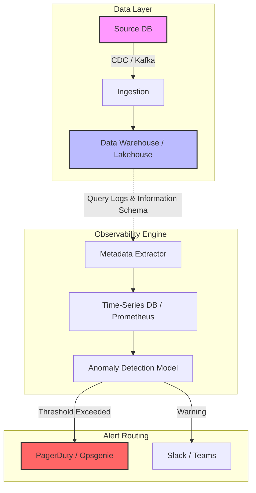

Trong môi trường dữ liệu quy mô lớn, việc một data pipeline bị "vỡ" không phải là câu hỏi "Có xảy ra hay không?", mà là "Khi nào xảy ra?". Thay vì bị động nhận email phàn nàn từ CEO vì dashboard trống trơn, hệ thống cần được thiết kế với tư duy SRE (Site Reliability Engineering) để chủ động phát hiện bất thường (Data Observability), định tuyến cảnh báo (Alert Routing), và phản ứng sự cố (Incident Response).

## Kiến trúc Vật lý của Hệ thống Cảnh báo (Data Observability Architecture)

Cảnh báo dữ liệu truyền thống thường dựa trên các câu lệnh `SELECT count(*)` chạy theo batch định kỳ. Cách tiếp cận này tạo ra độ trễ lớn và tiêu tốn quá nhiều compute cost cho cơ sở dữ liệu nguồn. Các hệ thống Data Observability hiện đại sử dụng kiến trúc **Event-Driven Metadata Extraction**.



### Trade-off: Polling vs. Push-based Observability
- **Polling (Batch query):** Dễ triển khai bằng Airflow sensor hoặc dbt tests định kỳ. *Đánh đổi:* Tăng tải I/O lên Data Warehouse (Compute Cost cao), không bắt được sự kiện real-time, độ trễ cảnh báo có thể lên tới vài giờ.
- **Push-based (Event-driven):** Ứng dụng nguồn chủ động phát metadata events (ví dụ `DataContractViolatedEvent`) qua Kafka ngay khi dữ liệu được sinh ra. *Đánh đổi:* Đòi hỏi đội Backend và Data Engineer phải đồng thuận mạnh mẽ về Data Contract, chi phí vận hành hạ tầng Message Broker cao hơn.

## Rủi ro Vận hành & Cạm bẫy "Alert Fatigue"

### Mệt mỏi vì Cảnh báo (Alert Fatigue)
Khi thiết lập alerting, cái bẫy lớn nhất là **Alert Fatigue**. Nếu PagerDuty réo lúc 3 giờ sáng chỉ vì một pipeline nội bộ bị delay 5 phút (Transient Error), kỹ sư on-call sẽ dần hình thành thói quen "Acknowledge" (xác nhận) vô thức. Khi một sự cố SEV-1 (Critical) thực sự xảy ra (ví dụ: JVM OOMKilled trên cụm Spark phục vụ Real-time Fraud Detection), nó sẽ bị chìm nghỉm trong "biển" cảnh báo rác.

### Cách khắc phục: Dynamic Baselines thay vì Static Thresholds
Thay vì hardcode theo kiểu tĩnh `if row_count < 1000 then alert`, các hệ thống lớn áp dụng mô hình dự đoán chuỗi thời gian (Time-series forecasting như thuật toán Prophet hoặc đơn giản là Z-Score) để tự động điều chỉnh ngưỡng (Dynamic Baselines) theo tính mùa vụ (Seasonality).

**Ví dụ cấu hình Airflow Slack Alerting cho các lỗi thực sự cần can thiệp (Actionable):**
```python
from airflow.providers.slack.operators.slack_webhook import SlackWebhookOperator
from airflow.hooks.base import BaseHook

def notify_slack_on_failure(context):
    """
    Chỉ trigger khi Task thực sự thất bại sau toàn bộ số lần Retries.
    Tránh spam cho các lỗi Network Timeout thoáng qua (Transient Errors).
    """
    ti = context.get('task_instance')
    slack_msg = f"""
    :rotating_light: **DAG Failed - Immediate Action Required** 
    - **Task:** {ti.task_id}
    - **DAG:** {ti.dag_id}
    - **Error:** Memory Spill-to-disk exceeded limits / JVM OOMKilled.
    - **Runbook:** <https://wiki.company.com/runbooks/spark_oom|View Action Items>
    """
    
    slack_webhook_token = BaseHook.get_connection('slack_alert').password
    alert = SlackWebhookOperator(
        task_id='slack_alert_failure',
        http_conn_id='slack_alert',
        webhook_token=slack_webhook_token,
        message=slack_msg,
        username='airflow_bot'
    )
    return alert.execute(context=context)
```

## Phân cấp Sự cố (Severity Levels) & Incident Response

Khi cảnh báo được định tuyến đúng, quy trình phản ứng sự cố (IR) bắt đầu. Một sự cố lớn (Major Incident) thường trải qua các mức độ nghiêm trọng:

- **SEV-1 (Critical):** Data Platform sập toàn phần, ảnh hưởng trực tiếp đến người dùng cuối hoặc doanh thu. (Ví dụ: Bảng `fct_orders` bị `DROP` nhầm hoặc dữ liệu CDC ngừng sync). *Yêu cầu On-call Engineer can thiệp ngay lập tức qua PagerDuty.*
- **SEV-2 (High):** Luồng dữ liệu cốt lõi bị ngắt nhưng có hệ thống dự phòng (Fallback mechanism), hoặc ảnh hưởng nhóm lớn người dùng nội bộ (Ví dụ: Dashboard Ban Giám đốc bị trễ). *Cần khắc phục (hoặc có workaround) trong 1-2 giờ.*
- **SEV-3 (Medium) / SEV-4 (Low):** Lỗi ở các pipeline phụ trợ, không SLA. *Chỉ alert qua Slack, xử lý trong giờ hành chính.*

### Ma trận Trách nhiệm trong Major Incidents
Để tránh việc các kỹ sư dẫm chân nhau trong một phòng họp ảo (War Room), quy trình chuẩn (như của PagerDuty) chia rõ 3 vai trò:
1. **Incident Commander (IC):** Không trực tiếp gõ code. Chỉ huy toàn cuộc, kiểm soát timeline, và đưa ra quyết định có cần "Rollback" hoặc ngắt một node khỏi cluster hay không.
2. **Operations Lead / SME:** Đọc logs trực tiếp, debug memory dumps, viết hotfix (ví dụ: chạy `SQL MERGE` để backfill lại khoảng dữ liệu bị hỏng hoặc cấu hình lại `min.insync.replicas` cho Kafka).
3. **Communications Lead:** Đăng status lên kênh public định kỳ. Vai trò này cực kỳ quan trọng để "cách ly" Operations Lead khỏi sự hối thúc liên tục từ Cấp quản lý/Stakeholders.

## Văn hóa Post-mortem & Root Cause Analysis (RCA)

Sự cố chỉ thực sự đóng lại sau phiên họp **Post-mortem**. Nguyên tắc tối thượng là **Blameless Culture (Không đổ lỗi)**. Nếu kỹ sư vô tình gõ lệnh xóa production database, lỗi thuộc về quy trình thiếu IAM Least Privilege và thiếu rào chắn (Guardrails), chứ không phải do năng lực cá nhân.

### Áp dụng "5 Whys" vào Data Incident thực tế
- *Tại sao Pipeline báo cáo bị lỗi Timeout?* -> Bảng `dim_users` không được update.
- *Tại sao bảng không update?* -> Job Spark bị lỗi Consumer Lag, không thể theo kịp tốc độ của Kafka.
- *Tại sao xảy ra Consumer Lag?* -> Đội Backend phát hành tính năng đẩy spike messages đột biến làm nghẽn phân vùng (Partition Hotspot).
- *Tại sao nghẽn phân vùng?* -> Key dùng để hash vào Kafka partition bị lệch (Data Skew).
- *Tại sao không ai phát hiện sớm?* -> Không có alerting nào theo dõi metric `kafka_consumer_lag_records`.

**Action Item:** Không đổ lỗi cho Backend. Giải pháp hệ thống là cấu hình Prometheus Alertmanager bắn thẳng PagerDuty khi Consumer Lag vượt ngưỡng nguy hiểm.

```yaml
# Ví dụ AlertRule trong Prometheus cho Consumer Lag
groups:
- name: kafka_alerts
  rules:
  - alert: HighConsumerLag
    expr: sum(kafka_consumergroup_lag) by (consumergroup, topic) > 10000
    for: 5m
    labels:
      severity: page
    annotations:
      summary: "Consumer group {{ $labels.consumergroup }} is lagging significantly"
      runbook_url: "https://wiki.company.com/runbooks/kafka_lag_hotspots"
```

## Nguồn Tham Khảo (References)
- [Google SRE Book - Incident Response](https://sre.google/sre-book/incident-response/)
- [PagerDuty Incident Response Documentation](https://response.pagerduty.com/)
- [Uber Engineering Blog: Data Observability Framework](https://www.uber.com/en-VN/blog/data-observability-framework/)
- [Databricks - The Five Pillars of Data Observability](https://www.databricks.com/glossary/data-observability)
