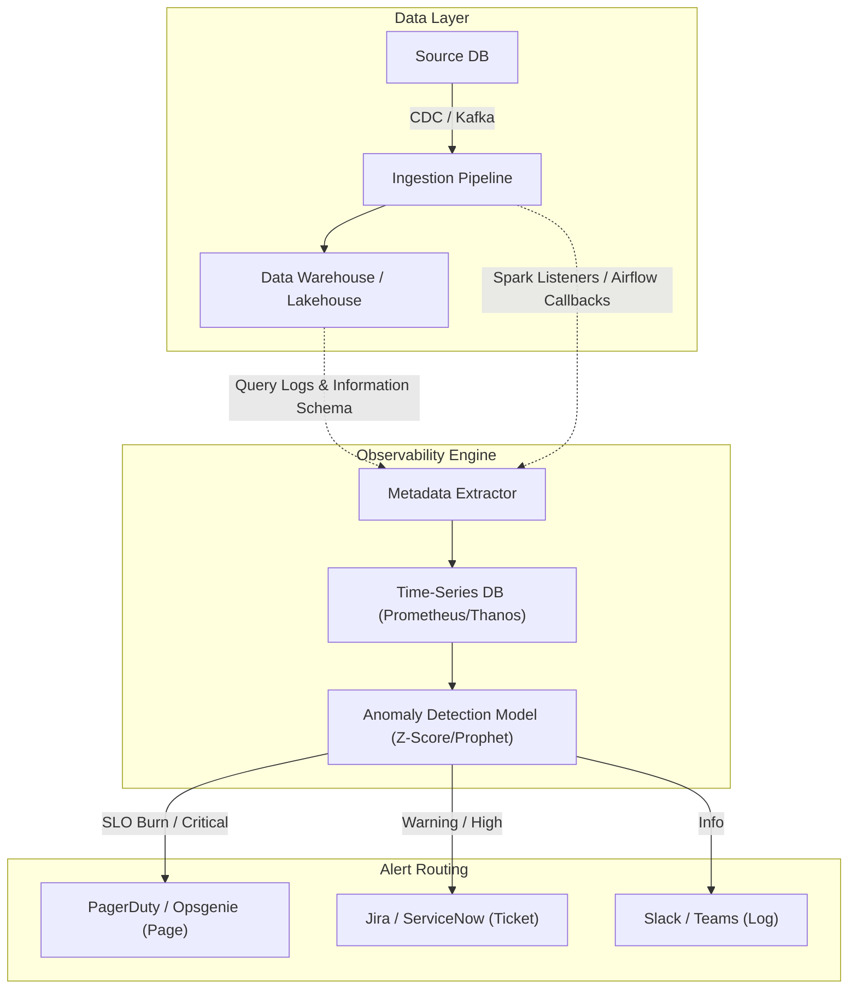

Trong một môi trường dữ liệu quy mô lớn (Enterprise Data Platform), việc một Data Pipeline bị "vỡ" không phải là câu hỏi *"Có xảy ra hay không?"*, mà là *"Khi nào thì xảy ra?"*. 

Thay vì bị động nhận email phàn nàn từ CEO vì Dashboard doanh thu buổi sáng trống trơn, hệ thống của bạn cần được thiết kế với tư duy **SRE (Site Reliability Engineering)** để chủ động phát hiện bất thường (Data Observability), định tuyến cảnh báo (Alert Routing), và xử lý sự cố có hệ thống (Incident Response).

Bài viết này mổ xẻ cách xây dựng một hệ thống giám sát cảnh báo tránh khỏi thảm họa "Alert Fatigue" (Mệt mỏi vì cảnh báo) và cách thức vận hành quy trình Post-mortem chuẩn mực của các công ty công nghệ hàng đầu như Google, Netflix, Uber.

---

## 1. Kiến trúc Vật lý của Hệ thống Cảnh báo (Data Observability Architecture)

Cảnh báo dữ liệu truyền thống thường dựa trên các câu lệnh `SELECT count(*)` chạy theo batch định kỳ mỗi giờ. Cách tiếp cận này tạo ra độ trễ lớn và tiêu tốn quá nhiều Credit/Compute Cost cho Data Warehouse nguồn (như Snowflake, BigQuery). 

Các hệ thống Data Observability hiện đại (như Monte Carlo, Databand) sử dụng kiến trúc **Event-Driven Metadata Extraction** kết hợp với Machine Learning.



### Trade-off: Polling vs. Push-based Observability
- **Polling (Batch query):** Dễ triển khai bằng Airflow sensor hoặc `dbt tests` định kỳ. *Đánh đổi:* Tăng tải I/O lên Data Warehouse (Compute Cost cao), không bắt được sự kiện real-time, độ trễ cảnh báo có thể lên tới vài giờ. Nếu Pipeline sập lúc 2h sáng, 6h sáng chạy test mới phát hiện ra.
- **Push-based (Event-driven):** Ứng dụng nguồn chủ động phát metadata events (ví dụ `DataContractViolatedEvent`) qua Kafka ngay khi dữ liệu được sinh ra. *Đánh đổi:* Đòi hỏi đội Backend và Data Engineer phải đồng thuận mạnh mẽ về Data Contract (Hợp đồng dữ liệu), chi phí vận hành hạ tầng Message Broker cao hơn.

---

## 2. Rủi ro Vận hành & Cạm bẫy "Alert Fatigue"

### 2.1. Nỗi ám ảnh "Alert Fatigue"
Theo sách *Google SRE Book*, cái bẫy lớn nhất khi thiết lập Alerting là **Alert Fatigue** (Sự mệt mỏi vì cảnh báo). Nếu ứng dụng PagerDuty của bạn réo liên tục lúc 3 giờ sáng chỉ vì một pipeline nội bộ bị delay 5 phút (Transient Error / Lỗi thoáng qua), kỹ sư trực on-call sẽ dần hình thành thói quen "Acknowledge" (Xác nhận) vô thức rồi đi ngủ tiếp. 

Khi một sự cố **SEV-1 (Critical)** thực sự xảy ra (Ví dụ: `OOMKilled` trên cụm Spark phục vụ Real-time Fraud Detection), nó sẽ bị chìm nghỉm trong "biển" cảnh báo rác, dẫn đến tổn thất hàng triệu đô la.

### 2.2. Triết lý Alerting của Google SRE: Page vs. Ticket vs. Log
Google SRE chia output của hệ thống giám sát thành 3 loại rõ rệt, tuyệt đối không được lẫn lộn:
1. **Pages (Gọi điện/Nhắn tin khẩn cấp):** Phải đánh thức con người ngay lập tức. Chỉ dùng khi có **sự kiện đe dọa trực tiếp đến SLO (Service Level Objective)** của người dùng cuối. (Ví dụ: Dữ liệu thanh toán ngừng chảy). Yêu cầu phản ứng trong vòng 5-15 phút.
2. **Tickets (Tạo Task Jira):** Lỗi cần con người can thiệp, nhưng không khẩn cấp. Có thể chờ đến sáng hôm sau hoặc xử lý trong giờ hành chính. (Ví dụ: Ổ cứng cụm Kafka đạt 85%, vài ngày nữa mới đầy).
3. **Logs (Ghi nhận thông tin):** Không cần con người xem ngay. Chỉ dùng làm dữ liệu để điều tra (Debug) sau khi có Page báo lỗi. Không được bắn Log vào kênh Slack cảnh báo.

### 2.3. Cách khắc phục: Dynamic Baselines thay vì Static Thresholds
Thay vì hardcode cấu hình tĩnh kiểu `if row_count < 1000 then alert` (Rất dễ False Positive vào dịp cuối tuần khi user ít), hệ thống lớn áp dụng mô hình dự đoán chuỗi thời gian (Time-series forecasting như thuật toán Prophet hoặc Z-Score) để tự động điều chỉnh ngưỡng (Dynamic Baselines) theo tính mùa vụ (Seasonality).

**Ví dụ Code: Cấu hình Airflow Alerting chỉ bắt lỗi thực sự cần can thiệp (Actionable):**
Tuyệt đối không bắn Alert vào lần thất bại đầu tiên. Chỉ bắn Alert khi Task thất bại *sau khi đã tiêu thụ hết toàn bộ số lần Retries*.

```python
from airflow.providers.slack.operators.slack_webhook import SlackWebhookOperator
from airflow.hooks.base import BaseHook

def notify_slack_on_exhausted_retries(context):
    """
    Chỉ trigger khi Task thực sự thất bại sau toàn bộ số lần Retries.
    Tránh spam cho các lỗi Network Timeout thoáng qua (Transient Errors).
    """
    ti = context.get('task_instance')
    
    # Chỉ bắn Alert nếu số lần thử lại đã đạt max_tries
    if ti.try_number < ti.max_tries:
        return # Im lặng, để Airflow tự retry
        
    slack_msg = f"""
    :rotating_light: **DAG Failed - Immediate Action Required** 
    - **Task:** {ti.task_id}
    - **DAG:** {ti.dag_id}
    - **Error:** Memory Spill-to-disk exceeded limits / JVM OOMKilled.
    - **Runbook:** <https://wiki.company.com/runbooks/spark_oom|View Action Items>
    """
    
    slack_webhook_token = BaseHook.get_connection('slack_alert').password
    alert = SlackWebhookOperator(
        task_id='slack_alert_failure',
        http_conn_id='slack_alert',
        webhook_token=slack_webhook_token,
        message=slack_msg,
        username='airflow_bot'
    )
    return alert.execute(context=context)
```

---

## 3. Phân cấp Sự cố (Severity Levels) & Incident Response

Khi cảnh báo được định tuyến đúng, quy trình phản ứng sự cố (Incident Response - IR) bắt đầu. Một Data Incident thường trải qua các mức độ nghiêm trọng (Severity):

- **SEV-1 (Critical):** Data Platform sập toàn phần, ảnh hưởng trực tiếp đến người dùng cuối hoặc doanh thu. (Ví dụ: Bảng `fct_orders` bị `DROP` nhầm hoặc dữ liệu CDC ngừng sync hoàn toàn). *Yêu cầu On-call Engineer can thiệp ngay lập tức qua PagerDuty.*
- **SEV-2 (High):** Luồng dữ liệu cốt lõi bị ngắt nhưng có hệ thống dự phòng (Fallback mechanism), hoặc ảnh hưởng đến nhóm lớn người dùng nội bộ (Ví dụ: Dashboard Ban Giám đốc bị trễ). *Cần khắc phục (hoặc có workaround) trong 1-2 giờ.*
- **SEV-3 (Medium):** Lỗi ở các pipeline phụ trợ, không vi phạm SLA. *Chỉ alert qua Slack/Ticket, xử lý trong giờ hành chính.*

### 3.1. Ma trận Trách nhiệm trong Major Incidents
Để tránh việc 5 kỹ sư cùng dẫm chân nhau trong một phòng họp ảo (War Room) và làm tình hình rối ren thêm, quy trình chuẩn (như của PagerDuty) chia rõ 3 vai trò độc lập:
1. **Incident Commander (IC - Chỉ huy):** Người nắm quyền tối cao. Không trực tiếp gõ code, không nhìn log. Chỉ huy toàn cuộc, kiểm soát timeline, và đưa ra quyết định "sống còn" như: Có cần "Rollback" cluster không? Có cần ngắt một node khỏi mạng không?
2. **Operations Lead / SME (Chuyên gia Kỹ thuật):** Người trực tiếp "nhúng chàm". Đọc logs, debug memory dumps, viết script hotfix (Ví dụ: chạy `SQL MERGE` để backfill lại khoảng dữ liệu bị hỏng hoặc cấu hình lại `min.insync.replicas` cho Kafka).
3. **Communications Lead (Trưởng ban Truyền thông):** Đăng status cập nhật lên kênh public (hoặc Status Page) định kỳ mỗi 15-30 phút. *Vai trò này cực kỳ quan trọng để "cách ly" Operations Lead khỏi sự hối thúc liên tục từ Cấp quản lý/Stakeholders, giúp họ tập trung 100% vào việc sửa lỗi.*

---

## 4. Quản lý Cơ sở Hạ tầng Alerting (Infrastructure as Code)

Để đảm bảo mọi Alert Rule được version control, đội ngũ DataOps thường định nghĩa Alert bằng mã. Dưới đây là ví dụ cấu hình **Prometheus Alertmanager** cho Data Pipeline:

```yaml
# rules/kafka_alerts.yml
groups:
- name: kafka_data_engineering_alerts
  rules:
  # Cảnh báo SEV-1: Consumer Lag quá cao (Nguy cơ hệ thống xử lý không kịp)
  - alert: KafkaConsumerLagCritical
    expr: sum(kafka_consumergroup_lag) by (consumergroup, topic) > 100000
    for: 5m  # Phải duy trì tình trạng lag trong 5 phút mới bắn (tránh spike thoáng qua)
    labels:
      severity: page  # Đẩy thẳng vào PagerDuty gọi điện
      team: data-platform
    annotations:
      summary: "CRITICAL: Consumer group {{ $labels.consumergroup }} is lagging massively"
      description: "Lag is > 100K records. Real-time Fraud Detection might be compromised."
      runbook_url: "https://wiki.company.com/runbooks/kafka_lag_hotspots"

  # Cảnh báo SEV-3: Ổ cứng sắp đầy (Ticket)
  - alert: KafkaDiskSpaceWarning
    expr: (kubelet_volume_stats_used_bytes / kubelet_volume_stats_capacity_bytes) > 0.85
    for: 1h
    labels:
      severity: ticket  # Đẩy vào Jira
    annotations:
      summary: "Warning: Kafka broker disk > 85% full"
```

---

## 5. Văn hóa Post-mortem & Root Cause Analysis (RCA)

Một sự cố chỉ thực sự đóng lại (Resolved) sau phiên họp **Post-mortem (Mổ xẻ sau sự cố)**. Nguyên tắc tối thượng của Google SRE là **Blameless Culture (Văn hóa không đổ lỗi)**. 

Nếu một kỹ sư vô tình gõ lệnh xóa sạch Production Database, lỗi thuộc về quy trình thiếu rào chắn (Guardrails), thiếu phân quyền IAM Least Privilege, và môi trường thiếu cô lập, chứ **không phải** do năng lực cá nhân của kỹ sư đó. Đổ lỗi cho con người sẽ khiến họ giấu giếm lỗi lầm trong tương lai, phá hủy hoàn toàn văn hóa minh bạch.

### 5.1. Áp dụng "5 Whys" vào Data Incident thực tế
Kỹ thuật "5 Tại Sao" (5 Whys) giúp đào sâu tận cùng nguyên nhân gốc rễ (Root Cause):
- **Tại sao Pipeline báo cáo doanh thu bị lỗi Timeout?** -> Do bảng `dim_users` không được update dữ liệu mới.
- **Tại sao bảng không update?** -> Job Spark Consumer bị lỗi Lag, không thể theo kịp tốc độ của Kafka.
- **Tại sao xảy ra Consumer Lag?** -> Đội Backend phát hành tính năng mới đẩy một lượng spike messages đột biến làm nghẽn một phân vùng (Partition Hotspot).
- **Tại sao nghẽn phân vùng?** -> Key dùng để hash vào Kafka partition bị thiết kế sai, gây ra Data Skew (Tất cả user mới đều chui vào partition 0).
- **Tại sao không ai phát hiện sớm?** -> Không có hệ thống Alerting nào theo dõi metric `kafka_consumer_lag` theo từng partition.

**Action Item (Hành động cải tiến):** Không trách mắng đội Backend. Thay vào đó, thiết lập Prometheus AlertRule bắn thẳng PagerDuty khi Partition Lag vượt ngưỡng, và tổ chức session đào tạo về "Hash Key Design" cho toàn công ty.

---

## Nguồn Tham Khảo [References]

1. **Google SRE Book:** [Incident Response](https://sre.google/sre-book/incident-response/) & [Monitoring Distributed Systems](https://sre.google/sre-book/monitoring-distributed-systems/).
2. **PagerDuty:** [Incident Response Documentation & Anti-Alert Fatigue](https://response.pagerduty.com/).
3. **Uber Engineering Blog:** [Data Observability Framework](https://www.uber.com/en-VN/blog/data-observability-framework/) - Cách Uber quản lý chất lượng hàng Petabyte dữ liệu.
4. **Databricks:** *The Five Pillars of Data Observability* - Kiến trúc giám sát Data Lakehouse.
