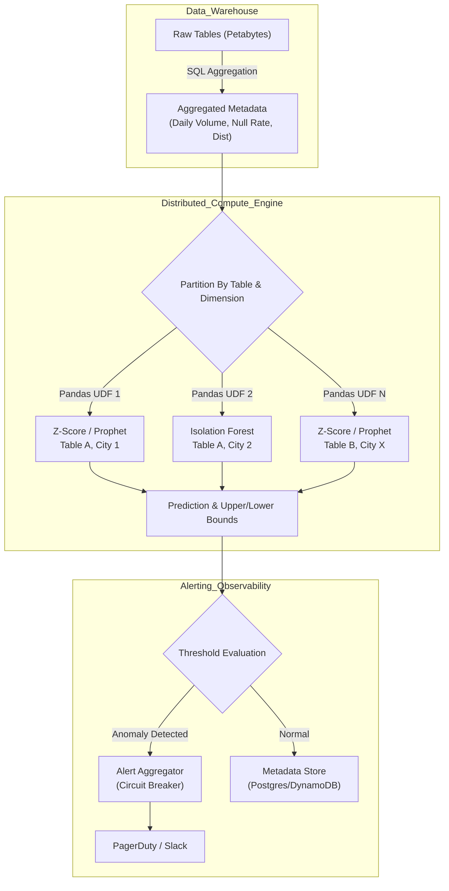

Các bộ luật Validation tĩnh (Static Rules) kiểu như `row_count > 1000` hay `null_rate < 5%` sẽ nhanh chóng trở thành gánh nặng bảo trì (Maintenance Burden) khổng lồ khi Data Warehouse phình to lên quy mô hàng vạn bảng. Các hãng công nghệ lớn như Uber (với hệ thống D3 - Data Drift Detection) hay Netflix đều phải chuyển dịch sang **Anomaly Detection**: Ứng dụng Thống kê (Statistics) và Machine Learning để tự động thiết lập các ngưỡng động (Dynamic Baselines) nhằm phát hiện sự suy giảm chất lượng dữ liệu.

Tuy nhiên, xây dựng một model phát hiện bất thường chạy trên Jupyter Notebook là chuyện nhỏ. Vận hành nó ở Scale hàng chục ngàn chuỗi thời gian (Time-series) song song mà không bị OOMKilled hay gây ra "bão cảnh báo" (Alert Fatigue) mới là bài toán khó của một Staff Data Engineer.

---

## 1. Kiến trúc Thực thi Vật lý (Physical Execution Architecture)

Để giải quyết bài toán Dimension Explosion (Bùng nổ chiều dữ liệu) khi phải theo dõi chất lượng theo từng `city_id`, `app_version` hay `merchant_id`, kiến trúc hệ thống không thể chạy tuần tự (Sequential). Chúng ta cần một Distributed Compute Engine (Apache Spark / Ray) để Map từng chuỗi thời gian tới một Model Instance chạy độc lập.



**Luồng dữ liệu (Data Flow):**
1. **Metadata Extraction:** Kẻ thù của FinOps là Full Table Scan. Thay vì quét toàn bộ dữ liệu thô, hệ thống Ingestion chỉ Query các Metadata Aggregator (ví dụ: `COUNT(*)`, `APPROX_COUNT_DISTINCT`, `AVG`) theo từng ngày/giờ.
2. **Distributed Training & Inference:** Sử dụng PySpark kết hợp Pandas UDF (User Defined Function) để cô lập bộ nhớ và CPU, phân tán việc chạy thuật toán (Z-Score, Prophet, Isolation Forest) lên hàng ngàn Worker Node.
3. **Alert Aggregation:** Để tránh việc PagerDuty "hú" 500 lần khi mạng bị gián đoạn toàn cục, hệ thống phải gom cụm cảnh báo (Alert Aggregation) trước khi Push Notification.

---

## 2. Lựa chọn Thuật toán: Thống kê vs Machine Learning

Trong Data Observability, không phải lúc nào dùng Deep Learning cũng tốt. Lựa chọn thuật toán là một sự đánh đổi giữa **Compute Cost (Chi phí CPU)** và **Độ nhạy cảm (Sensitivity)**.

### 2.1. Z-Score (Statistical Baseline)
Sử dụng công thức Z-Score: Đo lường khoảng cách từ điểm dữ liệu hiện tại đến Giá trị trung bình (Mean) theo độ lệch chuẩn (Standard Deviation - $\sigma$). Nếu điểm dữ liệu nằm ngoài $3\sigma$ (bao phủ 99.7% dữ liệu bình thường), nó là Anomaly.

**Ưu điểm:** Cực kỳ rẻ. CPU xử lý O(1) hoặc O(N). Có thể viết trực tiếp bằng SQL trên Snowflake/BigQuery mà không cần Spark.
**Nhược điểm:** Mù hoàn toàn trước tính mùa vụ (Seasonality - ví dụ cuối tuần Volume thấp hơn ngày thường) và xu hướng dài hạn (Trend). Phải giả định dữ liệu có phân phối chuẩn (Normal Distribution).

### 2.2. Isolation Forest (Tree-based Machine Learning)
Nguyên lý: *Những điểm dữ liệu bất thường (Anomalies) thường rất ít ỏi và có thuộc tính rất khác biệt, do đó chúng sẽ bị "cô lập" (Isolated) rất nhanh, nằm gần gốc (Root) của cây quyết định ngẫu nhiên.*

**Ưu điểm:** Giải quyết xuất sắc bài toán Đa chiều (Multivariate). Ví dụ: Volume bình thường, nhưng Tỷ lệ Null của 5 cột cùng lúc tăng 5%. Z-Score sẽ bó tay, nhưng Isolation Forest sẽ dễ dàng tìm ra sự lệch pha đa chiều này. Không cần giả định dữ liệu phân phối chuẩn.
**Nhược điểm:** Rất tốn CPU để Train. Đòi hỏi cấu hình tham số `contamination` (tỷ lệ dữ liệu rác dự kiến) cẩn thận.

---

## 3. Code Thực chiến: Distributed Z-Score với PySpark Pandas UDF

Sử dụng vòng lặp Python thuần để tính toán trên Driver Node sẽ gây thắt cổ chai. Cách tiếp cận chuẩn là dùng **Pandas UDF** trong PySpark để ép Spark chia nhỏ dữ liệu và thực thi phân tán qua Apache Arrow.

```python
import pandas as pd
import numpy as np
from pyspark.sql.functions import pandas_udf, PandasUDFType
from pyspark.sql.types import StructType, StructField, StringType, DateType, FloatType

# 1. Định nghĩa schema đầu ra
result_schema = StructType([
    StructField("table_name", StringType()),
    StructField("ds", DateType()),
    StructField("actual_value", FloatType()),
    StructField("z_score", FloatType()),
    StructField("is_anomaly", StringType[))
])

# 2. Định nghĩa Pandas UDF [Thực thi song song trên các Executor]
@pandas_udf(result_schema, PandasUDFType.GROUPED_MAP)
def detect_zscore_anomaly(pdf: pd.DataFrame) -> pd.DataFrame:
    # pdf chứa dữ liệu time-series của DUY NHẤT 1 bảng (Nhờ GroupBy bên dưới)
    table_name = pdf['table_name'].iloc[0]
    
    # Tính Mean và StdDev
    mean_val = pdf['metric_value'].mean[]
    std_val = pdf['metric_value'].std[]
    
    # Tính Z-Score
    # Dùng np.where để tránh chia cho 0 nếu std_val = 0
    pdf['z_score'] = np.where[std_val == 0, 0, (pdf['metric_value'] - mean_val] / std_val)
    
    # Ngưỡng 3-Sigma: Nếu Z-Score > 3 hoặc < -3 thì đánh dấu Anomaly
    pdf['is_anomaly'] = np.where[pdf['z_score'].abs(] > 3, "YES", "NO")
    pdf['actual_value'] = pdf['metric_value']
    
    return pdf[['table_name', 'ds', 'actual_value', 'z_score', 'is_anomaly']]

# 3. Kích hoạt phân tán
# daily_metrics_df: DataFrame(table_name, ds, metric_value)
# Dữ liệu được băm (Partition) theo table_name đẩy về các Worker
anomaly_results_df = daily_metrics_df.groupby("table_name").apply(detect_zscore_anomaly)

# Ghi kết quả vào Delta Lake làm Observability Store
anomaly_results_df.write.format("delta").mode("append").save("s3://data-lake/observability/anomalies/")
```

---

## 4. Rủi ro Vận hành (Operational Risks) & Troubleshooting

Hệ thống Data Observability bằng ML rất dễ phản tác dụng nếu không kiểm soát tốt các trade-off (sự đánh đổi) về kiến trúc vật lý và nghiệp vụ.

### 4.1. OOMKilled trên Worker Node (JVM vs Python Memory)
**Triệu chứng:** Spark Executor bị văng liên tục với lỗi `Container killed by YARN for exceeding memory limits (Exit code 137)`.
**Nguyên nhân gốc:** Khi dùng Pandas UDF, dữ liệu được Serialize từ JVM (Spark) sang tiến trình non-JVM (Python) thông qua Apache Arrow. Nếu một chuỗi thời gian của một bảng (1 GroupBy partition) quá dài, nó sẽ vượt quá dung lượng RAM của tiến trình Python Worker, gây tràn bộ nhớ C-level.
**Khắc phục (Fix):**
- Giới hạn Batch Size của Arrow: `spark.sql.execution.arrow.maxRecordsPerBatch=10000`.
- Tăng cường RAM dự phòng (Overhead) cho tiến trình Python: Mặc định `spark.executor.memoryOverhead` chỉ chiếm 10% tổng RAM. Cần nâng lên 20-30% khi chạy các thư viện Data Science (Pandas, Scikit-learn).

### 4.2. Hội chứng "Mù Cảnh Báo" (Alert Fatigue)
**Triệu chứng:** Kênh `#data-alerts` trên Slack nhận 500 tin nhắn mỗi buổi sáng. Data Engineer bị "tê liệt", bắt đầu ấn `Mute` kênh và lờ đi các sự cố nghiêm trọng thực sự.
**Nguyên nhân:** Mô hình (như Isolation Forest hoặc Prophet) cấu hình quá nhạy (Sensitivity quá cao) hoặc do Không gom cụm cảnh báo.
**Khắc phục:**
- **Contextualization:** Làm mượt dữ liệu trước khi ném vào model (ví dụ dùng Moving Average 3 ngày để khử nhiễu T7, CN). Set ngưỡng `contamination` trong Isolation Forest cực thấp (vd: 0.01 - chỉ cảnh báo 1% dị biệt nhất).
- **Circuit Breaker Design:** Áp dụng logic Aggregation: Nếu $> 50$ bảng báo lỗi Drop Volume cùng một lúc, hệ thống chỉ bắn **DUY NHẤT 1 cảnh báo tổng**: *"Hạ tầng Ingestion Upstream có thể đang sập toàn cục, 50+ bảng bị trễ data"*. Cấm bắn 50 tin nhắn lẻ tẻ.

### 4.3. Data Drift vs. Retraining Cost (Trade-off: Độ chính xác vs FinOps)
Doanh nghiệp đang tăng trưởng tốt, lượng người dùng tăng 2% mỗi tuần. Mô hình Z-Score cũ sẽ liên tục gào thét báo động "Bất thường chiều hướng lên" [Upward Anomaly] do trôi dạt dữ liệu (Data Drift).
- **Vấn đề:** Để mô hình học được trạng thái bình thường mới, bạn phải Retrain (Học lại) model liên tục.
- **Trade-off:** Chạy Isolation Forest hoặc Prophet cho 100,000 tables mỗi đêm sẽ đốt sạch ngân sách Cloud (FinOps Disaster).
- **Chiến lược Thực chiến:** Phân loại Tier dữ liệu (Data Tiering). Chỉ Retrain mô hình hạng nặng hàng ngày (Daily) cho các bảng Tier 1 (Tài chính, Doanh thu cốt lõi). Các bảng Log/Sự kiện Tier 2 và 3 chỉ sử dụng Z-Score đơn giản (rẻ tiền) hoặc Retrain mô hình 1 tháng 1 lần.

---

## 5. Nguồn Tham Khảo (References)

1. [Uber Engineering: D3 - An Automated System to Detect Data Drifts](https://www.uber.com/en-IT/blog/d3-an-automated-system-to-detect-data-drifts/)
2. [Netflix TechBlog: Lessons from Building Observability Tools at Netflix](https://netflixtechblog.com/lessons-from-building-observability-tools-at-netflix-7e8b62854b73)
3. Bài toán OOMKilled trong PySpark Pandas UDF: [Databricks Documentation](https://docs.databricks.com/en/spark/latest/spark-sql/udf-python-pandas.html)
4. *Isolation Forest Algorithm for Anomaly Detection* - Towards Data Science / Scikit-learn Docs.
5. [OpenObserve: Observability engineering blog](https://openobserve.ai/blog)
