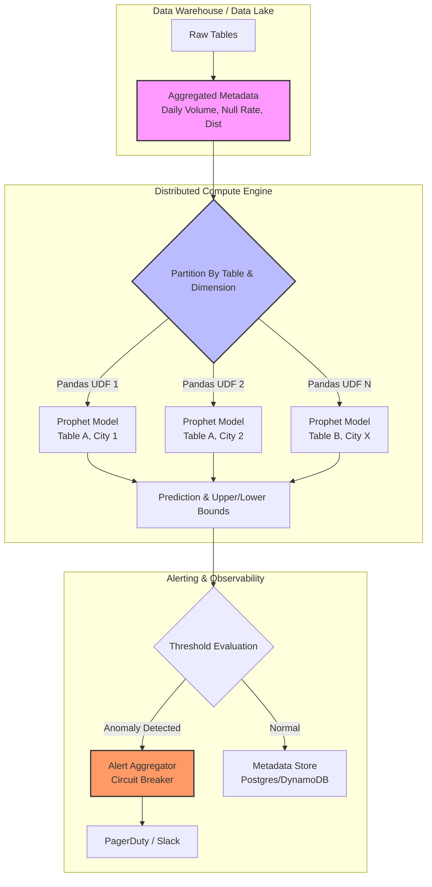

Các rule tĩnh (Static Rules) như `row_count > 1000` hay `null_rate < 5%` sẽ nhanh chóng trở thành gánh nặng bảo trì (maintenance burden) khi Data Warehouse phình to lên quy mô hàng vạn bảng. Các hãng công nghệ lớn như Uber (với hệ thống D3 - Data Drift Detection) hay Netflix (Data Observability) đều phải chuyển dịch sang **Anomaly Detection**: ứng dụng thống kê và Machine Learning để tự động thiết lập các ngưỡng động (Dynamic Baselines).

Tuy nhiên, xây dựng một model phát hiện bất thường là chuyện nhỏ. Vận hành nó ở scale hàng chục ngàn chuỗi thời gian (time-series) song song mà không bị OOMKilled hay gây ra "bão cảnh báo" (Alert Fatigue) mới là bài toán của Kỹ sư Dữ liệu.

---

## 1. Kiến trúc Thực thi Vật lý (Physical Execution Architecture)

Để giải quyết bài toán Dimension Explosion (bùng nổ chiều dữ liệu) khi phải theo dõi chất lượng theo từng `city_id`, `app_version` hay `merchant_id`, kiến trúc hệ thống không thể chạy tuần tự. Chúng ta cần một Distributed Compute Engine (Spark/Ray) để map từng chuỗi thời gian tới một model instance.



**Luồng dữ liệu (Data Flow):**
1. **Metadata Extraction:** Thay vì scan toàn bộ dữ liệu (tốn Compute Cost), hệ thống chỉ query các metadata aggregator (ví dụ: `COUNT(*)`, `APPROX_COUNT_DISTINCT`, `AVG`) theo ngày.
2. **Distributed Training & Inference:** Sử dụng PySpark kết hợp Pandas UDF (User Defined Function) để cô lập bộ nhớ và CPU, phân tán việc chạy model Prophet (hoặc ARIMA) lên hàng ngàn worker node.
3. **Alert Aggregation:** Để tránh việc PagerDuty nổ hàng trăm thông báo khi mạng bị gián đoạn, hệ thống phải gom cụm cảnh báo (Alert Aggregation) trước khi push notification.

---

## 2. Code Thực chiến: Distributed Anomaly Detection với PySpark

Sử dụng vòng lặp Python thuần để train hàng ngàn model Prophet sẽ tạo ra thắt cổ chai (Bottleneck) ở Driver Node. Cách tiếp cận chuẩn Staff Engineer là sử dụng **Pandas UDF** trong PySpark để tận dụng cơ chế thực thi phân tán dựa trên Apache Arrow.

```python
import pandas as pd
from prophet import Prophet
from pyspark.sql.functions import pandas_udf, PandasUDFType
from pyspark.sql.types import StructType, StructField, StringType, DateType, FloatType

# 1. Định nghĩa schema đầu ra
result_schema = StructType([
    StructField("table_name", StringType()),
    StructField("ds", DateType()),
    StructField("actual_volume", FloatType()),
    StructField("yhat", FloatType()), # Predicted
    StructField("yhat_lower", FloatType()),
    StructField("yhat_upper", FloatType()),
    StructField("is_anomaly", StringType())
])

# 2. Định nghĩa Pandas UDF (Phân tán workload)
@pandas_udf(result_schema, PandasUDFType.GROUPED_MAP)
def detect_volume_anomaly(pdf: pd.DataFrame) -> pd.DataFrame:
    # pdf chứa dữ liệu của 1 table cụ thể được Spark chia tới Worker
    table_name = pdf['table_name'].iloc[0]
    
    # Chuẩn bị dữ liệu cho Prophet
    train_df = pdf[['date', 'volume']].rename(columns={'date': 'ds', 'volume': 'y'})
    
    # Khởi tạo và Train model (Tự động bắt Seasonality)
    m = Prophet(daily_seasonality=False, yearly_seasonality=True, interval_width=0.99)
    m.fit(train_df)
    
    # Inference cho chính các điểm dữ liệu lịch sử để tìm anomaly
    forecast = m.predict(train_df)
    result = pd.merge(train_df, forecast[['ds', 'yhat', 'yhat_lower', 'yhat_upper']], on='ds')
    
    # Đánh dấu Anomaly
    result['is_anomaly'] = (result['y'] < result['yhat_lower']) | (result['y'] > result['yhat_upper'])
    result['actual_volume'] = result['y']
    result['table_name'] = table_name
    
    return result[['table_name', 'ds', 'actual_volume', 'yhat', 'yhat_lower', 'yhat_upper', 'is_anomaly']]

# 3. Kích hoạt thực thi (Action)
# daily_metrics_df: Schema(table_name, date, volume)
anomaly_results_df = daily_metrics_df.groupby("table_name").apply(detect_volume_anomaly)

# Ghi kết quả vào Delta Lake/Iceberg
anomaly_results_df.write.format("delta").mode("append").save("s3://data-lake/observability/anomalies/")
```

---

## 3. Rủi ro Vận hành (Operational Risks) & Troubleshooting

Hệ thống Data Observability ML-based rất dễ phản tác dụng nếu không kiểm soát tốt các trade-off vật lý và logic.

### 3.1. OOMKilled trên Worker Node (JVM vs Python Memory)
**Triệu chứng:** Spark Executor bị kill liên tục với lỗi `Container killed by YARN for exceeding memory limits`.
**Nguyên nhân:** Khi dùng Pandas UDF, dữ liệu được serialize từ JVM (Spark) sang tiến trình Python thông qua Apache Arrow. Nếu một partition (ví dụ một bảng quá lớn hoặc chuỗi thời gian quá dài) vượt quá RAM của Python worker, tiến trình sẽ tràn bộ nhớ.
**Khắc phục:**
- Cấu hình giới hạn batch size của Arrow: `spark.sql.execution.arrow.maxRecordsPerBatch` (VD: Set về 10000).
- Tăng cường bộ nhớ Overhead cho tiến trình non-JVM: `spark.executor.memoryOverhead` (Mặc định Spark chỉ cấp 10%, cần nâng lên 20-30% khi chạy thư viện ML Python).

### 3.2. Alert Fatigue (Hội chứng "Mù Cảnh Báo")
**Triệu chứng:** Kênh `#data-alerts` trên Slack nhận 500 tin nhắn mỗi buổi sáng. Data Engineer bắt đầu `Mute` kênh và lờ đi các sự cố nghiêm trọng thực sự.
**Nguyên nhân:** Model Prophet quá nhạy (Sensitivity cao) hoặc khoảng tin cậy (Confidence Interval) quá hẹp (`interval_width=0.8`). Hoặc do không gom nhóm cảnh báo (No Aggregation).
**Khắc phục:**
- **Tăng khoảng tin cậy:** Sử dụng `interval_width=0.99` (tương đương 3-sigma) để chỉ báo động những sự cố thực sự rõ rệt.
- **Circuit Breaker Design:** Áp dụng logic: Nếu $> 50$ bảng báo lỗi cùng một lúc, chỉ bắn DUY NHẤT 1 cảnh báo: *"Hạ tầng Ingestion có thể đang sập toàn cục, 50+ bảng bị trễ data"* thay vì bắn 50 cảnh báo riêng lẻ.

### 3.3. Data Drift vs. Retraining Cost (Trade-off: Accuracy vs FinOps)
Doanh nghiệp đang tăng trưởng, lượng `daily_active_users` tăng 2% mỗi tuần. Mô hình cũ sẽ nhìn nhận sự tăng trưởng này là "Bất thường chiều hướng lên" (Upward Anomaly) do trôi dạt dữ liệu (Data Drift).
- **Vấn đề:** Để khắc phục, ta phải Retrain (học lại) model liên tục mỗi ngày.
- **Trade-off:** Chạy Prophet cho 100,000 tables mỗi đêm ngốn một lượng Compute khổng lồ.
- **Giải pháp thực chiến:** Phân loại Tier dữ liệu (Data Tiering). Chỉ Retrain hàng ngày (Daily) cho các bảng Tier 1 (Tài chính, Doanh thu). Các bảng Tier 2 và 3 có thể sử dụng chiến lược Moving Average (đơn giản, ít tốn CPU) hoặc Retrain hàng tuần (Weekly).

---

## 4. Bất thường Phân phối đa chiều (Multivariate Distribution Anomalies)

Sử dụng Prophet chỉ giải quyết bài toán một chiều (Univariate) - như theo dõi sự thay đổi Volume. Tuy nhiên, nếu Schema giữ nguyên, Volume bình thường, nhưng **tỷ lệ Null của 5 cột cùng đồng loạt tăng nhẹ 5%** thì sao?

Trong tình huống này, Prophet bị mù. Kỹ thuật Dữ liệu phải dựa vào **Isolation Forest** (Cây cô lập) hoặc **Autoencoders**.
Nguyên lý của Isolation Forest là: *Những điểm dữ liệu bất thường rất ít ỏi và có thuộc tính rất khác biệt, nên chúng sẽ dễ bị "cô lập" gần gốc (root) của cây quyết định.*

**Trade-off khi dùng Multivariate Anomaly Detection:**
Thuật toán này bắt buộc phải scan toàn bộ raw data (dòng trên từng cột) thay vì chỉ query metadata gộp (aggregated data). Điều này đẩy chi phí Snowflake/BigQuery lên cực cao. Do đó, việc lấy mẫu (Stratified Sampling) bằng Hash Function trước khi chạy Isolation Forest là bắt buộc để cân bằng giữa chi phí (FinOps) và hiệu năng giám sát (Observability).

---

## Nguồn Tham Khảo
1. [Uber Engineering: D3 - An Automated System to Detect Data Drifts](https://www.uber.com/en-IT/blog/d3-an-automated-system-to-detect-data-drifts/)
2. [Netflix TechBlog: Lessons from Building Observability Tools at Netflix](https://netflixtechblog.com/lessons-from-building-observability-tools-at-netflix-7e8b62854b73)
3. [Facebook Prophet (Time Series Forecasting)](https://facebook.github.io/prophet/)
4. Bài toán OOMKilled trong PySpark Pandas UDF: [Databricks Documentation](https://docs.databricks.com/en/spark/latest/spark-sql/udf-python-pandas.html)
