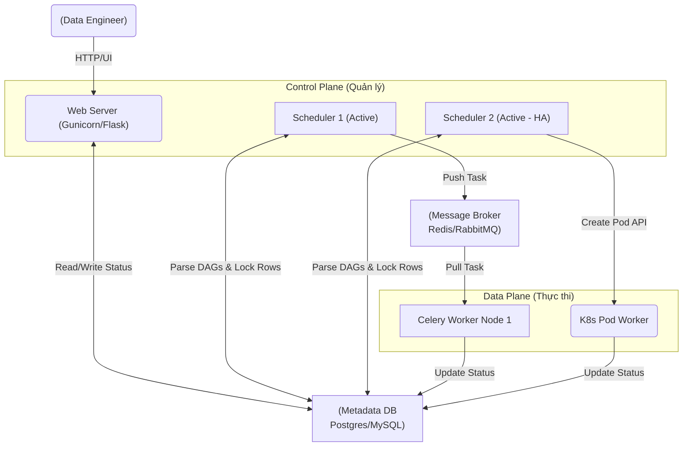

Khởi nguồn từ Airbnb và trở thành dự án Top-Level của Apache Software Foundation, Airflow được coi là "Tiêu chuẩn ngành" (Industry Standard) cho việc điều phối luồng dữ liệu (Data Orchestration). 

Nhiều người mới học thường lầm tưởng Airflow chỉ là một công cụ Cron nâng cao viết bằng Python. Tuy nhiên, ở quy mô Enterprise, việc quản lý hàng vạn DAGs chạy song song đòi hỏi Data Engineer phải hiểu rất sâu về **Kiến trúc Hệ thống (System Architecture)**. Bài viết này sẽ "mổ xẻ" Airflow dưới góc độ System Design: Làm sao Airflow scale lên hàng vạn task? Khi nào hệ thống sẽ sập? Và cách Tuning (tối ưu hóa) các nút thắt cổ chai.

---

## 1. Kiến trúc Thực thi Vật lý (Physical Execution Architecture)

Airflow bản chất là một **Hệ thống phân tán (Distributed System)**. Trái tim của Airflow không nằm ở code Python bạn viết, mà nằm ở Metadata Database.



1. **Scheduler (Bộ não):** Tiến trình daemon liên tục chạy ngầm, đọc thư mục chứa file Python DAGs, phân tích (parse) code, kiểm tra điều kiện kích hoạt, và ra lệnh đẩy các task đủ điều kiện vào Queue. Từ Airflow 2.0, Scheduler hỗ trợ **High Availability (HA)** (chạy nhiều Scheduler cùng lúc) giúp loại bỏ SPOF (Single Point of Failure).
2. **Metadata Database (Trái tim & Nút thắt):** Lưu trữ toàn bộ State (Trạng thái) của hệ thống. Nếu DB sập, toàn bộ Airflow sập. Database connection thường là nguyên nhân số 1 gây chết hệ thống.
3. **Message Broker (Queue):** (Chỉ dùng với Celery Executor) Thường là Redis, đóng vai trò buffer (bộ đệm) tách biệt (decouple) Control Plane và Data Plane.
4. **Workers (Cơ bắp):** Nơi tiến trình Python thực tế của bạn được thực thi.

---

## 2. Sự Đánh Đổi của các Executor (Executor Trade-offs)

Airflow không trực tiếp chạy code. Nó ủy quyền (Delegate) việc đó cho Executor. Việc chọn sai Executor sẽ dẫn đến thảm họa về hiệu năng hoặc chi phí.

### 2.1. Celery Executor (High Throughput, Low Isolation)
Sử dụng kiến trúc Producer - Consumer kinh điển với Redis làm Message Broker.

- **Ưu điểm (Pros):** Độ trễ (Latency) cực thấp. Scheduler nhét Task ID vào Redis, Worker pull về và chạy ngay lập tức trong vài mili-giây. Phù hợp cho hệ thống có hàng vạn task nhỏ, ngắn (ví dụ: gởi câu lệnh SQL sang Snowflake rồi ngồi chờ kết quả).
- **Nhược điểm (Trade-offs):** 
  - **Dependency Hell:** Các Worker là các máy ảo (VM) chạy chung một môi trường Python. Nếu Task A cần thư viện `pandas==1.0` và Task B cần `pandas==2.0`, bạn không thể chạy chúng trên cùng một cụm Celery Worker.
  - **Noisy Neighbor:** Một task bị Memory Leak (tràn RAM) có thể làm crash toàn bộ Worker Node (OOMKilled), kéo theo 30 task khác đang chạy chung Node đó bị fail oan uổng.

### 2.2. Kubernetes Executor (High Isolation, High Latency)
Mỗi task khi chạy, Scheduler sẽ gọi K8s API Server để **spin-up (khởi tạo) một Pod mới hoàn toàn**. Chạy xong, Pod bị hủy.

- **Ưu điểm (Pros):** Cách ly tuyệt đối 100%. Bạn có thể chỉ định tài nguyên (CPU/RAM request) và cấu hình Docker Image riêng biệt cho từng task. Xóa bỏ hoàn toàn Dependency Hell.
- **Nhược điểm (Trade-offs):** 
  - **Pod Startup Latency (Độ trễ khởi động):** Để boot một K8s Pod thường mất từ 10 - 30 giây (Cấp phát IP, kéo Image, init Container). Nếu bạn có một DAG gồm 1000 tasks nối tiếp nhau, mỗi task tốn 2 giây để chạy thật, bạn sẽ lãng phí `1000 * 30 = 30,000 giây` chỉ để chờ khởi động.
  - Tải cực nặng lên Kubernetes Control Plane.

> **💡 Best Practice - Kiến trúc lai (CeleryKubernetesExecutor):** 
> Chạy các task ngắn, nhẹ, chỉ đóng vai trò Trigger/Sensor trên Celery Worker để tối ưu tốc độ. Chỉ định chạy các task xử lý data nặng, cần custom Python libs trên K8s Pods.

---

## 3. Rủi ro Vận hành (Operational Risks & Troubleshooting)

Khi vận hành Airflow ở quy mô hàng ngàn DAGs, đây là những sự cố xương máu bạn sẽ gặp.

### 🚨 Sự cố 1: Scheduler Parsing Bottleneck (Treo Scheduler)
Mặc định, Scheduler sẽ quét và dịch (parse) lại **toàn bộ thư mục DAGs liên tục**. Mục đích là để cập nhật các thay đổi code mới nhất.

**Triệu chứng:** CPU của Scheduler chạm mức 100%. Các task đáng lẽ phải chạy nhưng cứ kẹt ở trạng thái `Queued` mãi mãi.
**Nguyên nhân gốc rễ (Root Cause):** Top-level Code. Kỹ sư khai báo import thư viện nặng (`boto3`, `pandas`) hoặc gọi kết nối Database ở ngay đầu file DAG, bên ngoài scope của Task. Điều này khiến Airflow phải thực thi logic đó **hàng ngàn lần vô ích mỗi phút** trong quá trình Parse DAG.

**✅ Giải pháp Code:** Đẩy mọi logic xử lý vào trong function của Task (Lazy Evaluation).

```python
# ❌ BAD PRACTICE (Gây sập Scheduler vì Top-level Code)
import requests
import pandas as pd
from airflow import DAG
from airflow.operators.python import PythonOperator

# LỖI CHẾT NGƯỜI: Hàm này bị gọi liên tục mỗi khi Scheduler parse file này
config_data = requests.get("https://api.mycompany.com/config").json() 

with DAG('bad_dag', ...) as dag:
    # ...
```

```python
# ✅ GOOD PRACTICE (Zero overhead lúc Parse)
from airflow import DAG
from airflow.operators.python import PythonOperator

def _extract_and_process():
    # CHỈ import và gọi API bên trong hàm khi Task thực sự chạy trên Worker
    import requests
    import pandas as pd
    
    config_data = requests.get("https://api.mycompany.com/config").json[)
    # ... process data ...

with DAG('good_dag', ...) as dag:
    task = PythonOperator(
        task_id='extract',
        python_callable=_extract_and_process
    )
```

### 🚨 Sự cố 2: Phình to kết nối CSDL (Metadata DB Connection Bloat)
**Triệu chứng:** Scheduler crash, Web UI báo lỗi 500, Database log xuất hiện lỗi `FATAL: sorry, too many clients already`.
**Nguyên nhân:** Trong kiến trúc Celery, nếu bạn có 50 Celery Workers, mỗi worker thiết lập `parallelism=32`, chúng sẽ cố gắng mở hàng ngàn kết nối TCP trực tiếp đồng thời tới Postgres Database để update status. Postgres không thiết kế để xử lý ngần đó kết nối trực tiếp.

**✅ Kỹ thuật Khắc phục:** 
Tuyệt đối KHÔNG cho Worker kết nối trực tiếp vào Postgres. Phải đi qua proxy **PgBouncer** ở chế độ `transaction pooling` để multiplex (ghép kênh) hàng ngàn kết nối logic từ Worker thành vài chục kết nối vật lý tới Postgres.

```yaml
# Ví dụ cấu hình Helm Chart cho PgBouncer trong Airflow
pgbouncer:
  enabled: true
  maxClientConn: 10000
  poolMode: transaction
  # Airflow Worker sẽ gọi tới PgBouncer (Port 6543) thay vì Postgres (Port 5432)
```

### 🚨 Sự cố 3: OOMKilled (Tràn RAM trên Worker)
**Triệu chứng:** Kỹ sư phàn nàn DAG bị fail, log cuối cùng hiện `Negsignal.SIGKILL`. Pod Worker bị khởi động lại.
**Nguyên nhân:** Airflow sinh ra để điều phối (Orchestration), **KHÔNG PHẢI ĐỂ XỬ LÝ DỮ LIỆU ĐÁM LỚN (Data Processing)**. Việc dùng `PythonOperator` để đọc trực tiếp file CSV 10GB vào pandas DataFrame trên một Worker chỉ có 4GB RAM sẽ khiến hệ điều hành bắn tín hiệu `SIGKILL` ngay lập tức để tự vệ.

**✅ Thay đổi Tư duy (Paradigm Shift): Áp dụng ELT**
1. Không dùng Airflow để `read_csv()`.
2. Dùng các Operator chuyên dụng để ra lệnh cho hệ thống khác xử lý (Push compute to data). Ví dụ: Dùng `SnowflakeOperator` để báo Snowflake chạy SQL, dùng `DatabricksSubmitRunOperator` để bắn job Spark. Airflow chỉ việc gửi lệnh và ngồi chờ (Polling Sensor).

---

## Nguồn Tham Khảo (References)

1. [Apache Airflow Official Architecture Documentation][https://airflow.apache.org/docs/apache-airflow/stable/core-concepts/overview.html]
2. [Astronomer Blog: Airflow 2.0 Scheduler HA and Performance][https://www.astronomer.io/blog/airflow-2-scheduler/]
3. [Astronomer Blog: Understanding Kubernetes Executor][https://www.astronomer.io/blog/airflow-kubernetes-executor/]
4. [Airbnb Engineering: Data Infrastructure at Airbnb](https://medium.com/airbnb-engineering/data-infrastructure-at-airbnb-8adfac34f190]
