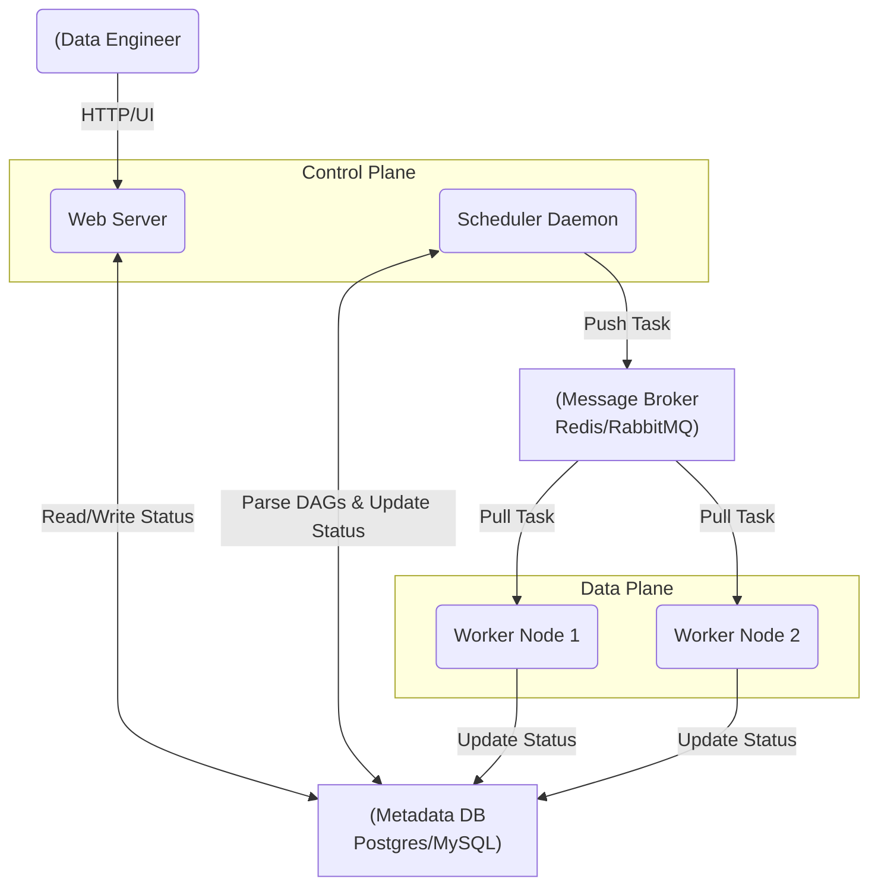

Khởi nguồn từ Airbnb và trở thành dự án Top-Level của Apache, Airflow là "tiêu chuẩn ngành" (industry standard) cho việc điều phối dữ liệu (Data Orchestration). 

Thay vì tập trung vào cách viết một DAG đơn giản, bài viết này sẽ "mổ xẻ" Airflow dưới góc độ **System Design**: Làm sao Airflow có thể scale lên hàng vạn task mỗi ngày? Khi nào hệ thống sẽ sập? Và làm sao để tránh tình trạng Scheduler bị "nghẽn"?

## Kiến trúc Thực thi Vật lý (Physical Execution Architecture)

Airflow là một hệ thống phân tán (distributed system) bao gồm 4 thành phần lõi giao tiếp với nhau chủ yếu qua Metadata Database và Message Broker (nếu dùng Celery).



1. **Scheduler (Bộ não):** Liên tục parse thư mục DAGs, kiểm tra điều kiện chạy, và đẩy các task đủ điều kiện vào Queue. 
2. **Metadata Database (Trái tim):** Trạng thái (state) của toàn bộ hệ thống được lưu tại đây. Đây là một điểm **Single Point of Failure (SPOF)** tiềm năng.
3. **Message Broker (Queue):** Thường dùng Redis hoặc RabbitMQ, làm buffer giữa Scheduler và các Worker.
4. **Workers (Cơ bắp):** Nơi mã lệnh thực tế được thực thi.

---

## Sự Đánh Đổi của các Executor (Executor Trade-offs)

Linh hồn của việc scale Airflow nằm ở **Executor**. Airflow không trực tiếp chạy code, nó ủy quyền (delegate) việc đó cho Executor.

### 1. Celery Executor (High Throughput, Low Isolation)
Celery là kiến trúc phổ biến nhất, sử dụng mô hình Producer (Scheduler) - Consumer (Workers) thông qua Broker (Redis).

- **Ưu điểm:** Độ trễ (latency) cực thấp. Task được nhét vào Redis và Worker có thể pick up ngay lập tức trong vài mili-giây. Phù hợp cho hệ thống có hàng vạn task nhỏ, ngắn (ETL queries, API triggers).
- **Nhược điểm (Trade-off):** Dependency Hell. Vì các Worker là các máy ảo (EC2/VM) dùng chung, nếu Task A cần `pandas==1.0` và Task B cần `pandas==2.0`, bạn sẽ gặp xung đột môi trường khốc liệt (Dependency Clash). Ngoài ra, một task memory leak có thể làm crash toàn bộ Worker Node, giết chết các task khác đang chạy cùng node đó.

### 2. Kubernetes Executor (High Isolation, High Latency)
Mỗi task khi chạy sẽ yêu cầu Scheduler nói chuyện với K8s API Server để **spawn ra một Pod mới hoàn toàn**, chạy xong thì hủy Pod.

- **Ưu điểm:** Cách ly 100% (Absolute Isolation). Bạn có thể chỉ định tài nguyên riêng (CPU/RAM request) và Docker image riêng cho từng task. Xóa bỏ hoàn toàn Dependency Hell.
- **Nhược điểm (Trade-off):** Pod Startup Latency. Để boot một K8s Pod thường mất từ 10 - 30 giây (kéo image, init container). Nếu bạn có 1000 tasks cần chạy mỗi 5 phút mà mỗi task chỉ mất 2 giây để chạy thật, thì K8s Executor là một thảm họa về Performance/Overhead. Hơn nữa, nó tạo áp lực cực lớn lên K8s Control Plane.

> **💡 Best Practice (Kiến trúc lai - CeleryKubernetesExecutor):** 
> Chạy các task ngắn, nhẹ trên Celery Worker (ví dụ: gởi SQL query sang Snowflake, gọi API) để có latency thấp. Chạy các task xử lý data nặng, cần lib dị (như train model Spark/Tensorflow) trên K8s Pods.

---

## Rủi ro Vận hành (Operational Risks & Bottlenecks)

Khi Scale Airflow lên môi trường Enterprise, bạn chắc chắn sẽ đối mặt với các sự cố sau.

### 1. Nút thắt cổ chai Scheduler (Scheduler Parse Time Bottleneck)
Mặc định, Scheduler sẽ quét và dịch (parse) lại **toàn bộ thư mục DAGs mỗi 30 giây** (`min_file_process_interval`). Mục đích là để cập nhật các thay đổi code mới nhất.

**🔴 Real-world Incident:** Scheduler bị "treo", CPU của Scheduler node chạm mức 100%, các task đáng lẽ phải chạy nhưng cứ kẹt ở trạng thái `Queued` hoặc `None`.

**Nguyên nhân:** Top-level Code. Kỹ sư khai báo import thư viện nặng (`pandas`, `boto3`) hoặc gọi API/Database ở ngay đầu file DAG, bên ngoài scope của Task (PythonOperator/BashOperator). Điều này khiến Airflow phải gọi API/DB đó **vô ích mỗi 30 giây**.

**✅ Cách khắc phục:** Đẩy mọi logic xử lý vào trong function của Task.

```python
# ❌ BAD PRACTICE (Gây sập Scheduler)
import requests
import pandas as pd
from airflow import DAG
from airflow.operators.python import PythonOperator

# Lỗi nghiêm trọng: Hàm này bị gọi MỖI 30 GIÂY khi Scheduler parse DAG
config_data = requests.get("https://api.mycompany.com/config").json() 

with DAG('bad_dag', ...) as dag:
    # ...
```

```python
# ✅ GOOD PRACTICE (Zero overhead lúc parse)
from airflow import DAG
from airflow.operators.python import PythonOperator

def _extract_and_process():
    # CHỈ import bên trong hàm khi task thực sự chạy trên Worker
    import requests
    import pandas as pd
    
    config_data = requests.get("https://api.mycompany.com/config").json()
    # ... process ...

with DAG('good_dag', ...) as dag:
    task = PythonOperator(
        task_id='extract',
        python_callable=_extract_and_process
    )
```

### 2. Sự phình to kết nối CSDL (Metadata DB Connection Bloat)
Scheduler, WebServer, và hàng trăm Worker - mỗi thành phần đều cần tạo connection pool đến Metadata DB (Postgres/MySQL) để cập nhật trạng thái (Running -> Success). 

**🔴 Real-world Incident:** Database báo lỗi `FATAL: sorry, too many clients already`. Toàn bộ Airflow ngưng trệ.

**Nguyên nhân:** Trong kiến trúc Celery phân tử, nếu bạn có 50 Celery Workers, mỗi worker cấu hình `parallelism=32`, bạn có khả năng mở hàng ngàn kết nối đồng thời tới DB. DB không đủ RAM để duy trì các connection này.

**✅ Cách khắc phục:** 
1. **Dùng Connection Pooling (PgBouncer):** Tuyệt đối KHÔNG cho Worker kết nối trực tiếp vào Postgres. Phải đi qua PgBouncer ở chế độ `transaction pooling` để multiplex (ghép kênh) hàng ngàn kết nối logic thành vài chục kết nối vật lý.
2. **Database Pruning:** Table `task_instance` và `log` sẽ phình ra hàng chục triệu dòng. Cần có một maintenance DAG chạy cronjob xóa (DELETE) các metadata cũ hơn 90 ngày.

### 3. OOMKilled Workers (Tràn RAM)
Airflow sinh ra để điều phối, **KHÔNG PHẢI ĐỂ XỬ LÝ DỮ LIỆU ĐÁM LỚN (Data Processing)**. 

**🔴 Real-world Incident:** Kỹ sư dùng `PythonOperator` đọc một file CSV 5GB vào pandas DataFrame trên một Celery Worker chỉ có 4GB RAM. OS tự động bắn tín hiệu `SIGKILL` (OOMKilled) giết chết tiến trình Worker. Task bị fail với log cụt lủn `Negsignal.SIGKILL`.

**✅ Cách khắc phục:** 
- Áp dụng nguyên tắc **ELT (Extract - Load - Transform)**. Airflow chỉ làm "nhạc trưởng" (Orchestrator).
- Dùng `SnowflakeOperator`, `BigQueryInsertJobOperator`, hoặc kích hoạt Spark/Databricks job. Hãy để Compute Engine chuyên dụng làm việc nặng, Airflow chỉ gửi lệnh và ngồi chờ (Polling Sensor).
- Nếu bắt buộc phải xử lý file trên Worker, hãy dùng Python Generators (Yield) để đọc file theo từng chunk (chunking) thay vì load toàn bộ vào RAM.

---

## Nguồn Tham Khảo (References)

* [Airflow Architecture Overview - Official Docs](https://airflow.apache.org/docs/apache-airflow/stable/core-concepts/overview.html)
* [Airflow Scheduler Internals & Best Practices (Astronomer Blog)](https://www.astronomer.io/blog/airflow-scheduler-bottlenecks/)
* [Scaling Apache Airflow for Machine Learning Workflows (AWS Architecture Blog)](https://aws.amazon.com/blogs/architecture/field-notes-scaling-apache-airflow-for-machine-learning-workflows/)
* [Orchestrating Data with Apache Airflow (Databricks Engineering)](https://www.databricks.com/blog/2023/10/24/data-orchestration-apache-airflow.html)
