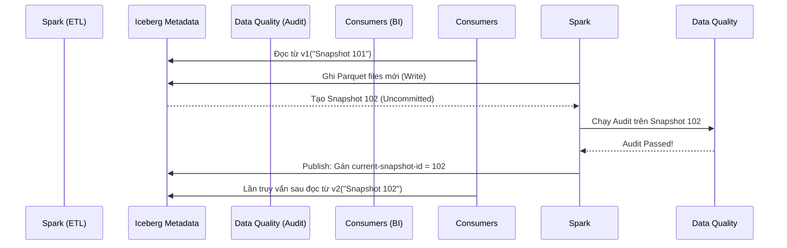

Trong Software Engineering, **Blue-Green Deployment** là kỹ thuật dựng song song hai môi trường giống hệt nhau (Blue đang live, Green đang cập nhật) và "chuyển mạch" (switch traffic) qua Load Balancer khi Green đã sẵn sàng. 

Tuy nhiên, trong Data Engineering, việc xử lý hàng Petabyte dữ liệu không thể đơn giản là "dựng thêm một cụm server". Nếu cập nhật pipeline trực tiếp trên Production (dùng `TRUNCATE / INSERT` hoặc `UPDATE`), hệ thống sẽ đối mặt với **"Mixed World Problem"** — trạng thái người dùng (BI Dashboards, ML Models) truy vấn đúng lúc dữ liệu đang ghi dở dang, dẫn đến báo cáo sai lệch hoặc crash pipeline downstream.

Để giải quyết triệt để bài toán Zero-Downtime và Data Quality, Data Engineering ứng dụng một biến thể của Blue-Green có tên là **WAP Pattern (Write - Audit - Publish)**, được khởi xướng và áp dụng rộng rãi bởi Netflix.

---

## 1. Kiến trúc Cốt lõi: Mô hình Write-Audit-Publish (WAP)

Thay vì ghi trực tiếp vào bảng đang phục vụ (Production), luồng dữ liệu sẽ đi qua 3 giai đoạn cô lập nghiêm ngặt:

```mermaid
graph TD
    subgraph "1. WRITE("Staging/Green")
        A["Kafka / S3 Raw Data"] -->|Spark / dbt ETL| B["(Uncommitted Snapshot / \n Staging Schema)"]
        style B fill:#e6f4ea,stroke:#1e8e3e
    end

    subgraph "2. AUDIT("Validation")
        B --> C{"Data Quality Tests \n dbt test / Great Expectations"}
        C -- Fails --> D["Alert & Halt Pipeline. \n Prod is untouched!"]
        style D fill:#fce8e6,stroke:#d93025
    end

    subgraph "3. PUBLISH("Production/Blue")
        C -- Passes --> E["Metadata Swap / \n Branch Merge"]
        E --> F["(Production Table / View)"]
        style F fill:#e8f0fe,stroke:#1a73e8
    end
    
    F -.->|Downstream Consumers| G["BI Dashboards / ML Models"]
```

1. **Write:** Dữ liệu mới được pipeline tính toán và ghi vào một môi trường ẩn (Staging Schema, hoặc uncommitted Iceberg snapshot). Consumers hoàn toàn **không** nhìn thấy dữ liệu này.
2. **Audit:** Các bài test chất lượng dữ liệu tự động (Null checks, Duplicate checks, Referential integrity, Statistical drift) được chạy trên môi trường ẩn này.
3. **Publish:** Chỉ khi 100% tests vượt qua (Pass), hệ thống mới thực hiện một lệnh **Metadata Swap** (chỉ tráo đổi siêu dữ liệu, không di chuyển data vật lý) để đẩy môi trường mới thành Production.

---

## 2. Kiến trúc Thực thi Vật lý (Physical Execution)

Tuy nguyên lý là giống nhau, cách thực thi Blue-Green/WAP phụ thuộc rất lớn vào Data Stack bên dưới.

### 2.1. Tầng Data Warehouse (Snowflake / BigQuery)

Ở các nền tảng CDW, chúng ta lợi dụng tính năng **Zero-Copy Clone** và **Metadata Swapping** để thực thi nhanh chóng.

**Ví dụ trên Snowflake với dbt:**
Thay vì update trực tiếp vào schema `PROD`, ta chạy dbt build vào schema `STG` (Green). Sau khi `dbt test` thành công, ta dùng lệnh `ALTER DATABASE ... SWAP WITH ...` để tráo đổi. Lệnh này là một atomic transaction chỉ thay đổi metadata pointer, diễn ra trong vòng vài mili-giây, bất kể DB nặng bao nhiêu TB.

**Code Thực chiến (dbt Macro cho Snowflake Swap):**
```sql
-- filepath: macros/blue_green_swap.sql

    
    
        -- Đổi tên nguyên khối database một cách Atomic
        ALTER DATABASE {{ prod_db }} SWAP WITH {{ staging_db }};
    

    
        
        
        
    


```

### 2.2. Tầng Data Lakehouse (Netflix Psyberg & Apache Iceberg)

Tại Netflix, hệ thống **Psyberg** (viết tắt của Pyspark + Iceberg) thực thi WAP ở quy mô cực lớn bằng cách tận dụng **Iceberg Snapshots**. 

Khi pipeline ETL chạy, thay vì commit (xuất bản) dữ liệu mới vào bảng Iceberg ngay lập tức, Psyberg sinh ra một metadata file mới nhưng không cập nhật con trỏ `current-snapshot-id` của bảng.



Ngoài ra, các công cụ quản lý Data Versioning như **lakeFS** hoặc **Project Nessie** cũng cung cấp API giống hệt `git`:
1. `CREATE BRANCH feature_etl_v2`
2. ETL ghi vào branch này.
3. `MERGE feature_etl_v2 INTO main` (Atomic publish).

---

## 3. Rủi ro Vận hành và Systemic Trade-offs (Operational Risks)

Blue-Green Deployment không phải là viên đạn bạc. Nó đi kèm với những đánh đổi hệ thống vô cùng tốn kém nếu không cẩn thận:

### 3.1. Storage Cost vs. Metadata Pointers (Chi phí Lưu trữ)
- **Rủi ro:** Nếu bạn sử dụng các Database truyền thống (như PostgreSQL) không hỗ trợ Zero-Copy Clone, việc tạo schema Green đồng nghĩa với việc bạn phải **x2 chi phí lưu trữ** (nhân bản toàn bộ bảng Fact 5TB thành 10TB).
- **Trade-off:** Đánh đổi tiền bạc lấy sự an toàn. 
- **Giải pháp:** Chỉ áp dụng WAP với các kiến trúc hỗ trợ Metadata pointers (Iceberg, Delta, Snowflake Clone, BigQuery Table Clone).

### 3.2. Nỗi ám ảnh của Streaming Pipelines (Consumer Offset Hell)
- **Rủi ro:** WAP rất dễ thiết lập cho Batch processing. Nhưng với Stateful Streaming (VD: Flink đọc từ Kafka), để chạy Blue và Green song song, bạn phải có 2 consumer group riêng biệt cùng đọc một topic. 
- **System Crash:** Khi Swap từ Green sang Blue, làm sao đồng bộ chính xác Kafka Offset và Watermarks để không bị lặp dữ liệu (Duplicate) hoặc sót dữ liệu (Data Loss)? Nếu Flink Job chứa stateful window aggregation, việc warm-up state cho môi trường Green có thể mất hàng giờ.
- **Lời khuyên:** Hạn chế Blue-Green cho Stateful Streaming. Thông thường ở Streaming, người ta ưu tiên schema evolution an toàn (Avro/Protobuf) và Forward-compatibility hơn là dựng 2 luồng.

### 3.3. Garbage Collection & Storage Fragmentation
- **Rủi ro:** Khi Swap liên tục, bạn để lại một đống "rác" (các snapshots cũ, các schema Blue đã bị giáng cấp, các file Parquet mồ côi). Nếu không dọn dẹp, Iceberg metadata size sẽ phình to, dẫn đến OOMKilled cho cỗ máy Spark Driver khi đọc metadata, hoặc Cloud bill tăng vọt.
- **Giải pháp:** Cấu hình tự động dọn rác (Vacuum/Expire Snapshots). Tuy nhiên, cần giữ lại môi trường cũ một khoảng **Retention Window** (vd: 3-5 ngày) như một "phao cứu sinh" để có thể Rollback lập tức nếu user phát hiện business logic sai sót mà Audit phase bỏ lọt.

---

## 4. Tóm lược Quy trình Orchestration chuẩn (Airflow DAG)

Một DAG (Directed Acyclic Graph) tiêu chuẩn trong Airflow/Dagster triển khai mô hình WAP thường trông như sau:

1. `clone_prod_to_staging`: Zero-copy clone Prod sang Staging (chuẩn bị môi trường Green).
2. `dbt_run_models`: Chạy logic biến đổi trên Staging.
3. `dbt_test_models`: Chạy Audit check (null, unique, relationship).
4. `swap_staging_and_prod`: (Publish) Kích hoạt lệnh tráo schema atomic.
5. `drop_old_staging_async`: Xóa bản Staging cũ (sau khi hết hạn retention) để tiết kiệm tiền.

---

## 5. Nguồn Tham Khảo (References)

- [Netflix TechBlog: "Psyberg" - Data Processing at Netflix](https://netflixtechblog.com/)
- [Apache Iceberg: Snapshot Isolation & Branching](https://iceberg.apache.org/docs/latest/branching/)
- [DataOps Manifesto](https://dataopsmanifesto.org/)
- [WAP Pattern (Write-Audit-Publish) by lakeFS](https://lakefs.io/)
- [Zero-Copy Cloning in Snowflake](https://docs.snowflake.com/en/user-guide/object-clone)
