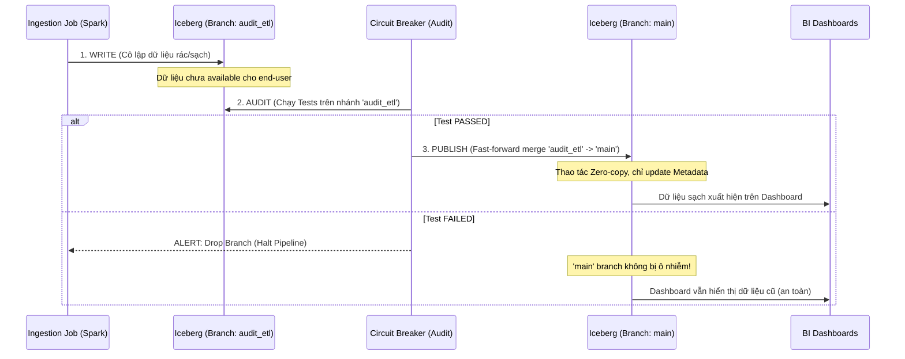

Trong kỹ thuật phần mềm (Software Engineering), "Circuit Breaker" (Cầu dao tự ngắt) là một Design Pattern nhằm ngăn chặn một hệ thống liên tục gọi đến một Service đang chết, tránh hiệu ứng sụp đổ dây chuyền (Cascading Failure). 

Trong Data Engineering, chúng ta vay mượn và áp dụng pattern này để giám sát **chất lượng và tính toàn vẹn của dữ liệu**. Thay vì kiểm tra xem API có "sống" hay không, Data Circuit Breaker kiểm tra xem dữ liệu chảy qua pipeline có đạt ngưỡng chất lượng (Quality Thresholds) hay không. 

Dưới góc nhìn của một Staff Data Engineer, mục tiêu tối thượng của Circuit Breaker là **Fail-fast (Thất bại nhanh)**: Thà dừng pipeline ngay lập tức (dù báo cáo bị trễ) còn hơn để "dữ liệu độc hại" (poisoned data) lan truyền xuống Data Warehouse, làm hỏng các báo cáo tài chính của C-level, phá hỏng các mô hình Machine Learning, và kéo theo một chiến dịch dọn dẹp (Data Cleanup) khổng lồ tốn hàng tuần trời.

---

## 1. Kiến trúc Thực thi Vật lý (Physical Execution)

Cơ chế Circuit Breaker trong Data Pipeline hoạt động dựa trên 3 trạng thái của một Cỗ máy Trạng thái (State Machine):

1. **Closed (Đóng mạch/Bình thường):** Dữ liệu vượt qua các bài kiểm tra (Data Quality Assertions) tại các chốt chặn. Pipeline chảy bình thường xuống hạ nguồn.
2. **Open (Mở mạch/Ngắt):** Phát hiện mức độ vi phạm dữ liệu vượt ngưỡng (ví dụ: > 5% giá trị NULL cho khóa chính `user_id`). Mạch "ngắt", pipeline lập tức dừng lại (Halt). Không có tác vụ hạ nguồn (Downstream Tasks) nào được chạy. Hệ thống bắn Alert kèm theo Context (Log, ID của Query bị lỗi) cho On-call Engineer.
3. **Half-Open (Đang kiểm tra lại/Thử nghiệm):** (Ít phổ biến hơn trong Data, thường dùng trong Streaming) Pipeline thử chạy lại một micro-batch hoặc chờ một tín hiệu từ upstream báo rằng dữ liệu đã được backfill để tự động đóng mạch trở lại.

---

## 2. Thiết kế Điểm Chốt Chặn (Circuit Breaker Placement)

Việc đặt Circuit Breaker ở đâu quyết định tính hiệu quả và chi phí của hệ thống. 

### 2.1. Tầng Orchestration (Apache Airflow / Dagster)
Đây là nơi lý tưởng nhất để điều phối luồng kiểm tra. Trong Airflow, bạn không nên để DAG chạy liên tiếp các task nếu dữ liệu đầu vào đã hỏng. Đừng bao giờ dựa vào việc Task fail tự nhiên (do lỗi SQL), vì đôi khi dữ liệu sai logic (nhưng đúng cú pháp) vẫn chạy thành công.

**Thực chiến với Airflow `ShortCircuitOperator`:**
Sử dụng `ShortCircuitOperator` để đánh giá Data Quality. Nếu hàm Python trả về `False`, toàn bộ các task downstream sẽ bị **Skip (Bỏ qua)** thay vì bị đánh dấu Failed một cách hỗn loạn. Điều này giữ cho trạng thái của DAG gọn gàng nhưng vẫn không làm hỏng dữ liệu.

```python
from airflow import DAG
from airflow.operators.python import ShortCircuitOperator
from airflow.providers.snowflake.operators.snowflake import SnowflakeOperator
from datetime import datetime

def check_data_quality_threshold():
    # Ví dụ query kiểm tra tỷ lệ NULL từ bảng Staging sau khi load từ S3
    # Trả về True nếu tỷ lệ NULL < 1% (Cho phép đi tiếp)
    # Trả về False nếu >= 1% (Ngắt mạch)
    null_rate = get_null_rate_from_snowflake("staging_orders", "customer_id")
    return null_rate < 0.01

with DAG("daily_sales_pipeline", start_date=datetime(2026, 1, 1)) as dag:
    
    ingest_task = SnowflakeOperator(
        task_id="ingest_to_staging",
        sql="COPY INTO staging_orders FROM @s3_stage"
    )

    # Đóng vai trò Data Circuit Breaker
    circuit_breaker = ShortCircuitOperator(
        task_id="dq_circuit_breaker",
        python_callable=check_data_quality_threshold
    )

    transform_task = SnowflakeOperator(
        task_id="transform_to_fact",
        sql="INSERT INTO fact_sales SELECT * FROM staging_orders"
    )

    # Định nghĩa Workflow
    ingest_task >> circuit_breaker >> transform_task
```

### 2.2. Tầng Transformation (dbt)
Trong dbt, việc ngắt mạch được tích hợp tự nhiên thông qua lệnh `dbt build`. Lệnh này sẽ chạy model, sau đó chạy ngay các Test của model đó. Nếu test **Fail**, dbt sẽ chặn đứng, không chạy các model hạ nguồn (downstream models).

```yaml
# dbt schema.yml configuration
models:
  - name: stg_payments
    columns:
      - name: payment_id
        tests:
          - unique:
              config:
                severity: error # Kích hoạt Circuit Breaker, DỪNG downstream
          - not_null:
              config:
                severity: warn  # Chỉ gửi cảnh báo vào logs, KHÔNG dừng downstream
```

---

## 3. Nâng cấp Kiến trúc: Write-Audit-Publish (WAP) Pattern

Circuit Breaker truyền thống đôi khi vẫn gặp một lỗ hổng chí mạng (Fatal Flaw): Nếu bạn ghi dữ liệu trực tiếp vào bảng Production (ví dụ dùng `INSERT INTO`), sau đó mới chạy `ShortCircuitOperator` hoặc `dbt test` và ngắt mạch thì sao? 
Lúc này "rác" đã nằm gọn trong Production. Người dùng mở Dashboard lên đã thấy số liệu bị sai. Mạch bị ngắt lúc này chỉ ngăn lỗi lan xuống tầng sâu hơn, nhưng không bảo vệ được tầng hiện tại.

Để giải quyết dứt điểm, các kỹ sư tại **Netflix** đã phổ biến **Write-Audit-Publish (WAP) pattern**, kết hợp hoàn hảo với kiến trúc Table Format hiện đại như **Apache Iceberg**. 

WAP hoạt động giống hệt mô hình Git Branching hoặc Blue-Green Deployment trong Software Engineering:

1. **Write (Ghi):** Data Pipeline ghi dữ liệu vào một nhánh (Branch) cô lập, hoặc một Snapshot ẩn. Người dùng hạ nguồn hoàn toàn không nhìn thấy dữ liệu này.
2. **Audit (Kiểm toán - Circuit Breaker):** Chạy các Data Quality tests hạng nặng (Great Expectations, dbt) TRÊN NHÁNH ẨN đó.
3. **Publish (Công bố):** Nếu Audit PASSED, thực hiện "tráo đổi" (View Swap) hoặc Fast-forward commit để trộn (merge) nhánh ẩn ra bảng Production. Khớp nối với nhánh chính ngay lập tức. Nếu FAILED, bỏ rơi nhánh ẩn, hệ thống Production không hề bị sứt mẻ (Zero Blast Radius).

### Sơ đồ Kiến trúc WAP với Apache Iceberg Branching



### Triển khai WAP với Apache Iceberg & Spark SQL

Iceberg hỗ trợ native branching. Bất kỳ thao tác DML nào cũng có thể trỏ vào một branch cụ thể.

```sql
-- 1. WRITE: Tạo một nhánh cô lập có tên 'audit_etl' từ 'main'
ALTER TABLE prod.db.fact_sales CREATE BRANCH audit_etl;

-- Pipeline Spark/Flink thực hiện INSERT dữ liệu mới vào nhánh 'audit_etl'
-- Người dùng query bảng `fact_sales` vẫn chỉ thấy dữ liệu cũ trên 'main'
INSERT INTO prod.db.fact_sales FOR VERSION AS OF 'audit_etl' 
SELECT * FROM staging_data;

-- 2. AUDIT: Công cụ DQ query trực tiếp nhánh 'audit_etl' để test
SELECT COUNT(*) FROM prod.db.fact_sales VERSION AS OF 'audit_etl' WHERE amount IS NULL;

-- 3. PUBLISH: Nếu Test Passed, fast-forward nhánh 'main' để trỏ tới snapshot của 'audit_etl'
CALL catalog.system.fast_forward('prod.db.fact_sales', 'main', 'audit_etl');

-- Cleanup nhánh audit (Optional)
ALTER TABLE prod.db.fact_sales DROP BRANCH audit_etl;
```
Nhờ quản lý phiên bản qua metadata (Snapshot ID), bước Publish là một thao tác cập nhật con trỏ Metadata `O(1)`, không hề tốn I/O copy lại dữ liệu, giúp WAP pattern trở nên cực kỳ rẻ và hiệu quả.

---

## 4. Rủi ro Vận hành (Operational Risks) & Trade-offs

Dù Data Circuit Breaker và WAP là "viên đạn bạc" bảo vệ Data Warehouse, việc triển khai chúng đi kèm với nhiều sự đánh đổi mà một Data Engineer cần phải đối mặt:

### 4.1. Alert Fatigue (Hội chứng kiệt sức vì cảnh báo)
*   **Vấn đề:** Nếu bạn đặt ngưỡng Circuit Breaker quá khắt khe (ví dụ: Không cho phép bất kỳ 1 dòng NULL nào trong bảng 1 tỷ dòng), pipeline sẽ gãy liên tục mỗi ngày do các dị thường nhỏ từ hệ thống nguồn. Kỹ sư trực ca sẽ bị spam trên Slack, dần dần sinh ra hiệu ứng "Crying Wolf", dẫn đến việc phớt lờ luôn những lỗi nghiêm trọng thật sự.
*   **Khắc phục:** Áp dụng chiến lược "Cảnh báo phân cấp". Chỉ dùng Circuit Breaker ngắt mạch (Halt) cho các Tier-1 Assets (Dữ liệu tài chính, tính lương). Các bảng Tier-3 chỉ nên gửi cảnh báo (Warn) và không làm đứt mạch pipeline.

### 4.2. Compute Cost vs. Data Integrity
*   **Vấn đề:** Để thực hiện bước `Audit` trong WAP, bạn phải chạy các phép `COUNT`, `GROUP BY`, `JOIN` (để test Referential Integrity). Các câu lệnh SQL này tiêu tốn Compute Credits (Snowflake) hoặc Bytes Billed (BigQuery). Càng nhiều chốt chặn, hóa đơn Cloud càng tăng cao.
*   **Khắc phục:** Không full-table scan. Hãy thiết kế Audit tests chạy trên phân vùng dữ liệu mới nhất (Incremental Audit) hoặc lấy mẫu (Sampling). Chấp nhận đánh đổi chi phí Compute tăng khoảng 10-15% để mua lại "Bảo hiểm" toàn vẹn dữ liệu.

### 4.3. Dependency Hell & Pipeline Deadlocks
*   **Vấn đề:** Khi một bảng quan trọng bị ngắt mạch, toàn bộ hệ sinh thái Dashboard downstream sẽ không được update (Stale Data). Nếu Business User cần số liệu gấp để họp Hội đồng quản trị, áp lực "Bypass" (Bỏ qua) Circuit Breaker từ cấp trên sẽ rất lớn. Pipeline rơi vào Deadlock: Dữ liệu sai thì không dám public, nhưng dữ liệu cũ thì Business không chấp nhận.
*   **Khắc phục:** Thiết lập SLA rõ ràng. Xây dựng một cơ chế "Emergency Override" [Công tắc khẩn cấp] dưới dạng một API hoặc DAG parameter (`bypass_dq_checks=True`) để force-run pipeline trong trường hợp bất khả kháng, đồng thời tự động log lại sự kiện này cho mục đích Post-mortem.

## Tổng Kết

Data Circuit Breakers kết hợp cùng Write-Audit-Publish (WAP) pattern là nền tảng cốt lõi của một kiến trúc dữ liệu độ tin cậy cao (High-Reliability Data Architecture). Việc thiết lập các chốt chặn này đòi hỏi sự thấu hiểu sâu sắc về **Trade-offs** giữa Chi phí Compute, Tốc độ luân chuyển dữ liệu và Chất lượng dữ liệu, đánh dấu sự trưởng thành của một hệ thống DataOps chuẩn Enterprise.

## Nguồn Tham Khảo (References)
* [Apache Iceberg Official Docs: Branching and Tagging](https://iceberg.apache.org/docs/latest/branching/)
* [Netflix Tech Blog: Data Mesh - A Data Movement and Processing Platform](https://netflixtechblog.com/)
* [Apache Airflow Official Docs: ShortCircuitOperator](https://airflow.apache.org/docs/apache-airflow/stable/core-concepts/dags.html)
* [dbt Labs: The dbt build command](https://docs.getdbt.com/reference/commands/build)
* [Project Nessie - Git-like Experience for Data Lakes](https://projectnessie.org/)
