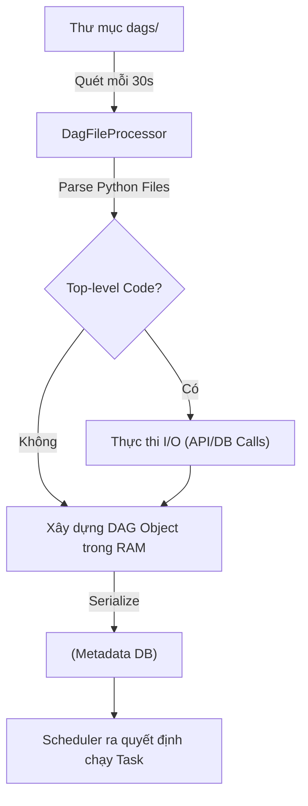
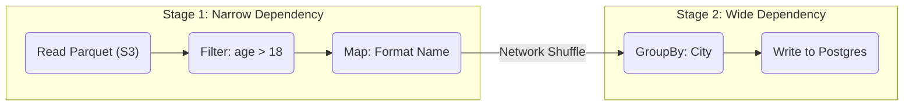

Nếu bạn bước vào một cuộc phỏng vấn vị trí Data Engineer và được hỏi "DAG là gì?", câu trả lời "Directed Acyclic Graph - Đồ thị có hướng không chu trình" chỉ đủ để bạn qua vòng sơ loại của các Junior. 

Để chứng minh năng lực của một Senior/Staff Engineer, bạn cần hiểu DAG không chỉ là một khái niệm toán học khô khan, mà là **một bản vẽ kiến trúc (Execution Blueprint)** quyết định cách hệ thống phân bổ tài nguyên, khóa (Lock) dữ liệu, và phục hồi (Recover) sau thảm họa.

Trong hệ sinh thái Dữ liệu hiện đại, DAG tồn tại ở hai cấp độ vật lý hoàn toàn khác biệt: 
1. **Orchestration DAGs** (như Apache Airflow, Netflix Maestro, Dagster) dùng để điều phối các tác vụ vĩ mô (Macro-tasks).
2. **Execution DAGs** (như Apache Spark, Trino, Flink) dùng để tối ưu hóa việc tính toán vi mô (Micro-computations).

Bài viết này sẽ "mổ xẻ" cả hai cấp độ này dưới góc nhìn System Design.

---

## 1. Orchestration DAGs: Vòng lặp Parsing và "Scheduler Tax"

Trong các hệ thống điều phối như Apache Airflow, DAG không phải là các file cấu hình tĩnh (Static JSON/XML). Chúng được định nghĩa hoàn toàn bằng code (Python/Scala). Đặc tính "Code as Configuration" mang lại sự linh hoạt tuyệt đối, nhưng lại sinh ra một cơ chế vật lý chết người gọi là **DAG Parsing Loop (Vòng lặp biên dịch DAG)**.

### 1.1. Bản chất của DAG Parsing
Airflow Scheduler không tự động biết DAG của bạn có bao nhiêu Task hay chạy lúc mấy giờ. Nó sở hữu một tiến trình ngầm (Daemon) gọi là `DagFileProcessor`. Tiến trình này sẽ quét toàn bộ thư mục `dags/` mỗi `min_file_process_interval` (mặc định là 30 giây). Nó sẽ import và **thực thi (execute) tất cả các file Python của bạn từ trên xuống dưới** nhằm xây dựng (Build) ra các object DAG trong bộ nhớ (RAM), sau đó Serialize (Tuần tự hóa) và đẩy cục Metadata đó vào Database (Postgres/MySQL).



### 1.2. Thảm họa "Scheduler Tax"
**Vấn đề vật lý:** Bất kỳ đoạn code nào nằm ngoài các hàm của Task (gọi là Top-level code) sẽ bị CPU của Scheduler thực thi lại **mỗi 30 giây**. 
Nếu bạn có 1000 file DAG, và mỗi DAG chứa một đoạn code gọi API để lấy cấu hình, Scheduler của bạn sẽ bắn 1000 request API mỗi 30 giây! Scheduler sẽ bị vắt kiệt CPU, kẹt cứng, dẫn đến độ trễ (Latency) cực lớn trong việc kích hoạt các Task khác. Hiện tượng ngốn tài nguyên vô ích này được giới kỹ sư gọi là **"Scheduler Tax" (Thuế lập lịch)**.

#### ❌ Cấu trúc DAG Tồi (Gây kẹt Scheduler)
```python
from airflow import DAG
from airflow.operators.python import PythonOperator
import requests

# TOP-LEVEL CODE: Chạy trên CPU của Scheduler Node mỗi 30 giây!
# Nếu API mất 2s để phản hồi * 50 files = Mất 100s chỉ để parse DAG.
# Scheduler sẽ bị nghẽn (Stalled) hoàn toàn.
config_data = requests.get("https://internal-api/dag-config").json()

with DAG('dynamic_bad_dag', schedule_interval='@daily') as dag:
    for item in config_data:
        PythonOperator(
            task_id=f"process_{"item['id']"}",
            python_callable=my_business_logic,
            op_kwargs={'data': item}
        )
```

#### ✅ Cấu trúc DAG Chuẩn (Tối ưu Parsing Time)
Giải pháp là đẩy logic I/O nặng vào bên trong **Ngữ cảnh thực thi của Task (Task Context)**, hoặc sử dụng kiến trúc **Dynamic Task Mapping** của Airflow 2.3+ để trì hoãn việc lấy dữ liệu cho đến thời điểm Runtime (Khi Task chạy trên Worker, thay vì trên Scheduler).

```python
from airflow import DAG
from airflow.decorators import task

with DAG('dynamic_good_dag', schedule_interval='@daily') as dag:
    
    @task
    def fetch_config():
        # Code này CHỈ chạy khi Task được kích hoạt bởi Celery/K8s Worker.
        # Scheduler KHÔNG thực thi nó trong lúc biên dịch file.
        import requests
        return requests.get("https://internal-api/dag-config").json()

    @task
    def process_data(item):
        print(f"Processing ID: {item['id']}")

    # Dynamic Task Mapping (Expand): 
    # Số lượng Task con sẽ được nội suy động ở thời điểm RUNTIME.
    # Không tạo gánh nặng cho Scheduler lúc parse.
    configs = fetch_config()
    process_data.expand(item=configs)
```

---

## 2. Execution DAGs: Lazy Evaluation & Shuffle Boundaries

Khác với Airflow (nơi bạn tự tay vẽ DAG), các Engine xử lý dữ liệu như **Apache Spark** tự động sinh ra Execution DAG.

Khi bạn viết code Spark (Dataframe API), Spark áp dụng cơ chế **Lazy Evaluation (Đánh giá lười biếng)**. Nghĩa là, nó không đụng vào một Byte dữ liệu nào cả, mà chỉ ghi nhận các lệnh biến đổi (Transformations như `.filter()`, `.map()`) thành một *Logical Plan*.
Chỉ khi nào nó gặp một Action (như `.write()` hoặc `.collect()`), **DAGScheduler** của Spark mới thức giấc và biên dịch Logical Plan thành một **Physical Execution DAG**.



Kiến trúc này chia DAG thành các **Stages (Giai đoạn)** bị ngăn cách bởi **Shuffle Boundaries (Ranh giới xáo trộn)**:
- **Narrow Dependencies (Phụ thuộc hẹp):** Các phép toán như `filter`, `map`. Dữ liệu không rời khỏi Node vật lý (Worker). Cực kỳ nhanh, không tốn I/O.
- **Wide Dependencies (Phụ thuộc rộng):** Các phép toán như `groupBy`, `join`. Bắt buộc hệ thống phải ghi dữ liệu tạm ra đĩa (Spill-to-disk) và truyền qua mạng (Network Shuffle) cho các Node khác. **Đây là nơi xảy ra 90% lỗi OOM (Out of Memory) trong Data Engineering.**

---

## 3. Rủi ro Vận hành và Đánh đổi Hệ thống (Systemic Trade-offs)

Trong các hệ thống Enterprise (như Netflix Maestro chạy hàng triệu task/ngày), việc thiết kế DAG bộc lộ những bài toán đánh đổi khốc liệt:

### 3.1. Cartesian Explosion (Bùng nổ tổ hợp) trong Task Mapping
**Vấn đề:** Trong Airflow, nếu bạn sử dụng `expand()` (Dynamic Mapping) lồng nhau qua hai danh sách: 1000 khách hàng và 1000 sản phẩm. Airflow sẽ cố gắng tạo ra $1,000 \times 1,000 = 1,000,000$ Task Instances trong Metadata DB chỉ cho *một* DAG Run. 
**Hậu quả:** Tràn RAM (OOMKilled) trên Scheduler và sập luôn cơ sở dữ liệu PostgreSQL đằng sau do quá tải `INSERT`.
**Đánh đổi:** Thay vì dùng Orchestration DAG để map 1 triệu phần tử, hãy map ở mức "Chunk" [10 Task, mỗi Task xử lý 100.000 phần tử bằng Spark]. **Hãy để Airflow làm nhạc trưởng, đừng bắt nó làm công nhân.**

### 3.2. Idempotency (Tính Lũy Đẳng)
**Vấn đề:** Một node trong DAG chạy fail ở giữa chừng (ví dụ: đang `INSERT` được 50% dữ liệu thì cúp điện). Khi bạn bấm `Clear` để chạy lại Task đó (Retry), dữ liệu bị nhân đôi (Duplicated).
**Đánh đổi kiến trúc:** Mọi Task trong DAG bắt buộc phải có tính Idempotency. Nghĩa là chạy 1 lần hay 100 lần thì kết quả cuối cùng trên Database vẫn y hệt nhau. 
- *Cách làm:* Đừng dùng `INSERT INTO`. Hãy dùng `MERGE INTO` (UPSERT), hoặc kiến trúc **Write-Audit-Publish (WAP)** (Ghi vào phân vùng tạm, chạy xong hết mới swap pointer).

### 3.3. Thắt cổ chai Fan-out / Fan-in
**Vấn đề:** Thiết kế DAG phân nhánh ra 100 Task chạy song song (Fan-out), sau đó gom lại vào 1 Task duy nhất để tính tổng (Fan-in). Task cuối cùng sẽ trở thành điểm nghẽn (Bottleneck), vì nó phải đợi Task thứ 100 hoàn thành (dù 99 Task kia đã xong) và chịu áp lực tải cực lớn.
**Giải pháp:** Thay vì Fan-in ở cấp độ Orchestration, hãy dùng Message Broker (Kafka) để các Fan-out tasks publish event, và có 1 streaming job consume liên tục để tính tổng dần.

---

## Tóm lại

DAG không chỉ là những mũi tên nối các hộp vuông trên giao diện Web UI. Nó là ngôn ngữ chung để bạn giao tiếp với cả hệ thống điều phối (Scheduler) và động cơ tính toán (Compute Engine). Nắm vững vật lý đằng sau DAG - hiểu được lúc nào CPU parse code, lúc nào dữ liệu bị đẩy qua mạng (Shuffle) - là bước đệm tối quan trọng để bạn vươn lên tầm Staff Data Engineer.

---

## Nguồn Tham Khảo

1. **Netflix Tech Blog:** [Maestro: Netflix’s Workflow Orchestrator](https://netflixtechblog.com/) - Phân tích kiến trúc điều phối DAGs ở quy mô khổng lồ của Netflix.
2. **Astronomer Blog (Airflow):** [7 Common Errors to Check When Writing Airflow DAGs](https://www.astronomer.io/blog/) - Cẩm nang tối ưu Scheduler Tax.
3. **Databricks Engineering:** [Understanding Spark Execution: DAGs, Stages, and Shuffles](https://www.databricks.com/)
4. Tác giả Martin Kleppmann, sách *Designing Data-Intensive Applications* (Chương Batch Processing & Dataflows).
