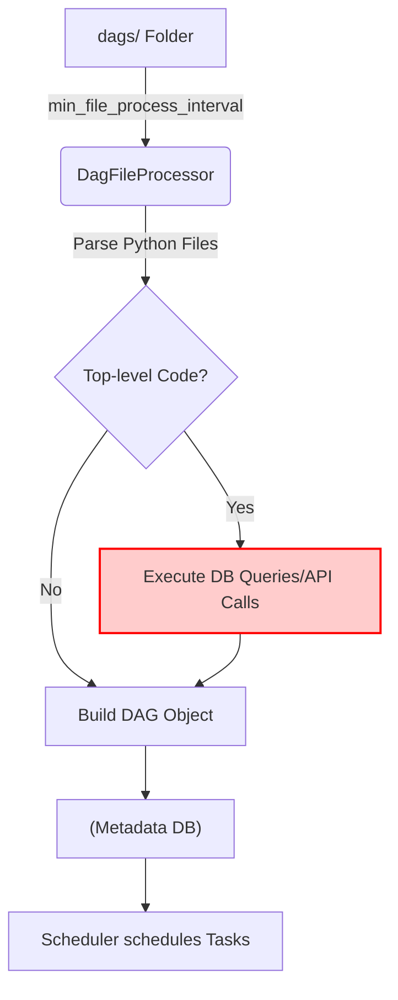
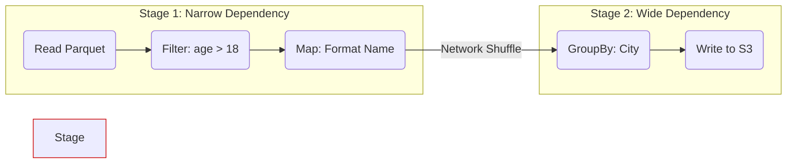

Nếu bạn bước vào một cuộc phỏng vấn Data Engineer và được hỏi "DAG là gì?", câu trả lời "Directed Acyclic Graph - Đồ thị có hướng không chu trình" chỉ đủ để bạn qua vòng sơ loại. Để chứng minh năng lực của một Staff Engineer, bạn cần hiểu DAG không chỉ là một khái niệm toán học, mà là **một bản vẽ kiến trúc (execution blueprint)** quyết định cách hệ thống phân bổ tài nguyên, khóa (lock) dữ liệu, và phục hồi sau sự cố.

Trong hệ sinh thái Dữ liệu, DAG tồn tại ở hai cấp độ vật lý hoàn toàn khác biệt: **Orchestration DAGs** (như Airflow, Netflix Maestro, Dagster) dùng để điều phối tác vụ vĩ mô, và **Execution DAGs** (như Apache Spark, Trino) dùng để tối ưu hóa tính toán vi mô.

---

## Kiến trúc Thực thi Vật lý (Physical Execution Architecture)

### 1. Orchestration DAGs: Vòng lặp Parsing và "Scheduler Tax"

Trong các hệ thống như Apache Airflow, DAG không tĩnh. Chúng được định nghĩa bằng code (Python). Điều này dẫn đến một cơ chế vật lý gọi là **DAG Parsing Loop** (Vòng lặp biên dịch DAG).

Airflow Scheduler không tự động biết DAG của bạn có bao nhiêu Task. Nó sở hữu một tiến trình gọi là `DagFileProcessor`, tiến trình này sẽ quét thư mục `dags/` mỗi `min_file_process_interval` (mặc định 30 giây) để thực thi (execute) file Python của bạn từ trên xuống dưới nhằm xây dựng (build) object DAG trong bộ nhớ, sau đó đẩy metadata vào Database.



**Vấn đề vật lý:** Bất kỳ đoạn code nào nằm ngoài các Task (gọi là Top-level code) sẽ bị CPU của Scheduler thực thi lại **sau mỗi 30 giây**. Nếu bạn có 1000 DAGs và mỗi DAG có một lệnh gọi API ở top-level, Scheduler của bạn sẽ bị vắt kiệt CPU, dẫn đến độ trễ (latency) trong việc kích hoạt các Task khác. Hiện tượng này được giới kỹ sư gọi là **"Scheduler Tax"**.

### 2. Execution DAGs: Lazy Evaluation & Shuffle Boundaries trong Spark

Khác với Airflow định nghĩa DAG bằng tay, Apache Spark tự động sinh ra DAG. Khi bạn viết code Spark (Dataframe API), Spark áp dụng cơ chế **Lazy Evaluation** (Đánh giá lười biếng). Nó không chạy dữ liệu ngay, mà chỉ ghi nhận các phép biến đổi (Transformations) thành một Logical Plan.

Khi gặp một Action (như `.write()` hoặc `.collect()`), DAGScheduler của Spark mới biên dịch Logical Plan này thành một Physical Execution DAG.



Kiến trúc này chia DAG thành các **Stages** (Giai đoạn) bị ngăn cách bởi **Shuffle Boundaries** (Ranh giới xáo trộn):
- **Narrow Dependencies (Phụ thuộc hẹp):** Các phép toán như `filter`, `map`. Dữ liệu không rời khỏi Node vật lý (Worker). Cực kỳ nhanh.
- **Wide Dependencies (Phụ thuộc rộng):** Các phép toán như `groupBy`, `join`. Bắt buộc hệ thống phải ghi dữ liệu tạm ra đĩa (Spill-to-disk) và truyền qua mạng (Network Shuffle) cho các Node khác. Đây là nơi xảy ra 90% lỗi OOM (Out of Memory).

---

## Show, Don't Tell: Giải phẫu "Scheduler Tax" (Airflow Code)

Để minh họa kiến trúc đánh đổi, hãy xem một sự cố thực tế khi kỹ sư cố gắng làm cho DAG "động" (Dynamic) bằng cách truy vấn Database ngay trong file cấu hình.

### Bad Architecture (Gây kẹt Scheduler)

```python
from airflow import DAG
from airflow.operators.python import PythonOperator
import requests

# TOP-LEVEL CODE: Chạy mỗi 30 giây trên Scheduler Node!
# Giả sử API này mất 2 giây để phản hồi, và bạn có 50 file DAG tương tự.
# Scheduler sẽ mất 100 giây chỉ để parse DAG, vượt quá interval 30s -> Toàn bộ hệ thống bị thắt cổ chai.
config_data = requests.get("https://internal-api/dag-config").json()

with DAG('dynamic_bad_dag', schedule_interval='@daily') as dag:
    for item in config_data:
        PythonOperator(
            task_id=f"process_{item['id']}",
            python_callable=my_func,
            op_kwargs={'data': item}
        )
```

### Good Architecture (Tối ưu Parsing Time)

Giải pháp là đẩy logic nặng vào bên trong ngữ cảnh thực thi của Task (Task Context), hoặc sử dụng kiến trúc **Dynamic Task Mapping** của Airflow 2.3+ để trì hoãn việc lấy metadata cho đến thời điểm Runtime.

```python
from airflow import DAG
from airflow.decorators import task

with DAG('dynamic_good_dag', schedule_interval='@daily') as dag:
    
    @task
    def fetch_config():
        # Code này CHỈ chạy khi Task được kích hoạt bởi Worker, 
        # Scheduler KHÔNG thực thi nó trong lúc biên dịch DAG.
        import requests
        return requests.get("https://internal-api/dag-config").json()

    @task
    def process_data(item):
        print(f"Processing {item['id']}")

    # Dynamic Task Mapping (Expand): 
    # Số lượng Task sẽ được nội suy động ở thời điểm runtime, bảo vệ Scheduler.
    configs = fetch_config()
    process_data.expand(item=configs)
```
*Ngoài ra, thiết lập `store_serialized_dags = True` trong cấu hình Airflow sẽ ép Scheduler lưu DAG dưới dạng JSON vào DB, giúp Webserver không cần phải tự parse lại file Python.*

---

## Rủi ro Vận hành và Sự cố Thực tế (Operational Incidents)

Trong các hệ thống Enterprise quy mô lớn (như Netflix sử dụng Maestro chạy hàng triệu task mỗi ngày), DAG bộc lộ những rủi ro vận hành nghiêm trọng:

1. **Cartesian Explosion (Bùng nổ tổ hợp) trong Task Mapping:** 
   Nếu bạn sử dụng `expand()` qua hai danh sách: 1000 khách hàng và 1000 sản phẩm, Airflow sẽ cố gắng tạo ra \$1,000 \times 1,000 = 1,000,000$ Task Instances trong Metadata DB chỉ cho một DAG Run. Hậu quả: Tràn RAM (OOMKilled) trên Scheduler và sập luôn cơ sở dữ liệu PostgreSQL đằng sau.
2. **Zombie Tasks & Cấp phát tài nguyên chết:**
   Trong môi trường Kubernetes (K8sExecutor), nếu một Pod đang chạy Node A bị hệ thống (OOM Killer) ngắt đột ngột, Airflow Scheduler không nhận được tín hiệu hồi đáp. Node A trở thành "Zombie Task". Cấu trúc DAG không thể tiến lên Node B vì Upstream chưa báo `Success`, gây kẹt toàn bộ luồng dữ liệu (Pipeline Stall).
3. **Thắt cổ chai do Hẹp - Rộng (Fan-out / Fan-in):**
   Thiết kế DAG phân nhánh ra 100 Task chạy song song (Fan-out), sau đó gom lại vào 1 Task duy nhất để tính tổng (Fan-in). Task cuối cùng sẽ trở thành điểm nghẽn cổ chai (Bottleneck), vì nó phải đợi Task thứ 100 hoàn thành (dù 99 Task kia đã xong) và chịu áp lực tải cực lớn.

---

## Đánh đổi Hệ thống (Systemic Trade-offs)

Khi thiết kế hệ thống xoay quanh DAG, Data Engineer liên tục phải đối mặt với các bài toán đánh đổi (Trade-offs):

| Quyết định Kiến trúc | Cái giá phải trả (Trade-off) | Khi nào sử dụng? |
| :--- | :--- | :--- |
| **Dynamic DAGs vs. Static DAGs** | DAG động mang lại sự linh hoạt (tự tạo Task từ DB), nhưng đánh đổi bằng việc tiêu tốn CPU của Scheduler để parse liên tục (Tăng Parsing Latency). | Dùng DAG tĩnh (Code sinh Code - ví dụ Terraform/Jinja) cho Core Pipeline. Dùng DAG động cho Ad-hoc reporting. |
| **XComs vs. Object Storage** | Chia sẻ dữ liệu giữa các Node thông qua biến môi trường/Metadata (XComs) rất tiện lợi, nhưng làm phình to DB. | DAG dùng để *điều phối*, không phải *truyền tải*. Hãy lưu dữ liệu lớn vào S3/GCS, và chỉ truyền đường dẫn (URL) qua DAG. |
| **Monolithic DAG vs. Micro-DAGs** | "Super DAG" chứa hàng ngàn node giúp dễ theo dõi toàn cục, nhưng một lỗi nhỏ ở nhánh phụ có thể làm kẹt nhánh chính. | Chia nhỏ thành các DAG theo Domain (Data Mesh concept), liên kết chúng qua `TriggerDagRunOperator` hoặc Event-driven (Kafka). |
| **Broadcast Join vs. Shuffle Join (Spark)** | Loại bỏ Shuffle (Wide Dependency) bằng cách nhân bản bảng nhỏ ra mọi Node (Broadcast). Đánh đổi: Có thể gây OOM trên Worker nếu bảng vượt quá vài trăm MB. | Tối ưu hóa Execution DAG khi join bảng Dimension (nhỏ) với bảng Fact (hàng tỷ dòng). |

Tóm lại, DAG không chỉ là các mũi tên nối với nhau. Nó là ngôn ngữ chung để giao tiếp với cả hệ thống điều phối (Scheduler) và động cơ tính toán (Compute Engine). Nắm vững vật lý đằng sau DAG là bước đệm đầu tiên để bạn vươn lên tầm Staff Engineer.

---

## Nguồn Tham Khảo

1. **Netflix Tech Blog:** [Maestro: Netflix’s Workflow Orchestrator](https://netflixtechblog.com/maestro-netflixs-workflow-orchestrator-123456789) - Phân tích cách Netflix điều phối DAGs ở quy mô khổng lồ.
2. **Apache Airflow Documentation:** [DAG Parsing and The Scheduler](https://airflow.apache.org/docs/apache-airflow/stable/authoring-and-scheduling/dagfile-processing.html)
3. **Databricks Engineering:** [Understanding Spark Execution: DAGs, Stages, and Shuffles](https://www.databricks.com/glossary/apache-spark-dag)
4. Tác giả Martin Kleppmann, sách *Designing Data-Intensive Applications* (Chương Batch Processing & Dataflows).
