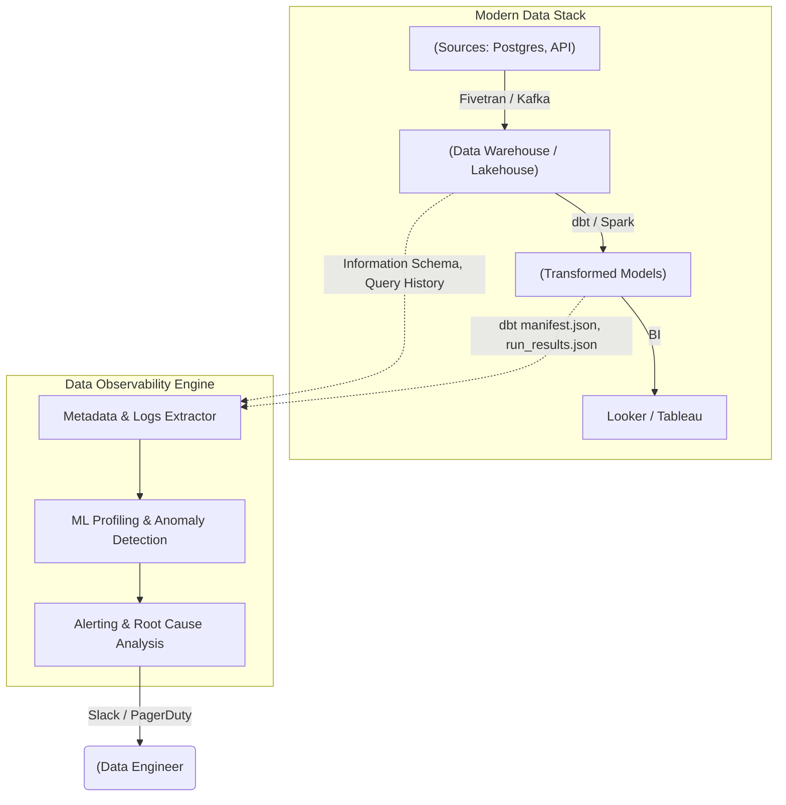

Pipeline của bạn chạy thành công, Airflow báo xanh (Success), dbt không văng lỗi, nhưng sáng hôm sau CEO nhắn tin hỏi: *"Tại sao doanh thu Dashboard ngày hôm qua lại giảm 50%?"*. Đó là một **Silent Failure** (lỗi thầm lặng) điển hình trong Data Engineering. Dữ liệu không lỗi cú pháp, pipeline không sập, nhưng hệ thống nguồn bị mất dữ liệu (Volume Drop) hoặc phân phối dữ liệu sai lệch (Data Drift). 

Lúc này, bạn đang đối mặt với **Data Downtime** — khoảng thời gian dữ liệu bị sai lệch, thiếu sót hoặc không thể tin cậy. Để giải quyết triệt để vấn đề này, chúng ta không thể chỉ phụ thuộc vào Data Quality (chủ yếu là Testing tĩnh). Chúng ta cần thiết lập một kiến trúc **Data Observability** (Khả năng quan sát dữ liệu) toàn diện.

---

## 1. Kiến trúc Vật lý (Physical Architecture)

Data Quality tập trung vào câu hỏi *"Dữ liệu này có đúng Rule không?"*, còn Data Observability trả lời *"Hệ thống này đang hoạt động bình thường không, và nếu lỗi thì Root Cause ở đâu?"*. 

Để giải quyết bài toán này ở quy mô Petabyte mà không làm sập Data Warehouse hoặc đội chi phí Compute, nền tảng Data Observability hiện đại (như Monte Carlo, Metaplane, Databand) được thiết kế theo nguyên lý **Metadata-driven (Dẫn động bằng Siêu dữ liệu)**.



### Đánh đổi Hệ thống (Systemic Trade-offs): Metadata-driven vs. Data-driven
*   **Data-driven (Truy vấn toàn bộ dữ liệu - Full Scan):** Đo lường Data Quality bằng cách thực thi `SELECT COUNT(*)`, `AVG()`, `MAX()` trên các bảng tỷ lệ lớn. 
    *   *Trade-off:* Độ chính xác tuyệt đối nhưng Compute Cost cực kỳ khổng lồ, dễ gây ra hiệu ứng thắt cổ chai (Bottlenecks) trên Data Warehouse.
*   **Metadata-driven (Truy vấn Siêu dữ liệu):** Chỉ parse `information_schema`, `query_history` hoặc `system logs` để lấy row count, bytes, và lineage. 
    *   *Trade-off:* Gần như không tốn Compute (Zero-compute cost), không tác động tới dữ liệu PII (bảo mật cao). Tuy nhiên, không bắt được các lỗi logic dữ liệu sâu (như sai lệch giá trị một cột nhất định). 

Trong thực tế, hệ thống tốt nhất phải kết hợp cả hai: Dùng Metadata Profiling để theo dõi toàn bộ (Broad Coverage) và dùng Data Quality Rules/Query Sampling để giám sát sâu các tài sản dữ liệu Tier-1 (Precision).

---

## 2. 5 Trụ cột (Pillars) & Mã nguồn Thực chiến

Bar Moses (CEO Monte Carlo) chuẩn hóa Data Observability thành 5 trụ cột. Thay vì lý thuyết, chúng ta hãy xem cách chúng hoạt động thông qua mã nguồn cấu hình thực tế sử dụng **SodaCL** (một công cụ Observability/Data Quality mã nguồn mở) và **dbt**.

### 2.1. Freshness (Độ tươi) & Volume (Khối lượng)
Dữ liệu có cập nhật đúng SLA không? Hôm nay dữ liệu ingest vào là 10 triệu dòng hay tụt xuống còn 1 triệu dòng? 

Trong dbt, chúng ta có thể cấu hình `source freshness` kết hợp với tính năng cảnh báo bất thường (Anomaly Detection) của SodaCL:

```yaml
# dbt_project/models/sources.yml (Freshness)
sources:
  - name: production_db
    tables:
      - name: orders
        loaded_at_field: _etl_loaded_at
        freshness:
          warn_after: {count: 1, period: hour}
          error_after: {count: 2, period: hour}

# soda_checks.yml (Volume Anomaly)
checks for orders:
  # ML model sẽ học chuỗi thời gian (time-series) của row_count 
  # và báo động nếu có sự sụt giảm/tăng vọt bất thường
  - anomaly score for row_count < 0.01:
      name: Phát hiện bất thường lượng dữ liệu Volume
```

### 2.2. Schema (Lược đồ)
**Schema Drift** là cơn ác mộng lớn nhất. Kỹ sư phần mềm (Software Engineer) vô tình drop cột `customer_id` hoặc đổi kiểu dữ liệu từ `INT` sang `STRING`, lập tức pipeline dbt phía sau vỡ vụn (Crash).

Thay vì đợi dbt văng lỗi, Data Observability engine sẽ bắt lỗi Schema Change ngay từ lúc Fivetran vừa sync dữ liệu thô vào Data Warehouse:

```yaml
checks for raw_customers:
  # Cảnh báo trên Slack bất cứ khi nào Schema bị thay đổi (thêm, sửa, xóa cột)
  - schema:
      warn: when schema changes
      fail: 
        when required column:
          - customer_id
          - email
        when wrong column type:
          customer_id: integer
```

### 2.3. Distribution (Phân phối dữ liệu) & Data Quality ở mức trường
Khác với Volume (tính trên toàn bảng), Distribution giám sát giá trị nội tại của từng cột. Nếu cột `discount_rate` bình thường có giá trị từ 0 - 0.3, tự nhiên xuất hiện giá trị 50, hệ thống cần báo động.

```yaml
checks for sales_transactions:
  - invalid_percent(discount_rate) < 1 %:
      valid min: 0
      valid max: 0.5
  - missing_percent(email) < 5 %:
      name: Tỷ lệ NULL cột email không được vượt quá 5%
```

### 2.4. Lineage (Phả hệ dữ liệu)
Khi cột `email` bị lỗi NULL 50%, Lineage giúp Data Engineer truy ngược (Root Cause Analysis): *Data đi từ Kafka -> raw_users -> stg_users -> dim_customers*. Đồng thời, hệ thống báo cáo xuôi (Downstream Impact): *Lỗi này sẽ làm hỏng Dashboard "Marketing Campaign" của phòng Marketing*. 

Hệ thống Observability hiện đại parse các file artifact như `manifest.json` của dbt hoặc Query logs của Snowflake để tự động vẽ ra Data Lineage Graph.

---

## 3. Rủi ro Vận hành (Operational Risks)

Xây dựng hệ thống Data Observability không chỉ đơn giản là cài đặt tool. Nó đi kèm với những rủi ro thiết kế hệ thống cực kỳ đau đầu:

### 3.1. Cơn bão Cảnh báo (Alert Fatigue)
Khi bạn bật Anomaly Detection bằng ML cho hàng nghìn bảng dữ liệu, ML Model ban đầu chưa đủ độ hội tụ (Convergence) sẽ liên tục bắn cảnh báo giả (False Positives). 
*   **Hậu quả:** Kênh Slack `#data-alerts` ngập trong hàng trăm tin nhắn mỗi ngày. Kỹ sư sinh ra tâm lý "nhờn" cảnh báo, dẫn đến việc phớt lờ luôn những lỗi nghiêm trọng thật sự (Crying Wolf effect).
*   **Khắc phục:** 
    *   Thiết lập **Data Tiering**: Chỉ bật alert ngặt nghèo (P1) cho các bảng Tier-1 (Báo cáo tài chính, ML Model chính). Tier-2 và Tier-3 chỉ nên gửi report cuối ngày hoặc tuần.
    *   Sử dụng cơ chế gom nhóm (Alert Grouping) và gán rõ `owner` cho từng pipeline để route cảnh báo đúng người.

### 3.2. Bùng nổ Chi phí Compute (Compute Cost Explosion)
Sử dụng các kỹ thuật như **Data Diff** (so sánh từng dòng dữ liệu giữa môi trường Dev và Prod trước khi merge code) trên các bảng có dung lượng Petabyte sẽ dẫn đến việc tiêu tốn hàng nghìn đô la trên BigQuery/Snowflake chỉ cho một thao tác Pull Request.
*   **Hậu quả:** Hóa đơn đám mây (Cloud Bill) tăng phi mã do các query full-table scan liên tục.
*   **Khắc phục:** 
    *   Giới hạn tập dữ liệu Data Diff bằng cách chỉ lấy mẫu (Sampling) hoặc giới hạn partition theo thời gian (ví dụ: `WHERE created_at >= CURRENT_DATE - 3`).
    *   Chuyển dịch tối đa các check từ Data-driven sang Metadata-driven như đã phân tích ở phần Kiến trúc Vật lý.

### 3.3. Retry Storms (Cơn bão thử lại)
Khi hệ thống Data Observability phát hiện độ trễ (Freshness alert) và kích hoạt cơ chế tự động chạy lại (Auto-retry) một DAG trên Airflow. Nếu nguồn gốc của vấn đề là do Database Upstream đang quá tải (Bottleneck), hàng chục job thi nhau retry sẽ tạo ra **Retry Storm**, đánh sập hoàn toàn Database đích.
*   **Khắc phục:** Sử dụng thuật toán Exponential Backoff và cấu hình Circuit Breaker (Ngắt mạch) khi số lượng retry vượt ngưỡng an toàn.

---

## Nguồn Tham Khảo (References)

1. [Monte Carlo: Data Observability Platform](https://www.montecarlodata.com/blog-what-is-data-observability/) - Các khái niệm gốc về 5 trụ cột và Data Downtime.
2. [SodaCL Documentation](https://docs.soda.io/) - Ngôn ngữ cấu hình giám sát chất lượng dữ liệu.
3. [Databricks: Data Quality and Observability](https://www.databricks.com/glossary/data-observability) - Triển khai Observability trên kiến trúc Lakehouse.
4. *Designing Data-Intensive Applications* (Martin Kleppmann) - Các nguyên lý về tính ổn định và độ tin cậy của hệ thống dữ liệu.
5. [Uber Engineering: Data Quality at Scale](https://www.uber.com/en-US/blog/data-quality-at-uber/) - Bài học thực chiến xử lý Alert Fatigue từ Uber.
