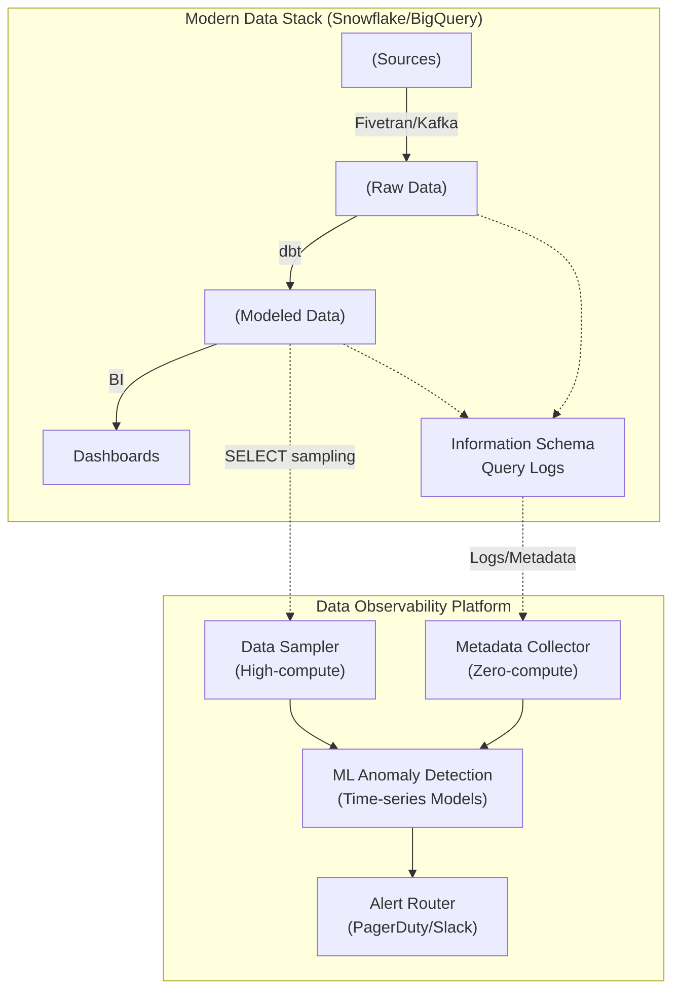

Pipeline của bạn chạy thành công, Apache Airflow báo xanh (Success), dbt không văng lỗi, nhưng sáng hôm sau CEO nhắn tin hỏi: *"Tại sao doanh thu trên Dashboard ngày hôm qua lại giảm 50%?"*. Đó là một **Silent Failure** (Lỗi thầm lặng) điển hình trong Data Engineering. Dữ liệu không lỗi cú pháp, pipeline không sập, nhưng hệ thống nguồn bị mất dữ liệu (Volume Drop) hoặc phân phối dữ liệu sai lệch (Data Drift). 

Lúc này, bạn đang đối mặt với khái niệm **Data Downtime** — khoảng thời gian dữ liệu bị sai lệch, thiếu sót hoặc không thể tin cậy. Để giải quyết triệt để vấn đề này, Data Quality (Kiểm thử dữ liệu tĩnh) là chưa đủ. Chúng ta cần thiết lập một kiến trúc **Data Observability** (Khả năng quan sát dữ liệu) toàn diện.

Dưới góc nhìn của một Staff Data Engineer, xây dựng Data Observability không đơn thuần là mua một công cụ SaaS, mà là bài toán thiết kế kiến trúc giám sát, quản trị vòng đời cảnh báo (Alert Lifecycle) và tối ưu hóa chi phí điện toán (Compute Cost).

---

## 1. Data Quality vs. Data Observability

Trước khi đi sâu vào hệ thống vật lý, cần phân định rạch ròi hai khái niệm thường bị nhầm lẫn này:

- **Data Quality (Known Knowns - Bắt những lỗi đã biết trước):** Tập trung vào câu hỏi *"Dữ liệu này có đúng Business Rule không?"*. Nó sử dụng các công cụ như **Great Expectations (GX)** hoặc **dbt tests** để viết các Unit Test cứng. Ví dụ: `tuổi phải > 0`, `email không được NULL`. Nếu dữ liệu vi phạm, pipeline sẽ dừng lại (Circuit Breaker).
- **Data Observability (Unknown Unknowns - Bắt những lỗi không ngờ tới):** Trả lời câu hỏi *"Hệ thống này đang hoạt động bình thường không, và nếu lỗi thì Root Cause ở đâu?"*. Nó sử dụng Machine Learning để liên tục giám sát toàn bộ hệ thống. Ví dụ: *"Tỷ lệ NULL của cột email bình thường là 2%, hôm nay vọt lên 15%."* hoặc *"Bảng này bình thường được load lúc 8h sáng, nay 10h vẫn chưa có."*

---

## 2. Kiến trúc Vật lý: Metadata-driven vs Data-driven

Để giám sát hàng ngàn bảng dữ liệu ở quy mô Petabyte mà không làm sập Data Warehouse hoặc đội chi phí Compute lên mây, các nền tảng Data Observability hiện đại (Monte Carlo, Databand, Databricks Data Intelligence) áp dụng nguyên lý kiến trúc kết hợp.



### Đánh đổi Hệ thống (Systemic Trade-offs)

1. **Metadata-driven (Dẫn động bằng Siêu dữ liệu):** 
   - *Cơ chế:* Hệ thống giám sát chỉ parse `information_schema`, `query_history` hoặc `system logs` định kỳ 15 phút/lần để lấy thông tin về Row Count, Bytes size, và Data Lineage.
   - *Ưu điểm:* **Zero-compute cost** (Gần như không tốn phí truy vấn), độ bảo mật cao vì không chạm vào dữ liệu thực (PII data). Bao phủ 100% Data Warehouse.
   - *Nhược điểm:* Không bắt được các lỗi ở cấp độ giá trị cột (như tỷ lệ phân phối dữ liệu sai lệch).

2. **Data-driven (Truy vấn Data trực tiếp):**
   - *Cơ chế:* Chạy các câu lệnh SQL thực tế như `SELECT COUNT(*), AVG(amount), COUNT(NULL) FROM table`.
   - *Trade-off:* Độ chính xác tuyệt đối nhưng **Compute Cost cực kỳ khổng lồ**, dễ gây ra hiệu ứng thắt cổ chai (Bottlenecks).
   - *Best Practice:* Chỉ bật Data-driven checks (Metrics/Distribution) cho các bảng Tier-1 (Báo cáo tài chính, Input cho ML Models), còn lại dùng Metadata-driven cho Tier-2 và Tier-3.

---

## 3. Khung 5 Trụ cột (5 Pillars) của Monte Carlo

Bar Moses, CEO của Monte Carlo, đã chuẩn hóa khái niệm Data Observability thành 5 trụ cột. Dưới đây là phân tích chi tiết và cách hiện thực hóa chúng.

### Pillar 1: Freshness (Độ tươi)
Dữ liệu có cập nhật đúng thời gian cam kết (SLA) không? Nếu Data Warehouse có dữ liệu, nhưng dữ liệu đó đã 3 ngày không được cập nhật, hệ thống BI của bạn coi như vô dụng.

### Pillar 2: Volume (Khối lượng)
Kiểm soát tính đầy đủ (Completeness). Hôm qua nạp 10 triệu dòng, hôm nay bỗng sụt xuống còn 1 triệu dòng? Đó là dấu hiệu rõ ràng của việc API nguồn bị lỗi hoặc ETL pipeline bị drop data. ML models sẽ học chuỗi thời gian (time-series) của Row Count để phát hiện dị thường (Anomaly).

### Pillar 3: Schema (Lược đồ)
**Schema Drift** là cơn ác mộng lớn nhất của Data Engineer. Kỹ sư phần mềm (Backend Engineer) vô tình xóa cột `customer_id` hoặc đổi kiểu dữ liệu từ `INT` sang `STRING` trên DB nguồn. Lập tức pipeline dbt phía sau gãy vụn. Observability cần báo động ngay khoảnh khắc Schema thay đổi, TRƯỚC KHI pipeline bắt đầu chạy.

### Pillar 4: Distribution (Phân phối dữ liệu)
Giám sát sức khỏe ở cấp độ Field/Column. Cột `discount_rate` luôn nằm trong khoảng 0.0 - 0.5. Tự nhiên hôm nay xuất hiện các giá trị `99.9` hoặc tỷ lệ `NULL` tăng từ 1% lên 40%. Đây là lỗi Logic nghiệp vụ mà Metadata không thể phát hiện.

### Pillar 5: Lineage (Phả hệ dữ liệu)
Khi Pillar 1-4 phát ra cảnh báo, Lineage đóng vai trò là bản đồ để điều tra nguyên nhân gốc rễ (Root Cause Analysis). Nếu bảng `stg_users` bị lỗi Volume, Lineage sẽ chỉ ra rằng:
- **Upstream (Nguồn gốc lỗi):** Bắt nguồn từ Kafka Topic `user_events`.
- **Downstream (Mức độ ảnh hưởng):** Sẽ làm hỏng Dashboard "Active Users" của Giám đốc Marketing.

---

## 4. Hiện thực hóa bằng Mã nguồn [Show, Don't Tell]

Dù bạn dùng SaaS (Monte Carlo) hay Open Source, dưới đây là cách chúng ta cấu hình Data Quality kết hợp Observability trong hệ sinh thái dbt và Great Expectations.

### Khai báo dbt tests cho Known-Knowns (Data Quality)

```yaml
# dbt_project/models/schema.yml
models:
  - name: fct_orders
    columns:
      - name: order_id
        tests:
          - unique
          - not_null
      - name: status
        tests:
          - accepted_values:
              values: ['placed', 'shipped', 'completed', 'returned']
```

### Sử dụng Great Expectations để bắt Distribution Anomalies

```python
# great_expectations suite snippet
import great_expectations as gx

context = gx.get_context(]
validator = context.sources.pandas_default.read_parquet("s3://data-lake/fct_orders.parquet")

# 1. Bắt lỗi Volume
validator.expect_table_row_count_to_be_between(min_value=90000, max_value=110000)

# 2. Bắt lỗi Distribution (Sự phân phối của cột discount)
validator.expect_column_values_to_be_between(
    column="discount_rate",
    min_value=0.0,
    max_value=0.5,
    mostly=0.99 # Chấp nhận 1% ngoại lệ
)

# 3. Bắt lỗi Schema Drift
validator.expect_column_to_exist("customer_id")
validator.expect_column_values_to_be_of_type("customer_id", "INTEGER")

validator.save_expectation_suite(discard_failed_expectations=False)
```

---

## 5. Rủi ro Vận hành và Thiết kế Kiến trúc (Operational Risks)

Xây dựng hệ thống Data Observability không chỉ đơn giản là cài đặt một tool. Nó đi kèm với những rủi ro thiết kế cực kỳ đau đầu:

### 5.1. Cơn bão Cảnh báo (Alert Fatigue)
Khi bạn bật Anomaly Detection bằng ML cho hàng nghìn bảng dữ liệu, ML Model ban đầu chưa đủ độ hội tụ (Convergence) sẽ liên tục bắn cảnh báo giả (False Positives). 
*   **Hậu quả:** Kênh Slack `#data-alerts` ngập trong hàng trăm tin nhắn mỗi ngày. Kỹ sư sinh ra tâm lý "nhờn" cảnh báo, dẫn đến việc phớt lờ luôn những lỗi nghiêm trọng thật sự [Crying Wolf effect].
*   **Khắc phục (Data Tiering):** Bắt buộc phải phân loại Data Assets. Chỉ bật alert ngặt nghèo (báo thức nửa đêm qua PagerDuty) cho các bảng Tier-1. Tier-2 và Tier-3 chỉ nên gửi báo cáo tổng hợp (digest) vào Slack vào 8h sáng.

### 5.2. Bùng nổ Chi phí Compute (Compute Cost Explosion)
Nếu bạn lạm dụng Data-driven checks (như chạy Great Expectations full-scan trên bảng Petabyte mỗi giờ một lần), hóa đơn Snowflake/BigQuery của bạn sẽ tăng gấp 3 lần.
*   **Khắc phục:** 
    *   Tận dụng tối đa Metadata-driven checks (như xem `information_schema.tables` để lấy row_count thay vì `SELECT COUNT(*)`).
    *   Khi dùng Data-driven checks, phải giới hạn phân vùng bằng cờ thời gian: `WHERE created_at >= CURRENT_DATE - 1`.

### 5.3. Retry Storms (Cơn bão thử lại)
Khi hệ thống Observability phát hiện độ trễ (Freshness alert) và Airflow tự động kích hoạt Auto-retry DAG. Nếu nguyên nhân gốc là do Database nguồn đang quá tải (Bottleneck), việc hàng chục Job thi nhau retry sẽ tạo ra một cú DDoS nội bộ, đánh sập hoàn toàn Database.
*   **Khắc phục:** Bắt buộc áp dụng thuật toán Exponential Backoff và cấu hình Circuit Breaker (Ngắt mạch) khi số lượng retry thất bại vượt ngưỡng.

---

## Nguồn Tham Khảo (References)

1. [Monte Carlo: What is Data Observability?](https://www.montecarlodata.com/blog-what-is-data-observability/) - Định nghĩa và 5 trụ cột tiêu chuẩn ngành.
2. [Databricks: Data Observability Glossary](https://www.databricks.com/glossary/data-observability) - Triển khai trên kiến trúc Lakehouse.
3. [Great Expectations Official Docs](https://greatexpectations.io/) - Framework khai báo Data Quality.
4. *Designing Data-Intensive Applications* (Martin Kleppmann) - Tính ổn định và độ tin cậy của hệ thống.
5. [Uber Engineering: Data Quality at Scale](https://www.uber.com/en-US/blog/data-quality-at-uber/) - Bài học thực chiến xử lý Alert Fatigue ở quy mô khổng lồ.
