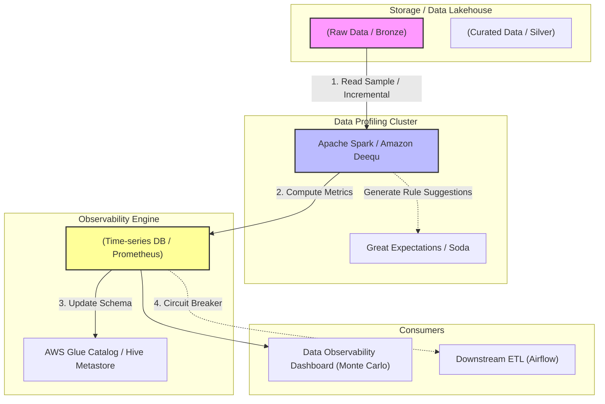

Có bao giờ bạn nhảy vào viết code ETL ngay khi vừa nhận được một file CSV hay thông tin kết nối CSDL từ đối tác, để rồi Pipeline bị sập (crash) giữa chừng vì dữ liệu có chứa giá trị Null, định dạng ngày tháng không nhất quán (lẫn lộn giữa `MM/DD/YYYY` và `DD/MM/YYYY`), hoặc Schema thay đổi đột ngột? 

Để tránh việc phát triển "mù", **Data Profiling (Lập hồ sơ dữ liệu)** ra đời như một bước khám sức khỏe tổng quát cho Dữ liệu. Tuy nhiên, bỏ qua những định nghĩa sách giáo khoa, Data Profiling ở quy mô Big Data (Petabyte-scale) không đơn thuần là gọi hàm đếm số lượng bản ghi. Việc gọi một lệnh `COUNT(DISTINCT)` ngây ngô trên một bảng 10 tỷ dòng có thể làm sập toàn bộ Spark Cluster do cạn kiệt bộ nhớ (OOMKilled). 

Bài viết này sẽ mổ xẻ Data Profiling và sự giao thoa của nó với khái niệm **Data Observability (Khả năng quan sát dữ liệu)** dưới góc nhìn System Architecture.

---

## 1. Mối quan hệ giữa Data Profiling và Data Observability

Theo triết lý của Monte Carlo Data, Profiling và Observability là hai mặt của một đồng xu, bổ trợ cho nhau chặt chẽ:

- **Data Profiling (Chụp ảnh tĩnh - The Snapshot):** Là quá trình phân tích dữ liệu tại *một thời điểm cụ thể* để thu thập số liệu thống kê (Metadata) về đặc tính của nó: Tỷ lệ Null, kiểu dữ liệu thực tế, sự phân phối (Distribution), giá trị lớn nhất/nhỏ nhất, độ dài chuỗi (String length). Nó giúp bạn hiểu *Data đang trông như thế nào*.
- **Data Observability (Giám sát động - The Continuous Monitor):** Là một hệ thống giám sát tự động, liên tục đo đạc 5 trụ cột (5 Pillars): Freshness (Độ tươi), Volume (Khối lượng), Schema (Cấu trúc), Lineage (Phả hệ), và Quality (Chất lượng). Hệ thống Observability sử dụng dữ liệu từ Profiling làm *Đường cơ sở (Baseline)*. Nếu tỷ lệ Null của cột `email` đột ngột tăng từ 0.1% lên 30%, hệ thống Observability sẽ phát hiện sự bất thường (Anomaly) và kích hoạt PagerDuty gọi kỹ sư thức dậy.

---

## 2. Kiến trúc Thực thi Vật lý (Physical Execution Architecture)

Khi tích hợp Data Profiling vào hệ thống DataOps, Data Engineer phải thiết kế luồng chạy sao cho việc tính toán Metadata Profiling không trở thành "Bottleneck" (Nghẽn cổ chai) của toàn bộ Data Pipeline.



### In-line vs. Out-of-band Profiling
Các kiến trúc sư dữ liệu thường chọn 1 trong 2 mô hình sau để chạy Profiling:

1. **In-line Profiling (Synchronous):** Profiling chạy trực tiếp bên trong luồng ETL chính (Cùng một job Spark/dbt). Nếu dữ liệu vượt ngưỡng bất thường, pipeline sẽ dừng lại (Fail-fast).
   * *Đánh đổi (Trade-off):* Đảm bảo tuyệt đối không có dữ liệu bẩn lọt vào lớp Silver/Gold, nhưng phải hy sinh độ trễ (Latency). Cực kỳ tốn kém vì ETL bị đình trệ để chờ Profiling chạy xong.
2. **Out-of-band Profiling (Asynchronous):** Dữ liệu vẫn được đổ (Ingest) vào Data Lake với tốc độ tối đa. Một Asynchronous Job (như AWS Glue ETL, Databricks Job) được trigger song song ở một Cluster riêng biệt chỉ để quét và tính toán số liệu Profiling.
   * *Đánh đổi (Trade-off):* Không làm chậm Ingestion, nhưng rủi ro là dữ liệu bẩn đã lọt vào Data Lake và có thể bị Report Dashboard đọc được trước khi hệ thống Observability kịp phát ra cảnh báo.

---

## 3. Rủi ro Vận hành (Operational Risks & Incidents)

Dưới đây là những "tai nạn" kinh điển khi chạy Data Profiling trên quy mô Petabyte.

### 🚨 Rủi ro 1: Nỗi ám ảnh OOMKilled (Out of Memory) và Network Shuffle
**Triệu chứng:** Kỹ sư gọi `df.profile_report()` của thư viện `ydata-profiling` (Pandas) trên file Parquet 100GB. Container bị sập lập tức. Sau đó kỹ sư chuyển sang dùng Apache Spark, nhưng khi chạy lệnh `COUNT(DISTINCT user_id)`, Spark Executor bị crash kèm mã lỗi `java.lang.OutOfMemoryError: Java heap space`.
**Nguyên nhân:** Tính toán Distinct Count (Đếm giá trị phân biệt) là một thao tác **High-Cardinality Aggregation**. Spark bắt buộc phải gom toàn bộ hàng chục triệu `user_id` khác nhau về một node (thông qua Network Shuffle khổng lồ) để so sánh và đếm, dẫn đến cạn kiệt RAM.

**✅ Cách khắc phục (Thuật toán Xác suất - Probabilistic Algorithms):**
Tuyệt đối không dùng Pandas Profiling cho Big Data. Hãy sử dụng **Amazon Deequ** (Công cụ do Amazon phát triển dựa trên Scala/Spark). 
Để đếm Distinct, đừng bắt máy tính đếm chính xác 100%. Hãy sử dụng **HyperLogLog** (Một cấu trúc dữ liệu xác suất). Nó có thể đếm 1 tỷ user_id duy nhất chỉ với sai số ~1%, nhưng chỉ tốn **vài Megabyte RAM** thay vì hàng trăm Gigabyte.

```scala
// Ví dụ cấu hình Amazon Deequ trong Scala (Bảo vệ Spark khỏi OOMKilled)
import com.amazon.deequ.analyzers.runners.AnalysisRunner
import com.amazon.deequ.analyzers.{Size, Completeness, ApproxCountDistinct}

val analysisResult = AnalysisRunner
  .onData(df)
  .addAnalyzer(Size()) // Đếm số dòng
  .addAnalyzer(Completeness("email")) // Tỷ lệ Null
  
  // Dùng ApproxCountDistinct (dựa trên thuật toán HyperLogLog) 
  // thay vì CountDistinct chính xác. Điều này cứu Cluster của bạn.
  .addAnalyzer(ApproxCountDistinct("session_id")) 
  .run()
```

### 🚨 Rủi ro 2: Cartesian Explosion trong Cross-table Profiling
**Triệu chứng:** Khi chạy Profiling để kiểm tra tính toàn vẹn tham chiếu (Referential Integrity - VD: Có bao nhiêu `order.user_id` bị mồ côi, không tồn tại trong bảng `users`), câu lệnh JOIN mất 12 tiếng không chạy xong, Bill Cloud tăng vọt.
**Nguyên nhân:** Thao tác `JOIN` không được kiểm soát chặt chẽ, gặp hiện tượng Data Skew (Ví dụ: Có 1 triệu đơn hàng bị Null `user_id`), Data Node sẽ thực hiện `CROSS JOIN` (Tích Đề-các) đẻ ra hàng nghìn tỷ bản ghi tạm thời, thổi bay bộ nhớ đệm (Cartesian Explosion).
**Khắc phục:** Cần lọc sạch (Filter) các giá trị Null hoặc dùng `BroadcastHashJoin` nếu bảng Dimension nhỏ.

---

## 4. Systemic Trade-offs (Sự Đánh Đổi Hệ Thống)

Dưới góc nhìn của một Data Architect, Data Profiling là nghệ thuật của sự đánh đổi (Trade-offs):

1. **Accuracy vs. Compute Cost (Độ chính xác vs. Hóa đơn FinOps):**
   Chạy quét toàn bộ 100% dữ liệu lịch sử (Full Table Scan) hàng ngày để sinh Profiling Report là tự sát về mặt tài chính. 
   **Giải pháp:** Áp dụng **Sampling (Lấy mẫu ngẫu nhiên)**. Bạn chấp nhận kết quả Profiling có sai số (margin of error) để đổi lấy việc tiết kiệm 95% chi phí Cluster.
   ```python
   # PySpark: Lấy mẫu 5% dữ liệu, sử dụng seed để đảm bảo Idempotent (tính lặp lại được)
   df_sample = df.sample(withReplacement=False, fraction=0.05, seed=42)
   ```

2. **Granularity vs. Resource Usage (Độ phân giải vs. Tiêu thụ CPU):**
   Table-level profiling (đếm row count, đo bytesize) tiêu thụ rất ít tài nguyên. Tuy nhiên, Column-level profiling (tính phân phối phân vị - Percentiles, dựng Histogram) trên các cột Text/JSON/Array dài sẽ ngốn CPU khủng khiếp. 
   **Giải pháp:** Luôn cấu hình tắt tính năng Profiling sâu trên các cột không quan trọng (như cột log thô `raw_payload`).

---

## 5. Triển khai bằng Databricks Delta Live Tables (DLT)

Nếu bạn ở hệ sinh thái Databricks, Delta Live Tables (DLT) cung cấp cơ chế `EXPECT` tuyệt vời để kết hợp Profiling và Data Quality Gates ngay từ tầng Ingestion.

```python
# Ví dụ cấu hình Data Quality Expectations như một Circuit Breaker trong Databricks DLT
import dlt

@dlt.table
# Bắn cảnh báo Profiling nếu event_time bị Null, nhưng vẫn cho dữ liệu đi qua
@dlt.expect("valid_timestamp", "event_time IS NOT NULL")
# Xóa bỏ (Drop) record nếu doanh thu âm (Tránh lọt vào Dashboard)
@dlt.expect_or_drop("valid_revenue", "revenue >= 0") 
# Ngắt mạch toàn bộ Job (Circuit Breaker) nếu gặp user_id không hợp lệ
@dlt.expect_or_fail("valid_user_id", "user_id > 0") 
def cleaned_events():
  return spark.readStream.table("raw_events")
```

## Tổng Kết

Data Profiling không bao giờ là một bản báo cáo tĩnh [Static PDF] nằm mốc meo trong máy tính của Data Analyst. Trong kiến trúc hiện đại, Profiling là một Engine sống, chạy liên tục để nhồi Metadata cho hệ thống Data Observability. 
Đổi lại, Data Engineer phải thiết kế luồng Profiling cực kỳ cẩn thận: Biết cách dùng Sampling, thuật toán xác suất (HyperLogLog) và xử lý Data Skewness để bảo vệ hệ thống khỏi những cơn ác mộng OOMKilled và hóa đơn Cloud khổng lồ.

## Nguồn Tham Khảo (References)

1. **Monte Carlo Data:** [Data Profiling vs Data Observability: What's the Difference?][https://www.montecarlodata.com/]
2. **AWS Big Data Blog:** [Test data quality at scale with Amazon Deequ][https://aws.amazon.com/blogs/big-data/test-data-quality-at-scale-with-deequ/]
3. **Databricks:** [Delta Live Tables Data Quality and Expectations](https://docs.databricks.com/en/delta-live-tables/expectations.html]
4. Sách: *Designing Data-Intensive Applications* - Martin Kleppmann.
