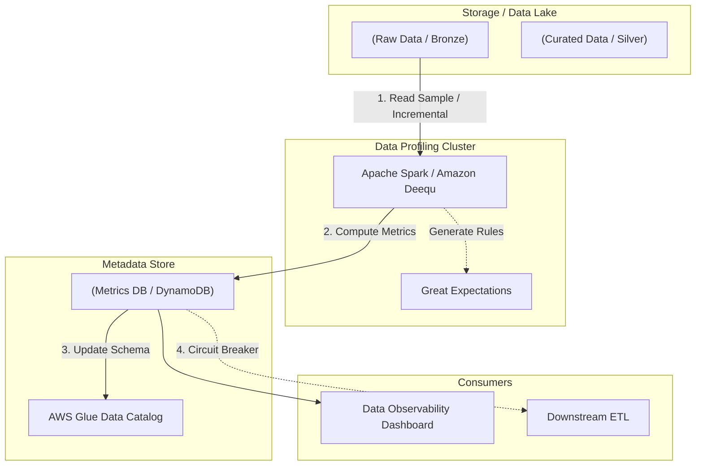

Có bao giờ bạn nhảy vào viết code ETL ngay khi vừa nhận được một file CSV hay thông tin kết nối CSDL từ đối tác, để rồi pipeline bị lỗi (crash) giữa chừng vì dữ liệu có chứa giá trị Null, định dạng ngày tháng không nhất quán, hoặc kiểu dữ liệu thay đổi đột ngột? Để tránh những sự cố đó, **Data Profiling (Lập hồ sơ dữ liệu)** ra đời.

Nhưng bỏ qua định nghĩa cơ bản, Data Profiling không đơn thuần là đếm số lượng bản ghi hay tính giá trị trung bình. Ở quy mô Big Data (Petabyte-scale), việc chạy một lệnh `COUNT(DISTINCT)` ngây ngô có thể làm sập toàn bộ Spark Cluster do cạn kiệt bộ nhớ (OOMKilled). Bài viết này sẽ mổ xẻ Data Profiling dưới góc nhìn System Architecture.

## Kiến trúc Thực thi Vật lý (Physical Execution Architecture)

Khi tích hợp Data Profiling vào hệ thống DataOps, Data Engineer phải thiết kế luồng chạy sao cho việc tính toán metadata không trở thành "Bottleneck" (nghẽn cổ chai) của toàn bộ Data Pipeline.



### In-line vs. Out-of-band Profiling

1. **In-line Profiling (Synchronous):** Profiling chạy trực tiếp bên trong luồng ETL. Nếu dữ liệu không vượt qua các chốt kiểm tra (Data Quality Gates), pipeline sẽ dừng lại (Fail-fast).
   * *Đánh đổi:* Đảm bảo tuyệt đối không có dữ liệu bẩn lọt vào downstream, nhưng hy sinh độ trễ (Latency). Thường áp dụng ở luồng Micro-batch hoặc trên tập dữ liệu đã được làm sạch (Silver -> Gold).
2. **Out-of-band Profiling (Asynchronous):** Dữ liệu vẫn được đổ vào Data Lake. Một Asynchronous Job (như AWS Glue ETL, Databricks Job) được trigger song song để quét và tính toán số liệu. 
   * *Đánh đổi:* Không làm chậm Ingestion, nhưng có rủi ro dữ liệu bẩn đã được tiêu thụ (consumed) bởi hệ thống khác trước khi cảnh báo kịp phát ra.

## Rủi ro Vận hành (Operational Risks)

### 1. Nỗi ám ảnh OOMKilled (Out of Memory)
Trong Pandas, gọi `df.profile_report()` trên file 10GB có thể làm tràn RAM máy tính (Spill-to-disk). Trong Distributed Computing như Apache Spark, việc gọi `collect()` hoặc tính toán High-Cardinality Aggregations (như đếm số lượng người dùng duy nhất `user_id`) sẽ dẫn đến Network Shuffle khổng lồ.
*Tình huống thực tế:* Một executor bị quá tải do Data Skew (dữ liệu phân bổ không đều theo partition), dẫn đến lỗi `java.lang.OutOfMemoryError: Java heap space`.

**Cách khắc phục (Code thực chiến):**
Tuyệt đối không dùng Pandas Profiling cho Big Data. Hãy sử dụng **Amazon Deequ** để phân tán việc tính toán. Để tính số lượng giá trị phân biệt, sử dụng thuật toán xấp xỉ (HyperLogLog) thay vì tính chính xác.

```scala
// Ví dụ cấu hình Amazon Deequ trong Scala
import com.amazon.deequ.analyzers.runners.AnalysisRunner
import com.amazon.deequ.analyzers.{Size, Completeness, ApproxCountDistinct}

val analysisResult = AnalysisRunner
  .onData(df)
  .addAnalyzer(Size())
  .addAnalyzer(Completeness("user_id"))
  // Dùng ApproxCountDistinct (dựa trên thuật toán HyperLogLog) thay vì CountDistinct chính xác
  // Điều này giúp tránh Network Shuffle khổng lồ và ngăn chặn OOMKilled
  .addAnalyzer(ApproxCountDistinct("session_id")) 
  .run()
```

### 2. Cartesian Explosion trong Cross-table Profiling
Khi phân tích quan hệ (Relationship Discovery) giữa các bảng (ví dụ: phát hiện Orphan Records khi `order.user_id` không tồn tại trong `users.id`), thao tác `JOIN` không được kiểm soát có thể tạo ra Cartesian Explosion, sinh ra hàng tỷ bản ghi tạm thời, thổi bay bộ nhớ đệm. Cần kiểm tra cẩn thận các Broadcast Hash Join hoặc xử lý Skewness trước khi chạy Profiling.

## Systemic Trade-offs (Sự Đánh Đổi Hệ Thống)

Dưới góc nhìn Staff Engineer, Data Profiling là bài toán về tối ưu Trade-offs:

1. **Accuracy vs. Compute Cost (Độ chính xác vs. Chi phí điện toán - FinOps)**
   Chạy quét toàn bộ 100% dữ liệu lịch sử (Full scan) hàng ngày để sinh Profiling Report cực kỳ tốn kém. Giải pháp thực tiễn là **Sampling (Lấy mẫu ngẫu nhiên)**. Bạn chấp nhận kết quả Profiling có sai số (margin of error) để đổi lấy việc tiết kiệm 90% chi phí Cluster.
   ```python
   # PySpark: Lấy mẫu 10% dữ liệu, sử dụng seed để đảm bảo Idempotent (tính lặp lại được)
   df_sample = df.sample(withReplacement=False, fraction=0.1, seed=42)
   ```

2. **Granularity vs. Resource Usage (Độ phân giải vs. Tiêu thụ tài nguyên)**
   Table-level profiling (đếm row count, đo bytesize) tiêu thụ rất ít tài nguyên. Tuy nhiên, Column-level profiling (tính phân phối phân vị - Percentiles, dựng Histogram) trên các cột text/JSON dài sẽ ngốn CPU khủng khiếp. Luôn phải cấu hình tắt tính năng Profiling sâu trên các cột không cần thiết (như cột log raw).

3. **Real-time Latency vs. Completeness**
   Nếu nhúng Data Profiling trực tiếp vào Apache Kafka hay Flink (Streaming), bạn phải chấp nhận hy sinh các metric phức tạp như Exact Distinct Count. Thay vào đó, bạn phải dựa vào các cấu trúc dữ liệu xác suất (Probabilistic Data Structures) như HyperLogLog hoặc Bloom Filters để đảm bảo tốc độ O(1).

## Các Công Cụ Tiêu Chuẩn Trong Industry

1. **Amazon Deequ / PyDeequ:** Công cụ mã nguồn mở do Amazon phát triển dựa trên Apache Spark. Dành riêng cho tập dữ liệu Petabyte, sử dụng cơ chế Incremental Profiling (chỉ tính toán sự thay đổi metadata State trên dữ liệu mới thay vì load lại toàn bộ).
2. **Great Expectations (GX):** Phù hợp với kiến trúc Batch Data Warehouse (như Snowflake, BigQuery). Tích hợp rất sâu vào dbt để tạo Data Quality Rules tự động dựa trên kết quả Profiling ban đầu.
3. **Databricks Delta Live Tables (DLT):** Nếu bạn ở hệ sinh thái Databricks, DLT cung cấp cơ chế `EXPECT` để profiling và chặn dữ liệu bẩn ngay từ tầng Ingestion bằng SQL hoặc Python.

```python
# Ví dụ cấu hình Data Quality Expectations như một Circuit Breaker trong Databricks DLT
import dlt

@dlt.table
@dlt.expect_or_drop("valid_timestamp", "event_time IS NOT NULL")
@dlt.expect_or_fail("valid_user_id", "user_id > 0") # Sẽ fail toàn bộ job nếu gặp user_id âm
def cleaned_events():
  return spark.readStream.table("raw_events")
```

## Tổng Kết

Data Profiling không bao giờ là một bản báo cáo tĩnh nằm mốc meo trong máy của Data Analyst. Trong DataOps, Profiling là một Module sống, chạy liên tục và cung cấp các siêu dữ liệu (Metadata) quan trọng để hệ thống Data Quality tự động đưa ra quyết định (Circuit Breaker). Đổi lại, Data Engineer phải thiết kế luồng Profiling cẩn thận, áp dụng Sampling, Probabilistic Algorithms và xử lý Skewness để bảo vệ hệ thống khỏi những cơn ác mộng OOMKilled.

## Nguồn Tham Khảo
1. [Test data quality at scale with Deequ - AWS Big Data Blog](https://aws.amazon.com/blogs/big-data/test-data-quality-at-scale-with-deequ/)
2. [Data Quality engineering with Great Expectations](https://greatexpectations.io/)
3. [Delta Live Tables Data Quality and Expectations - Databricks Official Docs](https://docs.databricks.com/en/delta-live-tables/expectations.html)
4. *Designing Data-Intensive Applications* - Martin Kleppmann (O'Reilly)
