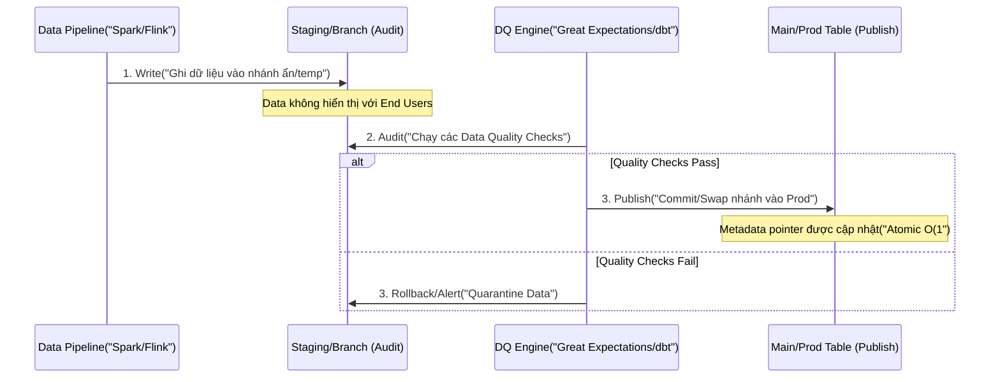

Data Quality thường được nhắc đến qua 6 chiều chuẩn mực của DAMA (Completeness, Accuracy, Consistency, Validity, Uniqueness, Timeliness). Tuy nhiên, nếu chỉ dừng lại ở định nghĩa và vài câu `SELECT COUNT(*)`, chúng ta sẽ hoàn toàn thất bại khi vận hành ở quy mô Petabyte hoặc các luồng Streaming real-time. 

Tại các công ty công nghệ lớn như Uber, Netflix, hay Databricks, Data Quality được đối xử như một **Reliability System (Hệ thống Độ tin cậy)** ngang hàng với Microservices. Bài viết này sẽ mổ xẻ 6 chiều chất lượng dữ liệu dưới góc độ Kiến trúc Hệ thống (System Architecture), các Design Patterns để thực thi chúng, và những sự cố sập hệ thống (Real-world Incidents) bạn sẽ gặp phải nếu áp dụng sai cách.

---

## 1. Bản chất Kiến trúc của 6 Chiều Chất Lượng Dữ Liệu

### 1.1. Validity (Tính hợp lệ) & Cốt lõi của Schema Evolution
Validity ở quy mô nhỏ là dùng Regex. Ở quy mô lớn, nó là bài toán **Schema Registry**. Netflix giải quyết tính hợp lệ ngay tại điểm phát sinh sự kiện (Point of Encoding) bằng kiến trúc Data Mesh. Nếu một Event không tuân thủ Protocol Buffers hoặc Avro Schema đã đăng ký, nó sẽ bị drop hoặc đẩy vào Dead Letter Queue (DLQ) ngay lập tức, không cho phép đi vào Data Lake.

*   **Trade-off:** Strict Schema Validation (Tải trọng tính toán cao tại Ingestion) vs. Schema-on-Read (Tải trọng cao tại Query).
*   **Real-world Incident (Poison Pill):** Một Consumer Lag khổng lồ xảy ra trên Kafka khi upstream thay đổi kiểu dữ liệu trường `amount` từ `INT` sang `STRING` nhưng không đăng ký qua Schema Registry. Consumer (viết bằng Java) liên tục ném exception `SerializationException` và rơi vào trạng thái **Retry Storm**, đánh gục toàn bộ downstream pipeline.

### 1.2. Completeness (Tính đầy đủ) trong Streaming
Trong môi trường Batch, đếm tỷ lệ NULL là đủ. Nhưng trong Streaming (Kafka, Flink), làm sao biết chúng ta đã nhận đủ các event của một transaction phức tạp? 

*   **Cách giải quyết:** Sử dụng **Watermarking** và **Stateful Processing**. Apache Flink sử dụng khái niệm Windowing và Allowed Lateness để quyết định khi nào một luồng dữ liệu được coi là "đầy đủ" để tính toán.
*   **Trade-off:** Completeness vs. Timeliness. Chờ đợi dữ liệu đến đủ (Completeness) đồng nghĩa với việc tăng độ trễ (Latency).

### 1.3. Uniqueness (Tính duy nhất) & At-least-once Semantics
Trong các hệ thống phân tán, mạng lưới có thể chập chờn (Network Partition), dẫn đến các producer gửi lại message (Retries). Các Message Broker như Kafka mặc định cung cấp `At-least-once` delivery, nghĩa là trùng lặp **chắc chắn sẽ xảy ra**.

*   **Khắc phục Vật lý:** Thay vì cố gắng khử trùng (Deduplication) liên tục ở tầng Data Warehouse (gây tốn Compute cực lớn và nguy cơ **Cartesian Explosion** khi JOIN), kỹ sư dữ liệu sử dụng Idempotent Producers ở tầng Message Broker (vd: `enable.idempotence=true` trong Kafka) và các bảng Hudi/Iceberg với tính năng Upsert (MERGE ON KEY) dựa trên Primary Key.

### 1.4. Timeliness (Tính kịp thời) & SLA Monitoring
Timeliness không phải là dữ liệu "chạy nhanh thế nào", mà là sự chênh lệch giữa `Event_Time` (lúc user click) và `Processing_Time` (lúc dữ liệu có mặt ở bảng Gold). Uber theo dõi độ trễ này bằng hệ thống UDQ (Uber Data Quality), biến Freshness thành một SLA bắt buộc.

### 1.5. Accuracy (Tính chính xác) & Consistency (Tính nhất quán)
Đây là hai chiều khó giải quyết nhất bằng hệ thống tự động. Accuracy đòi hỏi đối chiếu với Golden Source (thường tốn kém chi phí API call hoặc cross-database query). Consistency đòi hỏi Reconciliation (đối soát) giữa nhiều microservices (ví dụ: Hệ thống Payment báo thành công, hệ thống Inventory báo chưa trừ kho).

---

## 2. Các Mẫu Kiến Trúc (Architecture Patterns) Thực Thi Data Quality

Thay vì viết các kịch bản kiểm tra rời rạc, Data Engineering hiện đại nhúng Data Quality vào luồng chảy của dữ liệu thông qua các Pattern.

### 2.1. Mẫu Write-Audit-Publish (WAP)

Pattern này được áp dụng rộng rãi tại Uber, Netflix và Apple để ngăn chặn "Dữ liệu rác" rò rỉ vào production. WAP chia luồng ghi thành 3 pha, sử dụng các Table Format như Apache Iceberg hoặc Apache Hudi.



**Thực thi thực tế với Apache Iceberg:**
Kỹ thuật WAP cực kỳ hiệu quả nhờ tính năng Zero-copy Branching của Iceberg (tương tự Git Branch).

```sql
-- 1. WRITE: Ghi vào một nhánh ẩn (Audit Branch)
ALTER TABLE sales_data CREATE BRANCH audit_branch;
INSERT INTO sales_data FOR VERSION AS OF 'audit_branch'
SELECT * FROM raw_sales_stream;

-- 2. AUDIT: Công cụ DQ (vd: Soda, dbt) truy vấn trực tiếp vào nhánh audit
SELECT COUNT(*) FROM sales_data FOR VERSION AS OF 'audit_branch' 
WHERE amount < 0; -- Expect 0

-- 3. PUBLISH: Fast-forward nhánh audit vào nhánh main nếu test pass
CALL catalog.system.fast_forward('sales_data', 'main', 'audit_branch');
```

**Trade-off của WAP:**
Tăng Latency của toàn bộ pipeline do phải đợi pha Audit hoàn tất trước khi Publish. Tốn chi phí lưu trữ tạm thời cho dữ liệu Quarantine (cần chính sách Retention hợp lý).

### 2.2. Declarative Expectations với Medallion Architecture

Databricks (và các công cụ như Delta Live Tables) tiếp cận Data Quality bằng cách khai báo rõ các kỳ vọng (Expectations) trên đường ống ETL từ Bronze -> Silver -> Gold. Thay vì pipeline sập hoàn toàn khi gặp dữ liệu lỗi, hệ thống tự động định tuyến.

```python
# Ví dụ Delta Live Tables (DLT) xử lý Validity và Completeness
import dlt
from pyspark.sql.functions import expr

@dlt.table(
    name="silver_users",
    comment="Cleaned user data with DQ expectations"
)
@dlt.expect_or_drop("valid_age", "age > 0 AND age < 120") # Drop record lỗi
@dlt.expect_or_fail("valid_id", "user_id IS NOT NULL")   # Fail cả pipeline nếu ID NULL
@dlt.expect_all_or_quarantine(
    {"valid_email": "email LIKE '%@%.%'"},
    "quarantine_users" # Đẩy record lỗi email vào bảng cách ly
)
def get_silver_users():
    return dlt.read_stream("bronze_users")
```

**Real-world Incident (JVM OOMKilled):** 
Nếu bạn cố gắng lưu trữ toàn bộ dữ liệu vi phạm (Quarantined data) vào bộ nhớ RAM của Spark Executor trước khi xả xuống disk, bạn sẽ nhanh chóng gặp lỗi `java.lang.OutOfMemoryError: Java heap space`. **Giải pháp:** Phải flush (spill-to-disk) luồng dữ liệu lỗi xuống Object Storage liên tục (streaming mode) thay vì buffer trên RAM.

---

## 3. Tối ưu Chi phí (FinOps) trong Data Quality

Chạy hàng ngàn Data Quality checks mỗi giờ trên kho dữ liệu Data Warehouse (như Snowflake, BigQuery) sẽ đốt cháy ngân sách Compute của bạn cực kỳ nhanh chóng.

1.  **Shift-Left Data Quality:** Bắt lỗi càng gần Source càng tốt. Kiểm tra Validity và Uniqueness ngay trên Apache Kafka/Kinesis hoặc ở lớp Bronze Data Lake, thay vì đợi dữ liệu load vào BigQuery rồi mới chạy `dbt test`. Compute của Spark/Presto trên Data Lake rẻ hơn Compute của Cloud Data Warehouse.
2.  **Incremental Testing:** Thay vì chạy test trên toàn bộ bảng (`SELECT COUNT(*) FROM huge_table`), chỉ chạy test trên phân vùng dữ liệu mới nhất (dựa trên `_landing_time` hoặc Hudi Commit Time).
3.  **Data Observability (ML-based):** Sử dụng các nền tảng như Monte Carlo hoặc Databand. Thay vì viết hàng trăm rule thủ công, hệ thống sử dụng Machine Learning để profile schema, volume và freshness, tự động cảnh báo khi có sự thay đổi đột biến (Anomaly Detection). Giảm thiểu đáng kể thời gian bảo trì Rules.

## 4. Tổng Kết

Đo lường 6 chiều chất lượng dữ liệu không phải là viết một danh sách SQL queries. Ở môi trường Enterprise, nó là việc áp dụng các nguyên lý **Reliability Engineering** vào Dữ liệu:
*   Dùng **Schema Registry** để chặn rác từ cửa.
*   Dùng **WAP Pattern** (Write-Audit-Publish) với Iceberg/Hudi để cô lập dữ liệu lỗi trước khi lên sóng.
*   Sử dụng **Declarative Data Pipelines** (như DLT hoặc dbt) để tự động hóa định tuyến Quarantine/Drop.
*   Quản lý **FinOps** nghiêm ngặt khi chạy Data Quality checks ở quy mô lớn.

## Nguồn Tham Khảo
* [Uber Engineering: UDQ - An Integrated Platform for Data Quality](https://www.uber.com/en-VN/blog/udq/)
* [Netflix TechBlog: Data Mesh - A Data Movement and Processing Platform](https://netflixtechblog.com/data-mesh-a-data-movement-and-processing-platform-@netflix-1288bcab2873)
* [Databricks: Implementing Data Quality with Delta Live Tables](https://www.databricks.com/blog/2022/08/31/implementing-data-quality-delta-live-tables.html)
* [Apache Iceberg: Write-Audit-Publish (WAP) Pattern](https://iceberg.apache.org/docs/latest/branching/)
