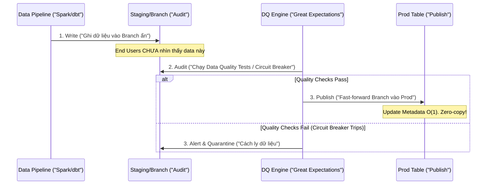

Data Quality thường được nhắc đến qua 6 chiều chuẩn mực của DAMA (Completeness, Accuracy, Consistency, Validity, Uniqueness, Timeliness). Tuy nhiên, nếu chỉ dừng lại ở lý thuyết và vài câu lệnh `SELECT COUNT(*)`, chúng ta sẽ hoàn toàn thất bại khi vận hành ở quy mô Cloud-scale hoặc các luồng Streaming real-time. 

Tại các công ty công nghệ lớn, Data Quality được thiết kế như một **Reliability System (Hệ thống Độ tin cậy)** ngang hàng với Microservices, nơi áp dụng triết lý DataOps mạnh mẽ. Bài viết này sẽ mổ xẻ 6 chiều chất lượng dữ liệu dưới góc độ Kiến trúc Hệ thống (System Architecture), các Design Patterns (như Circuit Breaker, WAP), và cách tối ưu FinOps.

---

## 1. Bản chất Kiến trúc của 6 Chiều Chất Lượng Dữ Liệu

### 1.1. Validity (Tính hợp lệ) & Cốt lõi của Schema Evolution
Validity ở quy mô nhỏ là dùng Regex kiểm tra format email. Ở quy mô lớn, nó là bài toán **Schema Registry**. Các luồng dữ liệu (Event Streaming) phải được validate ngay tại điểm phát sinh (Point of Encoding).
*   **Kiến trúc:** Mọi Event đẩy vào Kafka phải được mã hóa bằng Protocol Buffers hoặc Avro và kiểm tra qua Schema Registry. Nếu sai định dạng, nó bị đẩy vào Dead Letter Queue (DLQ).
*   **Sự cố (Poison Pill):** Nếu upstream tự ý đổi kiểu dữ liệu trường `amount` từ `INT` sang `STRING` mà không rào trước, luồng Flink Consumer sẽ liên tục văng exception `SerializationException`, gây ra vòng lặp **Crash Loop BackOff** và đánh sập toàn bộ downstream pipeline.

### 1.2. Completeness (Tính đầy đủ) trong Kỷ nguyên Streaming
Trong môi trường Batch Data Warehouse, đếm tỷ lệ NOT NULL là đủ. Nhưng trong Streaming, làm sao biết hệ thống đã nhận đủ các event của một transaction (ví dụ: Chờ cả event Đặt hàng và event Thanh toán)?
*   **Kiến trúc:** Sử dụng **Watermarking** và **Stateful Processing**. Apache Flink sử dụng Windowing để quyết định khi nào một luồng sự kiện được coi là "đầy đủ" để xả kết quả xuống DB. Chờ đợi (Completeness) đồng nghĩa với việc tăng độ trễ (Latency).

### 1.3. Uniqueness (Tính duy nhất) & At-least-once Semantics
Trong distributed systems, việc rớt mạng ảo (Network Partitions) khiến các ứng dụng phải gửi lại message (Retries). Do đó, sự trùng lặp (Duplicates) **chắc chắn sẽ xảy ra** (chuẩn At-least-once delivery).
*   **Kiến trúc:** Đừng cố khử trùng (Deduplication) liên tục bằng lệnh `GROUP BY` ở tầng Data Warehouse (gây tốn Compute cực lớn và nguy cơ **Cartesian Explosion**). Hãy dùng **Idempotent Producers** ngay từ đầu nguồn, và sử dụng lệnh `MERGE` (Upsert) với Primary Key trên Delta Lake/Iceberg.

### 1.4. Timeliness (Tính kịp thời) & SLA
Timeliness không đo lường tốc độ chạy của Spark, mà đo độ chênh lệch giữa `Event_Time` (lúc user thực hiện hành động) và `Processing_Time` (lúc dữ liệu hiện trên Dashboard của sếp). Nó là thước đo **SLA (Service Level Agreement)** bắt buộc phải có hệ thống cảnh báo (PagerDuty).

### 1.5. Accuracy (Tính chính xác) & Consistency (Tính nhất quán)
Đây là hai chiều đắt đỏ nhất. Accuracy đòi hỏi đối chiếu (Cross-check) với **Golden Source** (Hệ thống gốc). Consistency đòi hỏi **Reconciliation (Đối soát)** giữa các hệ thống (Ví dụ: Hệ thống Payment báo thành công, nhưng Inventory chưa trừ kho).

---

## 2. Các Mẫu Kiến Trúc (Architecture Patterns) trong DataOps

Thay vì viết các kịch bản kiểm tra rời rạc, DataOps hiện đại nhúng Data Quality vào luồng chảy của dữ liệu, hoạt động như một cái cầu dao điện.

### 2.1. Mẫu Circuit Breaker (Cầu dao tự động)
Trong DataOps, Circuit Breaker ngăn chặn dữ liệu rác lan truyền xuống hạ nguồn (Blast Radius). Khi một Automated Quality Test thất bại (vd: số lượng `NULL` vượt quá 5%), "Cầu dao sẽ nhảy".
Pipeline lập tức bị tạm dừng (Paused/Halted), gửi cảnh báo Slack cho Data Engineer. Dữ liệu lỗi bị chặn lại tại lớp Staging, đảm bảo Business Users ở lớp Gold không bao giờ nhìn thấy số liệu sai lệch.

### 2.2. Mẫu Write-Audit-Publish (WAP)
Pattern này kết hợp hoàn hảo với Circuit Breaker, áp dụng rộng rãi tại Netflix và Apple, sử dụng các Table Format thế hệ mới như Apache Iceberg hoặc Nessie.



*Code thực chiến WAP với Apache Iceberg:*
```sql
-- 1. WRITE: Ghi dữ liệu mới vào một nhánh tạm (audit_branch)
ALTER TABLE core_billing CREATE BRANCH audit_branch;
INSERT INTO core_billing FOR VERSION AS OF 'audit_branch'
SELECT * FROM raw_billing_stream;

-- 2. AUDIT: Công cụ dbt chạy test trên nhánh audit_branch
-- Nếu test ra kết quả > 0 -> Circuit Breaker trips!
SELECT COUNT(*) FROM core_billing FOR VERSION AS OF 'audit_branch' 
WHERE amount < 0; 

-- 3. PUBLISH: Chỉ khi pass test, ta mới swap metadata sang Main Branch
CALL catalog.system.fast_forward('core_billing', 'main', 'audit_branch');
```

### 2.3. Declarative Testing với dbt & Great Expectations
Với triết lý "Quality-as-code", kỹ sư dữ liệu khai báo các rào cản chất lượng trực tiếp trong pipeline.
Sự kết hợp giữa `dbt` (chuyển hóa dữ liệu) và `Great Expectations` (thông qua package `dbt-expectations`) mang lại quyền lực kiểm thử thống kê:

```yaml
# Ví dụ cấu hình dbt schema.yml
models:
  - name: dim_users
    columns:
      - name: email
        tests:
          - not_null
          - unique
          # Dùng dbt-expectations để test regex Validity
          - dbt_expectations.expect_column_values_to_match_regex:
              regex: "^[a-zA-Z0-9_.+-]+@[a-zA-Z0-9-]+\\.[a-zA-Z0-9-.]+$"
      - name: account_balance
        tests:
          # Cảnh báo nếu độ lệch chuẩn [Z-score] quá lớn
          - dbt_expectations.expect_column_values_to_be_within_n_stdevs:
              group_by: [country]
              n_stdevs: 3
```

---

## 3. Tối ưu Chi phí [FinOps] và Anomaly Detection

Chạy hàng ngàn câu lệnh `SELECT COUNT(*)` mỗi giờ trên Cloud Data Warehouse (Snowflake, BigQuery) sẽ đốt cháy ngân sách Compute (FinOps).

1.  **Shift-Left Data Quality:** Bắt lỗi càng gần Source càng tốt. Kiểm tra Validity và Uniqueness ngay trên Apache Kafka hoặc ở lớp Bronze Data Lake. Tải tính toán (Compute) của Kafka Streams/Spark rẻ hơn rất nhiều so với Cloud Data Warehouse.
2.  **Incremental Testing:** Không bao giờ chạy Data Quality check trên toàn bộ bảng lịch sử 10 năm. Chỉ quét (scan) các phân vùng dữ liệu mới nhất (dựa trên `landing_time` hoặc watermark).
3.  **Machine Learning-based Anomaly Detection:** Thay vì kỹ sư phải bảo trì thủ công 10,000 rules tĩnh (Static Rules), các nền tảng Data Observability (như Monte Carlo) sử dụng AI để tự động học hỏi (Profile) schema, volume và freshness. Hệ thống sẽ tự động gửi cảnh báo (Anomaly Alert) nếu số lượng bản ghi hôm nay rớt 30% so với trung bình 30 ngày qua. Điều này giúp giảm 80% công sức bảo trì code Data Quality.

## Nguồn Tham Khảo (References)
* [Monte Carlo: Data Observability & Circuit Breakers][https://www.montecarlodata.com/blog-circuit-breakers-data-pipelines/]
* [Apache Iceberg: Write-Audit-Publish (WAP] Pattern][https://iceberg.apache.org/docs/latest/branching/]
* [dbt Labs & Great Expectations Integration][https://hub.getdbt.com/calogica/dbt_expectations/latest/]
* [Google SRE Book: Monitoring Distributed Systems](https://sre.google/sre-book/monitoring-distributed-systems/]
