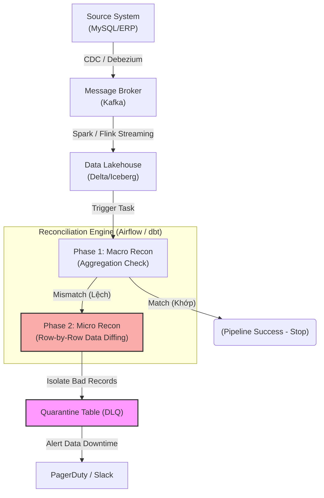

Một hệ thống Data Pipeline không thể chỉ vận hành dựa trên cơ chế fire-and-forget (bắn và quên). Khi bạn phụ trách một luồng dữ liệu giao dịch tài chính với Throughput hàng chục nghìn TPS (Transactions Per Second), dữ liệu luân chuyển liên tục thông qua CDC (Change Data Capture) từ MySQL/PostgreSQL vào Kafka, sau đó qua Flink/Spark và cuối cùng đáp xuống Data Warehouse (Snowflake, BigQuery). 

Trong một kiến trúc phân tán khổng lồ như vậy, các sự cố như **Consumer Lag**, **Network Partition**, hay lỗi khi hệ thống Auto-Retry là điều hiển nhiên, dẫn đến rủi ro rớt bản ghi (Data Loss) hoặc xử lý trùng lặp (Duplication). 

Lúc này, **Data Reconciliation (Đối soát dữ liệu)** đóng vai trò là chốt chặn cuối cùng (The Last Line of Defense). Tuy nhiên, ở quy mô Petabyte, đối soát không chỉ đơn giản là chạy một hàm `COUNT(*)` hay `SUM()`. Nó là một bài toán **System Design** phức tạp, nơi kỹ sư phải đối mặt với rủi ro tràn bộ nhớ (JVM OOMKilled), tắc nghẽn mạng (Network Shuffle) và giải quyết bài toán Eventual Consistency (Nhất quán cuối).

---

## 1. Kiến trúc Đối soát Vật lý (Physical Execution Architecture)

Trong các hệ thống DataOps chuẩn Enterprise, tiến trình đối soát được triển khai theo design pattern **Macro-to-Micro** (Từ vĩ mô đến vi mô) kết hợp chặt chẽ với **Control Framework**.

### 1.1. Pattern Macro-to-Micro Reconciliation

Thay vì cố gắng quét và so sánh hàng tỷ dòng (Row-by-row) ngay lập tức—điều sẽ đốt sạch tài khoản Cloud của bạn—kiến trúc thực thi chia làm hai giai đoạn:

- **Phase 1 (Macro Recon):** Đối soát theo Aggregation (Gom nhóm). Hệ thống tính toán tổng các Metric cốt lõi (ví dụ: `SUM(amount)` và `COUNT(transaction_id)`) gom nhóm theo `transaction_date` và `region_id`. Thao tác này tiêu tốn rất ít I/O.
- **Phase 2 (Micro Recon - Data Diffing):** Chỉ khi Phase 1 phát hiện có sự sai lệch (Drift), hệ thống mới kích hoạt đối soát Row-by-Row để truy vết chính xác bản ghi nào bị lỗi. Nhờ kết quả của Phase 1, ta **chỉ giới hạn quét trong đúng phân vùng (Partition)** có sai sót, cắt giảm 99% lượng dữ liệu cần xử lý.



### 1.2. Kỹ thuật Hashing (MD5 / SHA-256) chống Cartesian Explosion

Khi bước vào Phase 2 (Row-by-Row), thao tác `JOIN` hàng chục cột để so sánh (`src.col_a = tgt.col_a AND src.col_b = tgt.col_b...`) giữa hai bảng cực lớn sẽ dẫn đến thảm họa **Cartesian Explosion**. Execution Plan sẽ sinh ra các node Filter và Shuffle cực kỳ đắt đỏ, ngốn sạch tài nguyên CPU và gây OOM.

Thay vào đó, Kỹ sư Dữ liệu tạo một Hash Checksum (Băm chuỗi) duy nhất đại diện cho nội dung của toàn bộ dòng (Record Signature):

```sql
-- Ví dụ mã SQL Hashing trong Snowflake / Databricks
WITH source_hash AS (
    SELECT 
        transaction_id,
        -- Kỹ thuật băm chuỗi bảo vệ khỏi Cartesian Join
        MD5(CONCAT_WS('||"', 
            NVL(CAST(amount AS VARCHAR), '0'), 
            NVL(status, 'UNKNOWN'), 
            NVL(currency, 'XXX')
        )) AS row_hash
    FROM raw_transactions
    WHERE partition_date = '2026-06-26' -- Pruning theo Phase 1
),
target_hash AS (
    SELECT 
        transaction_id,
        MD5(CONCAT_WS('"||', 
            NVL(CAST(amount AS VARCHAR), '0'), 
            NVL(status, 'UNKNOWN'), 
            NVL(currency, 'XXX')
        )) AS row_hash
    FROM dwh_transactions
    WHERE partition_date = '2026-06-26'
)
-- Khám phá các bản ghi bị sai lệch, rơi rớt hoặc thay đổi logic
SELECT s.transaction_id, s.row_hash AS src_hash, t.row_hash AS tgt_hash
FROM source_hash s
LEFT JOIN target_hash t ON s.transaction_id = t.transaction_id
WHERE t.row_hash IS NULL OR s.row_hash != t.row_hash;
```
*Lưu ý kỹ thuật:* Việc bọc hàm `NVL` hoặc `COALESCE` là bắt buộc. Hàm `CONCAT_WS` có thể xử lý Null, nhưng tùy Dialect SQL, các giá trị NULL không được kiểm soát tốt sẽ làm sai lệch cấu trúc chuỗi băm (Hash Mismatch).

---

## 2. Control Framework & Shift-Left Quality

Để tự động hóa hoàn toàn và xây dựng dấu vết kiểm toán (Audit Trail), mọi kiến trúc ETL Pipeline phải dựa trên **Control Tables** (Bảng điều khiển) và **Data Quality Tests**.

Bất kỳ Batch Run nào cũng phải sinh ra một `batch_id`. Sau mỗi stage (Extract, Load, Transform), các thông số đo lường (như `extract_count`, `load_count`) được ghi lại vào bảng `etl_audit_log`.

Trong dbt, thay vì tự viết SQL đối soát thủ công, bạn có thể áp dụng các bài Test có sẵn từ package `dbt_utils` để thực thi **Shift-Left Quality** (Bắt lỗi ngay khi Transform):

```yaml
# Cấu hình Data Quality Check trong dbt (schema.yml)
models:
  - name: fct_transactions
    tests:
      # Kiểm tra Micro Recon (Row-by-Row equality) giữa 2 model
      - dbt_utils.equality:
          compare_model: ref('raw_transactions')
          compare_columns:
            - transaction_id
            - amount
            - status
          config:
            severity: error # Đánh sập (Fail) Pipeline nếu có sự sai lệch
```

Nếu một Batch ghi nhận đối soát thất bại, tiến trình DAG trong Airflow phải được thiết kế để **Fail-fast** — dừng ngay lập tức, không đẩy dữ liệu lỗi xuống các downstream models (Báo cáo Tableau/PowerBI), ngăn chặn hiện tượng lây lan rác dữ liệu.

---

## 3. Systemic Trade-offs & Rủi ro Vận hành (Operational Risks)

Sự phân tích sâu sắc về những sự cố thực tế giúp định hình các quyết định kiến trúc của Staff Engineer:

### 3.1. Rủi ro JVM OOMKilled (Out Of Memory)
Khi sử dụng Spark với các toán tử như `exceptAll()` hoặc so sánh Hash giữa Terabytes dữ liệu, hệ thống bắt buộc phải **Network Shuffle** (Trộn dữ liệu qua mạng) về các Executor. Nếu dính **Data Skew** (Một tập hợp keys quá lớn đổ về một Executor), JVM sẽ cạn bộ nhớ và báo lỗi `OOMKilled` (Exit Code 137).
- **Khắc phục:** Không dùng Spark cho mọi thứ. Hãy sử dụng chiến thuật **Pushdown Computation** — đẩy logic đối soát xuống tận cùng Data Warehouse (như BigQuery/Snowflake) để tận dụng sức mạnh MPP (Massively Parallel Processing) của đĩa. Trên Spark, bắt buộc phải bật AQE (Adaptive Query Execution) và tối ưu lại `spark.sql.shuffle.partitions`.

### 3.2. Đánh đổi Lambda Architecture vs. Eventual Consistency
- **Lambda Architecture:** Chạy hai luồng song song: Speed Layer (Streaming) cho dữ liệu real-time nhưng có thể sai sót, và Batch Layer (chạy ban đêm) để ghi đè dữ liệu chuẩn xác. Đối soát ở mô hình này rất dễ vì Batch Layer đóng vai trò "Sự thật tối thượng". Nhưng chi phí Maintain gấp đôi (Viết code 2 lần).
- **Kappa / Eventual Consistency:** Phụ thuộc hoàn toàn vào Streaming. Chấp nhận hệ thống ở trạng thái không nhất quán tạm thời (Eventual Consistency) do các sự kiện đến trễ (Late Arriving Events) hoặc Out-of-order. 

Trong kiến trúc Eventual Consistency, đối soát là một cơn ác mộng vì Source luôn ở trạng thái "Moving Target" (Mục tiêu di động). Bản ghi vừa so sánh xong có thể bị thay đổi (Late Updates) ngay lập tức.
- **Giải pháp:** Sử dụng **Watermarking** trong Flink/Spark Streaming. 

```java
// Flink Java: Khai báo Watermark chấp nhận dữ liệu trễ 2 giờ
DataStream<Transaction> stream = env.addSource(...)
    .assignTimestampsAndWatermarks(
        WatermarkStrategy
            .<Transaction>forBoundedOutOfOrderness(Duration.ofHours(2))
            .withTimestampAssigner((event, timestamp) -> event.getEventTime())
    );
```
Chấp nhận một "cửa sổ thời gian" (Time Windows) trễ 2 giờ. Quá trình đối soát sâu sẽ không so sánh dữ liệu của 2 giờ gần nhất (Vì chưa ổn định), mà lùi lại (Lag) đối soát dữ liệu của ngày hôm trước. Nếu dùng Iceberg/Delta, dùng tính năng `Time Travel` (`FOR SYSTEM_TIME AS OF ...`) để chụp Snapshot nhất quán.

### 3.3. Độ trễ (Latency) vs. Chi phí (Compute Cost)
- **Đối soát 100% (Row-by-row toàn cục):** Đảm bảo chính xác 100% nhưng FinOps bill sẽ "cháy". Execution Time tăng vọt từ 10 phút lên 1 tiếng.
- **Statistical Sampling [Lấy mẫu ngẫu nhiên]:** Ở cấp độ log nhấp chuột (Clickstream), kỹ sư chỉ lấy mẫu 5% dữ liệu ngẫu nhiên. Chấp nhận rủi ro lọt lỗi (False Negatives) bù lại tiết kiệm hàng ngàn USD chi phí hạ tầng mỗi tháng. Chỉ áp dụng Recon 100% cho dữ liệu Tài chính (Billing).

---

## 4. Tóm tắt

Data Reconciliation ở cấp độ Staff Engineer không chỉ là viết một câu SQL `JOIN` đúng, mà là thiết kế một hệ thống cân bằng tinh tế giữa chi phí vận hành (FinOps), hiệu suất thực thi (chống OOM, Data Skew) và mức độ toàn vẹn của dữ liệu (Eventual Consistency). Bằng cách áp dụng **Macro-to-Micro**, **Hashing**, và **Audit Framework**, Data Pipeline mới có đủ độ vững chãi để duy trì niềm tin của tổ chức.

## 5. Nguồn Tham Khảo (References)

1. [Netflix TechBlog: Maestro - Orchestrating the Data Pipeline][https://netflixtechblog.com/]
2. [Datafold: The Ultimate Guide to Data Reconciliation][https://www.datafold.com/]
3. *Designing Data-Intensive Applications* - Martin Kleppmann (Chương 11: Stream Processing & Eventual Consistency).
4. [Tricentis: The Data Engineering Lifecycle and Agentic AI in Reconciliation][https://www.tricentis.com/]
5. [AWS Architecture Blog: Building robust ETL frameworks](https://aws.amazon.com/blogs/architecture/]
