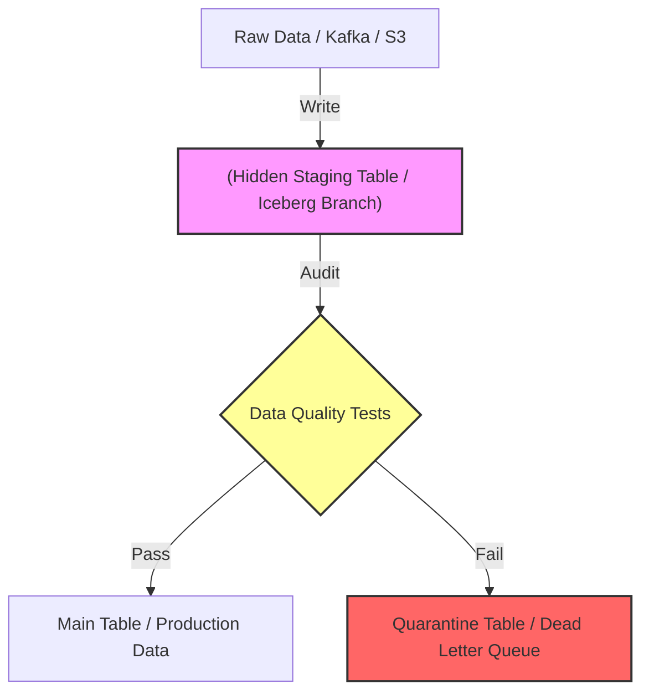

Trong phát triển phần mềm, Unit Test giúp bạn đảm bảo logic code hoạt động đúng. Tuy nhiên, trong Kỹ thuật Dữ liệu (Data Engineering), **logic đúng là chưa đủ, vì bản chất của dữ liệu là biến động**. Một ngày đẹp trời, API của đối tác trả về chuỗi `$10.5` thay vì số thực `10.5`, hoặc team Backend vô tình xóa mất bảng user_id. Pipeline của bạn vẫn chạy trơn tru, nhưng dữ liệu đầu ra lại biến thành "rác".

Bài viết này bỏ qua những định nghĩa sách giáo khoa "Data Testing là gì?" để đi sâu vào cách thiết kế hệ thống kiểm thử dữ liệu dưới góc nhìn kiến trúc (Architecture), phân tích các mô hình như **Circuit Breaker** (như cách Netflix và Uber vận hành), và những rủi ro đánh đổi (Trade-offs) khốc liệt về tài nguyên (Compute Cost) khi thực thi kiểm thử trên quy mô Petabyte.

## 1. Kiến trúc Thực thi Vật lý (Physical Execution Patterns)

Khi nào và ở đâu chúng ta nên chạy kiểm thử dữ liệu? Thay vì rải rác test ở mọi nơi, các Data Platform hiện đại áp dụng các Pattern kiến trúc cực kỳ cụ thể.

### 1.1. Circuit Breaker (Mạch dừng)

Mượn khái niệm từ microservices (Hystrix của Netflix), **Data Circuit Breaker** là cơ chế ngắt mạch toàn bộ hoặc một phần pipeline khi dữ liệu không đạt chuẩn. Nếu tỷ lệ lỗi vượt quá ngưỡng cho phép (SLA), pipeline sẽ bị dừng ngay lập tức (fail-fast) thay vì nạp dữ liệu sai vào hệ thống phục vụ (Serving Layer).

**Code Thực chiến:** 
Ví dụ cấu hình dbt test với cơ chế ngắt mạch phân cấp `warn` và `error`. Nếu `error` xảy ra, task Airflow phía sau sẽ không được trigger.

```yaml
models:
  - name: fct_transactions
    columns:
      - name: transaction_amount
        tests:
          - not_null
          - dbt_expectations.expect_column_values_to_be_between:
              min_value: 0
              max_value: 1000000
              config:
                severity: warn # Cảnh báo (Alert) nhưng không ngắt mạch
      - name: user_id
        tests:
          - not_null:
              config:
                severity: error # Ngắt mạch (Circuit Breaker) nếu vi phạm
          - relationships:
              to: ref('dim_users')
              field: id
```

### 1.2. Write-Audit-Publish (WAP) Pattern

Đây là kiến trúc cốt lõi đằng sau các hệ thống Data Quality tại các Big Tech như Airbnb (với Midas framework) và Apple. WAP giải quyết bài toán: *Làm sao để test dữ liệu thực tế mà không làm ảnh hưởng đến người dùng cuối?*

1. **Write (Ghi):** Ghi dữ liệu vào một nhánh ẩn (Staging / Branch) hoặc một phân vùng tạm (Temporary Partition).
2. **Audit (Kiểm toán):** Chạy toàn bộ các Data Tests (Great Expectations, dbt, Soda) trên nhánh ẩn đó.
3. **Publish (Phát hành):** Nếu Audit Pass, thực hiện thao tác hoán đổi nguyên tử (Atomic Swap) hoặc merge nhánh để phơi bày dữ liệu cho Data Consumers. Nếu Fail, nhánh bị hủy bỏ và báo động.


*Sơ đồ: Luồng thực thi Write-Audit-Publish (WAP) Pattern*

## 2. Rủi ro Vận hành & Systemic Trade-offs

Việc cắm Data Testing vào pipeline không phải là "bữa trưa miễn phí". Dưới đây là những "cái giá" phải trả và cách các Staff Engineer xử lý chúng.

### 2.1. Compute Cost vs. Pipeline Latency (Chi phí vs. Độ trễ)

**Vấn đề:** Các bài test phức tạp (đặc biệt là test `relationships` hay kiểm tra trùng lặp `unique` trên bảng có hàng tỷ dòng) đòi hỏi thao tác **Network Shuffle** khổng lồ trên Spark/Snowflake. Hậu quả là tiền Cloud (Compute Cost) tăng vọt và làm chậm SLA của pipeline. Đặc biệt, lỗi **Cartesian Explosion** rất dễ xảy ra nếu viết câu SQL test join không có điều kiện lọc phân vùng (Partition pruning).

**Giải pháp (Trade-off):**
- Đánh đổi tính chính xác tuyệt đối lấy hiệu năng bằng cách **Sample (Lấy mẫu)**.
- Chỉ chạy test trên phân vùng dữ liệu mới nhất (Incremental Testing) thay vì quét toàn bộ bảng (Full Table Scan).

**Code Thực chiến (dbt Incremental Test):**
Chỉ test tính Unique trên những dữ liệu được chèn trong 3 ngày gần nhất.

```sql
-- tests/assert_recent_transactions_unique.sql
SELECT transaction_id, count(*)
FROM {{ ref('fct_transactions') }}
WHERE created_at >= CURRENT_DATE - INTERVAL '3 days'
GROUP BY transaction_id
HAVING count(*) > 1
```

### 2.2. Alert Fatigue (Hội chứng "Nhờn" Cảnh Báo)

**Vấn đề:** Khi bạn thiết lập test với ngưỡng tĩnh (Static thresholds), ví dụ: `row_count > 100,000`. Vào ngày lễ (Black Friday), lượng đơn hàng tăng vọt lên 500,000. Hệ thống báo lỗi liên tục (False Positives). Kỹ sư dữ liệu bị "spam" Slack hàng đêm, dẫn đến trạng thái Alert Fatigue - mệt mỏi và bắt đầu phớt lờ cảnh báo. Khi lỗi thật sự xảy ra, không ai thèm quan tâm.

**Giải pháp từ Uber DQM (Data Quality Monitor):**
Chuyển từ Static Threshold sang **Statistical Modeling (Mô hình thống kê)** và **Anomaly Detection (Phát hiện bất thường)**. Hệ thống DQM của Uber học từ dữ liệu lịch sử để tự động điều chỉnh dải băng tin cậy (Confidence bands).

```python
# Pseudo-code minh họa tư duy Data Observability
from scipy.stats import zscore
import pandas as pd

def detect_volume_anomaly(daily_volume_series: pd.Series, threshold_z=3.0):
    """
    Thay vì fix cứng số dòng, dùng Z-Score để tìm bất thường 
    dựa trên phân phối của 30 ngày gần nhất.
    """
    z_scores = zscore(daily_volume_series)
    latest_z = z_scores.iloc[-1]
    
    if abs(latest_z) > threshold_z:
        trigger_pagerduty_alert(f"Volume anomaly detected! Z-Score: {latest_z}")
    else:
        log_info("Volume is within historical norms.")
```

### 2.3. OOMKilled và Bottleneck trên Trạm Kiểm Soát (Test Runner)

**Vấn đề:** Khi dùng Python (Great Expectations hoặc Pandas) để kéo (pull) lượng lớn dữ liệu từ Data Warehouse về Container (như Pod Kubernetes chạy Airflow) để chạy test in-memory. Nếu dữ liệu quá lớn, Container sẽ tràn RAM và bị HĐH "bắn hạ" ngay lập tức (Lỗi `OOMKilled`).

**Giải pháp:** 
- **Push-down Compute:** Đẩy việc tính toán test thẳng xuống Database/Warehouse (noi có sức mạnh phân tán). Công cụ dbt làm cực tốt việc này vì nó compile ra SQL và để Snowflake/BigQuery chạy.
- Nếu dùng Great Expectations, sử dụng SqlAlchemy Execution Engine thay vì Pandas Execution Engine để tránh kéo dữ liệu thô qua mạng.

## 3. Quản lý Vòng Đời Dữ Liệu Khuyết Tật (Data Quarantine)

Khi Circuit Breaker ngắt mạch, dữ liệu lỗi đi đâu?
Thay vì vứt bỏ, các hệ thống chuẩn Enterprise (như kiến trúc Uber UDQ) sẽ định tuyến các record lỗi vào **Quarantine Table (Bảng cách ly)** hoặc **Dead Letter Queue (DLQ)**.

Tại đây, Data Engineer sẽ phân tích nguyên nhân (Root Cause Analysis). Khi kịch bản lỗi (ví dụ: đối tác sửa lại định dạng API) được khắc phục, các record trong Bảng cách ly sẽ được chạy lại qua pipeline (Re-processing) để bù đắp dữ liệu bị thiếu, đảm bảo không có giao dịch nào bị thất thoát (Zero Data Loss).

## 4. Tổng Kết

Kiểm thử dữ liệu (Data Testing) không phải là cấu hình dbt yaml mù quáng. Nó là nghệ thuật thiết kế các điểm kiểm soát chất lượng (Quality Gates) tinh tế: vừa đủ nghiêm ngặt để bảo vệ kho dữ liệu (ngăn rác rưởi lọt vào), nhưng cũng vừa đủ thông minh (Anomaly Detection, Incremental Scan) để không cày nát ngân sách Cloud Compute và không tra tấn Data Engineer bằng những báo động giả lúc 3 giờ sáng.

## Nguồn Tham Khảo

* [Monitoring Data Quality at Scale with Statistical Modeling (Uber Engineering)](https://www.uber.com/en-VN/blog/monitoring-data-quality-at-scale-with-statistical-modeling/)
* [Data Quality at Airbnb: Introducing Wall and Midas](https://medium.com/airbnb-engineering)
* [Write-Audit-Publish Pattern for Data Lakes (Project Nessie/Apache Iceberg)](https://projectnessie.org/features/wap/)
* Sách: *Designing Data-Intensive Applications* - Martin Kleppmann (Chương thảo luận về Schema Evolution & Consistency).
* [dbt Best Practices cho Data Testing](https://docs.getdbt.com/docs/build/data-tests)
