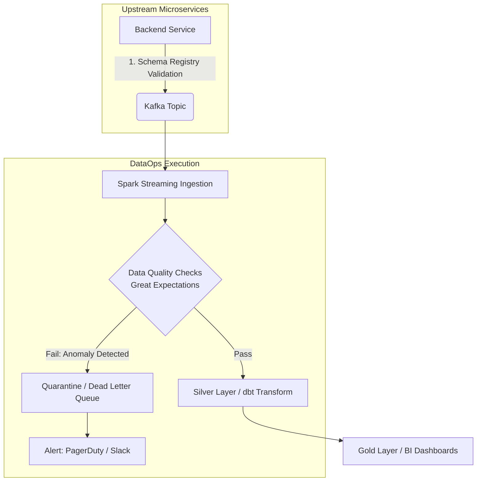

**DataOps** không đơn thuần là "DevOps cho Data" hay một vài khái niệm Agile sáo rỗng. Ở góc độ Engineering, DataOps là kiến trúc giải quyết bài toán **State (trạng thái của dữ liệu)** trong CI/CD. 

Khi một Software Engineer deploy code lỗi, họ có thể rollback (hoàn tác) container trong vài giây. Nhưng khi Data Engineer deploy một pipeline lỗi ghi sai lệch 500GB dữ liệu vào Data Warehouse, việc rollback đồng nghĩa với việc chạy lại các job nặng nề (backfill), giải quyết vấn nạn Data Skew, và tốn hàng nghìn USD tiền Compute. DataOps sinh ra để thiết lập các rào cản (guardrails) tự động hóa, ngăn chặn dữ liệu bẩn và code lỗi chạm tới Production.

---

## Kiến trúc CI/CD Dữ liệu (Data CI/CD Architecture)

Thách thức lớn nhất của Data CI/CD là **Môi trường cách ly (Environment Isolation)**. Làm sao để test một câu lệnh SQL mới trên dữ liệu Production mà không phải copy toàn bộ Petabytes dữ liệu sang môi trường Staging (vừa đắt đỏ, vừa vi phạm bảo mật)?

Giải pháp tiêu chuẩn hiện nay là kết hợp **Zero-copy Clone** và **Deferred Execution**.

### Cơ chế Zero-copy Clone (Clone qua Metadata)
Các hệ thống kho dữ liệu hiện đại (Snowflake, BigQuery, Databricks Delta Lake) hỗ trợ tạo bản sao dữ liệu tức thì mà không di chuyển byte vật lý nào. Hệ thống chỉ tạo một bản snapshot của các file metadata (ví dụ: Parquet/Iceberg manifest files) trỏ về cùng một phân vùng dữ liệu gốc.

### Code Thực chiến: `dbt defer` trong GitHub Actions
Khi tạo một Pull Request sửa logic bảng `fact_sales`, ta không muốn build lại toàn bộ các bảng upstream như `stg_users`, `stg_orders`. Ta cấu hình CI dùng cờ `--defer` kết hợp manifest state:

```yaml
name: DataOps CI Pipeline
on: [pull_request]
jobs:
  dbt_test_pr:
    runs-on: ubuntu-latest
    steps:
      - name: Checkout code
        uses: actions/checkout@v3
        
      - name: Create PR Schema (Zero-copy clone)
        run: |
          snowsql -q "CREATE SCHEMA pr_${{ github.event.pull_request.number }} CLONE prod_schema;"
          
      - name: Run dbt build with Defer
        run: |
          dbt build --select state:modified+ \
            --defer --state ./prod-run-artifacts \
            --target pr_env
```

**Đánh đổi hệ thống (Trade-offs)**: Mặc dù Zero-copy clone tiết kiệm Storage Cost, việc chạy test queries trên nhánh PR vẫn tiêu tốn Compute Cost. Với các PR lớn có nhiều phép JOIN, chi phí Warehouse chạy CI có thể vượt qua chi phí Production nếu không cấu hình Time-to-Live (TTL) để dọn dẹp các Schema PR rác.

---

## Kiến trúc Thực thi Orchestration (Orchestration Execution)

Công cụ Orchestration (điều phối) như Airflow, Dagster, Prefect là trái tim của DataOps. Tuy nhiên, cách chúng quản lý quá trình thực thi có sự khác biệt lớn về bản chất vật lý.

### Nút thắt cổ chai Airflow Scheduler (Airflow Bottlenecks)
Airflow dựa trên kiến trúc **Task-based**. Scheduler của Airflow liên tục quét thư mục chứa file Python (DAG directory) để parse và cập nhật trạng thái vào Metadata Database (Postgres/MySQL). 

**Real-world Incident: Scheduler OOM & Metadata Overload**
- **Sự cố**: Khi hệ thống phình to lên 5,000 DAGs, vòng lặp parse DAG của Airflow Scheduler chiếm trọn CPU, gây hiện tượng trễ lịch trình (DAGs scheduled trễ 10-15 phút). Đồng thời, số lượng Task Instances khổng lồ làm nghẽn kết nối (connection pool) tới Metadata Database, dẫn đến hiện tượng Zombie Tasks.
- **Khắc phục**: 
  1. Tăng `min_file_process_interval` (thời gian nghỉ giữa các vòng quét file).
  2. Bật `.airflowignore` để bỏ qua các thư mục không chứa DAG.
  3. Dịch chuyển compute nặng ra khỏi Airflow Worker bằng `KubernetesPodOperator` (chỉ dùng Airflow làm Trigger, để Kubernetes gánh việc thực thi).

```python
# Ví dụ chống OOM trên Airflow Worker bằng cách đẩy job xuống Kubernetes
from airflow.providers.cncf.kubernetes.operators.pod import KubernetesPodOperator

run_heavy_spark_job = KubernetesPodOperator(
    task_id="spark_data_quality_task",
    name="spark-dq-check",
    namespace="data-processing",
    image="spark:3.2",
    cmds=["spark-submit", "--class", "com.example.DataQualityCheck", "s3://code/dq.jar"],
    resources={"request_memory": "16G", "request_cpu": "4"},
    get_logs=True,
    is_delete_operator_pod=True, # Dọn dẹp Pod sau khi xong để tránh kẹt Cluster
)
```

### Chuyển dịch sang Data-aware Orchestration (Dagster)
Khác với Airflow quản lý "tiến trình", Dagster theo triết lý **Software-Defined Assets (SDA)**. Nó quản lý trực tiếp vòng đời của "dữ liệu" (table, ML model). Hệ thống tự hiểu bảng `dim_customer` phụ thuộc vào `stg_crm`, và chỉ chạy lại `dim_customer` khi nhận được event báo hiệu dữ liệu ở `stg_crm` đã thay đổi, giảm thiểu việc chạy các DAG theo lịch CRON tĩnh gây lãng phí tài nguyên.

---

## Rủi ro Vận hành và Data Quality (Operational Risks)

Data Quality trong DataOps tương tự như quy trình Quality Control trong nhà máy. Nếu không có "cầu dao" (Circuit Breaker), dữ liệu bẩn từ upstream sẽ đầu độc toàn bộ Dashboard downstream.



### The Data Contract (Hợp đồng Dữ liệu)
Netflix và Uber đã áp dụng **Data Mesh**, trong đó Data Quality được đẩy ngược về phía người tạo ra dữ liệu (Data Producers). 

**Sự cố (Data Contract Breakage)**: Kỹ sư Backend sửa tên cột `user_id` thành `customer_id` trong cơ sở dữ liệu dịch vụ. Code Backend vẫn chạy tốt, nhưng 1 tiếng sau, toàn bộ Pipeline của Data Team sập tĩnh (Schema Drift), kéo theo Báo cáo doanh thu trống trơn.

**Giải pháp Kiến trúc**: Sử dụng **Schema Registry** (ví dụ: Confluent Schema Registry cho Kafka) làm cổng bảo vệ. Bất kỳ PR nào từ Backend làm phá vỡ tính tương thích ngược (Backward Incompatibility) của Avro/Protobuf schema đều bị đánh rớt ngay tại pipeline CI/CD của Backend.

### Sự đánh đổi của Data Quality Checks (Systemic Trade-offs)

1. **Cartesian Explosion trong Data Test**: Một lỗi ngớ ngẩn phổ biến là viết Data Test (bằng SQL) kiểm tra dữ liệu bằng cách JOIN nhiều bảng mà quên xử lý duplicate keys. Lỗi này tạo ra tích Đề-các (Cartesian Product), quét hàng tỷ rows, làm tràn RAM (Spill-to-disk) hoặc sinh lỗi `OOMKilled` cho node thực thi, đồng thời đẩy bill Snowflake lên hàng ngàn USD chỉ vì một câu test ngầm.
2. **Latency vs. Throughput**: Trong các pipeline Real-time, việc kẹp Data Quality checks phức tạp (như tính Z-score phân phối để bắt Anomaly) vào từng micro-batch của Spark Streaming sẽ làm tăng processing time đột biến. Hậu quả là **Consumer Lag** (Consumer không đọc kịp tốc độ sinh log của Producer), dữ liệu bị dồn ứ trên Kafka.
   - *Hướng giải quyết*: Tách biệt Data Quality thành luồng Asynchronous (chạy kiểm thử trên batch lớn sau khi dữ liệu đã đáp xuống Storage), hoặc áp dụng Statistical Sampling (chỉ tính toán trên 1% traffic ngẫu nhiên) để giữ low latency.

---

## Nguồn Tham Khảo (References)
* [Netflix Tech Blog: Data Mesh Architecture & Data Quality](https://netflixtechblog.com/)
* [Designing Data-Intensive Applications - Martin Kleppmann](https://dataintensive.net/)
* [The DataOps Cookbook - DataKitchen](https://datakitchen.io/dataops-cookbook/)
* [Dagster: Software-Defined Assets](https://dagster.io/blog/software-defined-assets)
* [dbt Labs: Defer & State Methodologies](https://docs.getdbt.com/reference/node-selection/defer)
