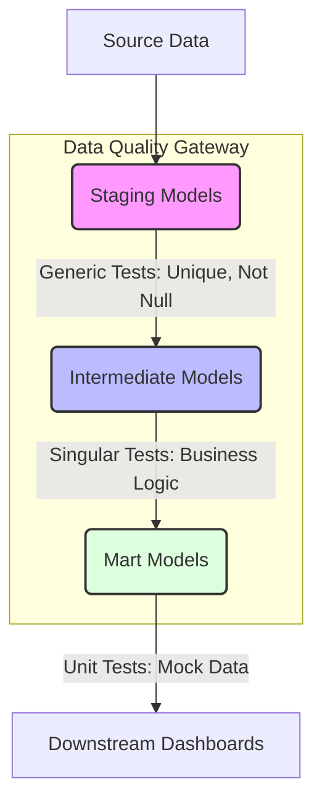

Có một tình huống kinh điển mà bất kỳ kỹ sư dữ liệu nào cũng từng đối mặt: "Silent Failure" (Lỗi câm). Pipeline của bạn chạy thành công, Airflow báo xanh (Success), không có một task nào bị *OOMKilled* hay *Timeout*. Nhưng đến sáng hôm sau, team Business Intelligence phàn nàn rằng doanh thu bị nhân đôi, hoặc dashboard báo cáo khách hàng mới bằng 0.

Lỗi không nằm ở luồng chạy vật lý, mà nằm ở **logic dữ liệu**. Khi quy mô hệ thống đạt mức hàng nghìn models (như tại Uber, Netflix hay Spotify), bạn không thể dùng mắt người hay vài câu SQL lẻ tẻ để kiểm tra. **dbt Testing** biến quy trình này thành **Data Quality as Code** (Chất lượng dữ liệu dưới dạng mã nguồn), cho phép bạn "Shift-Left" (kiểm thử từ sớm) và chặn đứng dữ liệu bẩn trước khi nó phá hỏng các báo cáo hạ nguồn (downstream).

---

## 1. Kiến trúc Kiểm thử trong dbt (Testing Architecture)

Thay vì viết các kịch bản kiểm thử riêng biệt bằng Python (như *Great Expectations* hay *Deequ*), dbt đưa kiểm thử vào trực tiếp lớp Transformation. Mọi bài test cuối cùng đều được compile ra SQL. Nguyên tắc cốt lõi: **Nếu truy vấn trả về > 0 dòng, bài kiểm thử đó FAIL.**



### 1.1. Data Contracts & Generic Tests

Tại các lớp Staging, Generic Tests đóng vai trò như các **Data Contracts** (Hợp đồng dữ liệu). Chúng đảm bảo Data schema không bị phá vỡ.

*   `unique`, `not_null`: Ngăn chặn lỗi Cartesian Explosion (phình to dữ liệu do join sai khóa).
*   `accepted_values`: Ngăn chặn dữ liệu rác từ form nhập liệu.
*   `relationships`: Đảm bảo Referential Integrity (Tính toàn vẹn tham chiếu).

**Ví dụ cấu hình (models.yml):**
```yaml
models:
  - name: stg_stripe__payments
    columns:
      - name: payment_id
        tests:
          - unique
          - not_null
      - name: status
        tests:
          - accepted_values:
              values: ['success', 'failed', 'pending']
              config:
                severity: warn # Non-blocking test
                warn_if: "> 10" # Cảnh báo nếu > 10 giao dịch trạng thái lạ
```

### 1.2. Kiểm thử Logic Nghiệp vụ (Singular Tests & Packages)

Khi các quy tắc trở nên phức tạp (Cross-column, Cross-table), ta dùng Singular Tests (SQL tùy chỉnh) hoặc tận dụng hệ sinh thái packages:
- **`dbt_utils`**: Dành cho các test nâng cao (ví dụ: `mutually_exclusive_ranges`, `unique_combination_of_columns`).
- **`dbt_expectations`**: Dành cho Data Profiling và kiểm tra phân phối dữ liệu (ví dụ: `expect_column_values_to_match_regex`).

### 1.3. Unit Testing trong dbt (Phiên bản mới)

Kiểm thử dữ liệu truyền thống (Data Tests) phụ thuộc vào dữ liệu thật trong kho. Nhược điểm là nó chậm, tốn chi phí scan dữ liệu, và kết quả test không mang tính tất định (non-deterministic). 
**Unit Testing** giải quyết việc này bằng cách mock (giả lập) dữ liệu đầu vào. Bạn định nghĩa dữ liệu input cứng và kết quả kỳ vọng (expected output) bằng CSV/YAML để cô lập hàm transformation. Điều này cực kỳ quan trọng đối với logic tính thuế, hoa hồng hoặc các chỉ số tài chính.

---

## 2. Systemic Trade-offs: Những đánh đổi ở quy mô lớn

Khi hệ thống Data Warehouse vượt mức Terabytes hoặc Petabytes, một câu lệnh `select count(*)` hoặc tìm `unique` trên bảng lớn có thể ngốn hàng chục USD (Snowflake Credits, BigQuery Bytes) và kéo dài thời gian chạy SLA thêm hàng giờ.

### Trade-off 1: Data Confidence vs. Pipeline SLA (Độ tin cậy vs. Độ trễ)
- **Vấn đề**: Chạy 500 bài test sau mỗi lần load dữ liệu sẽ làm chậm luồng cấp dữ liệu (Pipeline Latency).
- **Giải pháp**: Phân cấp mức độ nghiêm trọng (Severity).
  - Khóa chính (Primary Key) -> `severity: error` (Blocking). Lỗi sẽ dừng ngay Pipeline (Cascading stop) để tránh lan truyền dữ liệu bẩn.
  - Cột phụ (Metrics) -> `severity: warn` (Non-blocking). Lưu log vào bảng artifacts, Pipeline vẫn chạy bình thường. Data Team sẽ mở JIRA ticket xử lý sau.

### Trade-off 2: Compute Cost vs. Test Coverage (Chi phí tính toán vs. Độ phủ)
- **Vấn đề**: Việc chạy `unique` trên một bảng Fact chứa 5 tỷ dòng mỗi ngày là sự lãng phí khủng khiếp.
- **Giải pháp (Incremental Testing)**: Thay vì test toàn bộ dữ liệu lịch sử, ta chỉ test các partitions hoặc dòng dữ liệu mới chèn vào. Kết hợp `where` clause vào dbt tests:

```yaml
tests:
  - unique:
      column_name: order_id
      config:
        where: "created_at >= current_date - interval '1 day'"
```

### Real-world Incidents: Consumer Lag & OOMKilled do Cartesian Explosion
Giả sử một bảng Dim bị duplicate khóa (do test `unique` bị tắt để tiết kiệm chi phí). Khi bảng Fact Join với bảng Dim này, hiện tượng **Cartesian Explosion** xảy ra. 
1 tỷ dòng Fact x 2 (bản ghi Dim duplicate) = 2 tỷ dòng.
Kết quả: Memory của hệ thống xử lý (Spark/Trino) bị tràn (OOMKilled), Spill-to-disk quá lớn, hoặc cạn kiệt tài nguyên tính toán khiến toàn bộ các luồng dữ liệu khác bị thắt cổ chai (Bottleneck). 
=> **Bài học:** Không bao giờ thỏa hiệp với test `unique` trên các bảng Dimensions cốt lõi.

---

## 3. Slim CI/CD: Triển khai Kiểm thử Tự động (Show, Don't Tell)

Ở các Data Team quy mô lớn (DataOps), không ai tự chạy `dbt test` bằng tay. Mọi Pull Request (PR) phải vượt qua vòng kiểm thử tự động (CI). 

Thay vì chạy toàn bộ project, hệ thống **Slim CI** sử dụng cờ `--select state:modified+` để chỉ build và test những model bị thay đổi code trong PR, giúp giảm thời gian CI từ hàng tiếng xuống còn vài phút.

**Kiến trúc GitHub Actions cho Slim CI dbt:**

```yaml
name: dbt_slim_ci

on:
  pull_request:
    branches:
      - main

jobs:
  dbt_run_and_test:
    runs-on: ubuntu-latest
    steps:
      - name: Checkout Code
        uses: actions/checkout@v3

      - name: Setup Python & dbt
        run: |
          pip install dbt-snowflake
          dbt deps

      - name: Download Production Manifest
        # Tải file manifest.json từ lần chạy Production thành công gần nhất
        # để so sánh sự thay đổi (State comparison).
        run: aws s3 cp s3://my-dbt-artifacts/manifest.json ./target/

      - name: Run Slim CI
        # Lệnh dbt build thực thi song song cả run và test.
        # defer giúp đọc dữ liệu từ schema PR tạm thời, nếu không có sẽ lấy từ schema Prod.
        run: |
          dbt build \
            --select state:modified+ \
            --defer --state ./target
```

### Tại sao dùng `dbt build` thay vì `dbt run` rồi `dbt test`?
Lệnh `dbt build` chạy xen kẽ (Run Model A -> Test Model A -> Run Model B). Nếu Model A fail test, Model B sẽ tự động bị bỏ qua (Skipped). Điều này tối ưu compute resources hơn rất nhiều so với việc cố chạy (run) toàn bộ các bảng rồi mới đi test, vì đằng nào dữ liệu hạ nguồn cũng đã bị bẩn nếu thượng nguồn fail.

---

## 4. Tổng Kết

Kiểm thử dữ liệu với dbt đã đưa Data Engineering tiệm cận với chuẩn mực của Software Engineering. Bằng cách thiết lập Data Contracts chặt chẽ ở thượng nguồn, Unit Test logic ở giữa, và Incremental Test ở hạ nguồn, các kỹ sư dữ liệu có thể kiểm soát hoàn toàn hệ thống Data Warehouse khổng lồ, ngăn chặn các "Silent Failures", tối ưu chi phí hạ tầng (FinOps) và lấy lại niềm tin từ đội ngũ Business.

## Nguồn Tham Khảo (References)
- [Uber Engineering: Data Quality Monitor](https://www.uber.com/en-VN/blog/data-quality-monitor/)
- [Netflix TechBlog: Data Mesh & Data Quality](https://netflixtechblog.com/)
- [DataOps Manifesto](https://dataopsmanifesto.org/)
- [dbt Documentation: Unit testing](https://docs.getdbt.com/docs/build/unit-tests)
- [dbt Packages: dbt_expectations](https://hub.getdbt.com/calogica/dbt_expectations/latest/)
