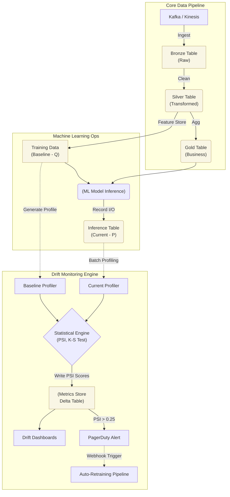

Pipeline không báo một dòng log đỏ nào (SUCCESS 100%), Schema vẫn chuẩn xác đến từng Type, dữ liệu vẫn chảy vào kho đúng giờ (Freshness đạt 99.9%). Thế nhưng, cuối tháng doanh thu từ hệ thống Recommendation (Gợi ý sản phẩm) giảm mạnh 20%, hoặc mô hình Fraud Detection bỗng khóa nhầm tài khoản của hàng loạt người dùng hợp lệ. 

Chào mừng đến với **Distribution Drift** (Trôi dạt phân phối, hay Data Drift) - cơn ác mộng thầm lặng nhất của mọi Staff Data Engineer và Kỹ sư MLOps.

Khác với Schema Drift gây ra lỗi sập luồng (Hard Failures - ví dụ thiếu cột, sai kiểu dữ liệu), Distribution Drift tạo ra **Thất bại thầm lặng (Silent Failures)**. Dữ liệu vẫn hợp lệ về mặt vật lý, nhưng đã thay đổi hoàn toàn về bản chất thống kê. Bài viết này sẽ mổ xẻ kiến trúc giám sát Drift ở quy mô lớn (Scale), các Metrics đo lường (KL Divergence, PSI), và những sự đánh đổi về chi phí tính toán (Compute Trade-offs) cực kỳ khốc liệt.

---

## 1. Bản chất Vật lý của Data Drift

Trong kiến trúc hệ thống, Distribution Drift xảy ra khi **Hàm phân phối xác suất (Probability Distribution Function - $P(X)$)** của luồng dữ liệu Production (Current) lệch khỏi luồng dữ liệu tham chiếu (Baseline - thường là tập Training Data). 

Có 3 hình thái trôi dạt chính:
1. **Covariate Shift (Feature Drift):** $P(X)$ thay đổi, nhưng quan hệ giữa X và Y giữ nguyên. Ví dụ: Mô hình định giá nhà được Train trên dữ liệu trước dịch với lãi suất thấp. Nay lãi suất tăng, phân phối thu nhập và khoản vay của người mua $X$ thay đổi hoàn toàn, đẩy mô hình ra khỏi miền bao phủ (Domain) mà nó từng học.
2. **Prior Probability Shift (Label Drift):** $P(Y)$ thay đổi. Tỷ lệ nhấp chuột (CTR) bỗng tăng vọt từ 2% lên 20% do một chiến dịch Marketing giảm giá khủng, làm sai lệch hoàn toàn các Baseline cũ.
3. **Concept Drift:** $P(Y|X)$ thay đổi. Nghĩa là mối quan hệ ngầm giữa Input và Output thay đổi bản chất. Ví dụ: Hành vi mua 50 cuộn giấy vệ sinh từng là dấu hiệu gian lận đầu cơ (Fraud), nhưng trong đại dịch COVID-19, đó lại là hành vi mua sắm bình thường.

---

## 2. Toán học phía sau sự dịch chuyển: KL Divergence & PSI

Để một chiếc máy tính phát hiện sự thay đổi phân phối, nó cần quy đổi hình học thành một con số. Hai vũ khí sắc bén nhất là:

### 2.1. Kullback-Leibler (KL) Divergence
Đây là một metric kinh điển trong Information Theory, đo lường sự chênh lệch (Divergence) giữa phân phối sản xuất $P$ và phân phối chuẩn $Q$:
$$ D_{"KL"}(P || Q) = \sum P(x) \log\left(\frac{"P(x)"}{Q(x)}\right) $$

**Bản chất:** Nếu $P$ và $Q$ giống hệt nhau, $D_{"KL"} = 0$. Càng lệch, $D_{"KL"}$ càng lớn.
**Điểm yếu chết người:** KL Divergence là hàm **Bất đối xứng (Asymmetric)** ($D_{"KL"}(P||Q) \neq D_{"KL"}(Q||P)$). Hơn nữa, nếu có một giá trị xuất hiện trong $P$ nhưng không có trong $Q$ (chia cho 0), kết quả sẽ ra vô cực (Infinity), làm Crash toàn bộ Pipeline giám sát.

### 2.2. Population Stability Index (PSI)
Để khắc phục lỗi chia cho 0 và tính bất đối xứng, ngành Ngân hàng và MLOps tạo ra PSI (Bản chất là một biến thể đối xứng của KL Divergence). 
Công thức tính toán dựa trên việc chia dữ liệu thành các Bins (Ví dụ 10 khoảng deciles):
$$ PSI = \sum (\%Current\_Bin - \%Baseline\_Bin) \times \ln\left(\frac{"\%Current\_Bin"}{\%Baseline\_Bin}\right) $$

**Tiêu chuẩn diễn dịch PSI (Rule of Thumb):**
- $PSI < 0.1$: Dữ liệu cực kỳ ổn định. Không có Drift.
- $0.1 \leq PSI < 0.25$: Drift nhẹ (Minor Shift). Kích hoạt mức cảnh báo màu Vàng, Data Scientist cần đưa vào Watchlist.
- $PSI \geq 0.25$: Drift nghiêm trọng (Major Shift). Báo động Đỏ. Cần đóng băng Model và kích hoạt luồng Retrain lập tức.

---

## 3. Kiến trúc Giám sát Drift (Observability Plane)

Để bắt được Data Drift ở quy mô Petabyte, việc chạy một script Jupyter cục bộ là bất khả thi. Chúng ta cần một kiến trúc Lakehouse Monitoring tích hợp trực tiếp vào Data Pipeline.



**Luồng thực thi vật lý:**
1. Mọi Request (Input) và Prediction (Output) của mô hình (ví dụ qua API) phải được dump (ghi) bất đồng bộ xuống một **Inference Table** (thường dùng Delta Lake/Iceberg).
2. Một tiến trình Airflow/Databricks Workflow (thường chạy Batch hàng đêm) sẽ quét Inference Table của ngày hôm qua và lôi Baseline Table ra đối chiếu.
3. Chia dữ liệu thành Bins (Binning), tính toán các chỉ số phân phối (PSI, K-S), và ghi điểm số vào Metrics Store.

---

## 4. Thực thi Giám sát với Evidently AI

Dưới đây là Code thực chiến đo PSI cho biến phân loại và Wasserstein distance cho biến liên tục, sử dụng `evidently`.

```python
import pandas as pd
from evidently.report import Report
from evidently.metric_preset import DataDriftPreset

# 1. Tải dữ liệu Reference (Baseline) và Current (Sản xuất)
# LƯU Ý: Phải sử dụng Sample (1-5%) nếu dữ liệu lớn hơn vài GB để tránh OOM
reference_data = pd.read_parquet("s3://data-lake/feature_store/training_v2_sample.parquet")
current_data = pd.read_parquet("s3://data-lake/inference/date=2026-06-25_sample.parquet")

# 2. Cấu hình Engine đo Drift
# - Biến liên tục [num]: Dùng Wasserstein (ngưỡng 0.1)
# - Biến phân loại (cat): Dùng PSI (Ngưỡng 0.25 - Cảnh báo đỏ)
drift_report = Report(metrics=[
    DataDriftPreset(
        num_stattest='wasserstein', 
        cat_stattest='psi',
        num_stattest_threshold=0.1,
        cat_stattest_threshold=0.25
    ]
])

# 3. Tính toán (Compute-Intensive)
drift_report.run(reference_data=reference_data, current_data=current_data)

# 4. Trích xuất kết quả và Alerting
result = drift_report.as_dict()
is_drift_detected = result["metrics"][0]["result"]["dataset_drift"]

if is_drift_detected:
    trigger_pagerduty_alert("CRITICAL: Major Data Drift (PSI >= 0.25) Detected!")
```

---

## 5. Systemic Trade-offs: FinOps vs. Độ chính xác

Tính toán Data Drift trên Big Data là một bài toán **cực kỳ tốn CPU và RAM** [Compute-Intensive]. Một Staff Engineer phải đối mặt với các sự đánh đổi sau:

### 5.1. Bài toán OOMKilled do Sorting (K-S Test)
Để so sánh hàm phân phối của 1 Tỷ dòng dữ liệu hiện tại với 10 Tỷ dòng dữ liệu Training bằng hàm Kolmogorov-Smirnov (K-S Test), CPU bắt buộc phải **Sắp xếp (Sort)** dữ liệu. Sort trên hệ thống phân tán (Spark) sẽ gây ra **Network Shuffle** khổng lồ và rất dễ dẫn đến lỗi `JVM OOMKilled`.

**Trade-off (FinOps vs Precision):** Đừng cố tính toán chính xác tuyệt đối. Hãy cứu lấy ngân sách Cloud.
- **Giải pháp 1: Data Sampling (Lấy mẫu ngẫu nhiên).** Chỉ Profile trên 1% hoặc 5% dữ liệu Production (Uniform Random Sampling). Theo luật số lớn, phân phối của tập Sample 5% gần như tương đương 100% nhưng giảm 95% chi phí Compute.
- **Giải pháp 2: Binning Approximate.** Chuyển đổi dữ liệu liên tục thành các Bin rời rạc ngay trong SQL (ví dụ dùng `WIDTH_BUCKET` trong BigQuery). Phép đếm Group By Bins cực kỳ rẻ so với việc Sort mảng liên tục.

### 5.2. Độ trễ (Latency) vs Cảnh báo giả (False Positives)
- Nếu chạy Profile Drift mỗi giờ (Hourly): Mẫu số (N) quá nhỏ, phương sai cao, và dính tính mùa vụ (ví dụ: Hành vi click lúc 2h sáng rất dị biệt so với 9h sáng). Bạn sẽ bị dội bom Alert rác (Alert Fatigue).
- **Khắc phục (Sliding Windows):** Thiết lập Cửa sổ trượt. Chỉ tính PSI trên dữ liệu tích lũy của 7 ngày gần nhất, so sánh với 7 ngày trước đó. Độ trễ phát hiện cao hơn (Tốn 1-2 ngày để nhận ra), nhưng độ tin cậy của cảnh báo đạt 99%.

---

## 6. Nguồn Tham Khảo

1. **Evidently AI Blog:** [Data Drift Metrics: PSI, KL Divergence, and more][https://www.evidentlyai.com/blog]
2. **AWS Architecture Blog:** *Detecting data drift using Amazon SageMaker Clarify*.
3. **Databricks Lakehouse Monitoring:** *Monitor data and AI assets* (Tích hợp Delta Catalog và Metrics Store).
4. *Designing Machine Learning Systems* - Chip Huyen (O'Reilly). Chương 8: Data Distribution Shifts.
5. Bài viết chuyên sâu về Toán học của Drift: [Understanding Population Stability Index (PSI]](https://mwouts.github.io/itables/)
