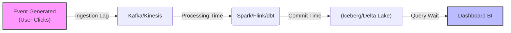

Trong Kỹ thuật Dữ liệu, có một định lý không thể chối cãi: **"Right data, wrong time = wrong data"** (Dữ liệu đúng nhưng trễ hẹn thì cũng là dữ liệu rác). Nếu Data Pipeline cung cấp dữ liệu huấn luyện cho hệ thống Real-time Bidding (Đấu thầu quảng cáo) bị trễ 2 giờ, công ty có thể mất trắng hàng triệu đô la.

**Freshness Monitoring (Giám sát Độ trễ)** không chỉ là việc đặt vài cái alert email trên Apache Airflow. Ở quy mô Cloud-scale (như Uber hay Netflix), nó là một bài toán System Design phức tạp: *Làm sao để đo lường độ trễ chính xác tới từng phút trên hàng Petabyte dữ liệu mà không làm "cháy túi" (Burn Compute Budget) tiền Cloud?*

---

## 1. Phân Rã Độ Trễ (Decomposing End-to-End Latency)

Khi Business User phàn nàn *"Dashboard số liệu ngày hôm qua chưa có!"*, độ trễ này (End-to-end Freshness SLA) thực chất là tổng hòa của nhiều điểm nghẽn vật lý. Để debug hiệu quả, Staff Data Engineer phải bóc tách nó thành 3 pha:

1. **Ingestion Lag (Độ trễ thu thập):** Thời gian dữ liệu nằm chờ trong Message Queue (ví dụ: `Kafka Consumer Lag`).
2. **Processing Time (Thời gian xử lý):** Thời gian hệ thống tính toán (Spark/Flink/dbt chạy mất bao lâu).
3. **Availability Delay (Thời gian hiển thị):** Chờ Data Warehouse (Snowflake, BigQuery) commit transaction hoặc chạy Z-Ordering/Compaction.



---

## 2. Cạm bẫy: Event Time vs. Processing Time

Để đo độ trễ, cách ngây thơ nhất là chạy câu lệnh `SELECT MAX(timestamp)`. Nhưng bạn sẽ chọn cột timestamp nào?

*   **Event Time:** Mốc thời gian thực tế sự kiện xảy ra trên thiết bị người dùng (Ví dụ: 10:00 AM user bấm nút Mua Hàng).
*   **Processing Time:** Mốc thời gian (Wall-clock) máy chủ nhận được và xử lý sự kiện đó.

**Sự cố kinh điển (Late Arriving Data):**
Giả sử toàn bộ pipeline của bạn bị sập lúc 10:05 AM. Không có data mới nào chảy vào. Đến 11:00 AM, một user vừa kết nối lại 4G, thiết bị của họ đẩy lên một event cũ rích có `Event_Time = 10:04 AM`. 
Nếu hệ thống giám sát của bạn query `MAX(Event_Time)`, nó sẽ thấy số liệu đứng im ở 10:04 AM, và báo động đỏ "DỮ LIỆU BỊ TRỄ 1 TIẾNG!". 
Trong khi đó, nếu query `MAX(Processing_Time)`, nó sẽ thấy event vừa được insert lúc 11:00 AM, và báo xanh "HỆ THỐNG CHẠY TỐT".

*Sự thật là hệ thống đang sập, nhưng query `Processing_Time` lại báo xanh (False Negative), còn query `Event_Time` báo đỏ nhưng nguyên nhân lại do 1 user rớt mạng chứ không phải do hệ thống.*

**Kiến trúc giải quyết:** Phân biệt rạch ròi. Dùng **Processing Time** (`kafka_arrival_timestamp` hoặc `_dbt_updated_at`) để giám sát sức khỏe của hệ thống Data Pipeline. Dùng **Event Time** kết hợp với **Watermarks** để đánh giá tính đầy đủ (Completeness) của Business Logic.

---

## 3. Kiến trúc Đo Lường: Metadata-based vs. Data-based

Có hai trường phái vật lý để tính toán dữ liệu "tươi" cỡ nào, mỗi cái mang một hệ quả (Trade-off) riêng về FinOps.

### 3.1. Metadata-based Freshness (Siêu Dữ Liệu)
Thay vì scan toàn bộ bảng khổng lồ, hệ thống gọi API vào lớp Catalog (AWS Glue) hoặc đọc thuộc tính file (S3 Object `LastModified`).

- **Cơ chế:** Đọc bảng `information_schema.tables` hoặc metadata log của Apache Iceberg/Delta Lake.
- **Trade-off:**
  - *Ưu điểm:* Độ phức tạp `O(1)`. Gần như miễn phí (Zero compute cost). Rất phù hợp để check liên tục mỗi 5 phút.
  - *Nhược điểm:* **False Positive cực cao.** Pipeline có thể chạy thành công, file parquet được ghi đè (Metadata cập nhật), nhưng thực tế *không có record nào được append* do logic filter bị sai ở upstream. File mới có dung lượng 0KB. Hệ thống báo xanh nhưng dữ liệu đã "ôi thiu".

### 3.2. Data-based (Query-based) Freshness
Thực thi trực tiếp SQL query để bòn rút `MAX(processing_time)` từ tập dữ liệu vật lý.

- **Cơ chế:** Quét trực tiếp data.
- **Trade-off:**
  - *Ưu điểm:* Độ chính xác tuyệt đối (Ground Truth).
  - *Nhược điểm:* Nguy cơ **Compute Cost Explosion** (Bùng nổ chi phí). Nếu bảng có 10 tỷ dòng và bạn chạy `MAX()` mỗi 10 phút mà không dùng Partition Pruning, hóa đơn BigQuery của bạn sẽ tăng chóng mặt.

---

## 4. Code Thực Chiến & Tối Ưu FinOps

Tuyệt đối không dùng query "chay". Dưới đây là các kỹ thuật thực chiến ở môi trường Enterprise.

### 4.1. dbt Source Freshness với Partition Filtering
Công cụ `dbt` cung cấp tính năng Source Freshness (một dạng Data-based check). Để chống OOM (Out Of Memory) hoặc lãng phí tiền scan BigQuery/Snowflake, **bắt buộc** phải dùng thuộc tính `filter` để thu hẹp vùng quét (chỉ scan partition mới nhất).

```yaml
version: 2
sources:
  - name: production_kafka
    database: raw_events_db
    tables:
      - name: user_activity_events
        loaded_at_field: kafka_processing_time # Sử dụng Processing Time
        freshness:
          warn_after: {count: 30, period: minute}
          error_after: {count: 1, period: hour}
          # 🔥 KỸ THUẬT QUAN TRỌNG (FinOps): Chỉ scan phân vùng của ngày hôm nay/hôm qua
          # Giảm thiểu lượng dữ liệu bị quét từ Terabytes xuống Megabytes
          filter: >
            kafka_processing_time >= current_date - interval '1 day'
```

### 4.2. Giám sát Tận Gốc (Upstream) qua Kafka Consumer Lag
Nếu đợi dữ liệu vào tới Data Warehouse mới báo trễ thì đã quá muộn để cứu vãn báo cáo cuối ngày. Các kiến trúc sư dữ liệu chặn đứng độ trễ ngay tại Ingestion Layer bằng cách giám sát `Kafka Consumer Lag`.

*Cấu hình Prometheus AlertManager:*
```yaml
groups:
- name: data_platform_freshness
  rules:
  - alert: HighConsumerLag_DataIngestion
    # Tính toán Lag: Tổng số messages đang nằm chờ, chưa kịp xử lý
    expr: sum(kafka_consumergroup_lag{consumergroup="spark-clickstream-ingest"}) > 100000
    for: 10m # Tình trạng này kéo dài 10 phút mới báo động
    labels:
      severity: critical
      team: data-platform
    annotations:
      summary: "Consumer Lag bùng nổ, Pipeline Ingestion đang nghẽn nặng"
      description: "Spark Streaming đang tiêu thụ dữ liệu chậm hơn tốc độ Produce. Nguy cơ trễ SLA toàn hệ thống. Hãy scale up Executors ngay lập tức."
```

### 4.3. Machine Learning Anomaly Detection (Data Observability)
dbt Freshness giải quyết bài toán **"Known-Unknowns"** (Bạn biết bảng nào quan trọng và cấu hình rule bằng tay). Nhưng với kho dữ liệu có 5,000 bảng, bạn không thể cấu hình tay cho từng bảng.

Các nền tảng Data Observability (như Monte Carlo, Databand) giải quyết bài toán **"Unknown-Unknowns"**. Chúng sử dụng Machine Learning để quét Metadata của toàn bộ 5,000 bảng trong im lặng [Zero-compute cost]. AI sẽ học (Profile) chu kỳ update của từng bảng. Nếu một bảng thường được update vào 2:00 AM hàng ngày, nhưng hôm nay 4:00 AM vẫn chưa có dữ liệu mới, hệ thống tự động bắn cảnh báo (Anomaly Alert) mà không cần kỹ sư phải viết một dòng YAML nào.

---

## 5. Quản trị Alert Fatigue (Bão cảnh báo)

**Triệu chứng:** Đặt SLA 5 phút cho một bảng Batch chạy mỗi tiếng. PagerDuty réo liên tục, Data Engineer bực mình tắt thông báo (Mute), đến khi hệ thống sập thật thì không ai biết.

**Chiến lược phân tầng (Data Tiering):**
- **Tier 1 (Critical - Real-time ML, C-Level Dashboards):** Freshness SLA < 15 phút. Gắn PagerDuty gọi điện thoại trực tiếp vào nửa đêm.
- **Tier 2 (Warning - Daily Reports):** Freshness SLA < 24h. Bắn tin nhắn Slack nhẹ nhàng vào channel chung.
- **Circuit Breakers (Cầu dao tự động):** Khi bảng Upstream bị trễ (SLA Miss), thay vì nhắm mắt chạy tiếp làm sai lệch toàn bộ Aggregated Tables bên dưới, hệ thống Orchestrator (Airflow/Dagster) phải tự động Short-circuit, chặn đứng (Skip) các DAG downstream để bảo vệ Data Integrity, cho đến khi vấn đề trễ hẹn được xử lý.

## Nguồn Tham Khảo (References)
* [Monte Carlo: Data Observability & Freshness Monitoring][https://www.montecarlodata.com/blog-data-freshness/]
* [dbt Documentation: Source data freshness][https://docs.getdbt.com/docs/build/sources#snapshotting-source-data-freshness]
* [Uber Engineering: Building Uber's Data Quality Platform](https://www.uber.com/en-VN/blog/data-quality-platform/]
* *Designing Data-Intensive Applications* (Martin Kleppmann) - Chương 11: Stream Processing & Time reasoning.
