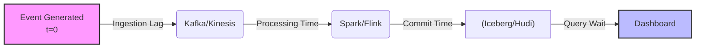
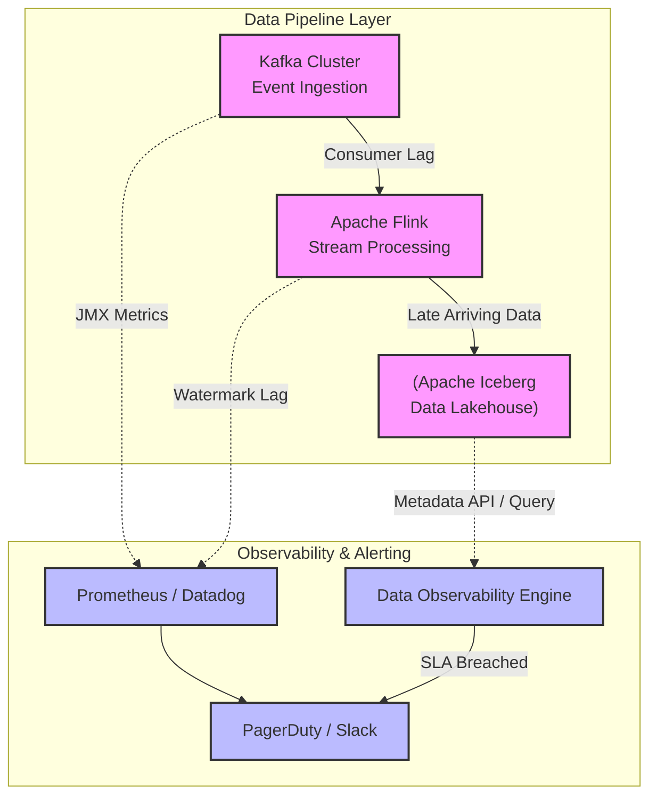

Trong kỹ thuật dữ liệu, "Right data, wrong time = wrong data". Nếu pipeline trễ vài giờ trong những hệ thống Real-time Bidding hay Fraud Detection, hậu quả có thể đo bằng hàng triệu đô la. 

**Freshness Monitoring** không chỉ là việc đặt vài cái alert trên Airflow. Ở quy mô Enterprise (như Uber hay Netflix), nó là một bài toán System Design phức tạp: Làm sao để đo lường độ trễ chính xác tới từng phút trên hàng Petabyte dữ liệu mà không làm "cháy túi" (burn compute budget) tiền hạ tầng?

---

## 1. Phân Rã Độ Trễ (Decomposing End-to-End Latency)

Khi Business User than phiền *"Dashboard số liệu cũ quá!"*, độ trễ này (End-to-end Freshness SLA) thực chất là tổng hòa của nhiều điểm nghẽn vật lý trong Data Pipeline. Để giám sát hiệu quả, một Staff Engineer phải bóc tách nó thành:

1. **Ingestion Lag (Độ trễ thu thập):** Thời gian dữ liệu nằm chờ trong Message Queue (ví dụ: `Kafka Consumer Lag`).
2. **Processing Time (Thời gian xử lý):** Thời gian hệ thống tính toán (Flink/Spark batch chạy mất bao lâu).
3. **Availability Delay (Thời gian hiển thị):** Chờ Data Warehouse (Snowflake, BigQuery) commit dữ liệu hoặc Build Caches/Materialized Views.



---

## 2. Kiến trúc Đo Lường: Metadata-based vs. Data-based Freshness

Có hai trường phái vật lý chính để tính toán dữ liệu "tươi" cỡ nào, mỗi cái mang một hệ quả (Trade-off) riêng.

### 2.1. Metadata-based Freshness (Giám sát qua Siêu Dữ Liệu)
Thay vì scan toàn bộ bảng, hệ thống gọi API vào lớp Catalog (AWS Glue, Hive Metastore) hoặc đọc thuộc tính file (S3 Object `LastModified`).

- **Cơ chế:** Đọc `information_schema.tables` hoặc metadata log của Apache Iceberg.
- **Trade-off:**
  - *Ưu điểm:* `O(1)` Time Complexity. Gần như miễn phí (Zero compute cost). Rất phù hợp để check liên tục (mỗi phút).
  - *Nhược điểm:* **False Positive rất cao.** Pipeline có thể chạy thành công, file parquet được ghi đè (Metadata cập nhật), nhưng thực tế *không có record nào được append* do lỗi upstream. Hệ thống báo xanh nhưng thực tế dữ liệu đã "ôi thiu".

### 2.2. Data-based (Query-based) Freshness
Thực thi trực tiếp SQL query để bòn rút (extract) `MAX(event_timestamp)` từ tập dữ liệu vật lý.

- **Cơ chế:** Scan cột thời gian của bảng.
- **Trade-off:**
  - *Ưu điểm:* Độ chính xác tuyệt đối (Ground Truth).
  - *Nhược điểm:* Có thể dẫn đến **Compute Cost Explosion** nếu query trên hàng tỷ dòng dữ liệu mà không cấu hình Partition Pruning.

---

## 3. Code Thực Chiến & Cấu Hình Kiến Trúc

Tuyệt đối không dùng query `SELECT MAX(time)` "chay" trên các bảng khổng lồ. Dưới đây là các kỹ thuật thực chiến:

### Kỹ thuật 1: dbt Source Freshness với Partition Filtering
Nếu bạn cấu hình dbt source freshness thông thường, dbt sẽ scan toàn bảng. Để chống OOM (Out Of Memory) hoặc tiết kiệm tiền BigQuery/Snowflake scan, bắt buộc phải dùng thuộc tính `filter` để chỉ scan phân vùng mới nhất.

```yaml
version: 2
sources:
  - name: production_kafka
    tables:
      - name: user_activity_events
        loaded_at_field: event_timestamp
        freshness:
          warn_after: {count: 15, period: minute}
          error_after: {count: 1, period: hour}
          # 🔥 KỸ THUẬT QUAN TRỌNG: Chỉ scan phân vùng của ngày hôm nay/hôm qua
          # Giảm thiểu lượng dữ liệu bị quét từ Terabytes xuống Megabytes
          filter: >
            event_timestamp >= current_date - interval '1 day'
```

### Kỹ thuật 2: Giám sát Tận Gốc (Upstream) qua Kafka Consumer Lag
Nếu đợi dữ liệu vào tới Data Warehouse mới biết trễ thì đã quá muộn. Các hệ thống như Uber chặn đứng độ trễ ngay tại Ingestion Layer bằng cách giám sát `Kafka Consumer Lag`.

Cấu hình Prometheus AlertManager:

```yaml
groups:
- name: data_platform_freshness
  rules:
  - alert: HighConsumerLag_DataIngestion
    # Tính toán Lag: Số lượng messages bị nghẽn chưa được xử lý
    expr: sum(kafka_consumergroup_lag{consumergroup="spark-clickstream-ingest"}) > 50000
    for: 5m
    labels:
      severity: page
      team: data-platform
    annotations:
      summary: "Consumer Lag bùng nổ, Pipeline Ingestion đang nghẽn"
      description: "Spark Streaming đang tiêu thụ dữ liệu chậm hơn tốc độ Produce. Có nguy cơ OOM hoặc trễ SLA. Hãy scale up executors."
```

---

## 4. Các Sự Cố Thực Tế & Khắc Phục (Troubleshooting)

### Incident 1: Late Arriving Data (Dữ liệu đến muộn)
**Triệu chứng:** Mobile App của user rớt mạng, 2 ngày sau có mạng mới đẩy event lên server. Data-based Freshness kiểm tra `MAX(event_timestamp)` thấy có event của 1 phút trước (do vừa đẩy lên), báo xanh (Pass), nhưng thực chất pipeline xử lý dữ liệu của ngày hôm nay đang bị kẹt.
**Khắc phục:** Phân biệt rạch ròi giữa **Event Time** (Giờ user bấm nút) và **Processing Time** (Giờ hệ thống Kafka/Warehouse nhận được). Luôn monitor Freshness dựa trên *Processing Time* (`created_at` từ DB, hoặc `kafka_timestamp`) kết hợp với Watermarking trong Flink.

### Incident 2: Alert Storm (Bão cảnh báo) & Alert Fatigue
**Triệu chứng:** Đặt SLA 5 phút cho một bảng Batch chạy mỗi tiếng. PagerDuty réo liên tục, Engineer tắt thông báo, hệ thống sập thật thì không ai biết.
**Khắc phục (Data Tiering):**
- **Tier 1 (Real-time ML, C-Level Dashboards):** Freshness < 15 mins. Gắn PagerDuty gọi điện trực tiếp.
- **Tier 2 (Daily Reports):** Freshness < 24h. Bắn Slack nhẹ nhàng.
- **Circuit Breakers (Cầu dao tự động):** Khi bảng Source bị trễ (SLA Miss), thay vì chạy tiếp làm sai lệch các Aggregated Tables, hệ thống Orchestrator (như Dagster, Airflow) tự động Short-circuit, chặn đứng các dbt run tiếp theo để bảo vệ Data Integrity.

### Incident 3: Tắc nghẽn Z-Ordering / Compaction
**Triệu chứng:** Bạn dùng Apache Iceberg, query `MAX()` rất nhanh lúc đầu nhờ File Metadata. Dần dần hệ thống chậm hẳn đi.
**Nguyên nhân:** Dữ liệu streaming tạo ra quá nhiều "Small files" (Small File Problem).
**Khắc phục:** Chạy tiến trình Compaction (Gom file) và Z-Ordering ngầm định kỳ (Background Job) để tối ưu hóa metadata tree của Iceberg, giữ cho query Freshness luôn đạt tốc độ `O(1)`.

---

## 5. Tổng Quan: Kiến trúc Data Observability

Mô hình dưới đây minh họa hệ thống Giám sát Độ trễ tập trung (Centralized Observability) thường thấy tại các công ty công nghệ lớn, nơi mọi thông số rải rác được quy về một nền tảng:



---

## Nguồn Tham Khảo (References)
* [Uber Engineering: Building Uber's Data Quality Platform](https://www.uber.com/en-VN/blog/data-quality-platform/)
* [Netflix TechBlog: Maestro, Netflix’s Workflow Orchestrator](https://netflixtechblog.com/maestro-netflixs-workflow-orchestrator-1147b1965908)
* [dbt Documentation: Source data freshness](https://docs.getdbt.com/docs/build/sources#snapshotting-source-data-freshness)
* *Designing Data-Intensive Applications* (Martin Kleppmann) - Chương 11: Stream Processing & Time reasoning.
