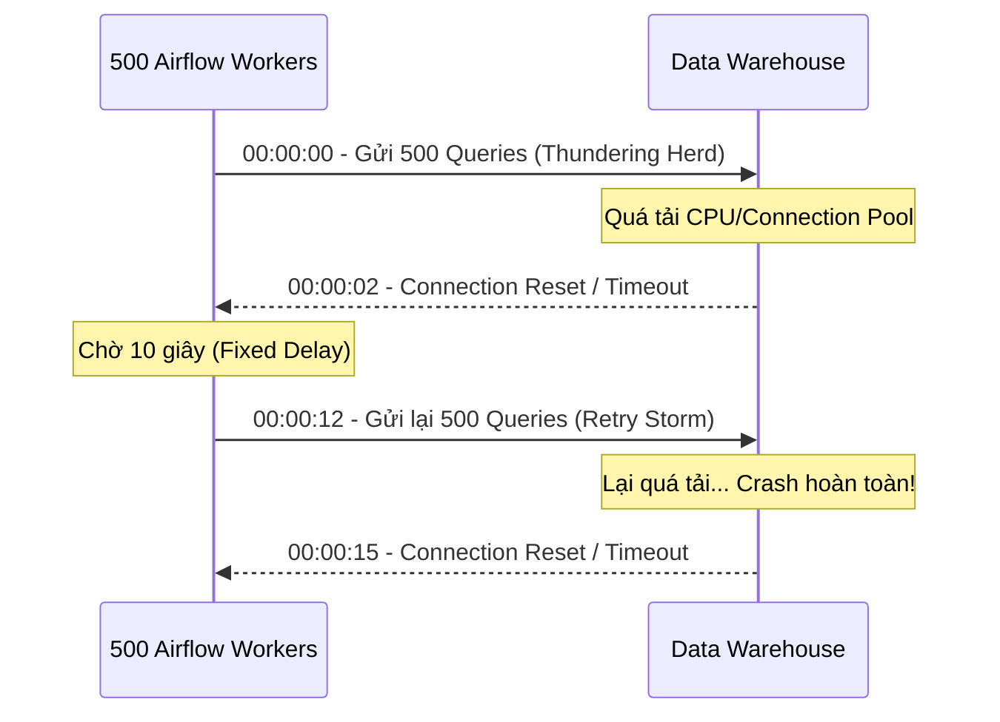
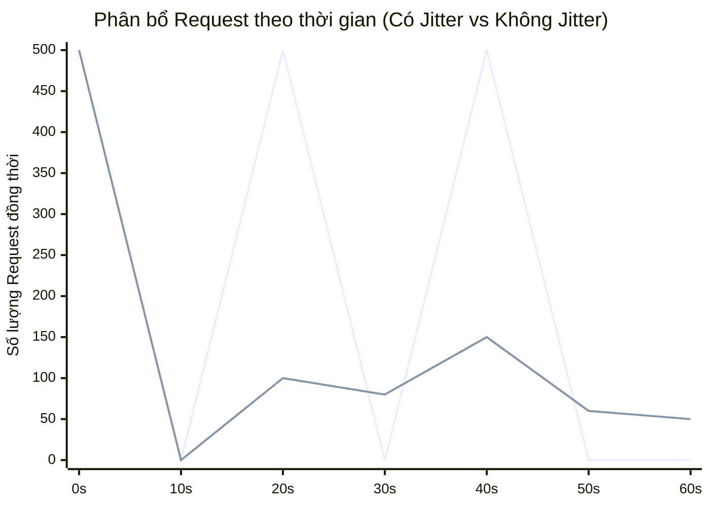

Một hệ thống dữ liệu vững chắc không phải là hệ thống không bao giờ lỗi, mà là hệ thống có khả năng tự phục hồi (self-healing) khi đối mặt với sự cố hạ tầng. Các lỗi phổ biến nhất trong distributed systems thường là lỗi tạm thời (transient errors): Network partitions, API Rate Limiting (HTTP 429), JVM Garbage Collection pauses, hay Database Lock timeout.

Nếu Data Pipeline bị *crash* ngay khi gặp một transient error, hệ thống đó được xem là mỏng manh (fragile). Giải pháp cơ bản là Retry (thử lại). Tuy nhiên, nếu cấu hình Retry không cẩn thận, bạn sẽ tự tay tạo ra một đợt tấn công từ chối dịch vụ (DDoS) vào chính hệ thống của mình.

## 1. Rủi ro Vận hành: Thundering Herd và Retry Storms

Hãy tưởng tượng một Data Pipeline gồm 500 Task instances (chạy qua Celery/Kubernetes workers) cùng query vào một Data Warehouse (như Snowflake hoặc Redshift) lúc 00:00 mỗi ngày. 

Đột nhiên, Network switch bị *blip* (mất kết nối 2 giây). Toàn bộ 500 kết nối bị rớt. 
Nếu hệ thống Orchestration được cấu hình: `retries=3, retry_delay=10s`. Sau đúng 10 giây, 500 Task này sẽ đồng loạt nã 500 kết nối mới vào Data Warehouse. Lượng connection tăng đột biến này gọi là **Thundering Herd** (Hiệu ứng bầy đàn). 

Nếu Data Warehouse không chịu nổi tải, nó lại tiếp tục văng lỗi. 500 Task lại tiếp tục chờ 10s và thử lại... Quá trình này tạo ra một vòng lặp chết chóc gọi là **Retry Storm**.



## 2. Kiến trúc Giải quyết: Exponential Backoff và Jitter

Để tránh Retry Storms, các Staff Engineer không bao giờ dùng *Fixed Delay* (chờ cố định). Thay vào đó, họ sử dụng **Exponential Backoff** kết hợp với **Jitter**.

*   **Exponential Backoff (Lùi theo cấp số nhân):** Tăng thời gian chờ sau mỗi lần thất bại ($2^c \times base\_delay$). Ví dụ: 2s, 4s, 8s, 16s... Điều này cho phép Database hoặc API có thời gian xả tải (shed load) và phục hồi.
*   **Jitter (Độ nhiễu ngẫu nhiên):** Backoff thôi là chưa đủ, vì 500 task vẫn có thể khởi động lại *cùng một lúc* ở giây thứ 2, thứ 4, thứ 8. Jitter cộng thêm một giá trị ngẫu nhiên vào thời gian chờ để dàn đều lượng requests theo trục thời gian, phá vỡ tính đồng bộ (synchronization) của Thundering Herd.

Thuật toán chuẩn (như đề xuất của AWS Architecture): 
$Sleep = \text{random\_between}(0, \min(cap, base \times 2^{attempt}))$



### Code Thực chiến: Cấu hình Airflow với Jitter

Trong Apache Airflow, tuyệt đối không cấu hình `retry_delay` cứng nhắc. Dưới đây là cách setup chuẩn Enterprise:

```python
from datetime import timedelta
from airflow import DAG
from airflow.operators.python import PythonOperator
from airflow.exceptions import AirflowFailException

default_args = {
    'owner': 'data_platform',
    'depends_on_past': False,
    'retries': 5, # Thử tối đa 5 lần
    'retry_delay': timedelta(minutes=1), # Base delay
    'retry_exponential_backoff': True, # Bật Exponential Backoff
    'max_retry_delay': timedelta(minutes=15), # Cap = 15 phút, tránh việc chờ quá lâu vi phạm SLA
}

def extract_api_data(**kwargs):
    import requests
    response = requests.get("https://api.vendor.com/v1/data")
    
    if response.status_code == 401:
        # Lỗi cố định (Permanent Error) - Sai Token. 
        # CÓ RETRY CŨNG VÔ DỤNG. Đánh sập Task ngay lập tức (Fail-Fast)
        raise AirflowFailException("Auth Error: Bỏ qua Retry. Báo động ngay!")
        
    elif response.status_code in (429, 500, 502, 503):
        # Lỗi tạm thời (Transient) -> Raise Exception thường để Airflow tự động Retry theo Jitter
        raise Exception(f"Transient Error: {response.status_code}")
    
    return response.json()

with DAG(
    'enterprise_retry_dag',
    default_args=default_args,
    schedule_interval='@hourly',
    catchup=False
) as dag:

    # Airflow tự động áp dụng thuật toán Jitter khi retry_exponential_backoff=True
    fetch_task = PythonOperator(
        task_id='extract_vendor_api',
        python_callable=extract_api_data
    )
```

## 3. SLA, SLO và SLI trong Data Engineering

Bên cạnh độ ổn định (Reliability), giá trị cốt lõi của dữ liệu nằm ở tính thời sự (Freshness). Nếu Retry quá nhiều, dữ liệu sẽ đến tay người dùng trễ, phá vỡ **SLA (Service Level Agreement - Cam kết cấp độ dịch vụ)**.

Trong DataOps, chúng ta quản trị SLA theo chuẩn SRE (Site Reliability Engineering) của Google:

*   **SLI (Service Level Indicator - Chỉ báo thực tế):** Thời điểm Pipeline hoàn thành thực tế mỗi ngày. Ví dụ: *07:45 AM, 08:15 AM*.
*   **SLO (Service Level Objective - Mục tiêu vận hành nội bộ):** Kỹ sư Data cam kết nội bộ phải đẩy dữ liệu lên Data Warehouse trước *08:00 AM* với tỷ lệ đạt 99% trong tháng.
*   **SLA (Cam kết kinh doanh):** Hợp đồng với Business Users, thường nới lỏng hơn SLO một chút (ví dụ: *08:30 AM*). Nếu dữ liệu chưa có vào lúc 08:30 AM, PagerDuty sẽ gọi điện thoại trực tiếp cho Data Engineer on-call lúc nửa đêm.

### Systemic Trade-offs: Latency vs. Reliability

Nếu API Vendor bị chập chờn liên tục suốt 2 tiếng, bạn phải chọn giữa 2 Trade-off hệ thống:

1.  **Chấp nhận hy sinh SLA (Reliability > Latency):** Cứ cấu hình Retry 50 lần, Max delay 30 phút. Đảm bảo dữ liệu chắc chắn sẽ lấy được, nhưng report của sếp có thể trễ đến trưa. 
2.  **Bảo vệ SLA (Latency > Reliability):** Chấp nhận Skip qua task bị lỗi (Continue on Error) và báo cáo dữ liệu thiếu (Stale data/Partial data). Sử dụng Dead-Letter Queue (DLQ) để lưu trữ record lỗi và xử lý lại sau.

### Quản trị SLA Misses bằng Code

Thay vì ngồi nhìn Dashboard chằm chằm, Data Engineer thiết lập các Callback tự động kích hoạt Incident Response khi vi phạm SLA (SLA Miss).

```python
from datetime import timedelta
from airflow import DAG
from airflow.operators.dummy import DummyOperator
from airflow.providers.slack.operators.slack_webhook import SlackWebhookOperator

def on_sla_miss_callback(dag, task_list, blocking_task_list, slas, blocking_tis):
    """
    Kích hoạt khi Pipeline không hoàn thành trong khoảng SLA cho phép
    """
    message = f":red_circle: *SLA MISS ALERT* :red_circle:\nDAG: `{dag.dag_id}`\nBlocking Tasks: `{blocking_task_list}`"
    
    SlackWebhookOperator(
        task_id='slack_sla_alert',
        http_conn_id='slack_connection',
        message=message
    ).execute(context={})

default_args = {
    'owner': 'data_platform',
    'sla': timedelta(hours=2), # BẮT BUỘC toàn bộ DAG phải hoàn thành trong 2 tiếng
}

with DAG(
    'critical_financial_report',
    default_args=default_args,
    start_date=datetime(2023, 1, 1),
    sla_miss_callback=on_sla_miss_callback # Tự động gọi hàm này nếu trễ SLA
) as dag:
    
    heavy_compute_task = DummyOperator(task_id='spark_aggregation')
```

## 4. Tóm tắt Tiêu chuẩn Thiết kế (Design Principles)

Để xây dựng DataOps Pipeline chuyên nghiệp (Enterprise-grade), hãy luôn nhớ 3 nguyên tắc thép:

1.  **Idempotency (Tính luỹ đẳng) là bắt buộc:** Bạn không thể an tâm dùng Retry nếu Pipeline của bạn không luỹ đẳng. Lần retry thứ 2 không được phép INSERT đúp dữ liệu của lần chạy thứ 1. Hãy luôn dùng lệnh `MERGE` (UPSERT) thay vì `INSERT`, hoặc xóa vùng dữ liệu (`DELETE` partition) trước khi chạy lại.
2.  **Fail-Fast cho Lỗi cố định:** Bắt các mã lỗi như 401 Unauthorized, 403 Forbidden, 404 Not Found, hoặc lỗi Syntax SQL và ngắt tiến trình NGAY LẬP TỨC bằng ngoại lệ `AirflowFailException`. Không lãng phí chu kỳ Retry.
3.  **Timeout Limits:** Đừng bao giờ tin tưởng vào mạng lưới. Nếu một truy vấn Database bị Deadlock, task có thể bị "treo" (Zombie Task) vô thời hạn, hút cạn Connection Pool. Luôn cài đặt `execution_timeout` cứng (ví dụ 1 giờ) ở cấp độ Operator.

## Nguồn Tham Khảo

1.  [AWS Architecture Blog - Exponential Backoff And Jitter](https://aws.amazon.com/blogs/architecture/exponential-backoff-and-jitter/)
2.  [Netflix TechBlog - Fault Tolerance in a High Volume, Distributed System](https://netflixtechblog.com/fault-tolerance-in-a-high-volume-distributed-system-91ab4faae74a)
3.  [Google SRE Book - Service Level Objectives](https://sre.google/sre-book/service-level-objectives/)
4.  [Apache Airflow Documentation - Task Retries and SLAs](https://airflow.apache.org/docs/apache-airflow/stable/core-concepts/tasks.html#retries)
