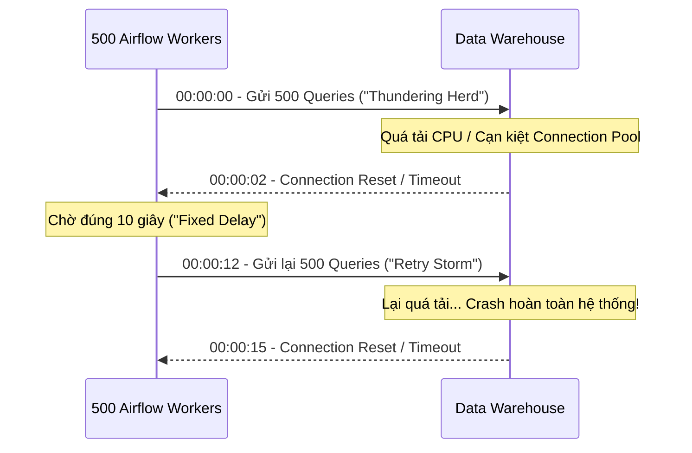
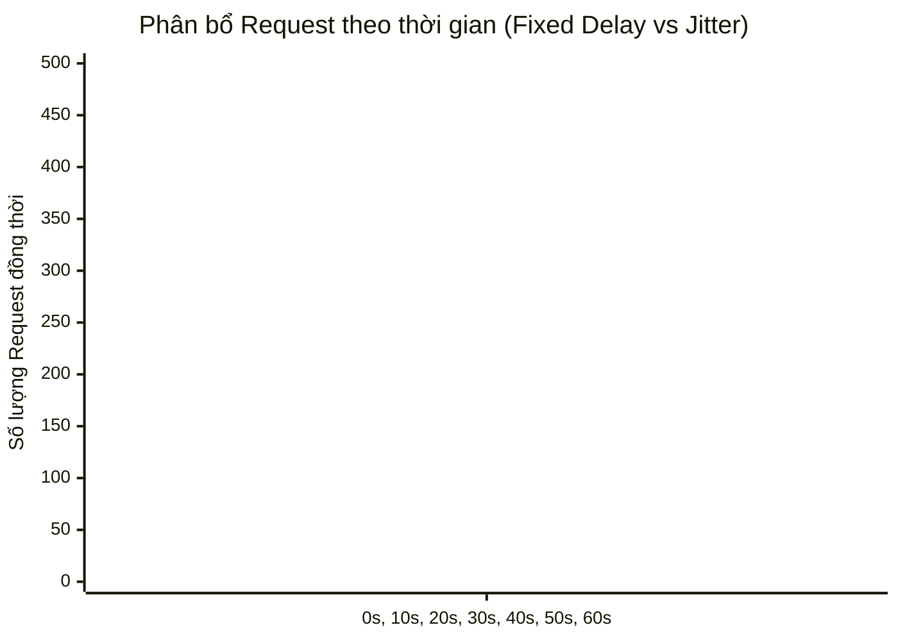

Trong môi trường Cloud-native phân tán, một hệ thống dữ liệu vững chắc (Robust) không phải là hệ thống không bao giờ xảy ra lỗi, mà là hệ thống có khả năng **Tự phục hồi (Self-healing)** khi đối mặt với sự cố. 

Các lỗi phổ biến nhất trong Data Engineering thường là **Lỗi tạm thời (Transient Errors)**: Network partitions (Rớt mạng mili-giây), API Rate Limiting (HTTP 429), Database Lock timeout, hay JVM Garbage Collection pauses. Nếu Data Pipeline bị *crash* ngay khi gặp một transient error, hệ thống đó được xem là mỏng manh (Fragile). 

Giải pháp cơ bản là **Retry (thử lại)**. Tuy nhiên, nếu cấu hình Retry một cách ngây thơ, bạn sẽ tự tay tạo ra một đợt tấn công từ chối dịch vụ (DDoS) vào chính Data Warehouse của mình.

---

## 1. Rủi ro Vận hành: Thundering Herd và Retry Storms

Hãy tưởng tượng một Data Pipeline (dùng Apache Airflow) gồm 500 Task instances chạy song song qua Kubernetes workers, cùng thực hiện truy vấn (query) vào một Data Warehouse (như Snowflake hoặc Redshift) lúc 00:00 mỗi đêm. 

Đột nhiên, Network switch bị *blip* (mất kết nối 2 giây). Toàn bộ 500 kết nối bị rớt. Hệ thống Orchestration được cấu hình ngây thơ: `retries=3, retry_delay=10s`. 

Sau đúng 10 giây, 500 Task này sẽ đồng loạt nã 500 kết nối mới vào Data Warehouse. Lượng connection tăng đột biến và đồng bộ này được gọi là **Thundering Herd (Hiệu ứng bầy đàn)**. 

Nếu Data Warehouse không chịu nổi tải, nó lại tiếp tục văng lỗi. 500 Task lại tiếp tục chờ 10s và thử lại... Quá trình này tạo ra một vòng lặp chết chóc gọi là **Retry Storm**.



---

## 2. Kiến trúc Giải quyết: Exponential Backoff và Jitter

Để tránh Retry Storms, các Staff Data Engineer không bao giờ dùng *Fixed Delay* (chờ khoảng thời gian cố định). Thay vào đó, họ sử dụng **Exponential Backoff** kết hợp với **Jitter**.

*   **Exponential Backoff (Lùi theo cấp số nhân):** Tăng thời gian chờ sau mỗi lần thất bại theo cấp số nhân ($2^c \times base\_delay$). Ví dụ lần 1 chờ 2s, lần 2 chờ 4s, lần 3 chờ 8s, 16s... Điều này cho phép Database hoặc API bên thứ 3 có thời gian xả tải (shed load) và phục hồi.
*   **Jitter (Độ nhiễu ngẫu nhiên):** Backoff thôi là chưa đủ, vì 500 task khốn khổ kia vẫn có thể khởi động lại *cùng một lúc* ở giây thứ 2, thứ 4, thứ 8. **Jitter** cộng thêm một giá trị ngẫu nhiên vào thời gian chờ để dàn đều lượng requests theo trục thời gian, phá vỡ tính đồng bộ (synchronization) của bầy đàn.

Thuật toán chuẩn (như đề xuất của AWS Architecture): 
$Sleep = \text{"random\_between"}(0, \min(cap, base \times 2^{attempt}))$



### 2.1. Code Thực chiến: Cấu hình Airflow Jitter & Fail-Fast

Trong Apache Airflow, hãy bật cờ `retry_exponential_backoff`. Tuy nhiên, với các **Lỗi Cố định (Permanent Errors)** như sai mật khẩu (HTTP 401), thiếu quyền (403), hoặc SQL Syntax error, việc Retry là hoàn toàn vô nghĩa và lãng phí tài nguyên. Hệ thống cần áp dụng nguyên tắc **Fail-Fast** (Chết ngay lập tức).

```python
from datetime import timedelta
from airflow import DAG
from airflow.operators.python import PythonOperator
from airflow.exceptions import AirflowFailException

default_args = {
    'owner': 'data_platform',
    'retries': 5, # Thử tối đa 5 lần
    'retry_delay': timedelta(minutes=1), # Base delay
    'retry_exponential_backoff': True, # Bật Exponential Backoff (Airflow tự động áp dụng Jitter)
    'max_retry_delay': timedelta(minutes=15), # Cap = 15 phút, tránh chờ quá lâu vi phạm SLA
}

def extract_api_data(**kwargs):
    import requests
    response = requests.get("https://api.vendor.com/v1/data")
    
    if response.status_code in (401, 403, 404):
        # Lỗi cố định (Permanent Error) - CÓ RETRY CŨNG VÔ DỤNG. 
        # Đánh sập Task ngay lập tức bằng AirflowFailException (Fail-Fast)
        raise AirflowFailException(f"Client Error {response.status_code}: Bỏ qua Retry. Báo động ngay!")
        
    elif response.status_code in (429, 500, 502, 503):
        # Lỗi tạm thời (Transient Error) 
        # Raise Exception thường để Airflow tự động Retry theo Jitter
        raise Exception(f"Transient Error: {response.status_code}")
    
    return response.json()
```

---

## 3. Tối ưu Hóa Sensor và Ngăn chặn Resource Exhaustion

**Sensors** trong Airflow là các operator chuyên dụng để chờ đợi một điều kiện (File xuất hiện trên S3, Partition có sẵn trong Hive). Tuy nhiên, cấu hình Sensor sai là nguyên nhân số 1 làm sập cụm Airflow.

- **Thảm họa `mode='poke'`:** Ở chế độ mặc định này, Sensor sẽ chiếm dụng hoàn toàn một Worker Slot liên tục trong suốt thời gian nó chờ đợi (có thể lên tới hàng giờ). Nếu bạn có 100 Sensors đang chờ, toàn bộ 100 slots của Worker pool bị khóa chết (Sensor Deadlock), các task khác không thể chạy.
- **Giải pháp `mode='reschedule'`:** Ở chế độ này, Sensor thức dậy, kiểm tra điều kiện. Nếu chưa đạt, nó giải phóng Worker Slot ngay lập tức cho task khác chạy, và được đưa vào trạng thái "ngủ" trong database cho đến lần kiểm tra sau. Cực kỳ tiết kiệm chi phí.
- **Tương lai: Deferrable Operators:** Từ Airflow 2.0+, hãy dùng Deferrable Operators. Tính năng này đẩy việc "chờ đợi" (waiting) sang một tiến trình Asynchronous (Triggerer), giải phóng Worker 100%, cho phép một cụm nhỏ xử lý hàng chục ngàn thao tác chờ cùng lúc.

---

## 4. Quản trị SLA, SLO và Timeouts

Bên cạnh độ ổn định (Reliability), giá trị cốt lõi của DataOps nằm ở tính thời sự (Freshness). Nếu Retry quá nhiều, dữ liệu đến tay người dùng trễ, phá vỡ **SLA (Service Level Agreement - Cam kết cấp độ dịch vụ)**.

Nhiều Data Engineer nhầm lẫn giữa SLA và Timeout. Chúng hoàn toàn khác nhau:

| Tính năng | Mục đích | Hành vi hệ thống |
| :--- | :--- | :--- |
|" **Timeout (`execution_timeout`)** "| Định nghĩa thời gian tối đa một task được phép chạy. Ngăn chặn Zombie Tasks treo vĩnh viễn. |" Nếu quá hạn, task bị **KILL (Thất bại)** và giải phóng tài nguyên. "|
| **SLA** | Định nghĩa mốc thời gian hoàn thành kỳ vọng của một DAG để phục vụ Business. |" Nếu quá hạn, task **VẪN TIẾP TỤC CHẠY**, nhưng hệ thống kích hoạt **SLA Miss Alert** (Báo động cho kỹ sư). "|

### Quản trị SLA Misses bằng Code (SRE Standard)

Thay vì ngồi nhìn Dashboard, hãy thiết lập Callback tự động kích hoạt Incident Response (Slack/PagerDuty) khi vi phạm SLA.

```python
from datetime import datetime, timedelta
from airflow import DAG
from airflow.operators.dummy import DummyOperator
from airflow.providers.slack.operators.slack_webhook import SlackWebhookOperator

def on_sla_miss_callback(dag, task_list, blocking_task_list, slas, blocking_tis):
    """Kích hoạt tự động khi Pipeline không hoàn thành trong khoảng SLA cho phép"""
    message = f":red_circle: *SLA MISS ALERT* :red_circle:\nDAG: `{dag.dag_id}`\nBlocking Tasks: `{blocking_task_list}`"
    # Call PagerDuty or Slack
    SlackWebhookOperator[
        task_id='slack_sla_alert',
        http_conn_id='slack_connection',
        message=message
    ].execute(context={})

default_args = {
    'owner': 'data_platform',
    'execution_timeout': timedelta(minutes=45), # Hard limit: Task quá 45p sẽ bị Kill
    'sla': timedelta(hours=2), # Soft limit: Cả DAG phải xong trong 2 tiếng
}

with DAG(
    'critical_financial_report',
    default_args=default_args,
    start_date=datetime(2023, 1, 1),
    sla_miss_callback=on_sla_miss_callback 
) as dag:
    heavy_compute_task = DummyOperator(task_id='spark_aggregation')
```

---

## 5. Nguyên Tắc Thép (Design Principles) cho Enterprise DataOps

1.  **Idempotency (Tính luỹ đẳng) là Bắt Buộc:** Bạn không thể an tâm dùng Retry nếu Pipeline của bạn không luỹ đẳng. Lần retry thứ 2 không được phép INSERT đúp dữ liệu của lần chạy thứ 1. Hãy luôn dùng lệnh `MERGE` (UPSERT) thay vì `INSERT`, hoặc xóa phân vùng (`DELETE partition`) trước khi ghi lại. Nếu luồng không luỹ đẳng, việc Retry sẽ làm ô nhiễm dữ liệu báo cáo tài chính.
2.  **Sử dụng Airflow Pools:** Đừng để Airflow tấn công DDoS vào hệ thống hạ nguồn. Bọc các task truy cập API Vendor hoặc Data Warehouse vào các **Airflow Pools** giới hạn (Ví dụ: pool `snowflake_query` = 20 slots). Điều này đóng vai trò như một van điều tiết (Throttle) tự nhiên.
3.  **Bảo vệ SLA (Latency > Reliability):** Đôi khi hệ thống đối tác sập suốt 3 tiếng. Thay vì Retry trong vô vọng, hãy cân nhắc chiến lược **Bỏ qua Lỗi (Continue on Error)** và đẩy dữ liệu rác vào Dead-Letter Queue (DLQ). Việc có một báo cáo thiếu 1% dữ liệu đúng giờ đôi khi giá trị hơn một báo cáo đủ 100% nhưng giao vào lúc 5h chiều.

## Nguồn Tham Khảo (References)

1.  [AWS Architecture Blog - Exponential Backoff And Jitter](https://aws.amazon.com/blogs/architecture/exponential-backoff-and-jitter/)
2.  [Apache Airflow Documentation - Task Retries and SLAs](https://airflow.apache.org/docs/apache-airflow/stable/core-concepts/tasks.html#retries)
3.  [Google SRE Book - Service Level Objectives](https://sre.google/sre-book/service-level-objectives/)
4.  [Netflix TechBlog - Fault Tolerance in a High Volume, Distributed System](https://netflixtechblog.com/fault-tolerance-in-a-high-volume-distributed-system-91ab4faae74a)
