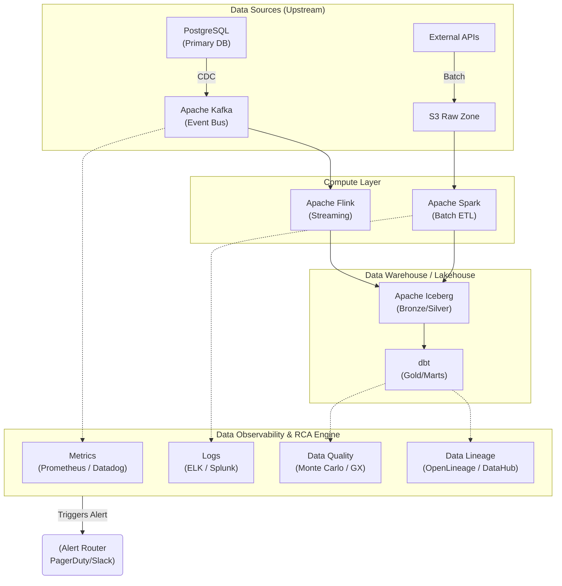

Sự cố dữ liệu (Data Incidents) không chỉ đơn thuần là việc pipeline báo đỏ (Failed) trên màn hình của Airflow hay Dagster. Trong các hệ thống phân tán phức tạp ở quy mô Petabyte, sự cố nguy hiểm nhất (và cũng gây thiệt hại tài chính lớn nhất) là khi pipeline vẫn báo xanh (Success) nhưng dữ liệu đầu ra lại sai lệch (Silent Failure). 

**Root Cause Analysis (RCA)** - Phân tích Nguyên nhân gốc rễ - trong Kỹ thuật Dữ liệu đòi hỏi một Staff Data Engineer không chỉ dừng lại ở việc vá lỗi bề mặt (chữa triệu chứng). Bạn phải truy vết xuyên qua mạng lưới Data Lineage phức tạp, đọc logs hệ thống (System Logs), và cuối cùng là thiết kế lại kiến trúc để ngăn chặn lỗi đó tái diễn.

Bài viết này đi thẳng vào các rủi ro vận hành (Operational Risks), phân tích nguyên nhân gốc rễ của các lỗi phổ biến ở tầng vật lý, và cách khắc phục bằng code thực chiến theo đúng tinh thần của DataOps.

---

## 1. Kiến trúc Giám sát & Phân giải sự cố (Observability Architecture)

Thay vì đợi Data Consumer (Data Analyst, C-Level) phàn nàn về báo cáo sai, một kiến trúc DataOps hiện đại áp dụng mô hình **Data Observability** để chủ động phát hiện bất thường (Anomaly Detection) dựa trên 5 trụ cột: *Freshness (Độ trễ), Volume (Khối lượng), Quality (Chất lượng), Schema (Cấu trúc), và Lineage (Phả hệ)*.

Dưới đây là bức tranh toàn cảnh về cách một hệ thống Data Observability thu thập tín hiệu (telemetry) để phục vụ quá trình RCA:



Khi một `Alert` (Cảnh báo) được kích hoạt, Data Engineer sẽ kết hợp **Logs** (Để tìm lỗi thực thi) và **Data Lineage** (Để truy ngược - Upstream Root Cause, hoặc truy xuôi - Downstream Impact) nhằm giới hạn khu vực bị ảnh hưởng (Blast Radius).

---

## 2. Rủi ro Vận hành (Operational Risks) & Real-world Incidents

Để trở thành một Senior/Staff Engineer, bạn phải thông thạo phương pháp **"The 5 Whys" (5 câu hỏi Tại sao)** để đào sâu vào tầng kiến trúc vật lý. Dưới đây là các kịch bản sập hệ thống kinh điển.

### Incident 1: JVM OOMKilled & Spill-to-disk trong Apache Spark

**Triệu chứng (Symptom):** Pipeline chạy ETL hàng ngày bình thường chạy mất 30 phút, hôm nay chạy hơn 2 tiếng rồi bị crash. Log báo lỗi `java.lang.OutOfMemoryError: Java heap space` hoặc container bị Kubernetes bắn hạ bằng mã lỗi `OOMKilled` (Exit code 137).

**Truy vết "The 5 Whys":**
1. **Tại sao job sập?** Do Worker Node (Executor) bị hết RAM (Out of Memory).
2. **Tại sao hết RAM dù đã cấp 16GB cho mỗi Executor?** Dữ liệu không được phân bố đều giữa các phân vùng (Data Skew). 90% dữ liệu bị dồn vào một Task duy nhất.
3. **Tại sao có Data Skew?** Do phép `JOIN` (Shuffle) sử dụng khóa `customer_id`, trong đó một khách hàng (ví dụ: một tài khoản nội bộ công ty hoặc bot crawler) chiếm tới 80% lượng giao dịch trong ngày hôm đó.
4. **Tại sao Shuffle lại làm crash hệ thống?** Khối lượng dữ liệu của một key (Bot ID) vượt quá không gian lưu trữ của bộ nhớ RAM trên một Executor. Spark cố gắng ghi tràn dữ liệu ra đĩa cứng (Spill-to-disk) để tránh OOM, nhưng máy ảo EC2 không đủ tốc độ đọc/ghi (IOPS) hoặc hết dung lượng đĩa cục bộ, dẫn đến kẹt (hang) và sập.
5. **Nguyên nhân gốc rễ (Root Cause):** Thiếu cơ chế xử lý Skewed Data (Dữ liệu bị lệch) trong cấu hình hệ thống và logic xử lý, làm cho dữ liệu của một Big Key đè chết một worker.

**Cách khắc phục triệt để (Remediation):**
Kích hoạt và cấu hình **Adaptive Query Execution (AQE)** trong Spark 3.x để Engine tự động phân chia lại các Partition bị lệch ở thời gian chạy (Runtime).

```python
# Cấu hình PySpark để tự động xử lý Skew Join thông qua AQE
spark.conf.set("spark.sql.adaptive.enabled", "true")
spark.conf.set("spark.sql.adaptive.skewJoin.enabled", "true")
# Một phân vùng lớn gấp 5 lần mức trung bình sẽ bị coi là Skewed
spark.conf.set("spark.sql.adaptive.skewJoin.skewedPartitionFactor", "5")
# Dữ liệu của partition phải lớn hơn 256MB mới kích hoạt chia nhỏ
spark.conf.set("spark.sql.adaptive.skewJoin.skewedPartitionThresholdInBytes", "256MB")

# Trong trường hợp logic cực kỳ phức tạp hoặc Spark < 3.0, 
# sử dụng kỹ thuật Salting (thêm nhiễu ngẫu nhiên vào key để phân tán tải)
from pyspark.sql.functions import rand
df_skewed = df.withColumn("salt", (rand() * 10).cast("int"))
df_joined = df_skewed.join(df_dimension, 
                           (df_skewed.customer_id == df_dimension.customer_id) & 
                           (df_skewed.salt == df_dimension.salt))
```
*Đánh đổi (Systemic Trade-off):* Bật AQE làm tăng overhead tính toán lúc runtime (CPU Cost) vì hệ thống phải liên tục đo lường kích thước (statistics) của các partition. Nhưng bù lại, hệ thống sẽ trở nên siêu ổn định (High Stability) và tỷ lệ thành công (Availability) cao hơn hẳn.

---

### Incident 2: Consumer Lag & Retry Storms trong Apache Kafka

**Triệu chứng (Symptom):** Dashboard báo cáo doanh thu Real-time bị trễ dữ liệu hơn 4 tiếng (Data Staleness). Log hệ thống không có lỗi đỏ (Error), nhưng các bảng điều khiển giám sát Kafka (Grafana) báo `Consumer Lag` tăng theo đường thẳng đứng.

**Truy vết "The 5 Whys":**
1. **Tại sao dữ liệu bị trễ?** Flink/Kafka Consumer Group không tiêu thụ được các message mới, khiến `Consumer Lag` tăng vọt.
2. **Tại sao Consumer không tiêu thụ được?** Quá trình xử lý liên tục bị gián đoạn do hệ thống không ngừng sắp xếp lại nhóm (Rebalancing).
3. **Tại sao bị Rebalance liên tục?** Tín hiệu nhịp tim (Heartbeat) không gửi về Kafka Broker kịp thời. Broker tưởng Consumer đã chết nên "đá" nó ra khỏi nhóm và phân lại partition cho Consumer khác.
4. **Tại sao Heartbeat không gửi kịp?** Consumer đọc phải một payload (bản ghi) có định dạng JSON bị hỏng, code quăng ra một lỗi ngoại lệ chưa được xử lý (Unhandled Exception), kích hoạt vòng lặp thử lại vô tận (Retry Loop), làm block luôn Thread gửi Heartbeat. Quá thời gian `max.poll.interval.ms`, Broker kích hoạt ngắt kết nối.
5. **Nguyên nhân gốc rễ (Root Cause):** Hệ thống nuốt phải một **"Poison Pill"** (Dữ liệu rác/độc hại) từ thượng nguồn, tạo ra một **Retry Storm** (Cơn bão thử lại) làm tê liệt toàn bộ luồng xử lý.

**Cách khắc phục triệt để:**
Về mặt Kiến trúc, bắt buộc phải triển khai mô hình **Dead Letter Queue (DLQ)** để hứng và đẩy các bản ghi lỗi (Poison Pill) ra một topic riêng biệt nhằm mục đích audit (phân tích) sau, tuyệt đối không làm kẹt luồng chính. 

Về mặt Cấu hình Hệ thống, tinh chỉnh Kafka Consumer để chống Rebalance:

```properties
# Kafka Consumer Properties (Tối ưu để chống Rebalance Storm)

# 1. Tăng thời gian tối đa cho phép xử lý một batch dữ liệu
# Tránh việc xử lý tốn nhiều thời gian làm mất Heartbeat
max.poll.interval.ms=300000 

# 2. Giảm số lượng records mỗi lần lấy về (Poll) 
# Để đảm bảo thời gian xử lý một batch luôn nhỏ hơn max.poll.interval.ms
max.poll.records=50

# 3. Cấu hình Heartbeat Thread độc lập (Từ Kafka 0.10.1+)
# Tăng cường khả năng chịu lỗi mạng (Network Blips) ngắn hạn
session.timeout.ms=45000
heartbeat.interval.ms=15000

# Đẩy dữ liệu lỗi vào DLQ thay vì throw Exception làm sập Consumer
```

---

## 3. Khắc phục sự cố và Kiến trúc Tự đồng nhất (Idempotency)

Khi đã làm xong RCA (tìm ra nguyên nhân và sửa code/cấu hình), bước tiếp theo là **Backfill** (chạy lại dữ liệu bù đắp cho khoảng thời gian bị hỏng). 

Lúc này, nguyên tắc tối thượng của Data Engineering xuất hiện: Nếu Data Pipeline không có tính **Idempotent** (Tự đồng nhất), việc chạy lại sẽ dẫn đến nhân đôi dữ liệu (Duplicate records) hoặc bùng nổ dữ liệu (Cartesian Explosion).
*Tính Idempotent có nghĩa là: Bạn có thể bấm nút "Rerun/Retry" 100 lần, nhưng trạng thái cuối cùng của Database vẫn chỉ như là chạy đúng 1 lần.*

**Show, Don't Tell: Đảm bảo Idempotent bằng SQL `MERGE` [SCD Type 2/Upsert]**

Dưới đây là kiến trúc chuẩn (áp dụng cho dbt, Snowflake, BigQuery, Apache Iceberg) để Upsert dữ liệu, đảm bảo dù bạn chạy bù (Backfill) bao nhiêu lần thì dữ liệu cũng không bao giờ bị duplicate.

```sql
-- Đảm bảo Idempotent khi Backfill dữ liệu vào bảng Target
MERGE INTO target_schema.fact_customer_profiles t
USING (
    -- 1. Lấy dữ liệu mới nhất trong batch để tránh xử lý bản ghi trùng (Intra-batch deduplication)
    SELECT customer_id, name, updated_at
    FROM raw_schema.source_stream
    QUALIFY ROW_NUMBER() OVER(
        PARTITION BY customer_id 
        ORDER BY updated_at DESC
    ) = 1
) s
ON t.customer_id = s.customer_id

-- 2. Cập nhật nếu bản ghi đã tồn tại NHƯNG có dữ liệu mới hơn 
-- (Tránh việc chạy Backfill dữ liệu cũ đè lên dữ liệu mới - Late Arriving Data)
WHEN MATCHED AND t.updated_at < s.updated_at THEN 
    UPDATE SET 
        t.name = s.name, 
        t.updated_at = s.updated_at

-- 3. Thêm mới nếu chưa có trong DB
WHEN NOT MATCHED THEN 
    INSERT (customer_id, name, updated_at) 
    VALUES (s.customer_id, s.name, s.updated_at);
```

### Đánh đổi hệ thống (Systemic Trade-offs)
*   **Xử lý toàn phần (Full Refresh) vs. Gia tăng (Incremental MERGE):** 
    Cấu hình `MERGE` (như code trên) tốn rất nhiều chi phí Compute (CPU) khi phải đối chiếu khóa (Key matching) so với việc xóa sạch bảng và chép lại từ đầu (`TRUNCATE` -> `INSERT`). 
    Tuy nhiên, đối với các bảng Fact chứa hàng chục Terabyte dữ liệu, việc Full Refresh mỗi lần cần chạy bù (Backfill) sẽ làm nổ tung hóa đơn Cloud (do tốn Network & Storage I/O) và kéo dài thời gian downtime lên nhiều ngày. `MERGE` là sự đánh đổi lấy Compute để tiết kiệm I/O và tối ưu MTTR (Mean Time To Recovery).
*   **Storage Cost vs. Developer Velocity:** Lưu trữ dữ liệu thô (Raw JSON/Events) vĩnh viễn ở S3 (Data Lake) giúp việc khôi phục và chạy RCA cực kỳ dễ dàng khi phát hiện logic transform sai lầm trong quá khứ. Bạn đang đánh đổi chi phí lưu trữ (Storage Cost) để mua lại thời gian và sự an tâm cho đội ngũ Kỹ sư.

## Nguồn Tham Khảo (References)
* [Databricks: What is Data Observability?][https://www.databricks.com/glossary/data-observability]
* [AWS Architecture Blog: Troubleshooting Data Workloads][https://aws.amazon.com/blogs/architecture/]
* [Uber Engineering: Data Quality at Uber][https://www.uber.com/en-VN/blog/data-quality-at-uber/]
* Sách: *Designing Data-Intensive Applications* (Martin Kleppmann) - Phân tích chuyên sâu về Idempotency và xử lý lỗi hệ thống phân tán.
* [The DataOps Manifesto](https://dataopsmanifesto.org/]
