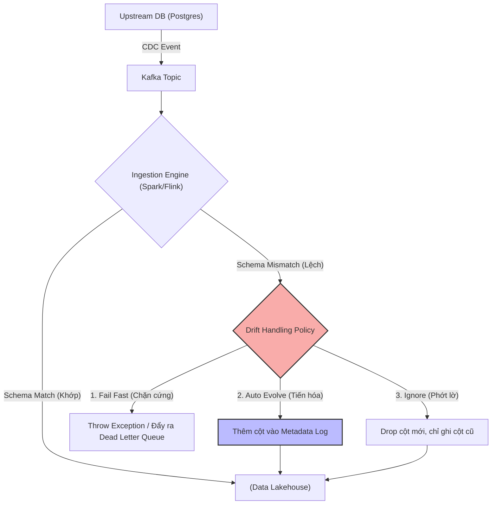
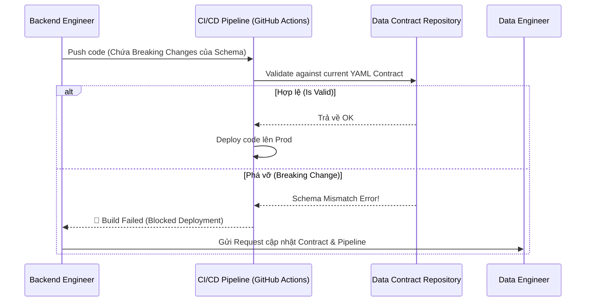

Khi Upstream Service Backend lẳng lặng thay đổi kiểu dữ liệu cột `user_id` từ `INT` sang `UUID`, hoặc drop cột `revenue` mà không báo trước, toàn bộ Downstream Data Pipelines (như Spark jobs, dbt models hoặc Flink stream) sẽ báo lỗi đỏ rực trên màn hình Grafana. Hiện tượng thay đổi cấu trúc dữ liệu không lường trước này được gọi là **Schema Drift** (Trôi dạt cấu trúc).

Trong thế giới Data Engineering ở quy mô hàng petabyte, Schema Drift không chỉ đơn thuần là bài toán "lỗi định dạng cột". Nếu không có một chiến lược kiến trúc (Architecture Strategy) vững vàng, nó sẽ gây ra **Silent Data Loss** (Mất dữ liệu thầm lặng), **Consumer Lag** (Tắc nghẽn hàng đợi trong Kafka), hoặc thảm họa **JVM OOMKilled** khi engine cố gắng ép kiểu (Type Casting) một lượng dữ liệu rác khổng lồ trên bộ nhớ.

---

## 1. Kiến trúc Thực thi Vật lý (Physical Execution) của Schema Drift

Khi hệ thống Ingestion (như Spark Structured Streaming hoặc Kafka Connect) đọc một batch/stream dữ liệu có cấu trúc khác biệt so với bảng đích (Target Table), điều gì thực sự xảy ra ở tầng vật lý?

1. **Schema Validation Phase:** Engine tải metadata lên RAM (ví dụ: File Footer của Parquet, hoặc thư mục `_delta_log` của Delta Lake).
2. **Mismatch Detection:** Engine đối chiếu cây cú pháp (AST) của schema đầu vào với metadata của bảng đích. Phát hiện sự lệch pha (Drift).
3. **Execution Fork (Phân nhánh thực thi):**
   - Nếu áp dụng **Strict Mode** (Mặc định): Job ném ngoại lệ `SchemaMismatchException`. Executor bị ngắt, dẫn đến toàn bộ Job FAILED.
   - Nếu cấu hình **Ignore**: Các cột mới (Unknown Columns) bị drop vĩnh viễn khỏi bộ nhớ, chỉ ghi các cột cũ (Silent Data Loss).
   - Nếu cấu hình **Evolve**: Engine tự động ghi chèn các câu lệnh DDL (như `ALTER TABLE ADD COLUMN`) vào Transaction Log, sau đó mới tiến hành Ghi dữ liệu (Write).



---

## 2. Các Chiến lược Thiết kế Hệ thống (Systemic Trade-offs)

Lựa chọn cách xử lý Schema Drift không có đúng hay sai tuyệt đối, nó phụ thuộc vào việc bạn đánh đổi (Trade-off) giữa **Tính ổn định (Reliability)**, **Tính khả dụng (High Availability)** và **Chi phí tính toán (Compute Cost)**.

### 2.1. Hard Enforcement (Fail Fast) với Schema Registry

**Triết lý:** "Dữ liệu sai định dạng là rác. Tuyệt đối không cho rác vào nhà".

Trong kiến trúc Streaming (đặc biệt là Kafka), **Confluent Schema Registry** thường được dùng làm Gatekeeper (Người gác cổng). Schema Registry lưu trữ các phiên bản schema (định dạng Avro, Protobuf hoặc JSON Schema) dưới dạng một Kafka topic nội bộ (ví dụ: `_schemas`). 

Khi Producer định gửi tin, nó bắt buộc phải Validate payload với Schema Registry. Nếu cấu trúc không khớp (ví dụ phá vỡ nguyên tắc Backward Compatibility - Tương thích ngược), Producer sẽ throw error, và message đó không bao giờ được Publish.

**Code thực chiến: Cấu hình Kafka Producer chặn rác từ nguồn (Python)**
```python
from confluent_kafka import SerializingProducer
from confluent_kafka.schema_registry import SchemaRegistryClient

# Khởi tạo Schema Registry Client
registry_client = SchemaRegistryClient({'url': 'http://schema-registry:8081'})

producer_conf = {
    'bootstrap.servers': 'kafka-broker:9092',
    'value.serializer': avro_serializer, # Serializer tự động móc nối với Registry
    'acks': 'all', # Đảm bảo data không bị mất
    'max.in.flight.requests.per.connection': 1 # Chống out-of-order khi retry do mạng
}
producer = SerializingProducer(producer_conf)
# Nếu cấu trúc payload không khớp với Schema trên Registry, lệnh produce() sẽ ném Exception ngay.
```

**Trade-offs (Đánh đổi):**
- **Được (Pro):** Downstream system (Spark, Flink, Data Warehouse) cực kỳ nhàn. Không bao giờ bị vỡ Pipeline do dữ liệu bẩn. Tính toàn vẹn (Integrity) đạt 100%.
- **Mất (Con):** Nếu Schema thay đổi hợp lệ nhưng chưa được đăng ký kịp thời lên Registry, luồng dữ liệu bị chặn cứng (Blocked). Trong các hệ thống High-Throughput, việc ngắt luồng liên tục có thể gây ra **Retry Storms** (Bão request thử lại) làm sập Upstream hoặc làm phình to bộ đệm Buffer của Producer.

### 2.2. Schema Evolution (Auto-merge) với Delta Lake

**Triết lý:** "Linh hoạt chấp nhận sự thay đổi để không làm gián đoạn luồng chảy của dữ liệu (High Availability)".

Các định dạng bảng mở (Open Table Formats) như Delta Lake, Apache Iceberg, hoặc Apache Hudi hỗ trợ tính năng **Schema Evolution** cực kỳ mạnh mẽ. Tính năng này thường được áp dụng ở lớp **Bronze Layer** (Raw Data) trong mô hình Medallion. Khi bật Auto-Merge, Engine (như Spark) sẽ tự động thực thi các tác vụ DDL ngầm định vào Transaction Log trước khi chèn dữ liệu mới.

**Code thực chiến: Bật Auto-Merge trong Delta Lake (PySpark)**
```python
# Cho phép tự động thêm cột mới (addNewColumns) khi đọc JSON lộn xộn
(spark.readStream
    .format("cloudFiles")
    .option("cloudFiles.format", "json")
    .option("cloudFiles.inferColumnTypes", "true")
    .option("cloudFiles.schemaEvolutionMode", "addNewColumns") # Auto Loader Magic
    .load("s3://landing-bucket/raw_data/")
    .writeStream
    .format("delta")
    .option("mergeSchema", "true") # CRITICAL: Bật cờ cho phép tiến hóa bảng đích
    .option("checkpointLocation", "s3://checkpoints/bronze_table/")
    .start("s3://lakehouse/bronze_table/")
)
```

**Trade-offs (Rủi ro Vận hành Mức độ Cao):**
- **Được:** Không bao giờ gãy Pipeline. Đảm bảo High Availability tuyệt đối. Các cột mới tự động xuất hiện ở Data Lake, lịch sử dữ liệu cũ tự động được fill `NULL` cho các cột mới.
- **Mất:**
  - **Z-Ordering Fragmentation (Phân mảnh dữ liệu):** Nếu cột mới liên tục được thêm vào và bạn dùng Z-Ordering để tối ưu truy vấn, việc có quá nhiều file rác chứa `NULL` ở cột mới làm giảm hiệu suất Data Skipping nghiêm trọng.
  - **Storage Explosion & Metadata OOM:** Lỗi kinh điển: Upstream gửi lộn một JSON payload chứa Dynamic Keys (ví dụ: `{"user_1": "data", "user_2": "data", ... "user_10000": "data"}`). Schema Evolution sẽ ngây thơ tạo ra hàng vạn cột mới vật lý. Hậu quả là Delta Log (metadata) phình to hàng Gigabyte, khiến thời gian parse Transaction Log tăng vọt, và cuối cùng bắn ra lỗi **JVM OOMKilled** cho Driver node mỗi lần khởi động Job.

### 2.3. Variant / JSON Extract (Late-binding Schema)

**Triết lý:** "Ghi nguyên gốc (Raw payload), Parsing sau cùng lúc truy vấn (Read-time/Transform-time)".

Đây là chiến lược phổ biến của mô hình ELT hiện đại với Snowflake, BigQuery. Thay vì cố gắng bóc tách ngay lúc ingest, toàn bộ payload từ API hoặc CDC được nhét thẳng vào một cột duy nhất có kiểu `VARIANT` hoặc `JSON`. Việc ép kiểu và trích xuất dữ liệu được đẩy xuống lớp Transformation (thường là dbt).

**Code thực chiến: SQL dbt Parsing JSON**
```sql
-- dbt model: stg_events.sql
WITH raw_data AS (
    SELECT raw_payload FROM {{ source('raw_schema', 'events_kafka') }}
)
SELECT
    -- Trích xuất an toàn (Safe Extraction), nếu trường không tồn tại sẽ trả về NULL
    JSON_EXTRACT_SCALAR(raw_payload, '$.event_id') AS event_id,
    CAST(JSON_EXTRACT_SCALAR(raw_payload, '$.user.age') AS INT64) AS user_age,
    
    -- Giữ nguyên payload gốc ở cột cuối để Audit khi cần
    raw_payload
FROM raw_data
```

**Trade-offs:**
- **Được:** Khả năng chịu đựng Schema Drift vô địch. 
- **Mất:** Phân tích cú pháp (Parsing) JSON Text trong truy vấn SQL tiêu tốn CPU khủng khiếp. **Compute Cost** trên Cloud Data Warehouse sẽ tăng theo cấp số nhân. Đồng thời, không thể tận dụng Columnar Compression (Snappy/ZSTD) hiệu quả cho các cột JSON lộn xộn.

---

## 3. Data Contracts (Hợp đồng dữ liệu): Ngăn chặn từ thượng nguồn (Shift-Left)

Mọi kỹ thuật ở trên (Schema Registry, Auto-Merge, JSON Extract) đều là giải pháp "chữa cháy" ở hạ nguồn (Downstream). Để giải quyết triệt để sự hỗn loạn của Schema Drift, thế giới Data Engineering đang dịch chuyển sang kiến trúc **Data Contracts**.

Data Contract là một bản cam kết cấu trúc (ví dụ file YAML) được ký kết giữa Software Engineer (Producer - Người tạo dữ liệu) và Data Engineer (Consumer - Người tiêu thụ). Nó định nghĩa cấu trúc, chất lượng, và SLA của dữ liệu.

Đặc biệt trong dbt, từ phiên bản 1.5, bạn có thể thiết lập Data Contracts trực tiếp vào file model yaml:

```yaml
# dbt_models/marts/core/users.yml
models:
  - name: dim_users
    config:
      contract:
        enforced: true # Cờ kích hoạt Contract. Fail dbt build nếu lệch schema.
    columns:
      - name: user_id
        data_type: string # Cam kết kiểu string (Ví dụ upstream đổi thành UUID)
        constraints:
          - type: not_null
      - name: email
        data_type: string
```

**Workflow CI/CD của Data Contract (Shift-Left Paradigm):**
1. Kỹ sư Backend sửa code, vô tình đổi `user_id` từ `string` sang `int`.
2. Họ Push code lên GitHub.
3. CI/CD pipeline chạy công cụ kiểm tra (như Datafold hoặc dbt compile) để đối chiếu thay đổi schema so với Data Contract hiện hành.
4. CI pipeline **BÁO LỖI (FAIL)**, chặn đứng (Block) việc Backend deploy code đó lên Production cho tới khi họ thông báo và thỏa thuận lại với team Data Engineer.



## 4. Tổng Kết Kiến Trúc

Không có một phương pháp "Silver Bullet" nào cho Schema Drift. Một Staff Engineer sẽ thiết kế hệ thống theo từng ngữ cảnh:
- Nếu dữ liệu mang tính sống còn [Financial Transactions, Billing] $\rightarrow$ Dùng **Fail Fast / Schema Registry** hoặc **dbt Contracts**.
- Nếu dữ liệu là Log/Event Analytics và cần tính sẵn sàng cao $\rightarrow$ Lớp Bronze dùng **Delta Schema Evolution**.
- Nếu dữ liệu cực kỳ phi cấu trúc (NoSQL dump, Webhook) $\rightarrow$ Nhét vào cột **Variant / JSON**.
- **Tối thượng nhất:** Áp dụng nguyên lý Shift-Left, bắt Backend Team phải tuân thủ **Data Contracts** ngay tại CI/CD của họ.

## 5. Nguồn Tham Khảo (References)

* [Delta Lake: Schema Evolution and Enforcement][https://docs.delta.io/latest/delta-batch.html#update-table-schema]
* [dbt Documentation: Model Contracts (Enforcing data shapes]][https://docs.getdbt.com/docs/collaborate/govern/model-contracts]
* [Confluent Schema Registry Overview & Compatibility Modes][https://docs.confluent.io/platform/current/schema-registry/]
* *Designing Data-Intensive Applications* - Martin Kleppmann (Chapter 4: Encoding and Evolution - Đọc để hiểu về Backward/Forward Compatibility).
* [Data Contracts Architecture - Chad Sanderson](https://dataproducts.substack.com/]
