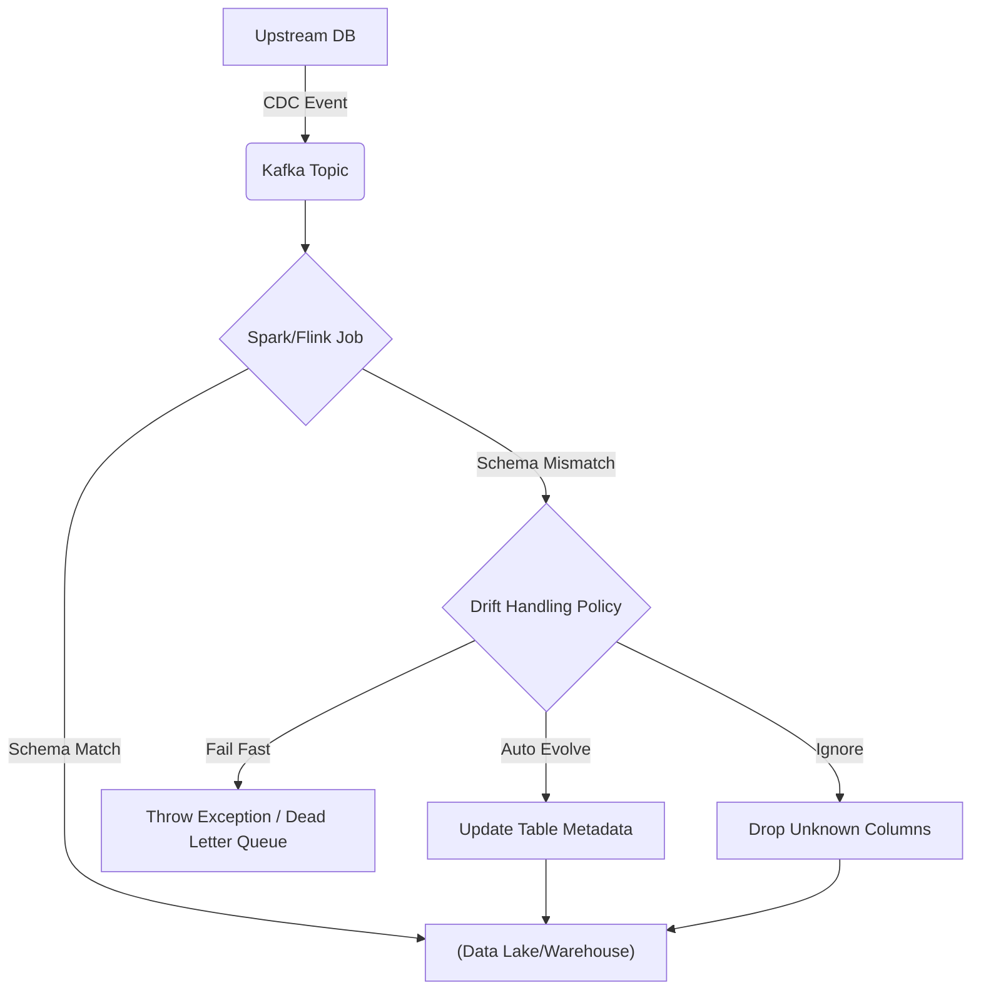
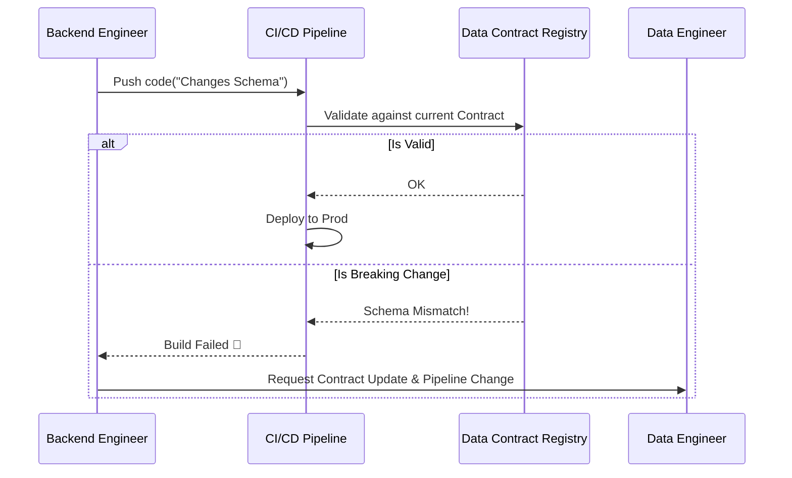

Khi upstream service thay đổi kiểu dữ liệu cột `user_id` từ `INT` sang `UUID`, hoặc drop cột `revenue` mà không báo trước, downstream data pipelines (như Spark jobs hoặc ELT syncs) sẽ báo lỗi đỏ rực. Hiện tượng thay đổi cấu trúc dữ liệu không lường trước này gọi là **Schema Drift**.

Schema Drift không chỉ đơn thuần là bài toán "lỗi định dạng cột". Ở quy mô lớn, nó gây ra **Silent Data Loss** (mất dữ liệu thầm lặng), **Consumer Lag** (độ trễ thông điệp trong Kafka), hoặc **JVM OOMKilled** khi engine cố gắng ép kiểu (type casting) một lượng dữ liệu lớn không thành công.

---

## Kiến trúc Thực thi Vật lý (Physical Execution) của Schema Drift

Khi hệ thống ingest data (Ingestion Layer) đọc một batch/stream chứa schema khác biệt so với bảng đích (Target Table), điều gì xảy ra ở tầng vật lý?

1. **Schema Validation Phase:** Engine đọc metadata (như Header của Parquet hoặc Metadata API của Delta/Iceberg).
2. **Mismatch Detection:** Engine so sánh schema của batch/stream với metadata của bảng đích.
3. **Execution Fork:**
   - Nếu không có cơ chế xử lý (Default): Job throws exception. Executor bị ngắt, dẫn đến Job Failed.
   - Nếu cấu hình "Ignore": Dữ liệu mới bị drop mất.
   - Nếu cấu hình "Evolve": Cập nhật metadata, tiến hành Ghi (Write).



---

## Các Chiến lược Thiết kế Hệ thống (Systemic Trade-offs)

Lựa chọn cách xử lý Schema Drift phụ thuộc vào việc bạn đánh đổi giữa **Tính ổn định (Reliability)**, **Tính khả dụng (Availability)** và **Chi phí tính toán (Compute Cost)**.

### 1. Hard Enforcement (Fail Fast) với Schema Registry

Triết lý: "Dữ liệu sai định dạng tuyệt đối không được vào hệ thống".

Trong kiến trúc Streaming, **Confluent Schema Registry** thường được dùng làm Gatekeeper. Schema Registry lưu trữ các phiên bản schema (Avro, Protobuf) dưới dạng một Kafka topic nội bộ (ví dụ: `_schemas`). 

Khi Producer định gửi tin, nó phải validate với Schema Registry. Nếu không khớp (ví dụ phá vỡ nguyên tắc Backward Compatibility), Producer sẽ throw error và message không được publish.

**Code thực chiến: Cấu hình Kafka Producer với Schema Registry**
```python
from confluent_kafka import SerializingProducer
from confluent_kafka.schema_registry import SchemaRegistryClient

registry_client = SchemaRegistryClient({'url': 'http://schema-registry:8081'})

producer_conf = {
    'bootstrap.servers': 'kafka-broker:9092',
    'value.serializer': avro_serializer,
    'acks': 'all', # Đảm bảo data không bị mất
    'max.in.flight.requests.per.connection': 1 # Chống out-of-order khi retry
}
producer = SerializingProducer(producer_conf)
```

**Trade-offs:**
- **Được:** Downstream system (Consumer, Data Warehouse) không bao giờ bị vỡ do dữ liệu bẩn.
- **Mất:** Nếu schema thay đổi hợp lệ nhưng chưa được đăng ký, luồng dữ liệu bị chặn cứng (Blocked). Trong các hệ thống high-throughput, việc ngắt luồng có thể gây ra **Retry Storms** (bão request thử lại) ở upstream hoặc làm đầy buffer của Kafka.

### 2. Schema Evolution (Auto-merge) với Lakehouse

Triết lý: "Linh hoạt chấp nhận sự thay đổi để không làm gián đoạn luồng dữ liệu".

Các định dạng bảng mở (Open Table Formats) như Delta Lake, Apache Iceberg, hoặc Apache Hudi hỗ trợ **Schema Evolution**. Khi bật tính năng này, engine (như Spark) sẽ tự động thực thi các tác vụ DDL (như `ALTER TABLE ADD COLUMN`) vào Transaction Log của bảng trước khi chèn dữ liệu mới.

**Code thực chiến: Bật Auto-Merge trong Delta Lake**
```python
# Cho phép tự động thêm cột mới hoặc upcast (nâng kiểu dữ liệu, ví dụ INT -> DOUBLE)
(spark.readStream
    .format("cloudFiles")
    .option("cloudFiles.format", "json")
    .option("cloudFiles.inferColumnTypes", "true")
    .option("cloudFiles.schemaEvolutionMode", "addNewColumns") # Auto Loader
    .load("s3://landing-bucket/raw_data/")
    .writeStream
    .format("delta")
    .option("mergeSchema", "true") # Critical configuration
    .option("checkpointLocation", "s3://checkpoints/bronze_table/")
    .start("s3://lakehouse/bronze_table/")
)
```

**Trade-offs (Rủi ro Vận hành):**
- **Được:** Đảm bảo **High Availability** cho Data Pipeline. Các cột mới tự động xuất hiện ở Data Warehouse, lịch sử dữ liệu cũ sẽ được fill `NULL` cho các cột mới.
- **Mất:**
  - **Z-Ordering Fragmentation:** Nếu cột mới liên tục được thêm vào và bạn dùng Z-Ordering để tối ưu truy vấn, việc có quá nhiều file chứa `NULL` ở cột mới làm giảm hiệu suất data skipping.
  - **Storage Explosion & Metadata OOM:** Đôi khi upstream gửi lộn một JSON payload rác (ví dụ: dynamic keys như `{"user_1": "data", "user_2": "data"}`). Schema Evolution sẽ tạo ra hàng vạn cột mới, làm phình to Delta Log (metadata), khiến thời gian parse Transaction Log tăng vọt và có thể gây **JVM OOMKilled** cho Driver node.

### 3. Variant / JSON Extract (Late-binding Schema)

Triết lý: "Ghi nguyên gốc (Raw), parse sau cùng (Read-time/Transform-time)".

Đây là chiến lược phổ biến của mô hình ELT hiện đại với Snowflake, BigQuery. Toàn bộ payload từ API hoặc NoSQL được đẩy vào một cột duy nhất có kiểu `VARIANT` hoặc `JSON`. Việc ép kiểu và trích xuất dữ liệu được đẩy xuống dbt.

**Code thực chiến: SQL dbt Parsing JSON**
```sql
-- dbt model: stg_events.sql
WITH raw_data AS (
    SELECT raw_payload FROM {{ source('raw_schema', 'events_kafka') }}
)
SELECT
    -- Trích xuất an toàn, nếu trường không tồn tại sẽ trả về NULL
    JSON_EXTRACT_SCALAR(raw_payload, '$.event_id') AS event_id,
    CAST(JSON_EXTRACT_SCALAR(raw_payload, '$.user.age') AS INT64) AS user_age,
    -- Giữ nguyên payload gốc để audit
    raw_payload
FROM raw_data
```

**Trade-offs:**
- **Được:** Khả năng chịu đựng Schema Drift vô địch. Không bao giờ gãy Ingestion pipeline.
- **Mất:** 
  - **Compute Cost:** Phân tích cú pháp (Parsing) JSON trong truy vấn SQL tiêu tốn rất nhiều CPU. Chi phí scan (Compute Cost) tăng mạnh.
  - Không thể sử dụng các tối ưu hóa lưu trữ cột (Columnar Compression) hiệu quả trên cột JSON như khi chia thành các cột Parquet độc lập.

---

## Data Contracts (Hợp đồng dữ liệu): Ngăn chặn từ thượng nguồn (Shift-Left)

Mọi kỹ thuật ở trên đều là giải pháp "chữa cháy" ở hạ nguồn. Để giải quyết triệt để Schema Drift, chúng ta cần chuyển đổi quy trình với **Data Contracts**.

Data Contract là một bản cam kết (ví dụ file YAML) giữa Software Engineer (Producer) và Data Engineer (Consumer). Nó định nghĩa cấu trúc, chất lượng và SLA của dữ liệu sẽ được đẩy đi.

```yaml
# data_contract_users.yaml
dataset: users_profile
version: "1.2.0"
owner: squad-auth
schema:
  - name: user_id
    type: string
    description: "UUID của user"
    primary_key: true
  - name: email
    type: string
    pii: true
  - name: age
    type: int
    minimum: 0
    maximum: 120
```

**Workflow CI/CD của Data Contract:**
1. Kỹ sư Backend sửa code, vô tình đổi `user_id` từ `string` sang `int`.
2. Họ commit code.
3. CI/CD pipeline chạy công cụ kiểm tra (như Datafold hoặc Terraform) để đối chiếu thay đổi schema so với Data Contract `data_contract_users.yaml`.
4. CI pipeline **FAIL**, chặn không cho Backend deploy lên Production cho tới khi thỏa thuận lại với Data Engineer.



## Tổng kết

Không có một phương pháp "Silver Bullet" nào cho Schema Drift. 
- Nếu dữ liệu mang tính sống còn (Financial Transactions) -> **Fail Fast / Schema Registry**.
- Nếu dữ liệu là Log/Event Analytics và cần tính sẵn sàng cao -> **Schema Evolution**.
- Nếu dữ liệu phi cấu trúc, thay đổi liên tục -> **Variant / JSON**.
- Tối thượng nhất là dịch chuyển trách nhiệm về thượng nguồn thông qua **Data Contracts**.

## Nguồn Tham Khảo (References)
* [Delta Lake: Schema Evolution and Enforcement](https://docs.delta.io/latest/delta-batch.html#update-table-schema)
* [Confluent Schema Registry Overview](https://docs.confluent.io/platform/current/schema-registry/index.html)
* *Designing Data-Intensive Applications* - Martin Kleppmann (Chapter 4: Encoding and Evolution)
* [Data Contracts - Chad Sanderson (Substack)](https://dataproducts.substack.com/p/the-architecture-of-data-contracts)
