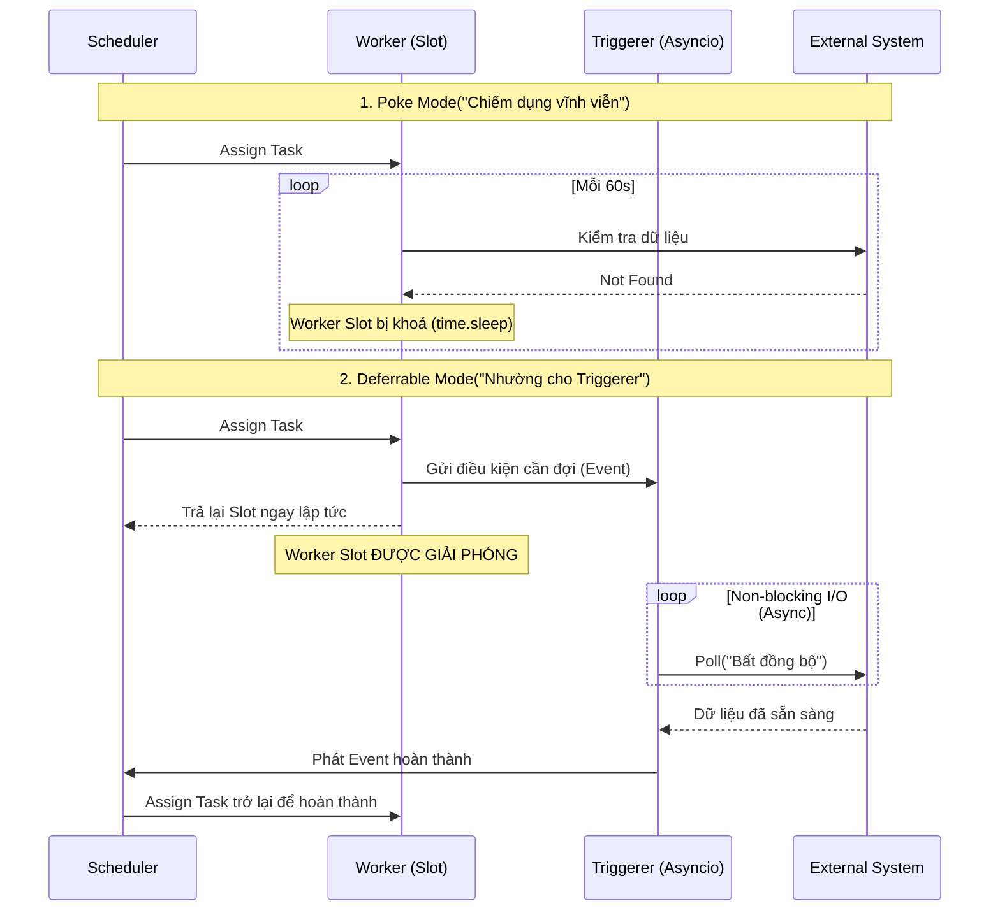
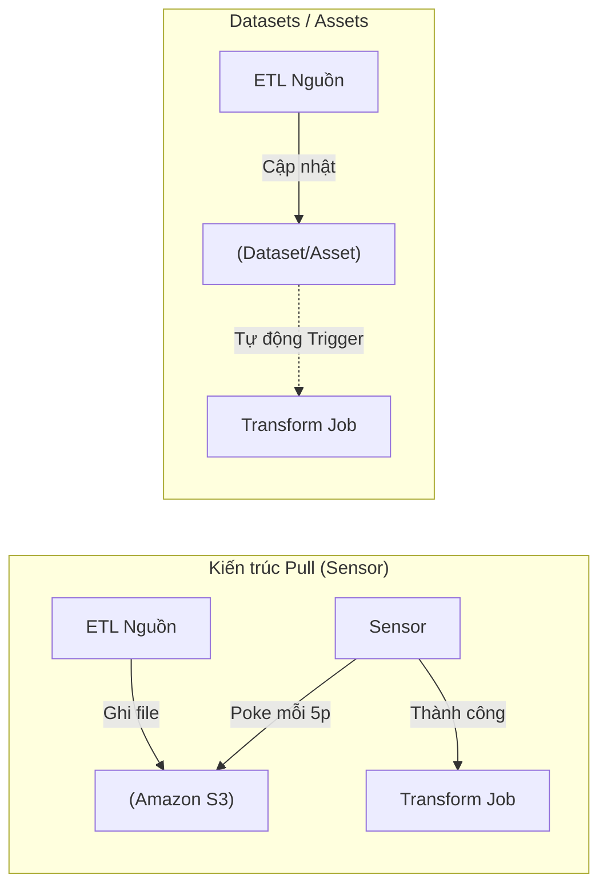

Sensors (Cảm biến) trong Apache Airflow (và các bộ Orchestrator tương tự) là loại Task đặc biệt chuyên làm nhiệm vụ **Polling** (Nằm chờ và thăm dò). Thay vì thực thi mã nguồn xử lý tính toán nặng nề, Sensor liên tục "hỏi" hệ thống bên ngoài: *"Dữ liệu đã tới chưa? Job upstream chạy xong chưa?"*. Ngay khi điều kiện thỏa mãn, Sensor mới cấp quyền cho pipeline đi tiếp.

Tuy nhiên, đằng sau khái niệm đơn giản này là những rủi ro cực lớn về phân bổ tài nguyên. Một Data Engineer thiếu kinh nghiệm có thể dễ dàng đánh sập toàn bộ hệ thống bằng việc đặt sai một cấu hình `poke_interval`.

---

## 1. Kiến trúc Thực thi Vật lý (Physical Execution of Sensors)

Việc Sensor liên tục kiểm tra trạng thái sẽ tiêu tốn tài nguyên thiết yếu nhất của Airflow: **Worker Slots** (Số lượng luồng/tiến trình tối đa được phép chạy đồng thời). Airflow hỗ trợ 3 mô hình kiến trúc thực thi Sensor:

### Mô hình 1: The "Poke" Mode (Chế độ mặc định)
- **Cơ chế:** Khi Scheduler đẩy Sensor vào Worker, Sensor sẽ giữ **vĩnh viễn** Worker Slot đó. Giữa các lần kiểm tra (`poke_interval`), tiến trình Worker sẽ gọi `time.sleep()`. 
- **Trade-off:**
  - *Ưu điểm:* Độ trễ (Latency) cực thấp, đáp ứng gần như tức thời khi dữ liệu xuất hiện.
  - *Nhược điểm:* **Lãng phí RAM/CPU khủng khiếp.** Nếu hệ thống của bạn có 50 Worker Slots, và 50 DAGs cùng chạy Sensor chờ file trong 3 tiếng, hệ thống sẽ bị **tê liệt hoàn toàn** (Starvation).
- **Khi nào dùng:** Chỉ dùng khi `poke_interval` rất nhỏ (vài giây) VÀ thời gian chờ dự kiến dưới 1-2 phút.

### Mô hình 2: The "Reschedule" Mode 
- **Cơ chế:** Sensor khởi chạy trong Worker, kiểm tra điều kiện. Nếu sai, nó ném ngoại lệ `AirflowRescheduleException`, **giải phóng ngay lập tức Worker Slot** và báo với Scheduler: *"Hãy xếp hàng tôi vào chạy lại sau 5 phút nữa"*.
- **Trade-off:**
  - *Ưu điểm:* Tiết kiệm Worker Slots tối đa. 1000 Sensors đang chờ cũng không làm ngẽn Worker.
  - *Nhược điểm:* **Tăng tải cho Database và Scheduler.** Mỗi lần Sensor thức dậy, Scheduler phải ghi chép lại DB, cấp slot mới, rồi Sensor lại tự huỷ. Việc tái khởi động liên tục tạo ra Network & DB Overhead.
- **Khi nào dùng:** Khi thời gian chờ dài (hàng giờ) và tần suất kiểm tra thưa (mỗi 5-10 phút).

### Mô hình 3: Deferrable Operators (Async Triggerer)
Từ Airflow 2.2, Deferrable Operators áp dụng mô hình I/O Non-blocking (Bất đồng bộ - Asyncio). Airflow giới thiệu một thành phần mới: **Triggerer**.

- **Cơ chế:** Worker chạy Sensor, đóng gói điều kiện cần chờ thành một `Trigger` và ném sang máy chủ Triggerer. Worker Slot được giải phóng lập tức. Triggerer sử dụng 1 luồng (single thread) duy nhất để quản lý hàng vạn `Trigger` thông qua `asyncio`. Khi sự kiện xảy ra, Triggerer đẩy tín hiệu về Scheduler để phục hồi task trở lại Worker.



---

## 2. Kiến trúc Event-Driven với AWS EventBridge / PubSub

Việc polling (dù là bất đồng bộ của Triggerer) vẫn tạo ra traffic dư thừa đến các hệ thống external. Để xây dựng hệ thống **Event-Driven Orchestration** thật sự hiệu quả (đặc biệt trong Airflow 3.0), ta chuyển sang mô hình Push từ các hệ thống đám mây.

**Kiến trúc:**
1. **Event Producer:** Hệ thống external sinh ra sự kiện (VD: File đáp xuống S3). S3 gửi thông báo qua AWS EventBridge (hoặc SNS).
2. **Event Router (EventBridge):** Nhận sự kiện từ S3 và định tuyến (route) trực tiếp vào một Amazon SQS Queue (hoặc GCP Pub/Sub Topic).
3. **Airflow Triggerer (SqsSensor deferrable=True):** Nằm chờ thụ động (listen) vào SQS Queue thông qua Deferrable Operator. Khi thông báo "đáp" vào hàng đợi SQS, Airflow bắt được sự kiện ngay lập tức, không lãng phí chu kỳ polling S3.

**Ví dụ cấu hình Python DAG (AWS SQS Deferrable Sensor):**
```python
from airflow.providers.amazon.aws.sensors.sqs import SqsSensor
from datetime import datetime
from airflow import DAG

with DAG('event_driven_pipeline', start_date=datetime(2026, 1, 1), schedule_interval=None) as dag:
    # Sensor nằm chờ SQS Queue mà không chiếm Worker Slot
    wait_for_s3_event = SqsSensor(
        task_id='wait_for_sqs_message',
        sqs_queue='my-eventbridge-queue',
        deferrable=True,  # Giải phóng worker, giao việc cho Triggerer
        max_messages=1,
        wait_time_seconds=20 # Long polling SQS
    )
```
Kiến trúc này **Decoupling (Tách rời)** được nguồn phát sinh sự kiện (AWS S3/EventBridge) và hệ thống orchestration (Airflow), giúp hệ thống mở rộng (Scale) vô hạn.

---

## 3. Rủi ro Vận hành (Operational Risks)

### Sự cố kinh điển: Sensor Deadlock (Worker Starvation)
**Kịch bản:** Ngày 1 đầu tháng, 100 DAGs báo cáo tài chính đồng loạt chạy vào lúc 12:00 AM. Mỗi DAG có một `S3KeySensor` ở chế độ `poke` (mặc định) để đợi file từ đối tác. Đối tác thông báo 03:00 AM mới có file.
- **Hậu quả:** 100 Sensors chiếm dụng sạch sẽ 100 Worker Slots của hệ thống. Các DAGs quan trọng khác (không dùng Sensor) lẽ ra chỉ mất 5 phút để chạy cũng bị kẹt lại ở trạng thái `Queued` vì không còn Worker Slot. Toàn bộ nền tảng dữ liệu "đóng băng" suốt 3 tiếng dù CPU của Worker vẫn đang báo 0% utilization (do các tiến trình đang ngủ).

**Cách khắc phục (Code Thực chiến):**
1. **Chuyển sang Deferrable / Reschedule.**
2. **Tạo Sensor Pool riêng:** Cấu hình Airflow Pool riêng biệt cho Sensor để giới hạn "bán kính sát thương".

```python
from airflow.providers.amazon.aws.sensors.s3 import S3KeySensor

# ❌ BAD PRACTICE: Gây Deadlock hệ thống
wait_for_data_bad = S3KeySensor(
    task_id="wait_for_data_bad",
    bucket_key="s3://datalake/raw/sales/{{ ds }}/*.csv",
    mode="poke",                # Chiếm giữ Worker vĩnh viễn
    poke_interval=10,           # Spam S3 API mỗi 10 giây
    timeout=60 * 60 * 24        # Chờ 24 tiếng (Default Airflow lên tới 7 ngày!)
)

# ✅ GOOD PRACTICE: Chống Deadlock với Deferrable
wait_for_data_good = S3KeySensor(
    task_id="wait_for_data_good",
    bucket_key="s3://datalake/raw/sales/{{ ds }}/*.csv",
    mode="reschedule",          # Lựa chọn fallback an toàn nếu không có Triggerer
    deferrable=True,            # Tối ưu hoá Async bằng Triggerer
    poke_interval=300,          # Kiểm tra mỗi 5 phút
    timeout=60 * 60 * 2,        # Time-to-Live tối đa 2 tiếng
    soft_fail=True,             # Đổi thành SKIPPED thay vì FAILED
    pool="sensor_pool"          # Cách ly tài nguyên, không giành giật với ETL Pool
)
```

### Hiện tượng False Alarm Alerting
Sensor mặc định sẽ bị đánh dấu `FAILED` khi hết thời gian `timeout`, kéo theo chuỗi hệ luỵ là kích hoạt PagerDuty đánh thức On-call Engineer lúc 3 giờ sáng. Đôi khi nguồn cấp dữ liệu không có cập nhật trong ngày là chuyện bình thường. Bằng cách gán `soft_fail=True`, Sensor sẽ chuyển sang `SKIPPED`, giúp Pipeline bỏ qua nhẹ nhàng mà không tạo "báo động giả".

---

## 4. Sự chuyển dịch Kiến trúc: Từ Pull (Sensor) sang Push (Event-driven)

Với sự ra đời của **Data-aware Scheduling (Airflow Datasets)** từ bản 2.4 và tiến lên **Asset-Aware Scheduling** trong Airflow 3.0, kiến trúc Data Engineering đang dịch chuyển sang **Event-driven (Push)**. 



Trong mô hình Datasets/Assets, Job A sau khi chạy xong sẽ phát đi một tín hiệu cập nhật Logical Dataset. Job B khai báo phụ thuộc vào Dataset này sẽ **tự động được kích hoạt** bởi Scheduler. Bỏ qua hoàn toàn chi phí Polling và giải quyết triệt để Sensor Deadlock.

---

## Nguồn Tham Khảo
* [Apache Airflow Concepts - Sensors (Official Docs)](https://airflow.apache.org/docs/apache-airflow/stable/core-concepts/sensors.html)
* [Deferrable Operators & Triggers (Airflow Docs)](https://airflow.apache.org/docs/apache-airflow/stable/authoring-and-scheduling/deferring.html)
* [Astronomer: Event-Driven Architecture with Airflow & AWS EventBridge](https://docs.astronomer.io/)
* [Data-aware Scheduling - Airflow Datasets](https://airflow.apache.org/docs/apache-airflow/stable/authoring-and-scheduling/datasets.html)
