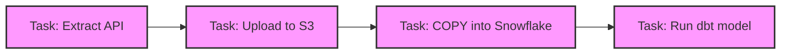
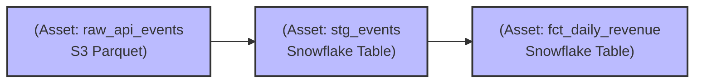

**Software-Defined Assets (SDA)** đánh dấu một sự dịch chuyển mô hình (paradigm shift) từ **Task-based Orchestration** sang **Asset-based Orchestration**. Được thiết kế và phổ biến bởi [Dagster](https://dagster.io/), SDA chuyển trọng tâm của Data Engineer từ việc định nghĩa "Hệ thống phải chạy những hành động (Tasks) gì?" sang "Hệ thống cần tạo ra những tài sản dữ liệu (Assets) nào?".

Trong kiến trúc SDA, một Data Asset (ví dụ: một bảng trong Snowflake, một file Parquet trên S3, hay một ML Model) trở thành "công dân hạng nhất" (first-class citizen). Mã nguồn (Code) được dùng để định nghĩa Asset, bao gồm cả logic tính toán (Compute Function) và siêu dữ liệu (Metadata, Dependencies, I/O Management).

---

## 1. Kiến trúc Thực thi (Physical Execution): Task-based vs. Asset-based

Để hiểu rõ thiết kế hệ thống của SDA, ta cần đặt nó lên bàn cân với mô hình truyền thống (Airflow, Luigi).

### 1.1. Imperative (Task-based) 
Trong mô hình này, bạn viết các đoạn mã **mệnh lệnh (imperative)** để chỉ định một chuỗi các thao tác.



* **Vấn đề:** Orchestrator (Airflow) chỉ giám sát được state của **Task** (Success, Failed, Retrying). Nó hoàn toàn "mù" về **Data**. Khi Task `Run dbt model` thành công, Airflow không biết bảng nào vừa được cập nhật, dung lượng bao nhiêu, có bao nhiêu bản ghi bị null. Việc Debugging và Data Lineage phụ thuộc vào các công cụ bên ngoài (ví dụ: DataHub, dbt docs).

### 1.2. Declarative (Asset-based / SDA)
Thay vì ra lệnh, bạn **khai báo (declarative)** các trạng thái mong muốn của dữ liệu.



* **Bản chất hệ thống:** Orchestrator lúc này tự suy luận (infer) đồ thị thực thi (Execution Graph) dựa trên các dependencies được khai báo giữa các Assets. Dagster sẽ tự tạo ra kế hoạch để "vật chất hóa" (materialize) các tài sản này. Data Lineage và Observability là tính năng mặc định (out-of-the-box).

---

## 2. Decoupling Compute & Storage (I/O Managers)

Một trong những thiết kế đắt giá nhất của SDA là tách bạch hoàn toàn Logic tính toán (Compute) và Cơ chế đọc/ghi vật lý (I/O Manager). 

Trong hệ thống cũ, code của bạn bị "hardcode" với nền tảng: `df.to_sql('fct_orders', con=snowflake_conn)`. Nếu muốn chạy Unit Test ở local, bạn phải mock Snowflake connection hoặc dựng Docker DB giả lập.

SDA giải quyết bằng **I/O Managers**:

```python
from dagster import asset, AssetExecutionContext, DailyPartitionsDefinition
import pandas as pd

daily_partitions = DailyPartitionsDefinition(start_date="2026-01-01")

@asset(
    partitions_def=daily_partitions,
    io_manager_key="warehouse_io_manager",
    compute_kind="python"
)
def cleaned_transactions(context: AssetExecutionContext, raw_transactions: pd.DataFrame) -> pd.DataFrame:
    """
    Asset này không quan tâm raw_transactions đến từ đâu (S3 hay Postgres), 
    cũng không quan tâm output sẽ được ghi đi đâu. 
    Việc đó do 'warehouse_io_manager' quyết định tại thời điểm Runtime.
    """
    partition_date_str = context.partition_key
    
    # 1. Filter only valid transactions
    df = raw_transactions[raw_transactions['amount'] > 0].copy()
    
    # 2. Add partition metadata
    df['processed_date'] = partition_date_str
    
    return df
```

Nhờ thiết kế này, ở môi trường `local`, `warehouse_io_manager` có thể là một `LocalFilesystemIOManager` (ghi ra file pickle/parquet trên máy), còn ở `production`, nó được trỏ tới `SnowflakeIOManager`. Mọi logic DataFrame có thể được **Unit Test 100% in-memory**.

---

## 3. Rủi ro Vận hành (Operational Risks) & Troubleshooting

SDA mang lại kiến trúc gọn gàng, nhưng cũng tiềm ẩn các rủi ro hệ thống ở quy mô lớn.

### 3.1. I/O Manager OOMKilled (Out of Memory)
* **Triệu chứng:** Container chạy asset bị hệ thống tắt (OOMKilled - Exit Code 137).
* **Nguyên nhân:** Khác với Task-based, SDA tự động pass output của upstream vào downstream dưới dạng tham số hàm (như `raw_transactions` ở code trên). Nếu `raw_transactions` là một bảng 50GB và bạn sử dụng I/O Manager mặc định để load toàn bộ vào RAM dưới dạng một `pandas.DataFrame`, ứng dụng sẽ bị tràn RAM lập tức.
* **Khắc phục:** 
  1. **Partitioning:** Sử dụng `DailyPartitionsDefinition` (như ví dụ trên) để Dagster chỉ load dữ liệu của 1 ngày.
  2. **Yielding Generators / Chunking:** Thay vì return một DataFrame nguyên khối, I/O Manager cần được thiết kế để trả về Iterator/Generator, hoặc sử dụng Polars/DuckDB với tính năng out-of-core processing (lazy evaluation) để stream data, tránh Spill-to-disk vô ích.

### 3.2. Sensor / Daemon Overhead (Reconciliation Loop Delay)
* **Triệu chứng:** CPU của Dagster Daemon luôn ở mức 100%. Các asset mất rất nhiều thời gian để tự động trigger.
* **Nguyên nhân:** Khi chuyển sang **Declarative Reconciliation** (Khai báo tự động đồng bộ), Daemon của hệ thống liên tục phải đánh giá (evaluate) đồ thị gồm hàng ngàn Assets để tính toán xem Asset nào đã bị "stale" (cũ) so với Upstream để kích hoạt chạy lại. Khi DAG quá lớn, vòng lặp này trở thành "cổ chai" (Bottleneck).
* **Khắc phục:** Tách repository ra làm nhiều Code Locations (Micro-repositories). Tối ưu hóa các chính sách Auto-materialize, chỉ bật đối với các Asset thực sự quan trọng (Tier 1).

### 3.3. Dependency Hell trong Multi-tenant
* **Triệu chứng:** Xung đột thư viện (ví dụ: Team A cần `pandas==1.5`, Team B cần `pandas==2.0`), dẫn đến việc không thể deploy SDA graph.
* **Khắc phục:** Dagster hỗ trợ **gRPC-based Code Locations**. Mỗi team có thể đóng gói SDA của mình trong một Docker Image riêng biệt. Orchestrator trung tâm (Dagster Webserver) giao tiếp với các user code qua gRPC, giúp cô lập hoàn toàn môi trường (Isolating Environments), giải quyết triệt để Dependency Hell.

---

## 4. Đánh đổi Hệ thống (Systemic Trade-offs)

Khi quyết định chuyển đổi từ Airflow (Task-based) sang Dagster (SDA), Staff Engineer cần cân nhắc các trade-offs sau:

| Chiều đánh giá | Task-based (Airflow) | Asset-based (Dagster SDA) |
| :--- | :--- | :--- |
| **Đường cong học tập (Learning Curve)** | Thấp. Python scripts gọi API, cron-job dễ hiểu. | Cao. Phải học các khái niệm trừu tượng: Resources, Config, Assets, I/O Managers. |
| **Bảo trì Dữ liệu Lịch sử (Backfill)** | Thủ công và dễ lỗi. Phải clear state từng Task theo ngày. | Tự động hoàn toàn. Chỉ cần chọn Asset và Partition, hệ thống tự xử lý đồ thị. |
| **Boilerplate Code** | Ít. | Nhiều. Việc tách bạch I/O và Logic yêu cầu viết nhiều class và decorator cấu hình hơn. |
| **Khả năng Mở rộng Tổ chức** | Dễ bị "Spaghetti DAGs" khi quy mô data team lớn lên. | Modular. Các team làm việc trên các Asset độc lập, giao tiếp qua Data Contracts. |

---

## Kết luận

Software-Defined Assets không đơn thuần là một tính năng của Dagster; đó là **cách tư duy chuẩn xác về Data Engineering**. Bằng cách coi dữ liệu là "công dân hạng nhất", tách rời logic khỏi storage, và quản lý metadata ngay tại thời điểm biên dịch (compile time), SDA giải quyết các nỗi đau về Data Lineage, Testability và Data Observability. Tuy nhiên, kiến trúc này đòi hỏi nền tảng Engineering vững chắc để quản lý OOM, Daemon loop và cấu hình hạ tầng.

---

## Nguồn Tham Khảo
* [Dagster: Software-Defined Assets Core Concepts](https://docs.dagster.io/concepts/assets/software-defined-assets)
* [Airflow vs Dagster: A Paradigm Shift](https://dagster.io/blog/dagster-airflow)
* [Dagster Architecture: Decoupling I/O and Compute](https://docs.dagster.io/concepts/io-management/io-managers)
* Designing Data-Intensive Applications (M. Kleppmann) - *Chương 10: Batch Processing (Liên hệ về tư duy Input/Output không thay đổi - Immutable)*
