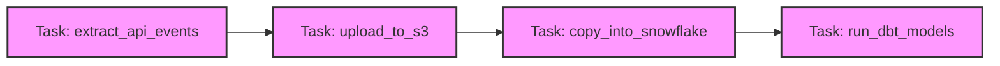
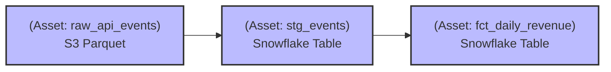

Lịch sử của Data Engineering đã chứng kiến nhiều sự dịch chuyển mô hình [Paradigm Shifts], từ ETL sang ELT, từ Batch sang Streaming. Hôm nay, chúng ta đang đứng trước một cuộc cách mạng mới ở tầng Điều phối (Orchestration): Sự dịch chuyển từ **Task-based Orchestration** (Điều phối dựa trên Tác vụ) sang **Asset-based Orchestration** (Điều phối dựa trên Tài sản).

**Software-Defined Assets (SDA)** là khái niệm cốt lõi của sự dịch chuyển này, được thiết kế và phổ biến rộng rãi bởi framework [Dagster](https://dagster.io/]. SDA chuyển trọng tâm của Data Engineer từ việc định nghĩa *"Hệ thống phải chạy những hành động (Tasks) gì?"* sang *"Hệ thống cần tạo ra và duy trì những tài sản dữ liệu (Assets) nào?"*.

Dưới góc nhìn của một Staff Data Engineer, SDA không chỉ là một tính năng của một công cụ mới. Nó là cách tiếp cận **Declarative (Khai báo)** áp dụng trực tiếp lên dữ liệu, biến Data Pipeline thành một cỗ máy tự phục hồi và tự bảo trì.

---

## 1. Kiến trúc Thực thi: Imperative (Task) vs. Declarative (Asset)

Để hiểu rõ thiết kế hệ thống của SDA, ta cần mổ xẻ và đặt nó lên bàn cân với mô hình truyền thống mà Apache Airflow hay Luigi đang sử dụng.

### 1.1. Imperative Orchestration (Điều phối Mệnh lệnh)
Trong mô hình này, bạn viết các đoạn mã **mệnh lệnh (imperative)** để chỉ định một chuỗi các thao tác (Tasks). Orchestrator đóng vai trò là một người giám sát tiến trình.



*   **Lỗ hổng Kiến trúc (Architectural Flaw):** Orchestrator (ví dụ: Airflow) chỉ giám sát được *Trạng thái của Task* (Success, Failed, Retrying). Nó hoàn toàn **"mù" về Dữ liệu (Data Blind)**. Khi Task `run_dbt_models` thành công, Airflow không biết bảng nào vừa được cập nhật, dung lượng bao nhiêu, hay có bao nhiêu bản ghi bị null. Việc Debugging và truy xuất Data Lineage bắt buộc phải phụ thuộc vào các công cụ bên ngoài (ví dụ: DataHub, dbt docs, OpenLineage). Khi task fail, bạn phải tự suy luận xem dữ liệu ở hạ nguồn đã bị hỏng đến mức nào.

### 1.2. Declarative Orchestration (Điều phối Khai báo với SDA)
Thay vì ra lệnh cho hệ thống "làm việc A rồi làm việc B", bạn **khai báo (declarative)** các trạng thái mong muốn của các tài sản dữ liệu. Mỗi SDA là một khai báo trong mã nguồn Python (Data as Code), liên kết chặt chẽ Logic tính toán với Tài sản vật lý.



*   **Bản chất hệ thống:** Orchestrator (Dagster) tự suy luận (infer) đồ thị thực thi (Execution Graph) dựa trên các dependencies được khai báo giữa các Assets. Dagster liên tục so sánh trạng thái hiện tại của dữ liệu với trạng thái được khai báo trong code, và tự tạo ra kế hoạch để "vật chất hóa" (materialize) các tài sản này.
*   **Data Lineage out-of-the-box:** Mối quan hệ giữa dữ liệu được sinh ra một cách tự nhiên. Khi bảng `stg_events` thay đổi logic, hệ thống biết chính xác `fct_daily_revenue` cần được tính toán lại (Reconciliation).

---

## 2. Decoupling Compute & Storage (I/O Managers)

Một trong những thiết kế đắt giá nhất của SDA là tách bạch hoàn toàn Logic tính toán (Compute) và Cơ chế đọc/ghi vật lý (Storage/IO). 

Trong hệ thống cũ, code của bạn bị "hardcode" với nền tảng: `df.to_sql('fct_orders', con=snowflake_conn)`. Nếu muốn chạy Unit Test ở local laptop, bạn phải mock toàn bộ Snowflake connection hoặc dựng Docker database giả lập, rất đau đầu và tốn thời gian.

SDA giải quyết bằng khái niệm **I/O Managers**:

```python
import pandas as pd
from dagster import asset, AssetExecutionContext, DailyPartitionsDefinition

# Khai báo chiến lược phân vùng theo ngày
daily_partitions = DailyPartitionsDefinition(start_date="2026-01-01")

@asset(
    partitions_def=daily_partitions,
    io_manager_key="warehouse_io_manager", # Decouple Storage
    compute_kind="python",
    group_name="finance_mart"
)
def cleaned_transactions(context: AssetExecutionContext, raw_transactions: pd.DataFrame) -> pd.DataFrame:
    """
    Asset này KHÔNG quan tâm `raw_transactions` được đọc từ đâu (S3 hay Postgres), 
    và cũng KHÔNG quan tâm output sẽ được ghi đi đâu. 
    Việc đó do 'warehouse_io_manager' quyết định tại thời điểm Runtime.
    """
    partition_date_str = context.partition_key
    
    # 1. Filter only valid transactions [Pure Compute Logic]
    df = raw_transactions[raw_transactions['amount'] > 0].copy[]
    
    # 2. Add partition metadata
    df['processed_date'] = partition_date_str
    
    # Return DataFrame, hệ thống sẽ tự động bắt lấy và ghi vào DB
    return df
```

Nhờ thiết kế Dependency Injection này, khi chạy ở môi trường `local`, `warehouse_io_manager` có thể được config là một `LocalFilesystemIOManager` (ghi ra file `.parquet` trên ổ cứng máy tính], còn ở `production`, nó được trỏ tới `SnowflakeIOManager`. 

Kết quả? Mọi logic biến đổi DataFrame có thể được **Unit Test 100% in-memory**, giải quyết một trong những bài toán khó nhất của Data Engineering: *Testability (Khả năng kiểm thử)*.

---

## 3. Rủi ro Vận hành (Operational Risks) & Troubleshooting

SDA mang lại kiến trúc gọn gàng, thanh lịch, nhưng không có bữa trưa nào miễn phí. Khi áp dụng ở quy mô dữ liệu cực lớn, SDA bộc lộ các rủi ro hệ thống mà một Kỹ sư cấp cao cần lường trước.

### 3.1. Nút thắt cổ chai I/O và OOMKilled (Out of Memory)
*   **Triệu chứng:** Container chạy Asset bị Kubernetes bắn hạ (OOMKilled - Exit Code 137).
*   **Nguyên nhân:** Khác với Task-based (bạn tự viết code đọc/ghi từng dòng), SDA tự động truyền output của upstream vào downstream dưới dạng tham số hàm (như `raw_transactions` ở code trên). Nếu `raw_transactions` là một bảng 100GB và bạn sử dụng I/O Manager mặc định để load toàn bộ vào RAM dưới dạng một `pandas.DataFrame`, ứng dụng sẽ bị tràn RAM lập tức.
*   **Khắc phục:** 
    1.  **Strict Partitioning:** Bắt buộc sử dụng Partitions (ví dụ `DailyPartitionsDefinition`) để I/O Manager chỉ load dữ liệu của 1 ngày.
    2.  **Lazy Evaluation & Chunking:** Thay vì return một DataFrame nguyên khối, hãy sử dụng Polars hoặc DuckDB với tính năng Out-of-core processing. Thay thế Type Hint từ `pd.DataFrame` sang các con trỏ logic (như dbt models) để đẩy việc tính toán (Push-down compute) xuống tận Data Warehouse thay vì xử lý trên memory của Orchestrator worker.

### 3.2. Sensor / Daemon Overhead (Reconciliation Loop Delay)
*   **Triệu chứng:** CPU của máy chủ chạy Dagster Daemon luôn ở mức 100%. Các Asset mất rất nhiều thời gian (vài phút) mới tự động trigger (kích hoạt) chạy khi upstream hoàn thành.
*   **Nguyên nhân:** Khi bạn bật tính năng **Declarative Reconciliation** (Tự động đồng bộ hóa trạng thái/Auto-materialize), Daemon của hệ thống liên tục phải quét và đánh giá (evaluate) đồ thị gồm hàng ngàn Assets để tính toán xem Asset nào đã bị "stale" (cũ) so với Upstream. Khi DAG phình to, vòng lặp tính toán (Tick) này trở thành "cổ chai" (Bottleneck).
*   **Khắc phục:** Tách repository khổng lồ (Monolith) ra làm nhiều Code Locations (Micro-repositories). Tối ưu hóa các chính sách Auto-materialize, chỉ bật nó đối với các Asset thực sự quan trọng (Tier-1) và dùng lịch chạy cố định (Schedule) cho các Asset Tier-3.

### 3.3. Dependency Hell trong kiến trúc Multi-tenant
*   **Triệu chứng:** Xung đột thư viện khi nhiều team dùng chung một Orchestrator (ví dụ: Team Data Science cần `pandas==1.5`, Team Data Engineering cần `pandas==2.0`), dẫn đến việc không thể deploy SDA graph.
*   **Khắc phục:** SDA và Dagster hỗ trợ kiến trúc **gRPC-based Code Locations**. Mỗi team có thể đóng gói toàn bộ SDA và thư viện của mình trong một Docker Image riêng biệt độc lập. Orchestrator trung tâm (Dagster Webserver) chỉ đóng vai trò Control Plane, giao tiếp với các user code qua gRPC, giúp cô lập hoàn toàn môi trường thực thi (Isolating Environments), giải quyết triệt để Dependency Hell.

---

## 4. Đánh đổi Hệ thống (Systemic Trade-offs)

Khi quyết định chuyển đổi từ kiến trúc Task-based (như Airflow) sang Asset-based (SDA của Dagster), một Staff Engineer cần phải trình bày rõ các trade-offs sau cho tổ chức:

| Tiêu chí Đánh giá | Task-based (Airflow) |" Asset-based (Dagster SDA) "|
| :--- | :--- | :--- |
|" **Đường cong học tập (Learning Curve)** "| **Thấp.** Python scripts gọi API đơn giản, khái niệm cron-job quen thuộc. | **Cao.** Cần tư duy Software Engineering, học các khái niệm trừu tượng: Resources, Config, Assets, I/O Managers. |
|" **Bảo trì Dữ liệu Lịch sử (Backfill)** "| **Thủ công và dễ lỗi.** Phải clear state từng Task theo từng khoảng ngày trên UI. Thường xuyên miss data. | **Tự động hoàn toàn.** SDA hiểu Data. Chỉ cần chọn Asset và Partition, hệ thống tự suy luận đồ thị và backfill chính xác. |
|" **Boilerplate Code (Mã lặp)** "| **Ít.** Viết code chạy thẳng. | **Nhiều.** Việc tách bạch I/O và Logic yêu cầu định nghĩa nhiều Decorators, Classes và Config schemas hơn. |
| **Khả năng Mở rộng Tổ chức** | Dễ dẫn đến **"Spaghetti DAGs"** rắc rối khi quy mô data team lớn lên (Hàng ngàn task chồng chéo). | **Modular.** Các team làm việc trên các Data Assets độc lập, giao tiếp với nhau qua Data Contracts và APIs. |
|" **Testability (Kiểm thử)** "| Khó khăn, phụ thuộc vào môi trường (Database thật). | Xuất sắc, hỗ trợ Unit Test 100% In-memory nhờ I/O Managers. |

---

## Kết luận

Software-Defined Assets không đơn thuần là một tính năng của một công cụ mới; nó đại diện cho **cách tư duy chuẩn xác về Data Engineering hiện đại**. Bằng cách coi dữ liệu là "công dân hạng nhất", tách rời logic khỏi storage, và quản lý metadata ngay tại thời điểm biên dịch [compile time], SDA giải quyết tận gốc các nỗi đau về Data Lineage, Testability và Backfilling. 

Tuy nhiên, kiến trúc khai báo này đòi hỏi một nền tảng Software Engineering vững chắc để quản trị vòng đời I/O Memory, vòng lặp Daemon và cấu hình hạ tầng container hóa.

---

## Nguồn Tham Khảo (References)
* [Dagster Official Docs: Software-Defined Assets Core Concepts][https://docs.dagster.io/concepts/assets/software-defined-assets]
* [Dagster Blog: Airflow vs Dagster - A Paradigm Shift][https://dagster.io/blog/dagster-airflow]
* [Dagster Docs: Decoupling I/O and Compute with IO Managers](https://docs.dagster.io/concepts/io-management/io-managers]
* Designing Data-Intensive Applications (M. Kleppmann) - *Chương 10: Batch Processing (Liên hệ về tư duy Input/Output không thay đổi - Immutable data processing)*
