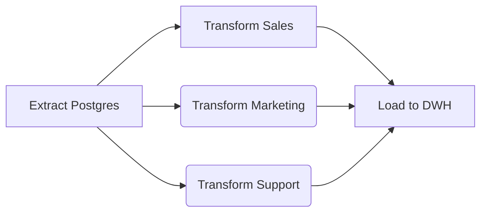
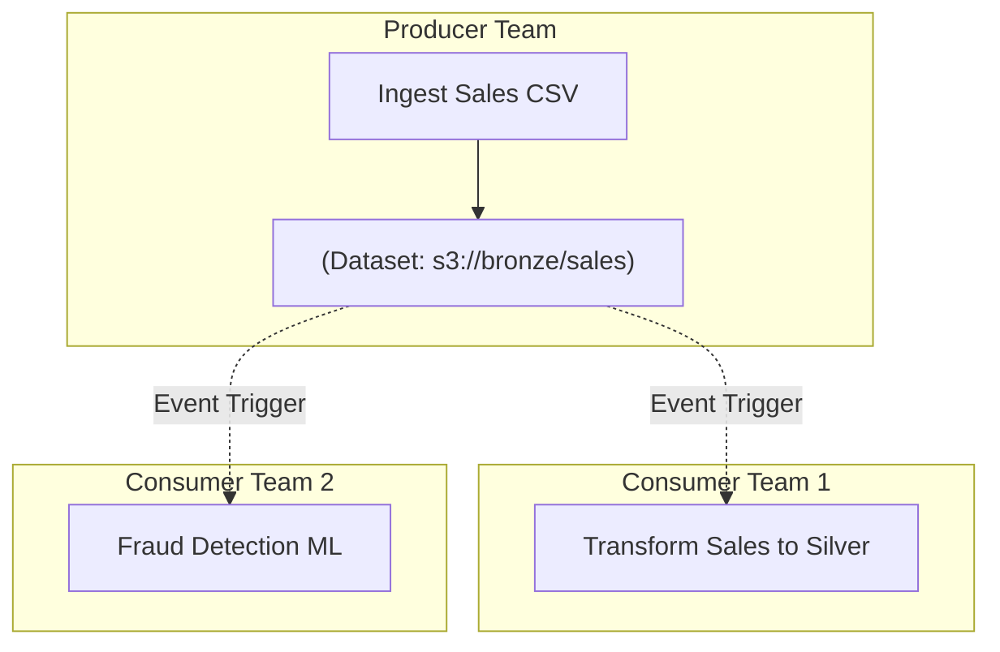

Trong thế giới Data [Orchestration](/concepts/7-dataops-orchestration-quality/orchestration), **Task Dependency (Sự phụ thuộc tác vụ)** thường bị hiểu nhầm là thao tác lập trình đơn giản (chỉ cần nối `Task_A >> Task_B`). Tuy nhiên, khi scale hệ thống lên hàng vạn jobs mỗi ngày như Netflix hay Uber, Dependency chính là điểm nghẽn kiến trúc (Architectural Bottleneck) lớn nhất.

Quản lý Dependency là việc thiết kế các "khế ước" (contracts) để hệ thống biết chính xác: Khi nào tác vụ được kích hoạt? Truyền dữ liệu giữa các task ra sao? Điều kiện thành công là gì? Và nếu upstream thất bại, làm sao để chặn đứng hiệu ứng Domino (Cascading Failures) mà không làm tràn RAM hệ thống.

---

## 1. Mức độ 1: Dependency Nội bộ (Intra-DAG)

Đây là các mô hình phụ thuộc cơ bản bên trong một Pipeline (DAG) duy nhất. Dù đơn giản, chúng tạo ra các rủi ro vận hành nếu không thiết kế cẩn thận.

### 1.1. Fan-out / Fan-in (Phân nhánh và Gom nhánh)
Mô hình này dùng để tối đa hoá I/O Throughput bằng cách chạy song song các luồng độc lập.
* **Fan-out:** 1 Task upstream kích hoạt N Tasks downstream (ví dụ: Tải xong `users` table -> Trigger tính toán 5 tập metric khác nhau).
* **Fan-in:** Đợi N Tasks hoàn tất mới chạy Task cuối (ví dụ: Tính xong 5 metrics -> Chạy báo cáo tổng).



🔥 **Rủi ro vận hành (Operational Risk): The Retry Storm**
Trong kiến trúc Fan-in, nếu `Load to DWH` bị cấu hình retry liên tục do nghẽn mạng, và bản thân nó là một tác vụ nặng (như `INSERT OVERWRITE` 100GB), việc một tác vụ upstream bị delay có thể đẩy toàn bộ hệ thống vào trạng thái tái kích hoạt không kiểm soát.
* **Giải pháp:** Phải áp dụng **Idempotency (Tính luỹ đẳng)**. Sử dụng `MERGE` thay vì `INSERT`, và bật cơ chế Backoff (Exponential Backoff) khi retry để tránh làm sập Data Warehouse.

### 1.2. Trigger Rules (Điều khiển Luồng linh hoạt)
Hệ thống Orchestrator mặc định chỉ chạy downstream nếu **tất cả** upstream `success`. Tuy nhiên, thực tế cần xử lý linh hoạt hơn thông qua **Trigger Rules**.

```python
# Ví dụ Airflow: Bẫy lỗi và dọn dẹp hệ thống (Cleanup)
from airflow.operators.bash import BashOperator

# Dù Cluster EMR chạy thành công hay thất bại (OOMKilled), Tác vụ này PHẢI chạy để tránh rò rỉ chi phí (FinOps)
terminate_emr = BashOperator(
    task_id='terminate_emr_cluster',
    bash_command='aws emr terminate-clusters --cluster-ids {{ params.cluster_id }}',
    trigger_rule='all_done' # Bỏ qua quy tắc all_success
)
```
Các Rules phổ biến:
* `all_success`: Điều kiện chuẩn (Default).
* `one_success`: Chạy ngay khi có ít nhất một task upstream hoàn thành.
* `one_failed`: Mồi lửa cho hệ thống Alerting (gửi Slack/PagerDuty ngay lập tức khi 1 luồng Fan-out chết, không đợi các luồng khác).
* `all_done`: Dùng cho Clean-up / Tear-down Infrastructure (như xoá Kubernetes Pod, tắt EC2).

---

## 2. Truyền Dữ Liệu Giữa Các Task (XCom & TaskFlow API)

Task Dependency không chỉ là về thứ tự chạy, mà còn là về dữ liệu truyền giữa chúng. Trong Airflow, cơ chế truyền dữ liệu metadata nhỏ được gọi là **XCom (Cross-Communication)**.

Trước Airflow 2.0, bạn phải gọi `xcom_push` và `xcom_pull` thủ công. Với **TaskFlow API**, Airflow tự động suy luận Dependency (Automatic Dependencies) và tự động push/pull XCom ẩn bên dưới.

```python
from airflow.decorators import task

@task
def extract():
    # Tự động push dict này vào XCom
    return {"user_id": 123, "status": "active"}

@task
def transform(user_data):
    # Nhận dữ liệu từ XCom, tự động thiết lập task dependency
    user_id = user_data["user_id"]
    return f"Processed {user_id}"

# Định nghĩa luồng bằng cách gọi hàm (Pythonic)
# Airflow sẽ hiểu: extract >> transform
data = extract()
result = transform(data)
```
*Lưu ý:* Không bao giờ dùng XCom để truyền dữ liệu lớn (như DataFrame hàng GB) vì XCom được lưu trong Metadata Database (PostgreSQL/MySQL), sẽ gây phình to (Bloat) database và sập hệ thống.

---

## 3. Mức độ 2: Dependency Xuyên Pipeline (Cross-DAG)

Khi hệ thống DataOps phình to, các kỹ sư buộc phải chia nhỏ thành các Micro-pipelines. Lúc này bài toán kết nối chúng lại nảy sinh.

### 3.1. Nỗi ám ảnh mang tên "Sensor Slot Starvation"
Cách truyền thống để DAG B đợi DAG A là dùng **Sensor** (Cảm biến). Sensor liên tục "poke" (hỏi) hệ thống xem DAG A xong chưa.
🔥 **Vấn đề:** Khi dùng chế độ mặc định, Sensor chiếm giữ Worker Slot vĩnh viễn, dẫn đến tê liệt tài nguyên. Phải sử dụng **Deferrable Operators** (Airflow 2.2+) để giải phóng Worker Slot sang Triggerer.

### 3.2. Chủ động kích hoạt (TriggerDagRun)
Thay vì thụ động chờ đợi, DAG A (Producer) ở bước cuối cùng sẽ gọi API để kích hoạt DAG B (Consumer).
* **Trade-off:** Rất nhanh và không tốn Slot. Nhưng tạo ra **Tight Coupling** (Sự kết dính logic). DAG A phải biết chính xác nó cần kích hoạt ai, truyền tham số gì. Khi DAG A có 50 consumers, mã nguồn của DAG A sẽ biến thành một đống code rác (Dependency Hell).

---

## 4. Mức độ 3: Data-Aware Scheduling (Event-Driven)

Để giải quyết triệt để Tight Coupling của Cross-DAG, Airflow (từ bản 2.4) chuyển sang mô hình **Data-Aware Scheduling (Điều phối nhận thức dữ liệu)**.

Thay vì ràng buộc Task A với Task B bằng thời gian (Cron) hay API Trigger, chúng ta ràng buộc chúng bằng **Logical Datasets (Tài sản dữ liệu)**.



### Cách hoạt động (Airflow Datasets Code)
Producer chỉ định nghĩa nó sẽ cập nhật Dataset nào. Nó không cần biết ai đọc.
```python
from airflow import Dataset
from airflow.operators.bash import BashOperator

sales_dataset = Dataset("s3://bronze/sales")

# DAG A (Producer)
load_sales_task = BashOperator(
    task_id="load_sales",
    outlets=[sales_dataset], # Khai báo: Tôi vừa cập nhật dataset này!
    bash_command="echo load"
)
```
Consumer không dùng Cron Schedule, mà dùng Dataset làm mồi kích hoạt.
```python
# DAG B (Consumer)
with DAG(
    dag_id="transform_sales",
    schedule=[sales_dataset], # Kích hoạt ngay khi dataset thay đổi (Just-In-Time)
):
    ...
```

### Systemic Trade-offs của Data-Aware Scheduling
Mặc dù là chuẩn mực của Data Mesh (các team hoạt động độc lập), Data-Aware Scheduling có những đánh đổi chí mạng:

1. **Non-Deterministic Execution (Thiếu tính tất định):** Nếu DAG A cập nhật `sales_dataset` 3 lần, nhưng DAG B đang bận, khi DAG B rảnh nó sẽ gộp cả 3 cập nhật này vào 1 lần chạy (Micro-batch collapse).
2. **Khó khăn khi Backfill:** Cron-based scheduling cực kỳ mạnh ở khoản Backfill (chạy bù quá khứ). Event-driven scheduling sinh ra để chạy tiến về phía trước, việc Backfill qua chuỗi Dataset là ác mộng vận hành.
3. **Ảo giác dữ liệu (Logical Only):** Dataset trong Orchestrator chỉ là "Logical Contract". Việc DAG A báo cập nhật Dataset không có nghĩa là file đã tồn tại trên S3 [có thể lỗi ghi file]. Trách nhiệm Data Quality vẫn thuộc về kỹ sư.

---

## Nguồn Tham Khảo
* [Netflix TechBlog: Maestro - Data/ML Workflow Orchestrator at Netflix](https://netflixtechblog.com/maestro-netflixs-data-workflow-orchestrator-9ddb8e5140e6)
* [Apache Airflow Docs: Datasets and Data-aware Scheduling](https://airflow.apache.org/docs/apache-airflow/stable/authoring-and-scheduling/datasets.html)
* [Apache Airflow Docs: TaskFlow API](https://airflow.apache.org/docs/apache-airflow/stable/tutorial/taskflow.html)
* [Dagster: Software-Defined Assets (SDA)](https://dagster.io/blog/software-defined-assets)
