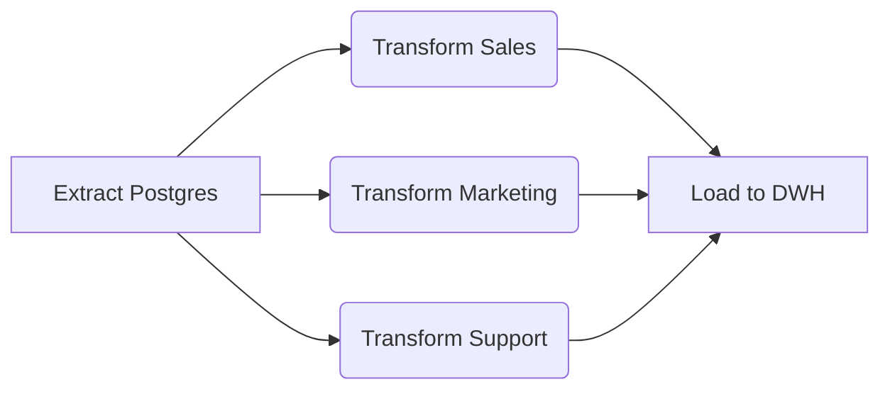
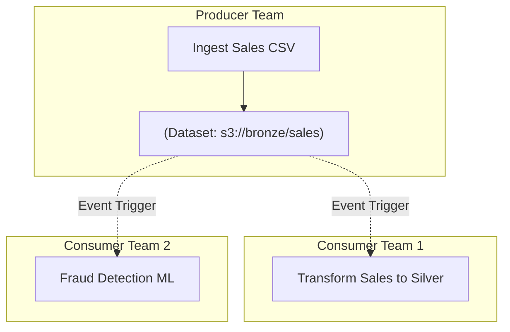

Trong thế giới Data [Orchestration](/concepts/7-dataops-orchestration-quality/orchestration), **Task Dependency (Sự phụ thuộc tác vụ)** thường bị hiểu nhầm là thao tác lập trình đơn giản (chỉ cần nối `Task_A >> Task_B`). Tuy nhiên, khi scale hệ thống lên hàng vạn jobs mỗi ngày như Netflix hay Uber, Dependency chính là điểm nghẽn kiến trúc (Architectural Bottleneck) lớn nhất.

Quản lý Dependency là việc thiết kế các "khế ước" (contracts) để hệ thống biết chính xác: Khi nào tác vụ được kích hoạt? Điều kiện thành công là gì? Và nếu upstream thất bại, làm sao để chặn đứng hiệu ứng Domino (Cascading Failures) mà không làm tràn RAM hệ thống.

---

## 1. Mức độ 1: Dependency Nội bộ (Intra-DAG)

Đây là các mô hình phụ thuộc cơ bản bên trong một Pipeline (DAG) duy nhất. Dù đơn giản, chúng tạo ra các rủi ro vận hành nếu không thiết kế cẩn thận.

### 1.1. Fan-out / Fan-in (Phân nhánh và Gom nhánh)
Mô hình này dùng để tối đa hoá I/O Throughput bằng cách chạy song song các luồng độc lập.
* **Fan-out:** 1 Task upstream kích hoạt N Tasks downstream (ví dụ: Tải xong `users` table -> Trigger tính toán 5 tập metric khác nhau).
* **Fan-in:** Đợi N Tasks hoàn tất mới chạy Task cuối (ví dụ: Tính xong 5 metrics -> Chạy báo cáo tổng).



🔥 **Rủi ro vận hành (Operational Risk): The Retry Storm**
Trong kiến trúc Fan-in, nếu `Load to DWH` bị cấu hình retry liên tục do nghẽn mạng, và bản thân nó là một tác vụ nặng (như `INSERT OVERWRITE` 100GB), việc một tác vụ upstream bị delay có thể đẩy toàn bộ hệ thống vào trạng thái tái kích hoạt không kiểm soát.
* **Giải pháp:** Phải áp dụng **Idempotency (Tính luỹ đẳng)**. Sử dụng `MERGE` thay vì `INSERT`, và bật cơ chế Backoff (Exponential Backoff) khi retry để tránh làm sập Data Warehouse.

### 1.2. Trigger Rules (Điều khiển Luồng linh hoạt)
Hệ thống Orchestrator mặc định chỉ chạy downstream nếu **tất cả** upstream `success`. Tuy nhiên, thực tế cần xử lý linh hoạt hơn.

```python
# Ví dụ Airflow: Bẫy lỗi và dọn dẹp hệ thống (Cleanup)
from airflow.operators.bash import BashOperator

# Dù Cluster EMR chạy thành công hay thất bại (OOMKilled), Tác vụ này PHẢI chạy để tránh rò rỉ chi phí (FinOps)
terminate_emr = BashOperator(
    task_id='terminate_emr_cluster',
    bash_command='aws emr terminate-clusters --cluster-ids {{ params.cluster_id }}',
    trigger_rule='all_done' # Bỏ qua quy tắc all_success
)
```
Các Rules phổ biến:
* `all_success`: Điều kiện chuẩn.
* `one_failed`: Mồi lửa cho hệ thống Alerting (gửi Slack/PagerDuty ngay lập tức khi 1 luồng Fan-out chết, không đợi các luồng khác).
* `all_done`: Dùng cho Clean-up / Tear-down Infrastructure (như xoá Kubernetes Pod, tắt EC2).

---

## 2. Mức độ 2: Dependency Xuyên Pipeline (Cross-DAG)

Khi hệ thống DataOps phình to (Monolith DAG), các kỹ sư buộc phải chia nhỏ thành các Micro-pipelines. Lúc này bài toán kết nối chúng lại nảy sinh.

### 2.1. Nỗi ám ảnh mang tên "Sensor Slot Starvation"
Cách truyền thống để DAG B đợi DAG A là dùng **Sensor** (Cảm biến). Sensor liên tục "poke" (hỏi) hệ thống xem DAG A xong chưa.

```python
# Cấu hình Sensor tồi tệ nhất làm sập Airflow Cluster
wait_for_dag_a = ExternalTaskSensor(
    task_id='wait_for_dag_a',
    external_dag_id='dag_a',
    mode='poke',           # BLOCKING SLOT!
    poke_interval=60,
    timeout=3600
)
```
🔥 **Vấn đề "Worker Slot Starvation":**
Khi dùng `mode='poke'`, Sensor sẽ chiếm giữ (lock) 1 Worker Slot suốt 1 tiếng chỉ để... ngủ và chờ đợi (Long-Running Lightweight task). Nếu có 100 Sensors như vậy, toàn bộ Pool của Airflow bị cạn kiệt, các Task thực sự cần CPU/RAM không có chỗ để chạy (Deadlock).

**Giải pháp (Kiến trúc từ Airbnb & Airflow 2.2+):**
1. **Mode Reschedule:** `mode='reschedule'` giải phóng Worker Slot khi đang ngủ, nhưng lại làm quá tải Scheduler Database vì liên tục ghi log trạng thái.
2. **Smart Sensors / Deferrable Operators:** Airbnb đã viết lại kiến trúc này. Task Sensor sẽ bị đình chỉ hoàn toàn và đẩy trạng thái chờ vào một tiến trình bất đồng bộ (Triggerer chạy `asyncio`). Khi có tín hiệu, nó mới chiếm lại Worker Slot.

### 2.2. Chủ động kích hoạt (TriggerDagRun)
Thay vì thụ động chờ đợi, DAG A (Producer) ở bước cuối cùng sẽ gọi API để kích hoạt DAG B (Consumer).
* **Trade-off:** Rất nhanh và không tốn Slot. Nhưng tạo ra **Tight Coupling** (Sự kết dính logic). DAG A phải biết chính xác nó cần kích hoạt ai, truyền tham số gì. Khi DAG A có 50 consumers, mã nguồn của DAG A sẽ biến thành một đống code rác (Dependency Hell).

---

## 3. Mức độ 3: Data-Aware Scheduling (Event-Driven)

Để giải quyết triệt để Tight Coupling của Cross-DAG, các công cụ hiện đại (Dagster, Airflow 2.4+, Prefect) chuyển sang mô hình **Data-Aware Scheduling** (Điều phối nhận thức dữ liệu).

Thay vì ràng buộc Task A với Task B bằng thời gian (Cron) hay API Trigger, chúng ta ràng buộc chúng bằng **Logical Data Assets (Tài sản dữ liệu)**.



### Cách hoạt động (Airflow Datasets Code)
Producer chỉ định nghĩa nó sẽ cập nhật Dataset nào. Nó không cần biết ai đọc.
```python
from airflow import Dataset

sales_dataset = Dataset("s3://bronze/sales")

# DAG A (Producer)
load_sales_task = BashOperator(
    task_id="load_sales",
    outlets=[sales_dataset], # Khai báo: Tôi vừa sinh ra dataset này!
    ...
)
```
Consumer không dùng Cron Schedule, mà dùng Dataset làm mồi kích hoạt.
```python
# DAG B (Consumer)
with DAG(
    dag_id="transform_sales",
    schedule=[sales_dataset], # Kích hoạt ngay khi dataset thay đổi (Just-In-Time)
):
    ...
```

### Systemic Trade-offs của Data-Aware Scheduling
Mặc dù là chuẩn mực của Data Mesh (các team hoạt động độc lập), Data-Aware Scheduling có những đánh đổi chí mạng:

1. **Non-Deterministic Execution (Thiếu tính tất định):** Nếu DAG A chạy 3 lần tạo ra 3 cập nhật cho `sales_dataset`, nhưng DAG B đang bận, khi DAG B chạy nó sẽ gộp cả 3 cập nhật này vào 1 lần chạy (Micro-batch collapse). Nếu logic của DAG B yêu cầu xử lý từng cục một, hệ thống sẽ sai lệch.
2. **Khó khăn khi Backfill (Chạy bù quá khứ):** Cron-based scheduling cực kỳ mạnh ở khoản Backfill (truyền tham số `logical_date` về quá khứ 2 năm để chạy lại toàn bộ pipeline). Event-driven scheduling sinh ra để chạy tiến về phía trước (Forward-looking), việc Backfill qua các chuỗi Dataset Dependency là một ác mộng vận hành.
3. **Ảo giác dữ liệu (Logical Only):** Dataset trong Orchestrator chỉ là "Logical Contract". Việc DAG A báo cáo cập nhật thành công `sales_dataset` không có nghĩa là file thực sự đã tồn tại trên S3 (có thể lỗi logic ghi file). Trách nhiệm Data Quality Checks vẫn nằm ở Data Engineer.

---

## Tổng kết

Trưởng thành trong Data Engineering là khi bạn ngừng nhìn Task Dependency như các đường thẳng trên giao diện. Nó là sự lựa chọn kiến trúc liên tục giữa **Resource Constraints** (Worker Slots, Memory), **Coupling** (Decoupled Teams vs. Monolith Code), và **Data Freshness** (Cron Batch vs. Event-driven Just-in-Time).

Việc chọn sai mô hình có thể khiến hệ thống chạy tốn gấp 10 lần chi phí AWS cho những con Sensor rỗng tuếch, hoặc làm cho việc gỡ lỗi (troubleshooting) ban đêm trở nên bất khả thi.

## Nguồn Tham Khảo
* [Airbnb Engineering: Airflow Smart Sensors for long-running tasks](https://medium.com/airbnb-engineering/airflow-smart-sensors-83d8e58319f6)
* [Netflix TechBlog: Maestro - Data/ML Workflow Orchestrator at Netflix](https://netflixtechblog.com/maestro-netflixs-data-workflow-orchestrator-9ddb8e5140e6)
* [Apache Airflow Docs: Datasets and Data-aware Scheduling](https://airflow.apache.org/docs/apache-airflow/stable/authoring-and-scheduling/datasets.html)
* [Dagster: Software-Defined Assets (SDA)](https://dagster.io/blog/software-defined-assets)
