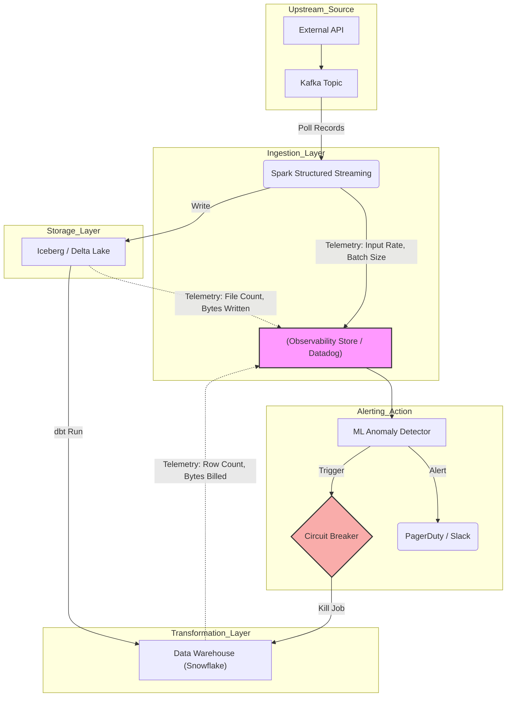

Trong triết lý **Data Observability** (Khả năng quan sát dữ liệu), Khối lượng dữ liệu (Volume) cùng với Độ tươi mới (Freshness), Phân phối (Distribution), Lược đồ (Schema), và Gia phả (Lineage) hợp thành 5 trụ cột sinh tồn của bất kỳ Data Platform nào.

Dưới góc nhìn hệ thống (Systems Engineering), **Volume Anomalies** (Bất thường về khối lượng dữ liệu) không chỉ đơn thuần là việc "số dòng hôm nay ít hơn hôm qua". Nó đại diện cho những thay đổi vật lý cực đoan về Băng thông mạng (Network Throughput), Bộ nhớ (RAM), và Chu kỳ tính toán (Compute Cycles) mà cụm máy chủ phải gánh chịu. 

Một sự kiện bùng nổ dữ liệu (Volume Spike) có thể kéo sập toàn bộ cụm Spark, trong khi sự sụt giảm dữ liệu (Volume Drop) thường là dấu hiệu của việc rò rỉ kết nối mạng hoặc lỗi cấu hình Upstream.

---

## 1. Bản chất Vật lý của Volume Anomalies (Physical Execution)

Sự bất thường về khối lượng thường phân làm hai cực: **Spike** (Bùng nổ) và **Drop** (Sụt giảm). Cả hai đều để lại "vết sẹo" trên hạ tầng.

### 1.1. Bùng nổ dữ liệu (Volume Spike)
Khi lượng dữ liệu tăng gấp 10-100 lần bình thường (ví dụ: Black Friday, hoặc App bị dính vòng lặp vô hạn), các nút thắt cổ chai (Bottlenecks) về phần cứng sẽ lập tức lộ diện:
- **JVM OOMKilled (Out of Memory):** Khi một partition trong Spark/Flink phình to quá mức (Data Skew) do lượng sự kiện từ một nhóm thiết bị tăng vọt. Cơ chế *Spill-to-disk* (ghi tạm ra ổ cứng) không kịp xử lý IOPS, dẫn đến tràn Heap Space. Hệ điều hành tung ra đòn `SIGKILL` tàn bạo (Exit Code 137).
- **Cartesian Explosion (Bùng nổ tích Đề-các):** Ở tầng Transformation, một lệnh `JOIN` bị thiếu điều kiện hoặc sai logic on-key có thể biến 2 bảng 1 triệu dòng thành 1 nghìn tỷ dòng, tiêu thụ hàng Terabyte RAM của Data Warehouse.
- **Retry Storms:** Hệ thống nguồn (Source) gặp lỗi mạng chập chờn, các client liên tục gửi lại (Retry) các batch log (với `retries=MAX` hoặc không có cơ chế Exponential Backoff), tạo ra đợt sóng thần dữ liệu trùng lặp (Duplicate Data) nhấn chìm Data Lake.

### 1.2. Sụt giảm dữ liệu (Volume Drop)
Ngược lại với Spike, Volume Drop âm thầm hơn (Silent Data Loss) nhưng gây tác động mạnh tới tính toàn vẹn kinh doanh:
- **Schema Drift phá vỡ Parser:** Đội Backend âm thầm đổi tên trường dữ liệu từ `user_id` thành `userId`. Kafka Connector hoặc Logstash không Map được schema, lập tức đẩy toàn bộ message vào Dead Letter Queue (DLQ). Pipeline Downstream vẫn chạy thành công (Status: SUCCESS), nhưng volume đầu vào rớt xuống 0.
- **Consumer Rebalancing Loop:** Trong Kafka, nếu thời gian xử lý một batch dữ liệu khổng lồ của Consumer vượt quá `max.poll.interval.ms`, Kafka Coordinator sẽ cho rằng Consumer đã chết và kích hoạt Rebalance. Vòng lặp Rebalance liên tục khiến không có partition nào được đọc. Volume Throughput rớt thảm hại dù dữ liệu trên Topic vẫn đang dội về rào rạt (Gây Consumer Lag chạm nóc).

---

## 2. Kiến trúc Data Observability (Observability Architecture)

Thay vì đặt cảnh báo lỏng lẻo ở cuối đường ống (khi dữ liệu rác đã chui vào Warehouse), một kiến trúc Data Observability chuẩn Enterprise phải thu thập tín hiệu (Telemetry) ở **Tất cả các chốt chặn**.



---

## 3. Khống chế Volume Anomalies (Show, Don't Tell)

Dưới đây là các kỹ thuật ở tầm cỡ Staff Engineer để khống chế Volume Anomalies trước khi chúng phá sập hạ tầng.

### 3.1. Kafka Backpressure (Bảo vệ Ingestion Layer)
Khi Upstream gửi data quá nhanh (Volume Spike), bạn tuyệt đối **KHÔNG ĐƯỢC** để Consumer "ăn" tất cả dữ liệu vào RAM. Cần giới hạn bằng các properties sau để tạo **Backpressure** (Áp lực ngược), ép Broker phải giữ dữ liệu trên Disk chờ Consumer xử lý từ từ.

```properties
# Cấu hình Kafka Consumer chống OOM khi volume bùng nổ
max.poll.records=500              # Chỉ lấy tối đa 500 records mỗi lần poll
fetch.max.bytes=52428800          # Tối đa 50MB cho một lần fetch
max.partition.fetch.bytes=1048576 # Giới hạn size/partition (1MB) tránh Data Skew OOM
```

### 3.2. Chống OOMKilled bằng Chunking / Python Generators
Nếu phải Pull data từ API định kỳ, **Tuyệt đối không** dùng phương thức `.json()` để load toàn bộ Payload khổng lồ vào một List trên RAM. Thay vào đó, xử lý Stream theo từng Chunk bằng Generator Pattern.

```python
import requests

def fetch_and_stream_api(url):
    # Stream=True giúp không load toàn bộ HTTP Response vào RAM
    with requests.get(url, stream=True) as response:
        response.raise_for_status()
        
        # Đọc từng dòng (chunk) để xử lý - Chống đạn tuyệt đối với Volume Spike
        for line in response.iter_lines():
            if line:
                # Yield từng record ra, rác cũ sẽ bị Garbage Collector dọn dẹp ngay
                yield process_record(line) 

# Sử dụng Generator
for clean_record in fetch_and_stream_api("https://api.partner.com/large-dump"):
    write_to_s3(clean_record)
```

### 3.3. Tự động ngắt luồng (Circuit Breaker) với dbt
Trong Data Warehouse, bạn có thể thiết lập hàng rào phòng ngự (Circuit Breaker) ngăn không cho dữ liệu dị thường chảy vào bảng Core (ví dụ: Bảng doanh thu, Bảng khách hàng VIP). Sử dụng package `dbt-expectations`.

```yaml
# models/schema.yml
models:
  - name: stg_payment_transactions
    tests:
      # KHỐNG CHẾ VOLUME: Nếu số dòng hôm nay bị vọt lên trên 500k 
      # (gấp 10 lần bình thường), dbt test sẽ FAIL ngay lập tức, chặn lệnh Build bảng kế tiếp.
      - dbt_expectations.expect_table_row_count_to_be_between:
          min_value: "{{ var('min_expected_rows', 1000) }}"
          max_value: "{{ var('max_expected_rows', 500000) }}"
          severity: error # Kích hoạt Circuit Breaker: Đánh sập pipeline nếu vi phạm
```

---

## 4. Systemic Trade-offs & FinOps (Đánh Đổi Hệ Thống)

Việc triển khai Data Observability để phát hiện Volume Anomalies đòi hỏi phải đánh đổi (Trade-offs) các yếu tố cốt lõi của kiến trúc.

### 4.1. Ngưỡng Tĩnh (Static Thresholds) vs. Cảnh báo Động (ML/Statistical)
- **Sử dụng ngưỡng tĩnh** (ví dụ: Cứ `row_count > 1M` là báo động) thì rẻ tiền, dễ viết bằng dbt SQL. Tuy nhiên, nó sẽ tạo ra **Alert Fatigue** (Bão cảnh báo giả) vào các ngày lễ, Black Friday, khiến kỹ sư mệt mỏi và lờ đi các cảnh báo thật.
- **Sử dụng Machine Learning** (ARIMA, Isolation Forest) cho phép hệ thống học chu kỳ (Seasonality). Đổi lại, bạn phải trả chi phí tính toán (Compute Cost) khổng lồ để Train lại Model dự báo cho hàng vạn bảng mỗi đêm.

### 4.2. Tính Tươi Mới (Freshness) vs. Tính Nhất Quán (Consistency)
- Nếu triển khai **Circuit Breaker chặt chẽ** (Kill Job ngay khi phát hiện Volume tăng 200%), tính Consistency (Đúng đắn) được bảo vệ, rác không lọt vào. Tuy nhiên, dữ liệu trên Dashboard sẽ bị "Stale" [Cũ]. Vi phạm cam kết Freshness.
- Ngược lại, nếu chọn **Eventual Consistency lỏng lẻo** (Cứ để Job chạy xong hết, phát sinh Volume Anomaly thì bắn Slack báo cáo sau), báo cáo sẽ kịp giờ (Fresh). Nhưng C-Level có thể đưa ra quyết định kinh doanh sai lầm dựa trên dữ liệu rác (Garbage In, Garbage Out) trước khi Data Engineer kịp sửa lỗi.

### 4.3. Nỗi đau FinOps & Metadata Explosion
Trong kiến trúc Data Lakehouse (Delta Lake / Apache Iceberg), một Volume Spike bất ngờ tạo ra hàng triệu files nhỏ li ti (Small Files Problem). Nó không chỉ tốn dung lượng S3. Quá trình bảo trì chạy `OPTIMIZE` (Z-Ordering) sau đó sẽ làm **bùng nổ Compute Cost** và thậm chí làm chậm các truy vấn siêu dữ liệu (Metadata Queries) của toàn bộ hệ thống.

---

## Nguồn Tham Khảo (References)

1. [Databricks: Implementing Data Observability at Scale][https://www.databricks.com/blog/2021/09/23/data-observability-with-databricks.html]
2. [Uber Engineering: Real-Time Data Pipeline Observability][https://www.uber.com/en-VN/blog/real-time-data-pipeline-observability/]
3. *Designing Data-Intensive Applications* - Martin Kleppmann (Chương 11: Stream Processing & Backpressure).
4. [Monte Carlo: The 5 Pillars of Data Observability][https://www.montecarlodata.com/blog-what-is-data-observability/]
5. [dbt-expectations Documentation](https://github.com/calogica/dbt-expectations]
