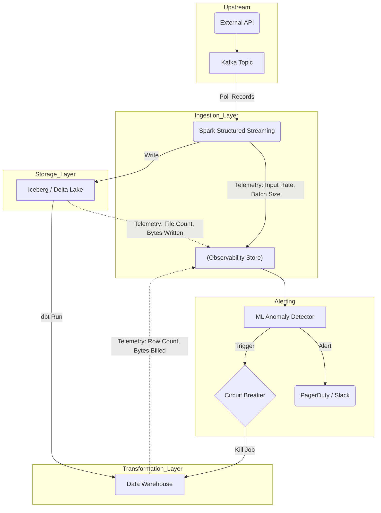

Khối lượng dữ liệu (Volume) là tín hiệu sinh tồn đầu tiên của bất kỳ đường ống dữ liệu nào. Dưới góc nhìn hệ thống, **Volume Anomalies** (bất thường về khối lượng dữ liệu) không chỉ đơn thuần là việc "số dòng hôm nay ít hơn hôm qua", mà nó đại diện cho những thay đổi vật lý cực đoan về băng thông (throughput), bộ nhớ (RAM), và chu kỳ tính toán (compute cycles) mà hệ thống phải gánh chịu.

Một sự kiện bùng nổ dữ liệu (Volume Spike) có thể kéo sập toàn bộ cụm Spark, trong khi sự sụt giảm dữ liệu (Volume Drop) thường là dấu hiệu của rò rỉ kết nối mạng hoặc lỗi cấu hình upstream.

---

## 1. Bản chất Vật lý của Volume Anomalies (Physical Execution)

Sự bất thường về khối lượng thường phân làm hai cực: **Spike** (Bùng nổ) và **Drop** (Sụt giảm). Cả hai đều để lại "vết sẹo" trên hạ tầng.

### 1.1. Bùng nổ dữ liệu (Volume Spike)
Khi lượng dữ liệu tăng gấp 10-100 lần bình thường, các nút thắt cổ chai (bottlenecks) về phần cứng sẽ lập tức lộ diện:
*   **JVM OOMKilled (Out of Memory):** Khi một partition trong Spark/Flink phình to quá mức (Data Skew) do lượng sự kiện từ một nhóm thiết bị tăng vọt. Cơ chế *Spill-to-disk* (ghi tạm ra ổ cứng) không kịp xử lý, dẫn đến tràn Heap Space và task bị hệ thống "giết" (SIGKILL).
*   **Cartesian Explosion (Bùng nổ tích Đề-các):** Ở tầng Transformation, một lệnh `JOIN` bị thiếu điều kiện hoặc sai logic on-key có thể biến 2 bảng 1 triệu dòng thành 1 nghìn tỷ dòng.
*   **Retry Storms:** Hệ thống nguồn (Source) gặp lỗi mạng chập chờn, các client gửi lại (retry) các batch log liên tục (với `retries=MAX` hoặc không có Exponential Backoff), tạo ra một đợt sóng thần dữ liệu trùng lặp nhấn chìm Data Lake.

### 1.2. Sụt giảm dữ liệu (Volume Drop)
Ngược lại với Spike, Volume Drop âm thầm hơn nhưng gây tác động mạnh tới tính toàn vẹn:
*   **Schema Drift phá vỡ Parser:** Đội Backend âm thầm đổi tên trường dữ liệu từ `user_id` thành `userId`. Kafka Connector hoặc Logstash không map được schema, lập tức đẩy toàn bộ message vào Dead Letter Queue (DLQ). Pipeline downstream vẫn chạy thành công nhưng volume đầu vào rớt xuống 0.
*   **Consumer Rebalancing Loop:** Trong Kafka, nếu thời gian xử lý một batch của consumer vượt quá `max.poll.interval.ms`, Kafka Coordinator sẽ cho rằng consumer đã chết và kích hoạt Rebalance. Vòng lặp rebalance liên tục khiến không có partition nào được đọc, volume throughput rớt thảm hại dù data trên topic vẫn đang dội về (gây Consumer Lag).

---

## 2. Kiến trúc Giám sát Khối lượng (Observability Architecture)

Thay vì đặt cảnh báo ở cuối đường ống (khi dữ liệu đã vào Warehouse), một kiến trúc Data Observability chuẩn phải thu thập tín hiệu (Telemetry) ở tất cả các chốt chặn.



---

## 3. Khống chế Volume Anomalies (Show, Don't Tell)

### 3.1. Kafka Backpressure (Bảo vệ Ingestion Layer)
Khi upstream gửi data quá nhanh (Spike), bạn tuyệt đối không được để Consumer "ăn" tất cả dữ liệu vào RAM. Cần giới hạn bằng các properties sau để tạo **Backpressure**:

```properties
# Cấu hình Kafka Consumer chống OOM khi volume bùng nổ
max.poll.records=500          # Chỉ lấy tối đa 500 records mỗi lần poll
fetch.max.bytes=52428800      # Tối đa 50MB cho một lần fetch
max.partition.fetch.bytes=1048576 # Giới hạn size/partition tránh Data Skew
```

### 3.2. Chống OOMKilled bằng Chunking / Python Generators
Nếu phải pull data từ API, **tuyệt đối không** dùng `.json()` để load toàn bộ payload vào một List. Thay vào đó, xử lý stream theo từng chunk:

```python
import requests

def fetch_and_stream_api(url):
    # Stream=True giúp không load toàn bộ response vào RAM
    with requests.get(url, stream=True) as response:
        response.raise_for_status()
        # Đọc từng dòng (chunk) để xử lý - chống Volume Spike
        for line in response.iter_lines():
            if line:
                yield process_record(line) # Generator pattern

# Sử dụng
for clean_record in fetch_and_stream_api("https://api.partner.com/large-dump"):
    write_to_s3(clean_record)
```

### 3.3. Tự động ngắt luồng (Circuit Breaker) với dbt
Trong Data Warehouse, bạn có thể thiết lập hàng rào (Circuit Breaker) ngăn không cho dữ liệu dị thường chảy vào bảng Core bằng package `dbt-expectations`.

```yaml
# models/schema.yml
models:
  - name: stg_payment_transactions
    tests:
      # Nếu số dòng hôm nay bị vọt lên gấp 3 lần trung bình 7 ngày trước, DAG sẽ FAIL ngay lập tức
      - dbt_expectations.expect_table_row_count_to_be_between:
          min_value: "{{ var('min_expected_rows', 1000) }}"
          max_value: "{{ var('max_expected_rows', 500000) }}"
          severity: error # Đánh sập pipeline nếu vi phạm
```

---

## 4. Systemic Trade-offs & FinOps

Việc phát hiện Volume Anomalies đòi hỏi phải đánh đổi (Trade-offs) các yếu tố cốt lõi của hệ thống:

*   **Tĩnh (Static Thresholds) vs. Động (ML/Statistical):** 
    *   Sử dụng ngưỡng tĩnh (ví dụ: `row_count > 1M`) thì rẻ và dễ viết bằng SQL. Tuy nhiên, nó sẽ tạo ra **Alert Fatigue** (Bão cảnh báo giả) vào các ngày lễ, Black Friday.
    *   Sử dụng Machine Learning (ARIMA, Isolation Forest) cho phép học chu kỳ (Seasonality). Đổi lại, bạn phải trả chi phí compute (FinOps) khổng lồ để train lại model dự báo cho hàng vạn bảng mỗi đêm.
*   **Tính Tươi mới (Freshness) vs. Tính Nhất quán (Consistency):**
    *   Nếu triển khai **Circuit Breaker** chặt chẽ (kill job ngay khi phát hiện volume dị thường), tính Consistency được bảo vệ, nhưng Data sẽ bị "Stale" (cũ) trên Dashboard.
    *   Ngược lại, nếu chọn **Eventual Consistency** (cứ để job chạy, chỉ bắn Slack cảnh báo), báo cáo sẽ kịp giờ nhưng C-Level có thể đưa ra quyết định sai lầm dựa trên dữ liệu rác trước khi DE kịp fix.
*   **FinOps & Metadata Explosion:** Trong Delta Lake/Iceberg, một Volume Spike với hàng triệu files nhỏ (Small Files Problem) không chỉ tốn dung lượng S3. Quá trình chạy `OPTIMIZE` (Z-Ordering) sau đó sẽ làm bùng nổ Compute Cost và thậm chí làm chậm các truy vấn siêu dữ liệu (Metadata Queries).

---

## Nguồn Tham Khảo

*   [Databricks: Implementing Data Observability at Scale](https://www.databricks.com/blog/2021/09/23/data-observability-with-databricks.html)
*   [Uber Engineering: Real-Time Data Pipeline Observability](https://www.uber.com/en-VN/blog/real-time-data-pipeline-observability/)
*   *Designing Data-Intensive Applications* - Martin Kleppmann (Chương 11: Stream Processing & Backpressure).
*   [dbt-expectations Documentation](https://github.com/calogica/dbt-expectations)
