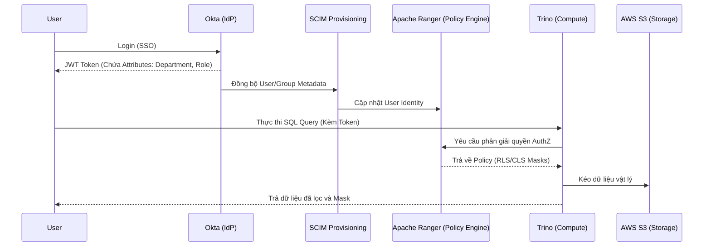

Một thảm họa kinh điển trong Data Engineering không bắt nguồn từ một lỗi logic phức tạp, mà thường đến từ một kỹ sư vô tình chạy lệnh `DROP TABLE` trên môi trường Production bằng tài khoản có quyền `ACCOUNTADMIN`, hoặc một nhà phân tích chạy `SELECT *` và kéo về toàn bộ lịch sử thẻ tín dụng không được che giấu (unmasked). 

Kiểm soát truy cập (**Access Control**) trong hệ thống dữ liệu hiện đại không đơn thuần là bài toán định danh (Identity), mà là một bài toán **Kiến trúc Hệ thống (System Architecture)**: Làm sao để kiểm tra hàng triệu policy phân quyền trên mỗi dòng dữ liệu mà không làm sập (bottleneck) Execution Engine?

---

## 1. Kiến trúc Phân quyền: Từ Tĩnh (RBAC) đến Động (ABAC)

Trước khi đi sâu, cần rạch ròi hai khái niệm: **AuthN (Authentication - Xác thực)** trả lời câu hỏi *"Bạn là ai?"*, trong khi **AuthZ (Authorization - Phân quyền)** xử lý *"Bạn được phép làm gì trên vùng nhớ vật lý nào?"*. Bài viết này tập trung vào AuthZ.

### 1.1. Role-Based Access Control (RBAC) và Nút thắt Cổ chai

RBAC gán quyền (Privileges) cho các Vai trò (Roles), sau đó ánh xạ User vào Role. 

**Vấn đề hệ thống (Systemic Trade-off): Sự bùng nổ Vai trò (Role Explosion)**
RBAC hoạt động hoàn hảo khi tổ chức nhỏ. Tuy nhiên, khi hệ thống scale theo Data Mesh, một user cần truy cập chéo nhiều domain: "Data Analyst ở khu vực US cần đọc PII data của Marketing, nhưng chỉ trong giờ hành chính". Để đáp ứng bằng RBAC, hệ thống IAM phải phình to bằng tổ hợp chập (Combinatorial Explosion) của các Roles (`role_analyst_us_marketing_pii_businesshours`). Quản lý hàng nghìn IAM Roles khiến hệ thống phân quyền (như AWS IAM Quotas) chạm ngưỡng giới hạn, và việc audit trở nên bất khả thi.

*Terraform triển khai RBAC chuẩn (Role Hierarchy) trong Snowflake:*

```hcl
# Tạo Role cấp thấp nhất (chỉ đọc)
resource "snowflake_role" "raw_db_read" {
  name = "RAW_DB_READ_ROLE"
}

# Gán quyền SELECT trên schema cho Role đọc
resource "snowflake_schema_grant" "grant_read" {
  database_name = "RAW_DB"
  schema_name   = "PUBLIC"
  privilege     = "USAGE"
  roles         = [snowflake_role.raw_db_read.name]
}

resource "snowflake_table_grant" "grant_select" {
  database_name = "RAW_DB"
  schema_name   = "PUBLIC"
  privilege     = "SELECT"
  roles         = [snowflake_role.raw_db_read.name]
  on_future     = true
}

# Role kế thừa (Role Hierarchy): Business Role kế thừa Functional Role
resource "snowflake_role" "data_analyst" {
  name = "DATA_ANALYST_ROLE"
}

resource "snowflake_role_grants" "grants" {
  role_name = snowflake_role.data_analyst.name
  roles     = [snowflake_role.raw_db_read.name] # Kế thừa quyền đọc
}
```

### 1.2. Attribute-Based Access Control (ABAC)

ABAC giải quyết triệt để *Role Explosion* bằng cách tách rời Policy khỏi Object. Phân quyền được đánh giá động (Dynamic Evaluation) vào thời điểm chạy (Runtime) dựa trên **Thuộc tính (Attributes/Tags)** của người dùng và dữ liệu.

Ví dụ: Bạn chỉ có 1 policy: *"Nếu `User.ClearanceLevel >= Data.SensitivityTag`, cho phép đọc"*.

*Databricks Unity Catalog ABAC Policy SQL:*

```sql
-- Gắn tag cho bảng và cột
ALTER TABLE marketing.campaigns SET TAGS ('sensitivity' = 'high');
ALTER TABLE marketing.campaigns ALTER COLUMN customer_email SET TAGS ('pii' = 'true');

-- Cấp quyền động dựa trên Tag thay vì chỉ định bảng
GRANT SELECT ON CATALOG marketing 
TO ROLE data_scientists 
WHEN TAG 'sensitivity' != 'high';
```

---

## 2. RLS và CLS dưới góc nhìn Physical Execution

Row-Level Security (RLS) và Column-Level Security (CLS) không phải là phép màu. Chúng là các bộ lọc (Filters) được Optimizer âm thầm chèn vào Query Execution Plan. 

### 2.1. Tác động của RLS tới Query Performance

Khi bật RLS, một câu query đơn giản `SELECT * FROM sales` sẽ bị Execution Engine ép buộc rewrite thành `SELECT * FROM sales WHERE region = current_user_region()`.

**Sự đánh đổi Hệ thống (Trade-offs):**
1. **Cache Invalidation:** RLS phá vỡ cơ chế Query Result Caching. Vì kết quả phụ thuộc vào `Security Context` (ai đang chạy), Engine không thể dùng lại kết quả của user A cho user B, dẫn đến Compute Cost tăng vọt.
2. **Full Table Scan (Spill-to-disk):** Nếu cột dùng làm điều kiện RLS (ví dụ `region`) không được Index, Partition hoặc Z-Order hợp lý, Security Filter buộc engine phải quét toàn bộ bảng (Table Scan). Với hàng tỷ dòng, điều này gây tràn RAM (OOMKilled) hoặc Spill-to-disk cục bộ trên các Worker nodes.

*Cấu hình RLS trong PostgreSQL:*

```sql
-- Kích hoạt RLS trên bảng
ALTER TABLE global_sales ENABLE ROW LEVEL SECURITY;

-- Tạo Policy: User chỉ thấy dữ liệu của chi nhánh mình
CREATE POLICY tenant_isolation_policy ON global_sales
    USING (tenant_id = current_setting('app.current_tenant')::uuid);

-- Ép buộc RLS áp dụng ngay cả với chủ sở hữu bảng (Table Owner)
ALTER TABLE global_sales FORCE ROW LEVEL SECURITY;
```

### 2.2. Dynamic Data Masking (CLS) vs Compute Overhead

Việc che dấu cột nhạy cảm (Dynamic Data Masking - DDM) đòi hỏi tính toán mã hóa/giải mã (Mask/Unmask) on-the-fly. Nếu bạn áp dụng Masking bằng UDF (User Defined Functions) phức tạp (như SHA-256 Hashing) trên một bảng 100 Terabytes, CPU của Database (ví dụ Snowflake Virtual Warehouse) sẽ bị đẩy lên 100% chỉ để xử lý chuỗi ký tự. Giải pháp là dùng các Masking Function nội tại (Native) hoặc Role-based Masking thay vì gọi UDF bên ngoài.

---

## 3. Kiến trúc Quản trị Tập trung (Identity Federation)

Trong môi trường Enterprise (như Data Mesh), dữ liệu nằm rải rác ở S3, Kafka, Trino, và PostgreSQL. Việc đi gán quyền (Grant) thủ công trên từng công cụ là "tự sát" về mặt vận hành.

Các hệ thống sử dụng một **Centralized Policy Engine** (như Apache Ranger, AWS Lake Formation) để đồng bộ hóa quy tắc tập trung.



### Rủi ro Vận hành (Operational Risks):
*   **SCIM Sync Lag:** Hệ thống nhân sự khóa tài khoản nhân viên nghỉ việc trên IdP (Okta), nhưng tiến trình SCIM Sync mất 30 phút để lan truyền tới Database. Trong 30 phút đó, "Ghost User" vẫn có thể tải dữ liệu về máy. (Cách khắc phục: Token Expiration ngắn hoặc Event-driven Webhooks).
*   **Aggregate Queries Leak:** RLS và CLS có thể bị bypass nếu engine không chặn hàm nội suy. Một user bị cấm xem lương cụ thể, nhưng có thể chạy `SELECT AVG(salary) FROM employees WHERE name = 'John Doe'` để đoán ra lương.

---

## 4. Best Practices cho Data Engineers

1. **Hạ tầng dưới dạng mã (IaC):** Quản lý quyền bằng Terraform. Mọi thay đổi Role phải qua Pull Request và CI/CD. Tuyệt đối không ClickOps (click tay trên UI) để cấp quyền.
2. **Service Accounts cho Automation:** Không dùng tài khoản thật của Data Engineer để chạy Airflow. Tạo các tài khoản dịch vụ phi nhân sự (Non-human accounts), gắn chứng chỉ vòng đời ngắn (Short-lived Credentials) qua AWS STS hoặc HashiCorp Vault.
3. **Phân loại dữ liệu tại nguồn (Shift-left Data Tagging):** Tự động quét và gán tag (PII, Financial) ngay khi dữ liệu vừa hạ cánh xuống Raw Zone (bằng AWS Macie hoặc dbt meta tags) để kích hoạt ABAC sớm nhất.

---

## Nguồn Tham Khảo (References)
*   [AWS Architecture Blog: Attribute-Based Access Control (ABAC)](https://aws.amazon.com/blogs/architecture/)
*   [NIST Guide to Attribute Based Access Control (ABAC)](https://nvlpubs.nist.gov/nistpubs/specialpublications/NIST.SP.800-162.pdf)
*   [Databricks Unity Catalog - Attribute-Based Access Control](https://docs.databricks.com/en/data-governance/unity-catalog/index.html)
*   Martin Kleppmann (2017), *Designing Data-Intensive Applications*, O'Reilly Media.
*   Joe Reis & Matt Housley (2022), *Fundamentals of Data Engineering*, O'Reilly Media.
