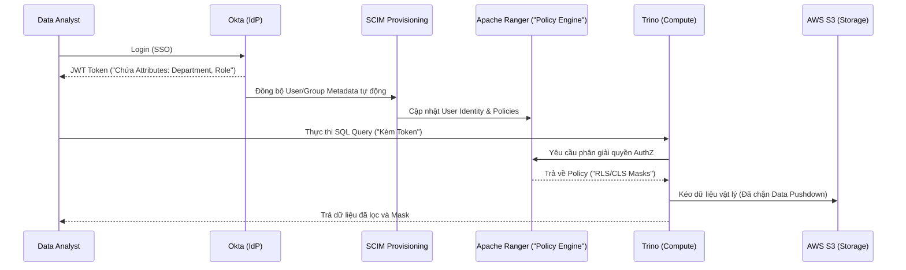

Một thảm họa kinh điển trong Data Engineering không bắt nguồn từ một lỗi logic thuật toán phức tạp, mà thường đến từ một kỹ sư vô tình chạy lệnh `DROP TABLE` trên môi trường Production bằng tài khoản có quyền `ACCOUNTADMIN`, hoặc một nhà phân tích chạy `SELECT *` và kéo về toàn bộ lịch sử thẻ tín dụng không được che giấu (Unmasked). 

Kiểm soát truy cập (**Access Control**) trong hệ thống dữ liệu hiện đại không đơn thuần là bài toán định danh (Identity), mà là một bài toán **Kiến trúc Hệ thống (System Architecture)**: Làm sao để kiểm tra hàng triệu Policy phân quyền trên mỗi dòng dữ liệu mà không làm sập (Bottleneck) Execution Engine?

Bài viết này phân tích sâu vào các nguyên lý AuthZ (Phân quyền) từ góc nhìn của một Staff Data Engineer, nơi mọi quyết định đều ảnh hưởng trực tiếp đến hiệu năng và chi phí của Data Platform.

---

## 1. Kiến trúc Phân quyền: Từ Tĩnh (RBAC) đến Động (ABAC)

Trước khi đi sâu, cần rạch ròi hai khái niệm: 
- **AuthN (Authentication - Xác thực)** trả lời câu hỏi *"Bạn là ai?"* (Sử dụng SSO, MFA, Okta).
- **AuthZ (Authorization - Phân quyền)** xử lý câu hỏi *"Bạn được phép làm gì trên vùng nhớ vật lý nào?"*. Bài viết này tập trung vào AuthZ.

### 1.1. Role-Based Access Control (RBAC) và Sự cố "Nổ tung Vai trò"

RBAC gán quyền (Privileges) cho các Vai trò (Roles), sau đó ánh xạ User vào Role. Nó là nền tảng của hầu hết các Database truyền thống và Snowflake.

**Vấn đề hệ thống (Systemic Trade-off): Sự bùng nổ Vai trò (Role Explosion)**
RBAC hoạt động hoàn hảo khi tổ chức nhỏ. Tuy nhiên, khi hệ thống Scale theo mô hình Data Mesh, một user cần truy cập chéo nhiều Domain: *"Data Analyst ở khu vực US cần đọc PII data của Marketing, nhưng chỉ trong giờ hành chính"*. 

Để đáp ứng bằng RBAC, hệ thống IAM phải phình to bằng tổ hợp chập (Combinatorial Explosion) của các Roles (ví dụ: `role_analyst_us_marketing_pii_businesshours`). Quản lý hàng nghìn IAM Roles khiến hệ thống phân quyền (như AWS IAM Quotas) chạm ngưỡng giới hạn, và việc Audit (Kiểm toán bảo mật) trở nên bất khả thi. Các kỹ sư DevOps sẽ bơi trong một mớ bòng bong các Role kế thừa chéo nhau.

*Đoạn mã Terraform triển khai RBAC chuẩn (Role Hierarchy) trong Snowflake:*

```hcl
# Terraform: Tạo Role Functional cấp thấp nhất (Chỉ đọc Raw Data)
resource "snowflake_role" "raw_db_read" {
  name = "RAW_DB_READ_ROLE"
}

# Gán quyền SELECT trên toàn bộ bảng hiện tại và tương lai (ON FUTURE)
resource "snowflake_schema_grant" "grant_read" {
  database_name = "RAW_DB"
  schema_name   = "PUBLIC"
  privilege     = "USAGE"
  roles         = [snowflake_role.raw_db_read.name]
}

resource "snowflake_table_grant" "grant_select" {
  database_name = "RAW_DB"
  schema_name   = "PUBLIC"
  privilege     = "SELECT"
  roles         = [snowflake_role.raw_db_read.name]
  on_future     = true # Tự động cấp quyền cho bảng tạo mới sau này
}

# Role Hierarchy: Business Role (Data Analyst] kế thừa Functional Role
resource "snowflake_role" "data_analyst" {
  name = "DATA_ANALYST_ROLE"
}

resource "snowflake_role_grants" "grants" {
  role_name = snowflake_role.data_analyst.name
  roles     = [snowflake_role.raw_db_read.name] # Kế thừa quyền đọc
}
```

### 1.2. Attribute-Based Access Control (ABAC]: Cuộc cách mạng Metadata

ABAC giải quyết triệt để *Role Explosion* bằng cách tách rời Policy khỏi Object. Phân quyền được đánh giá động (Dynamic Evaluation) vào thời điểm chạy (Runtime) dựa trên **Thuộc tính (Attributes/Tags)** của người dùng, dữ liệu, và môi trường.

Ví dụ: Bạn chỉ có 1 Policy duy nhất: *"Nếu `User.ClearanceLevel >= Data.SensitivityTag` VÀ `Environment.IP == 'Corporate_VPN'`, cho phép đọc"*.

*Đoạn mã Databricks Unity Catalog ABAC Policy SQL:*

```sql
-- Gắn tag (Metadata) cho bảng và cột ngay khi dữ liệu vừa hạ cánh (Shift-left)
ALTER TABLE marketing.campaigns SET TAGS ('sensitivity' = 'high');
ALTER TABLE marketing.campaigns ALTER COLUMN customer_email SET TAGS ('pii' = 'true');

-- Cấp quyền động dựa trên Tag thay vì chỉ định bảng thủ công
-- Mọi bảng tạo mới trong tương lai nếu không có tag 'high' thì Scientist tự động được đọc
GRANT SELECT ON CATALOG marketing 
TO ROLE data_scientists 
WHEN TAG 'sensitivity' != 'high';
```

---

## 2. RLS và CLS dưới góc nhìn Physical Execution (Trọng tâm Kỹ thuật)

Row-Level Security (RLS - Bảo mật cấp dòng) và Column-Level Security (CLS - Bảo mật cấp cột) không phải là phép màu. Chúng thực chất là các bộ lọc (Filters) được Optimizer âm thầm chèn vào Query Execution Plan. 

### 2.1. Tác động của RLS tới Query Performance (Hiệu năng)

Khi bật RLS, một câu query đơn giản `SELECT * FROM sales` của User thuộc khu vực 'APAC' sẽ bị Execution Engine ép buộc Rewrite (Viết lại) thành:
`SELECT * FROM sales WHERE region = 'APAC'`.

**Sự đánh đổi Hệ thống (System Trade-offs):**
1. **Cache Invalidation (Vô hiệu hóa bộ đệm):** RLS phá vỡ cơ chế Query Result Caching. Vì kết quả phụ thuộc vào `Security Context` (Ai đang chạy), Engine không thể dùng lại kết quả Cache của User A cho User B, dẫn đến Compute Cost tăng vọt do phải tính lại từ đầu.
2. **Full Table Scan (Spill-to-disk):** Nếu cột dùng làm điều kiện RLS (ví dụ `region`) không được Index, Partition, hoặc Z-Order hợp lý trên Parquet files, Security Filter buộc Engine phải quét toàn bộ bảng (Full Table Scan). Với hàng tỷ dòng, điều này gây tràn RAM (OOMKilled) hoặc Spill-to-disk cục bộ trên các Worker nodes, làm Query chậm đi 100 lần.

*Cấu hình Row Access Policy động trong Snowflake:*

```sql
-- Tạo một Mapping Table lưu trữ quyền truy cập của từng User
CREATE TABLE security.user_region_map (
    user_email VARCHAR,
    allowed_region VARCHAR
);

-- Tạo Policy động kiểm tra Mapping Table (Đánh đổi: Tốn thời gian JOIN ngầm)
CREATE OR REPLACE ROW ACCESS POLICY region_policy AS (region_col VARCHAR) RETURNS BOOLEAN ->
  EXISTS (
    SELECT 1 FROM security.user_region_map
    WHERE user_email = CURRENT_USER()
      AND allowed_region = region_col
  )
  OR CURRENT_ROLE() = 'ACCOUNTADMIN'; -- Admin thấy tất cả

-- Áp dụng Policy vào bảng thật
ALTER TABLE global_sales ADD ROW ACCESS POLICY region_policy ON (region);
```

### 2.2. Dynamic Data Masking (CLS) vs Compute Overhead

Việc che giấu cột nhạy cảm (Dynamic Data Masking - DDM) đòi hỏi tính toán mã hóa/giải mã (Mask/Unmask) On-the-fly trên từng dòng dữ liệu. 
Nếu bạn áp dụng Masking bằng một UDF (User Defined Functions) phức tạp (như SHA-256 Hashing) trên một bảng 100 Terabytes, CPU của Database (ví dụ Snowflake Virtual Warehouse) sẽ bị đẩy lên 100% chỉ để xử lý thao tác xử lý chuỗi ký tự (String manipulation). 

**Giải pháp của Staff Engineer:** Luôn dùng các Masking Function nội tại (Native) viết bằng C++ của Database Engine, hoặc dùng Role-based Masking đơn giản (thay thế bằng `***`) thay vì gọi External UDF / Lambda function ra bên ngoài làm thắt cổ chai I/O.

---

## 3. Kiến trúc Quản trị Tập trung (Identity Federation)

Trong môi trường Enterprise Data Mesh, dữ liệu nằm rải rác ở S3 (Object Storage), Kafka (Streaming), Trino (Query Engine), và PostgreSQL (OLTP). Việc kỹ sư đi gán quyền (Grant) thủ công trên từng công cụ là "Tự sát" về mặt vận hành.

Các hệ thống quy mô lớn sử dụng một **Centralized Policy Engine** (Như Apache Ranger, AWS Lake Formation) để đồng bộ hóa quy tắc tập trung.



### Rủi ro Vận hành (Operational Risks):
*   **SCIM Sync Lag:** Hệ thống nhân sự khóa tài khoản nhân viên nghỉ việc trên IdP (Okta), nhưng tiến trình SCIM Sync mất 30 phút để lan truyền tới Database. Trong 30 phút đó, "Ghost User" [Người dùng bóng ma] vẫn có thể tải dữ liệu mật về máy. **Khắc phục:** Ép buộc Token Expiration (Thời gian sống của Token) cực ngắn (5 phút) hoặc dùng Event-driven Webhooks.
*   **Aggregate Queries Leak (Rò rỉ qua hàm tổng hợp):** RLS và CLS có thể bị Bypass (Lách luật) nếu Engine không chặn hàm nội suy. Một User bị Mask cột lương, nhưng có thể chạy `SELECT AVG(salary) FROM employees WHERE name = 'John Doe'` để hệ thống tính ra chính xác lương của người đó.

---

## 4. Best Practices cho Data Engineers

1. **Hạ tầng dưới dạng mã (IaC):** Quản lý quyền tuyệt đối bằng Terraform. Mọi thay đổi Role phải qua Pull Request, Code Review và CI/CD. Tuyệt đối cấm hành vi ClickOps (Click tay trên UI Console) để cấp quyền trên môi trường Production.
2. **Service Accounts cho Automation:** Không bao giờ dùng tài khoản thật của Data Engineer để chạy Airflow hay dbt. Phải tạo các tài khoản dịch vụ phi nhân sự (Non-human accounts), gắn chứng chỉ vòng đời ngắn (Short-lived Credentials) qua AWS STS hoặc HashiCorp Vault.
3. **Phân loại dữ liệu tại nguồn (Shift-left Data Tagging):** Tự động quét và gán Tag (PII, Financial) ngay khi dữ liệu vừa hạ cánh xuống Raw Zone (Bằng AWS Macie hoặc dbt meta tags) để kích hoạt ABAC sớm nhất có thể.

---

## Nguồn Tham Khảo (References)
1. **AWS Architecture Blog:** [Attribute-Based Access Control (ABAC]][https://aws.amazon.com/blogs/architecture/] - Định hình tương lai của IAM Cloud.
2. **NIST Guide to ABAC:** [NIST SP 800-162][https://nvlpubs.nist.gov/nistpubs/specialpublications/NIST.SP.800-162.pdf] - Tiêu chuẩn bảo mật liên bang Mỹ về ABAC.
3. **Databricks Unity Catalog:** [Attribute-Based Access Control](https://docs.databricks.com/en/data-governance/unity-catalog/index.html].
4. **Designing Data-Intensive Applications (DDIA)** - Martin Kleppmann (2017).
