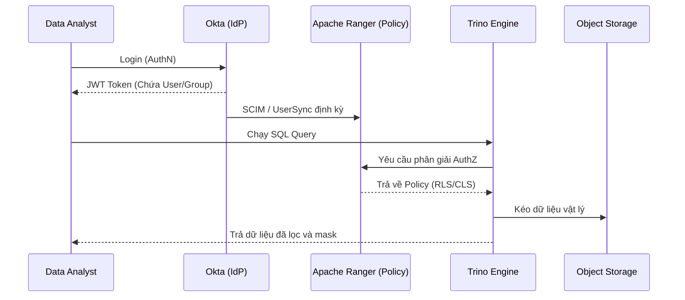

Một sự cố nghiêm trọng trong Data Engineering đôi khi bắt đầu từ một thao tác vận hành rất đơn giản: một kỹ sư vô tình chạy `DROP TABLE` trên môi trường Production bằng tài khoản `ACCOUNTADMIN`, hoặc một Data Analyst `SELECT *` và kéo về toàn bộ lịch sử giao dịch thẻ tín dụng không được che giấu (unmasked).

Trong hệ thống dữ liệu phân tán, kiểm soát truy cập (Access Control) không đơn thuần là bài toán định danh (Identity), mà là một bài toán **Kiến trúc Hệ thống (System Architecture)**. Khi bạn áp dụng một chính sách phân quyền (Policy) lên một bảng dữ liệu 100 Terabytes, làm sao để Engine kiểm tra hàng triệu luật truy cập trên mỗi dòng dữ liệu mà không làm sập toàn bộ cluster?

Điểm cần hiểu là cơ chế phân quyền (AuthZ) không chỉ nằm ở màn hình cấp quyền. Trong data platform, nó can thiệp vào query plan, cache, pruning, credential vending và chi phí hạ tầng.

## 1. AuthN vs. AuthZ: Ranh giới của hệ thống

Trước hết cần tách rõ trách nhiệm của hai khái niệm:
- **AuthN (Authentication - Xác thực):** Trả lời câu hỏi *"Bạn là ai?"*. Hệ thống AuthN xử lý việc đăng nhập, kiểm tra mật khẩu, MFA, hay SSO thông qua các Identity Provider (IdP) như Okta, Microsoft Entra ID.
- **AuthZ (Authorization - Phân quyền):** Trả lời câu hỏi *"Bạn được phép làm gì trên vùng nhớ vật lý này?"*. Đây là nơi Data Engineer phải làm việc trực tiếp: cấu hình quyền `SELECT`, `INSERT`, row filter, column mask và policy cho service account.

## 2. RBAC và Vấn đề "Nổ tung Vai trò" (Role Explosion)

**Role-Based Access Control (RBAC)** gán quyền (Privileges) cho các Vai trò (Roles), sau đó ánh xạ User vào các Role tương ứng. Đây là mô hình tiêu chuẩn được hỗ trợ bởi hầu hết các cơ sở dữ liệu truyền thống và Cloud Data Warehouse như Snowflake, PostgreSQL.

RBAC hoạt động rất ổn định cho đến khi tổ chức của bạn mở rộng theo mô hình Data Mesh. Hãy tưởng tượng một yêu cầu nghiệp vụ: *"Data Analyst ở khu vực APAC cần đọc dữ liệu Marketing có chứa PII, nhưng chỉ được phép đọc trong giờ hành chính."*

Để đáp ứng bằng RBAC, hệ thống IAM (Identity and Access Management) thường phải tạo ra các role quá chi tiết, dẫn đến **Role Explosion**. Bạn sẽ phải quản lý những role như `role_analyst_apac_marketing_pii_businesshours`. Khi số tổ hợp role tăng theo domain, region, độ nhạy dữ liệu và thời gian truy cập, audit trở nên khó tin cậy vì không còn ai nhìn được toàn bộ ma trận quyền.

*Ví dụ cấu hình RBAC sử dụng Terraform:*

```hcl
# Terraform: Tạo Functional Role (Quyền kỹ thuật)
resource "snowflake_role" "raw_db_read" {
  name = "RAW_DB_READ_ROLE"
}

# Cấp quyền đọc trên schema cho Functional Role
resource "snowflake_schema_grant" "grant_read" {
  database_name = "RAW_DB"
  schema_name   = "PUBLIC"
  privilege     = "USAGE"
  roles         = [snowflake_role.raw_db_read.name]
}

# Tạo Business Role (Vai trò nghiệp vụ) và kế thừa Functional Role
resource "snowflake_role" "data_analyst_apac" {
  name = "DATA_ANALYST_APAC_ROLE"
}

resource "snowflake_role_grants" "grants" {
  role_name = snowflake_role.data_analyst_apac.name
  roles     = [snowflake_role.raw_db_read.name]
}
```

## 3. ABAC: Giải quyết vấn đề bằng Metadata

**Attribute-Based Access Control (ABAC)** ra đời để giải quyết giới hạn của RBAC bằng cách tách rời Policy khỏi đối tượng vật lý. Phân quyền trong ABAC được đánh giá động (Dynamic Evaluation) tại thời điểm truy vấn (Runtime) dựa trên các **Thuộc tính (Tags/Attributes)** của người dùng, của dữ liệu và của môi trường.

Thay vì gán quyền thủ công cho từng bảng, bạn định nghĩa một luật duy nhất: *"Nếu `User.ClearanceLevel >= Data.SensitivityTag`, cho phép đọc."*

Databricks Unity Catalog là một ví dụ điển hình của việc ứng dụng ABAC bằng Governed Tags. Bằng cách gắn Tag (như `pii` hoặc `confidential`) cho bảng và cột, hệ thống tự động áp dụng luật bảo mật cho mọi dữ liệu có cùng Tag.

*Cấu hình ABAC Policy:*

```sql
-- Gắn tag cho bảng và cột ngay khi dữ liệu được tạo ra (Shift-left)
ALTER TABLE marketing.campaigns SET TAGS ('sensitivity' = 'high');
ALTER COLUMN marketing.campaigns.email SET TAGS ('pii' = 'true');

-- Cấp quyền động dựa trên Tag
GRANT SELECT ON CATALOG marketing 
TO ROLE data_scientists 
WHEN TAG 'sensitivity' != 'high';
```

Lợi thế cốt lõi của ABAC là khả năng mở rộng. Khi một bảng mới được tạo ra với tag `pii`, nó tự động được bảo vệ bởi chính sách hiện có mà không cần chạy thêm bất kỳ lệnh `GRANT` nào.

## 4. Thực thi RLS và CLS: Cái giá của hiệu năng

Bảo mật cấp dòng (Row-Level Security - RLS) và cấp cột (Column-Level Security - CLS) cho phép che giấu hoặc lọc dữ liệu dựa trên ngữ cảnh người dùng. Tuy nhiên, dưới góc nhìn hệ thống, chúng không phải là phép màu. RLS và CLS thực chất là các bộ lọc (Filters) và hàm biến đổi (Functions) được Query Optimizer âm thầm chèn vào Execution Plan.

### 4.1. Cache Invalidation và Full Table Scan

Khi một User chạy lệnh `SELECT * FROM global_sales`, nếu RLS được kích hoạt cho khu vực `APAC`, Execution Engine sẽ ép câu lệnh thành:
`SELECT * FROM global_sales WHERE region = 'APAC'`.

Sự can thiệp này sinh ra hai điểm nghẽn hiệu năng (Performance Bottleneck) lớn:
1. **Phá vỡ Query Caching:** Vì kết quả trả về phụ thuộc vào Identity của người chạy (`CURRENT_USER()`), Engine không thể tái sử dụng kết quả Cache của User A cho User B. Mọi câu query đều phải tiêu tốn Compute để tính toán lại từ đầu.
2. **Quét quá nhiều dữ liệu và Partition Pruning:** RLS không thay thế được thiết kế partition/clustering. Nếu người dùng không bị buộc lọc theo partition key, hoặc policy dựa trên cột không trùng với cách dữ liệu được tổ chức vật lý, engine có thể phải đọc nhiều file hơn cần thiết. Với BigQuery, Snowflake hay Spark, nguyên tắc vẫn giống nhau: policy bảo mật phải đi cùng chiến lược partitioning/clustering, nếu không chi phí và độ trễ sẽ tăng nhanh.

### 4.2. Khuyết điểm của Dynamic Data Masking (CLS)

Che giấu dữ liệu động (Masking) yêu cầu xử lý mã hóa hoặc biến đổi chuỗi on-the-fly. Việc này làm tăng tải CPU của worker node. 

**Kinh nghiệm thực chiến:** Đừng bao giờ sử dụng các UDF (User Defined Functions) phức tạp như gọi API ra bên ngoài (External Function) để Masking trên hàng tỷ dòng dữ liệu, việc này sẽ tạo ra nút thắt cổ chai I/O cực kỳ lớn. Luôn sử dụng các hàm Native có sẵn của Engine (như hàm SHA-256 nội tại hoặc đơn giản là thay thế bằng `***`) để đảm bảo tốc độ vectorized processing.

## 5. Kiến trúc Identity Federation và Quản trị Tập trung

Khi dữ liệu nằm rải rác trên Object Storage (S3, GCS), Streaming (Kafka), và Query Engine (Trino, Spark), việc quản lý quyền rải rác ở từng công cụ là không thể bảo trì. Các tổ chức dữ liệu lớn thường triển khai một **Centralized Policy Engine** (như Apache Ranger hoặc AWS Lake Formation) để tập trung hóa AuthZ.



Trong kiến trúc này, Ranger không chịu trách nhiệm chứng thực người dùng, mà nó đồng bộ dữ liệu User/Group từ Okta (hoặc AD) thông qua cơ chế SCIM hoặc UserSync. Khi Trino nhận query, plugin của Ranger trên Trino sẽ can thiệp để kiểm tra luật.

**Rủi ro vận hành (SCIM Sync Lag):** 
Một nhân viên nghỉ việc và bị khóa tài khoản ngay lập tức trên Okta. Tuy nhiên, luồng đồng bộ từ Okta sang Ranger/Trino có thể mất 15-30 phút để cập nhật. Trong khoảng thời gian đó, "Ghost User" vẫn có thể chạy query. Để hạn chế rủi ro, hệ thống phải thiết lập Token Expiration (Thời gian sống của Session) đủ ngắn, hoặc tích hợp Event-driven Webhooks để thu hồi quyền ngay lập tức.

## 6. Best Practices cho Kỹ sư nền tảng (Platform Engineers)

1. **Hạ tầng dưới dạng mã (Infrastructure as Code - IaC):** Tuyệt đối cấm hành vi ClickOps (Click tay trên giao diện) để cấp quyền trên môi trường Production. Mọi phân quyền phải được định nghĩa bằng Terraform, đi qua luồng Pull Request và CI/CD.
2. **Service Accounts cho Automation:** Không bao giờ dùng tài khoản của nhân viên để chạy Airflow, dbt hay các tác vụ Data Pipeline. Hãy sử dụng tài khoản dịch vụ (Non-human Service Accounts) kết hợp chứng chỉ vòng đời ngắn (Short-lived Credentials) thông qua AWS STS hoặc HashiCorp Vault.
3. **Phân loại dữ liệu tại nguồn (Shift-left Tagging):** Áp dụng Data Classification và gắn Tag (PII, Financial) ngay tại bước Ingestion (ví dụ thông qua dbt meta tags hoặc AWS Macie). Dữ liệu càng được định nghĩa metadata sớm, hệ thống ABAC càng hoạt động hiệu quả.
4. **Cẩn thận với Aggregate Queries Leak:** RLS và CLS có thể bị bypass (lách luật). Nếu cột lương bị mask, một User tinh vi vẫn có thể chạy `SELECT AVG(salary) FROM employees WHERE name = 'John Doe'` để lấy được con số thật. Bạn cần chặn quyền thực thi hàm nội suy trên các cột nhạy cảm.

## Thuật ngữ chính (Key terms)

| Term | Nghĩa ngắn |
| --- | --- |
| **RBAC** (Role-Based Access Control) | Phân quyền tĩnh dựa trên Vai trò (Role) của người dùng. |
| **ABAC** (Attribute-Based Access Control) | Phân quyền động dựa trên thuộc tính (Tag/Metadata) của dữ liệu và người dùng. |
| **RLS** (Row-Level Security) | Bảo mật cấp dòng, lọc dữ liệu trả về dựa vào Policy và Context của user. |
| **CLS** (Column-Level Security) / Data Masking | Bảo mật cấp cột, che giấu hoặc mã hóa giá trị của cột dữ liệu nhạy cảm. |
| **Identity Federation** | Ủy quyền quá trình định danh (AuthN) cho một hệ thống quản lý tập trung (như Okta, AD). |
| **SCIM** (System for Cross-domain Identity Management) | Giao thức tiêu chuẩn dùng để tự động đồng bộ User và Group giữa các hệ thống IT. |

## References

- Databricks. [Attribute-Based Access Control (ABAC) with Unity Catalog](https://docs.databricks.com/en/data-governance/unity-catalog/index.html).
- Snowflake. [Understanding Row Access Policies and Query Performance](https://docs.snowflake.com/en/user-guide/security-row-intro).
- Google Cloud. [Row-level security in BigQuery and Partition Pruning](https://cloud.google.com/bigquery/docs/row-level-security).
- Apache Ranger. [Apache Ranger Architecture and UserSync](https://ranger.apache.org/architecture.html).
- Martin Kleppmann (2017). *Designing Data-Intensive Applications*. O'Reilly Media.
