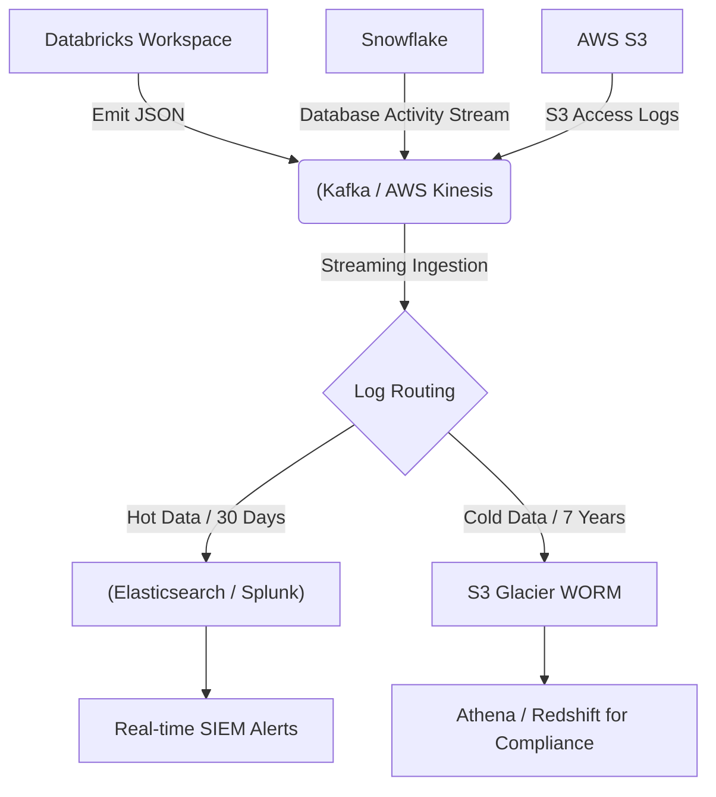
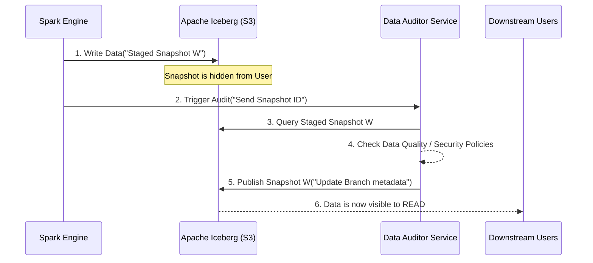

Một buổi sáng đẹp trời, hệ thống Data Warehouse của công ty bạn nhận một câu lệnh `DROP TABLE` từ một IP lạ. Hoặc tệ hơn, chi phí truy vấn BigQuery tháng này bất ngờ đội lên 50.000 USD do một luồng `SELECT *` quét toàn bộ bảng log 10PB mà không có mệnh đề `WHERE` (`Cartesian Explosion`). Trong những tình huống như vậy, Audit Logging (Nhật ký kiểm toán) chính là cứu cánh duy nhất để tìm ra *Blast Radius* (Bán kính ảnh hưởng) và *Root Cause* (Nguyên nhân gốc). 

Bài viết này bỏ qua những lý thuyết suông về compliance (như SOC 2 hay HIPAA) để đi thẳng vào **Kiến trúc Vật lý (Physical Architecture)** của Audit Logging ở quy mô Enterprise (trích xuất từ bài toán của Netflix và Uber).

## 1. Kiến trúc luồng Audit Log phân tán (Distributed Audit Logging Architecture)

Ở quy mô hàng nghìn Data Pipeline và hệ thống lưu trữ, việc streaming Audit Logs đòi hỏi một kiến trúc Pub/Sub chịu lỗi cao (Fault-tolerant) và đảm bảo tính bất biến (Immutability).

### 1.1. Luồng dữ liệu (Data Flow)

Thay vì ghi trực tiếp log vào Database, các hệ thống lớn (Uber, Databricks) luôn sử dụng kiến trúc Event-Driven, tách rời việc phát sinh log (Emission) và lưu trữ (Storage).




*(Hình minh họa: Kiến trúc Centralized Logging của AWS để phân tách Hot/Cold Storage)*

### 1.2. Đánh đổi Hệ thống (Systemic Trade-offs)
- **Latency vs. Reliability (Độ trễ vs. Độ tin cậy):** Nếu đẩy log trực tiếp vào hệ thống SIEM (như Splunk), độ trễ thấp nhưng rủi ro quá tải rất lớn (Bottleneck). Kafka/Kinesis đóng vai trò là Shock-absorber (bộ đệm giảm xóc). Tuy nhiên, đổi lại bạn phải giám sát hiện tượng `Consumer Lag`.
- **Compute Cost vs. Storage Cost:** Lưu trữ JSON raw trên S3 rất rẻ, nhưng mỗi lần query bằng Athena lại tốn tiền (Compute Cost theo Bytes Scanned). Do đó, cần có bước nén (Compression) và chuyển đổi sang định dạng Parquet thông qua Flink/Spark trước khi lưu.

## 2. Mô hình Write-Audit-Publish (WAP) của Netflix

Netflix xử lý hàng Exabyte dữ liệu, việc ghi Audit Log sau khi dữ liệu đã được query là quá muộn (Reactive). Thay vào đó, Netflix áp dụng mô hình **Write-Audit-Publish (WAP)** kết hợp với Apache Iceberg để Audit *trước* khi user truy cập.



**Thực thi kỹ thuật với Apache Iceberg:**
Trong WAP, Audit không chỉ ghi lại log truy cập, mà nó đóng vai trò chặn (Gatekeeper). Dữ liệu sẽ được ghi vào một nhánh (Branch) ẩn:

```sql
-- Ghi dữ liệu vào một nhánh audit ẩn (chưa publish)
ALTER TABLE logs.production_events CREATE BRANCH `audit_branch`;

-- Thực hiện ETL vào nhánh này
INSERT INTO logs.production_events.branch_audit_branch 
SELECT * FROM raw_events;

-- Auditor kiểm tra nhánh. Nếu vượt qua, thực hiện Cherry-pick (Publish)
CALL catalog.system.fast_forward('logs.production_events', 'main', 'audit_branch');
```

Nếu một lệnh chạy gây lỗi tràn bộ nhớ (JVM OOMKilled) giữa chừng, nhánh `audit_branch` bị hủy, nhánh `main` vẫn toàn vẹn.

## 3. Quản trị Cơ sở hạ tầng Audit Log (Infrastructure as Code)

Để đảm bảo tính bất biến (Immutability), Audit Log Bucket không được phép cho bất kỳ ai (kể cả Root user) chỉnh sửa/xóa. Công nghệ *S3 Object Lock* ở chế độ Compliance được cấu hình thông qua Terraform.

### 3.1. Thiết lập S3 WORM bằng Terraform

```hcl
resource "aws_s3_bucket" "audit_logs" {
  bucket = "company-central-audit-logs"

  # Bật Object Lock (Write-Once-Read-Many)
  object_lock_enabled = true
}

resource "aws_s3_bucket_object_lock_configuration" "audit_logs_lock" {
  bucket = aws_s3_bucket.audit_logs.id

  rule {
    default_retention {
      mode = "COMPLIANCE" # Tuyệt đối không thể bị ghi đè hay xóa
      days = 2555         # Lưu trữ 7 năm theo chuẩn tài chính
    }
  }
}
```

### 3.2. Cấu hình Kafka Chống mất Log (Zero Data Loss)

Khi hệ thống sinh log gặp sự cố mạng (Network Partition), nếu cấu hình Kafka sai, Audit Logs sẽ bốc hơi. Để đạt được *Zero Data Loss*, các Topic chứa Audit Logs phải cấu hình:

```properties
# Producer Configurations
acks=all
enable.idempotence=true
max.in.flight.requests.per.connection=5

# Topic / Broker Configurations
min.insync.replicas=2
replication.factor=3
```
*Trade-off:* Đặt `acks=all` và `min.insync.replicas=2` làm tăng độ trễ (Latency) vì Producer phải đợi các Follower broker xác nhận. Nếu Latency hệ thống gốc quá nhạy cảm, log phải được đẩy bất đồng bộ (Asynchronous) thông qua Local Agent (ví dụ Vector / Fluentd) để không block luồng xử lý chính.

## 4. Rủi ro Vận hành (Operational Incidents)

Trong thực tế, hệ thống Audit Logging có thể gây sập hệ thống chính nếu thiết kế không cẩn thận.

1. **Alert Fatigue (Kiệt sức vì cảnh báo):** 
   Một hệ thống Audit đẩy về 50.000 log lỗi xác thực (Auth failures) mỗi phút do một service cũ liên tục retry (Retry Storms) với token hết hạn. 
   *Khắc phục:* Áp dụng Rate Limiting hoặc Alert Deduplication ở lớp SIEM/Logstash.

2. **Cost Overrun (Bùng nổ chi phí FinOps):**
   Nếu thu thập 100% các câu truy vấn `SELECT` ở cấp độ hàng (Row-level) trên Databricks hoặc Snowflake, dung lượng log có thể vượt qua cả dữ liệu thực.
   *Khắc phục:* Chỉ bật Row-level logging ở các bảng nhạy cảm (PII/PHI). Đối với các bảng bình thường, chỉ Audit ở cấp độ DDL (Data Definition Language) và DML (Data Manipulation Language) thay vì DQL.

## 5. Nguồn Tham Khảo (References)

* [Netflix Tech Blog: Data Mesh - A Data Movement and Processing Platform](https://netflixtechblog.com/)
* [AWS Architecture Center: Centralized Logging](https://aws.amazon.com/architecture/)
* [Databricks Blog: Enabling Comprehensive Audit Logging](https://databricks.com/)
* [Uber Engineering: Auditing at Scale with Chaperone](https://www.uber.com/en-VN/blog/engineering/)
