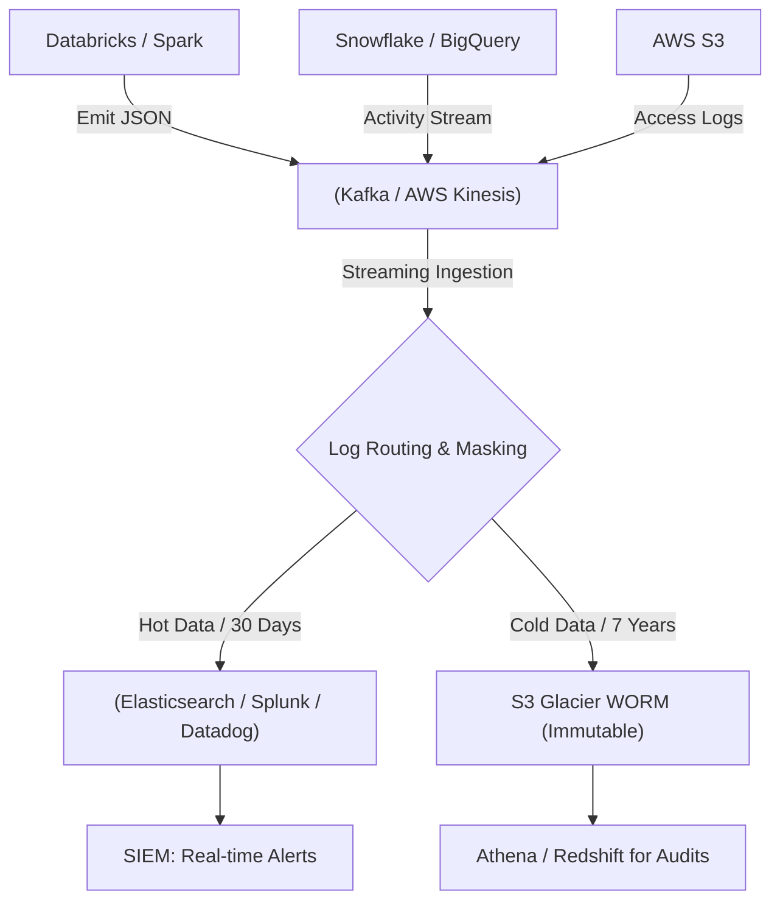
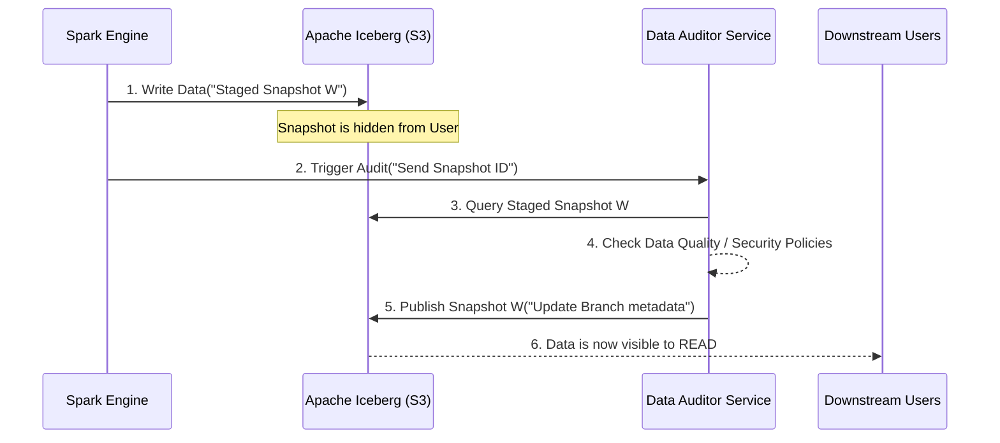

Một buổi sáng đẹp trời, hệ thống Data Warehouse của công ty bạn nhận một câu lệnh `DROP TABLE` từ một IP lạ. Hoặc tệ hơn, hóa đơn truy vấn BigQuery tháng này bất ngờ đội lên 50.000 USD do một luồng `SELECT *` quét toàn bộ bảng log 10PB mà không có mệnh đề `WHERE` (Hiện tượng `Cartesian Explosion`). 

Trong những tình huống như vậy, **Audit Logging (Nhật ký kiểm toán)** chính là cứu cánh duy nhất để tìm ra *Blast Radius* (Bán kính ảnh hưởng) và *Root Cause* (Nguyên nhân gốc). 

Bài viết này bỏ qua những lý thuyết suông về compliance để đi thẳng vào **Kiến trúc Vật lý (Physical Architecture)** của Audit Logging ở quy mô Enterprise, đảm bảo đáp ứng các tiêu chuẩn khắt khe như SOC 2, HIPAA, và GDPR.

---

## 1. Kiến trúc Centralized Logging & Tích hợp SIEM

Ở quy mô hàng nghìn Data Pipeline và hệ thống lưu trữ, việc streaming Audit Logs đòi hỏi một kiến trúc thu thập tập trung (Centralized Logging), kết hợp Pub/Sub chịu lỗi cao và kết nối trực tiếp với hệ thống SIEM (Security Information and Event Management).

### 1.1. Luồng dữ liệu (Data Flow)
Thay vì ghi trực tiếp log vào file cục bộ hay database hệ thống, các Big Tech luôn sử dụng kiến trúc Event-Driven, tách rời việc phát sinh log (Emission) và lưu trữ (Storage).



### 1.2. Đánh đổi Hệ thống [Systemic Trade-offs]
- **Latency vs. Reliability (Độ trễ vs. Độ tin cậy):** Nếu ứng dụng gọi API đẩy log trực tiếp vào hệ thống SIEM (như Splunk), độ trễ thấp nhưng rủi ro SIEM quá tải sẽ kéo sập cả ứng dụng gốc (Tight coupling). Kafka/Kinesis đóng vai trò là Shock-absorber (bộ đệm giảm xóc). Đổi lại, kỹ sư phải giám sát hiện tượng `Consumer Lag`.
- **Compute Cost vs. Storage Cost:** Lưu JSON raw trên S3 rất rẻ, nhưng mỗi lần Auditor yêu cầu query bằng Athena lại tốn tiền (Compute Cost theo Bytes Scanned). Do đó, luồng Cold Data thường phải đi qua bước nén và chuyển đổi sang định dạng Parquet (bằng Flink/Spark) trước khi lưu trữ dài hạn.

---

## 2. PII Masking: Ẩn danh Dữ liệu Nhạy Cảm Tại Nguồn (At Ingestion)

Việc thu thập log sinh ra một rủi ro tuân thủ (Compliance Risk) khổng lồ: Vô tình ghi lại dữ liệu PII (Personally Identifiable Information) như email, số thẻ tín dụng, session token vào trong Log.

Nếu log chứa PII không được mã hóa và bị lộ, công ty sẽ vi phạm nghiêm trọng GDPR hoặc SOC 2.
- **Best Practice (Mask at Ingestion):** Tại bước *Log Routing & Masking* (ví dụ dùng Logstash, Fluentd, hoặc Vector), kỹ sư thiết lập các bộ lọc Regex để tự động phát hiện và băm (hash) hoặc che (mask) PII *trước khi* log được ghi vào SIEM hoặc S3.

```conf
# Ví dụ cấu hình Fluentd / Fluent Bit che email trong log
[FILTER]
    Name    modify
    Match   audit.*
    # Mask email address: abc@gmail.com -> ***@gmail.com
    Condition Key_Value_Matches email ^[a-zA-Z0-9_.+-]+@[a-zA-Z0-9-]+\.[a-zA-Z0-9-.]+$
    Set email ***@redacted.com
```

---

## 3. Mô hình Write-Audit-Publish (WAP] của Netflix

Netflix xử lý hàng Exabyte dữ liệu. Việc ghi Audit Log *sau khi* dữ liệu bẩn đã được query và lên Dashboard là quá muộn (Reactive). 
Thay vào đó, Netflix áp dụng mô hình **Write-Audit-Publish (WAP)** kết hợp với Apache Iceberg để Audit *trước khi* user có thể truy cập (Proactive).



**Thực thi kỹ thuật với Apache Iceberg:**
Trong WAP, Audit đóng vai trò "người gác cổng" (Gatekeeper). Dữ liệu được ghi vào một nhánh (Branch) ẩn:

```sql
-- Ghi dữ liệu vào một nhánh audit ẩn (chưa publish)
ALTER TABLE logs.production_events CREATE BRANCH `audit_branch`;

-- Thực hiện ETL vào nhánh này
INSERT INTO logs.production_events.branch_audit_branch 
SELECT * FROM raw_events;

-- Auditor kiểm tra nhánh. Nếu an toàn, thực hiện Cherry-pick (Publish)
CALL catalog.system.fast_forward('logs.production_events', 'main', 'audit_branch');
```

Nếu dữ liệu vi phạm chính sách bảo mật, nhánh `audit_branch` bị hủy, nhánh `main` (nơi người dùng truy cập) vẫn an toàn tuyệt đối.

---

## 4. WORM Storage & Hạ tầng Bất biến (Infrastructure as Code)

Để đạt chứng nhận SOC 2 (Tiêu chí Non-repudiation - Chống chối bỏ), Audit Log Bucket **KHÔNG ĐƯỢC PHÉP** cho bất kỳ ai (kể cả Root/Admin user) chỉnh sửa hay xóa trong một khoảng thời gian quy định (thường là 7 năm). 
Công nghệ **WORM (Write-Once-Read-Many)**, cụ thể là *S3 Object Lock* ở chế độ Compliance, được sử dụng.

### Thiết lập S3 WORM bằng Terraform

```hcl
resource "aws_s3_bucket" "audit_logs" {
  bucket = "company-central-audit-logs"
  # Bật Object Lock (Write-Once-Read-Many)
  object_lock_enabled = true
}

resource "aws_s3_bucket_object_lock_configuration" "audit_logs_lock" {
  bucket = aws_s3_bucket.audit_logs.id

  rule {
    default_retention {
      mode = "COMPLIANCE" # Tuyệt đối không thể bị ghi đè hay xóa
      days = 2555         # Lưu trữ 7 năm theo chuẩn tài chính/y tế
    }
  }
}
```

---

## 5. Rủi ro Vận hành và FinOps

Trong thực tế, hệ thống Audit Logging có thể gây sập hệ thống chính nếu thiết kế không cẩn thận.

1. **Rủi ro mất Log [Zero Data Loss]:** Khi sinh log, nếu cấu hình Kafka sai, Audit Logs sẽ bốc hơi khi mất mạng. Phải đặt cấu hình Kafka Producer `acks=all` và `min.insync.replicas=2`. *Trade-off:* Việc này làm tăng độ trễ (Latency). Để không block luồng xử lý của ứng dụng chính, ứng dụng chỉ ghi log ra đĩa cục bộ, rồi dùng Local Agent (Vector/Fluentd) đẩy bất đồng bộ (Asynchronous) lên Kafka.
2. **Alert Fatigue (Kiệt sức vì cảnh báo):** Một hệ thống Audit đẩy về SIEM 50.000 log lỗi xác thực (Auth failures) mỗi phút do một service cũ liên tục retry với token hết hạn. SIEM báo động đỏ liên tục khiến kỹ sư bỏ qua (Ignore). *Khắc phục:* Áp dụng Alert Deduplication (Gộp cảnh báo) ở lớp SIEM.
3. **Cost Overrun (Bùng nổ chi phí FinOps):** Nếu thu thập 100% các câu truy vấn `SELECT` ở cấp độ hàng (Row-level) trên Snowflake, dung lượng log có thể vượt qua cả lượng dữ liệu thực tế. *Khắc phục:* Chỉ bật Row-level logging ở các bảng chứa PII/PHI. Đối với các bảng bình thường, chỉ Audit ở cấp độ DDL (CREATE/DROP) và DML (INSERT/UPDATE/DELETE).

---

## Nguồn Tham Khảo (References)
* [Netflix Tech Blog: Data Mesh - A Data Movement and Processing Platform][https://netflixtechblog.com/]
* [AWS Architecture Center: Centralized Logging & SIEM][https://aws.amazon.com/architecture/]
* [SOC 2 Compliance: Trust Services Criteria][https://www.aicpa.org/]
* [Apache Iceberg: Branching and Tagging](https://iceberg.apache.org/docs/latest/branching/]
