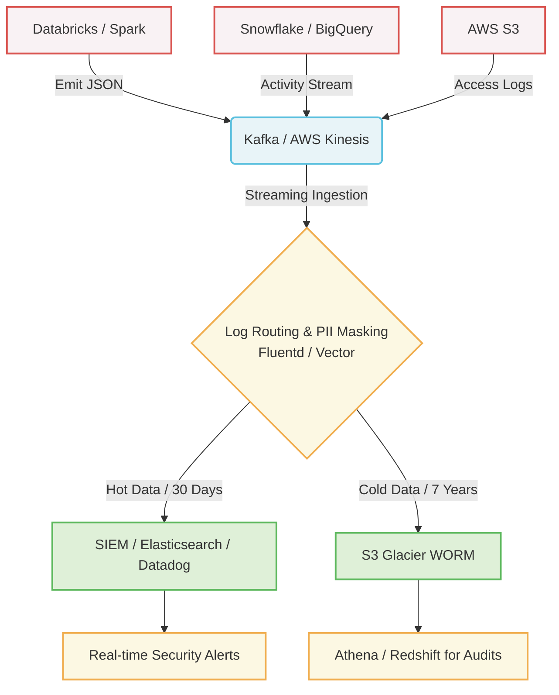
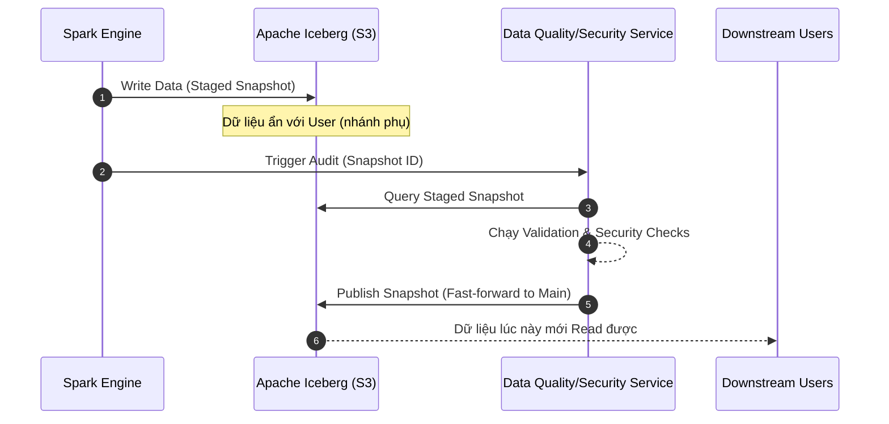

Một buổi sáng, hệ thống Data Warehouse của công ty bạn nhận một câu lệnh `DROP TABLE` từ một IP lạ. Hoặc hóa đơn BigQuery tháng này bất ngờ đội lên 10.000 USD do một luồng `SELECT *` quét toàn bộ bảng log 10PB mà không có mệnh đề `WHERE` (hiện tượng Cartesian Explosion). 

Trong những tình huống sự cố bảo mật hoặc bùng nổ chi phí, **Audit Logging (Nhật ký kiểm toán)** là lớp bằng chứng giúp xác định bán kính ảnh hưởng (blast radius), truy vết hành động và tìm nguyên nhân gốc rễ (root cause). 

Phần quan trọng không phải là khẩu hiệu compliance, mà là kiến trúc vật lý: log phát sinh ở đâu, đi qua hàng đợi nào, được mask ra sao, lưu bao lâu, ai được query, và dùng thế nào cho điều tra sự cố lẫn FinOps.

## Audit Logging là gì và giải quyết vấn đề gì?

Về bản chất, Audit Logging là quá trình ghi lại một cách bất biến (immutable) toàn bộ các hành động xảy ra trong hệ thống: ai (who), làm gì (what), khi nào (when), ở đâu (where), và kết quả ra sao (outcome). 

Trong Data Engineering, Audit Logging **giải quyết ba vấn đề cốt lõi:**
1. **Security & Forensics:** Cung cấp dấu vết để đội bảo mật (SecOps) điều tra sau khi sự cố xảy ra.
2. **Compliance (Tuân thủ):** Đáp ứng các tiêu chuẩn khắt khe như SOC 2, HIPAA, GDPR (yêu cầu lưu trữ log chống chối bỏ - Non-repudiation).
3. **FinOps & Operational Cost:** Cung cấp query-level observability để tìm ra những luồng truy vấn lãng phí tài nguyên nhất.

Audit Logging **KHÔNG PHẢI LÀ:**
- Hệ thống block request theo thời gian thực (đó là vai trò của Access Control/WAF).
- Nơi chứa dữ liệu kinh doanh (Business Data). Việc vô tình log dữ liệu PII là một rủi ro cực kỳ lớn.

## Kiến trúc Centralized Logging & Tích hợp SIEM

Ở quy mô hàng nghìn Data Pipeline và hệ thống lưu trữ, việc thu thập Audit Logs đòi hỏi một kiến trúc tập trung (Centralized Logging). Luồng dữ liệu phải được tách rời (decoupled) giữa nơi phát sinh (Emission) và nơi lưu trữ (Storage), đồng thời kết nối với hệ thống SIEM (Security Information and Event Management) để cảnh báo.

### Luồng dữ liệu (Data Flow)

Thay vì ghi trực tiếp log vào file cục bộ (dễ mất khi server crash) hay đẩy thẳng API của SIEM (rủi ro tight coupling và quá tải), các hệ thống thường dùng Message Broker làm bộ đệm.


*(Sơ đồ: Kiến trúc Centralized Audit Logging tích hợp SIEM)*

### Đánh đổi hệ thống (Systemic Trade-offs)
- **Latency vs. Reliability:** Dùng Kafka làm shock-absorber giúp hệ thống gốc không bị block khi SIEM quá tải. Đổi lại, kỹ sư phải vận hành cụm Kafka và giám sát hiện tượng `Consumer Lag`. Để tránh mất log khi hệ thống sập, Kafka Producer thường phải đặt `acks=all`, điều này làm tăng độ trễ mạng.
- **Compute vs. Storage Cost:** Lưu raw JSON trên S3 rất rẻ, nhưng mỗi lần Auditor yêu cầu query bằng Athena lại tốn tiền (tính phí theo Bytes Scanned). Do đó, luồng Cold Data thường phải đi qua bước nén và chuyển đổi sang định dạng cột (Parquet) trước khi lưu trữ dài hạn.

## PII Masking: Ẩn danh dữ liệu tại nguồn (At Ingestion)

Việc thu thập log cũng tạo ra rủi ro tuân thủ: vô tình ghi lại dữ liệu PII (Personally Identifiable Information) như email, số thẻ tín dụng, session token. Nếu log chứa PII bị lộ hoặc bị giữ quá thời hạn cần thiết, đội bảo mật sẽ phải xử lý nó như một nguồn dữ liệu nhạy cảm thật sự.

**Cơ chế Mask at Ingestion:**
Tại bước Log Routing (sử dụng Logstash, Fluentd, hoặc Vector), kỹ sư thiết lập các bộ lọc Regex để tự động phát hiện và băm (hash) hoặc che (mask) PII *trước khi* log được ghi vào SIEM hoặc S3.

Ví dụ cấu hình Fluent Bit để che email trong log:
```conf
[FILTER]
    Name    modify
    Match   audit.*
    # Mask email address: abc@gmail.com -> ***@gmail.com
    Condition Key_Value_Matches email ^[a-zA-Z0-9_.+-]+@[a-zA-Z0-9-]+\.[a-zA-Z0-9-.]+$
    Set email ***@redacted.com
```

## Mô hình Write-Audit-Publish (WAP): Audit chủ động

Việc ghi Audit Log *sau khi* dữ liệu lỗi đã được query và lên Dashboard là phản ứng bị động (Reactive). Để khắc phục, Netflix đã áp dụng mô hình **Write-Audit-Publish (WAP)** kết hợp với Apache Iceberg để Audit chất lượng và bảo mật *trước khi* người dùng có thể truy cập (Proactive).


*(Sơ đồ: Luồng thực thi Write-Audit-Publish với Apache Iceberg)*

Trong kiến trúc Data Mesh, WAP là chốt kiểm tra trước khi dữ liệu được xuất bản. Nếu dữ liệu vi phạm chính sách bảo mật hoặc data contract, nhánh tạm sẽ bị hủy, và nhánh production (`main`) không bị ảnh hưởng.

Ví dụ thực thi bằng SQL trên Iceberg:
```sql
-- 1. Ghi dữ liệu vào một nhánh audit ẩn
ALTER TABLE logs.production_events CREATE BRANCH `audit_branch`;
INSERT INTO logs.production_events.branch_audit_branch SELECT * FROM raw_events;

-- 2. Hệ thống chạy Audit checks trên nhánh `audit_branch`
-- 3. Nếu an toàn, thực hiện Cherry-pick (Publish) lên nhánh chính
CALL catalog.system.fast_forward('logs.production_events', 'main', 'audit_branch');
```

## WORM Storage & Tiêu chuẩn chống chối bỏ (SOC 2)

Để đạt chứng nhận SOC 2, Audit Log **KHÔNG ĐƯỢC PHÉP** bị chỉnh sửa hay xóa bởi bất kỳ ai (kể cả Root/Admin user) trong thời gian quy định (thường là 7 năm). Tiêu chí này được gọi là Non-repudiation (Chống chối bỏ).

Giải pháp là sử dụng công nghệ **WORM (Write-Once-Read-Many)**. Trên AWS, tính năng *S3 Object Lock* ở chế độ **Compliance Mode** được sử dụng. Một khi đã bật Compliance Mode, AWS đảm bảo không một ai có thể xóa file cho tới khi hết hạn retention.

Thiết lập S3 WORM bằng Terraform:
```hcl
resource "aws_s3_bucket" "audit_logs" {
  bucket = "company-central-audit-logs"
  # Yêu cầu bật Versioning trước khi dùng Object Lock
  versioning {
    enabled = true
  }
}

resource "aws_s3_bucket_object_lock_configuration" "audit_logs_lock" {
  bucket = aws_s3_bucket.audit_logs.id
  rule {
    default_retention {
      mode = "COMPLIANCE" # Tuyệt đối không thể bị ghi đè hay xóa
      days = 2555         # Lưu trữ 7 năm (2555 ngày)
    }
  }
}
```

## FinOps: Khai thác Audit Logs để tối ưu chi phí

Trong các Data Warehouse đám mây, hóa đơn thường khó giải thích nếu thiếu Audit Logs. Bằng cách phân tích Query Logs, Data Engineer có thể tìm ra các điểm rò chi phí lặp lại:

- **Với Snowflake:** Bảng `SNOWFLAKE.ACCOUNT_USAGE.QUERY_HISTORY` lưu toàn bộ thông tin về các câu truy vấn. Bạn có thể group theo user hoặc dbt model để tìm ra những pipeline tiêu tốn nhiều Credit nhất. Logs cũng giúp phát hiện các Virtual Warehouse có tỷ lệ rảnh rỗi (idle) cao để điều chỉnh chính sách auto-suspend xuống 60 giây.
- **Với BigQuery:** Xuất Cloud Audit Logs sang một dataset BigQuery riêng và query metadata `INFORMATION_SCHEMA.JOBS_BY_PROJECT`. Từ đây, kỹ sư dễ dàng tìm ra những câu lệnh `SELECT *` quét hàng Terabyte dữ liệu mà quên lọc Partition. Kỹ thuật "Dry Run" cũng thường được gọi thông qua API để ước tính chi phí trước khi thực sự chạy job.

## Thuật ngữ chính (Key terms)

| Term | Nghĩa ngắn |
| --- | --- |
| SIEM | Hệ thống quản lý sự kiện và thông tin bảo mật, nơi phân tích log để phát hiện mối đe dọa. |
| WORM (Write-Once-Read-Many) | Chuẩn lưu trữ bất biến, không cho phép xóa hay sửa đổi dữ liệu đã ghi. |
| PII (Personally Identifiable Information) | Thông tin nhận dạng cá nhân (email, SĐT, căn cước) cần được bảo vệ nghiêm ngặt. |
| SOC 2 (System and Organization Controls 2) | Tiêu chuẩn kiểm toán bảo mật, yêu cầu có Audit Log chống chối bỏ. |
| WAP (Write-Audit-Publish) | Design pattern giúp kiểm định dữ liệu trên nhánh phụ trước khi công bố ra nhánh chính. |

## Tài liệu tham khảo

- Data Mesh - A Data Movement and Processing Platform, Netflix Tech Blog. [Link](https://netflixtechblog.com/data-mesh-a-data-movement-and-processing-platform-netflix-1288bcab2873)
- Using S3 Object Lock, AWS Documentation. [Link](https://docs.aws.amazon.com/AmazonS3/latest/userguide/object-lock.html)
- Apache Iceberg: Branching and Tagging, Apache Docs. [Link](https://iceberg.apache.org/docs/latest/branching/)
- What is a SIEM?, Logz.io Blog. [Link](https://logz.io/learn/what-is-siem/)
