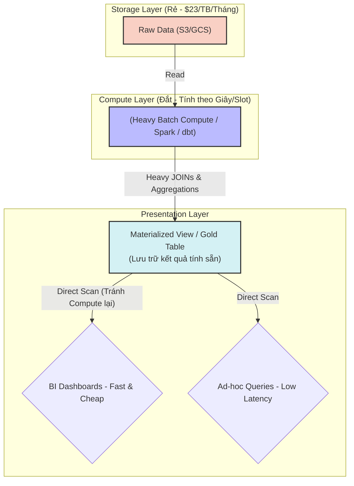

Cost Optimization (Tối ưu hóa chi phí) trong Data Engineering không đơn thuần là việc nhắc nhở mọi người "tắt server khi không dùng" hay "viết SQL cho gọn". Trong môi trường Cloud Data Platform hiện đại, nó là sự cân bằng nghệ thuật mang tính hệ thống giữa **Latency (Độ trễ)**, **Throughput (Thông lượng)**, và **Tiền bạc (Cost)**.

Với mô hình *pay-as-you-go* (xài bao nhiêu trả bấy nhiêu), một lỗi thiết kế hệ thống nhỏ (như quên khóa Partition hoặc cấu hình sai Auto-suspend) có thể dẫn đến hiện tượng *Full Table Scan* trên hàng Petabytes dữ liệu, gây ra các hóa đơn Cloud trị giá hàng chục nghìn đô la chỉ sau một đêm.

Dưới góc nhìn của một Staff Engineer, bài viết này đi sâu vào kiến trúc thực thi vật lý, các sự cố "đốt tiền" kinh điển, và cách triển khai **FinOps** (Financial Operations) thực chiến bằng Infrastructure as Code và SQL Configuration.

---

## 1. Sự Đánh Đổi Hệ Thống (Systemic Trade-offs)

Mọi quyết định thiết kế kiến trúc dữ liệu đều tuân theo một "tam giác bất khả thi": **Cost - Latency - Performance**. 

### 1.1. Streaming vs. Batch (Độ trễ vs. Chi phí Idle)
Nhiều kỹ sư có xu hướng mặc định chọn kiến trúc Real-time Streaming (Kafka + Flink) cho mọi pipeline với suy nghĩ "dữ liệu càng real-time càng tốt". Tuy nhiên, kiến trúc Streaming yêu cầu các compute nodes phải chạy liên tục `24/7` để duy trì kết nối mạng và xử lý checkpointing.
-   **Trade-off:** Việc chấp nhận độ trễ (Latency) cao hơn (vài giờ hoặc 1 ngày) bằng cơ chế Batching (như Apache Airflow + Spark) cho phép hệ thống sử dụng **Spot Instances** (máy ảo dư thừa giá rẻ giảm 70%), khởi động lên, chạy ngấu nghiến dữ liệu trong 1 giờ rồi tự tắt hoàn toàn, loại bỏ triệt để chi phí nhàn rỗi (Idle Cost).
-   **Quyết định hệ thống:** Chỉ thiết kế Real-time Ingestion cho các nghiệp vụ trực tiếp sinh lời lập tức (như Dynamic Pricing, Fraud Detection). Với các Dashboard BI tổng kết hàng ngày cho C-level, Batch Processing là lựa chọn duy nhất đúng đắn về mặt FinOps.

### 1.2. Compute Cost vs. Storage Cost
Trong các mô hình Data Warehouse hiện đại (như Snowflake, BigQuery, Databricks), chi phí CPU (Compute) đắt đỏ hơn hàng trăm lần so với chi phí lưu ổ cứng (S3/GCS Storage). Việc duy trì dữ liệu ở chuẩn Normalization (3NF) cực kỳ khắt khe đòi hỏi hệ thống phải thực hiện hàng loạt lệnh `JOIN` đắt đỏ khi truy vấn, gây "đốt cháy" CPU.



-   **Trade-off:** Staff Engineer chủ động đánh đổi Storage (chấp nhận lưu trữ dư thừa dữ liệu) bằng cách **Denormalize** (Phi chuẩn hóa) hoặc xây dựng **Materialized Views**. Việc tính toán trước kết quả bằng Batch Job ban đêm và lưu sẵn dưới dạng vật lý giúp giảm triệt để chi phí chạy Compute Engine khổng lồ ở thời gian thực mỗi khi User mở Dashboard.

---

## 2. Phân Tích FinOps trên các Nền Tảng Đình Đám

### 2.1. Snowflake: Bài toán Workload Isolation vs. Idle Cost
Snowflake sử dụng mô hình **Virtual Warehouses** (Cụm máy chủ ảo tách biệt compute và storage). Bạn đang trả tiền cho "thời gian cụm máy chủ bật".
-   *Systemic Trade-off:* Bạn có được sự cô lập tuyệt đối (Workload Isolation - Tách riêng Warehouse cho Data Engineering chạy ETL nặng, và Warehouse khác cho BI Dashboard để không tranh giành tài nguyên). Tuy nhiên, bạn đối mặt với rủi ro "Idle Spend" nếu cấu hình sai thời gian tự động tắt.
-   *Sự cố thực tế:* Kỹ sư cấu hình Warehouse `X-Large` nhưng quên set `AUTO_SUSPEND`. Kết quả là Warehouse chạy không tải cả đêm cuối tuần, tiêu tốn hàng nghìn đô.

**Thực chiến: Cấu hình Snowflake FinOps tối ưu**
```sql
-- Tạo Warehouse chuyên dụng cho BI, tự động tắt siêu nhanh để tiết kiệm tiền
CREATE OR REPLACE WAREHOUSE BI_REPORTING_WH
WITH 
  WAREHOUSE_SIZE = 'MEDIUM'
  -- Tự động tắt sau 60 giây không có query (rất quan trọng)
  AUTO_SUSPEND = 60 
  -- Tự động bật lại khi có query tới
  AUTO_RESUME = TRUE 
  -- Hủy ngay các query chạy quá 10 phút để tránh bị kẹt (runaway queries)
  STATEMENT_TIMEOUT_IN_SECONDS = 600;
```

### 2.2. BigQuery: Bài toán Serverless & Full Table Scan
BigQuery là một cỗ máy **True Serverless**. Mặc định (On-demand pricing), bạn không trả tiền cho thời gian bật máy, bạn trả tiền dựa trên **Số Byte Dữ Liệu Bị Quét (Bytes Scanned)** (khoảng \$5 - \$6 cho mỗi Terabyte quét).
-   *Systemic Trade-off:* Hoàn hảo cho các truy vấn Ad-hoc bùng nổ mà không cần quản lý máy chủ. Nhưng thảm họa xảy ra khi bạn gặp "Runaway Queries" (Ví dụ: Chạy `SELECT *` không có mệnh đề `WHERE` thời gian).
-   *Sự cố thực tế (Cartesian Explosion):* Data Analyst viết `JOIN` 2 bảng Fact tỷ dòng nhưng viết sai điều kiện `ON` (hoặc thiếu). BigQuery sinh ra 1 tỷ tỷ dòng trung gian, quét hết slot của toàn công ty, và đốt sạch 5.000 USD trước khi tiến trình bị timeout hoặc OOM.

**Thực chiến: Cấu hình BigQuery FinOps bằng Partitioning & Clustering**
Bắt buộc phải ép buộc (Enforce) người dùng sử dụng Partition Key (Thường là cột thời gian) để BigQuery bỏ qua (Prune) các thư mục dữ liệu không liên quan.

```sql
-- DDL tạo bảng trong BigQuery bắt buộc dùng Partition
CREATE TABLE `my_project.data_warehouse.fact_transactions` (
    transaction_id STRING,
    user_id INT64,
    amount FLOAT64,
    transaction_date DATE
)
-- Chia nhỏ dữ liệu vật lý theo từng ngày
PARTITION BY transaction_date 
-- Sắp xếp dữ liệu trong từng ngày để tăng tốc query tìm kiếm user
CLUSTER BY user_id
OPTIONS (
    -- FINOPS GUARDRAIL CHÍNH: 
    -- Từ chối mọi câu query nếu không có mệnh đề WHERE transaction_date = ...
    require_partition_filter = TRUE 
);
```

### 2.3. Chuyển Đổi Mô Hình (Pricing Models)
Khi khối lượng công việc của bạn trở nên ổn định và dễ đoán, hãy rời khỏi mô hình On-demand (Pay-per-query).
-   **BigQuery:** Chuyển sang mua **Capacity (Slots)** cố định.
-   **AWS / GCP:** Chuyển sang mua **Reserved Instances** (Cam kết 1-3 năm để giảm tới 60% chi phí).

---

## 3. Thuế Dịch Chuyển Mạng (Cloud Egress Tax) & Data Gravity

-   **Bối cảnh:** Một công ty triển khai Kafka Ingestion trên nền tảng GCP để nhận event từ Mobile App, nhưng Data Warehouse xử lý chính (Snowflake) lại được host tại AWS `us-east-1`.
-   **Hậu quả FinOps:** Việc đẩy 100TB dữ liệu dạng thô (Raw) mỗi tháng xuyên qua mạng Internet từ GCP sang AWS sẽ vấp phải Egress Cost vô cùng đắt đỏ (khoảng \$0.09/GB trên AWS/GCP). Công ty sẽ mất ~\$9,000/tháng chỉ để trả tiền "phí cầu đường" mạng, chưa tính tiền xử lý dữ liệu.
-   **Kiến trúc khắc phục (Data Gravity):** 
    - Luôn tuân thủ nguyên tắc *Data Gravity* - xử lý dữ liệu ở nơi lưu trữ nó. Data nằm ở AWS thì Compute phải nằm ở AWS.
    - Nếu kiến trúc bắt buộc phải là Multi-cloud, hãy nén file (dùng chuẩn Parquet hoặc ZSTD compression) và **chỉ luân chuyển dữ liệu đã được làm sạch, tổng hợp (Aggregated/Gold Data)**. Tuyệt đối không stream toàn bộ luồng Raw Events thô qua ranh giới Cloud.

---

## 4. Quản Trị Hệ Thống (Governance & Cost Attribution)

FinOps không phải là công việc của một đợt dọn dẹp hàng quý. Nó là một văn hóa kỹ thuật liên tục (Continuous Culture). Tại các công ty Big Tech như Netflix hay Uber, hạ tầng phải minh bạch trả lời câu hỏi: *"Ai đang tiêu bao nhiêu tiền?"*.

1.  **Resource Tagging (Gắn thẻ tài nguyên):** Mọi hạ tầng phải được gắn thẻ (Tags/Labels) từ lúc khởi tạo bằng Terraform (IaC). Không có thẻ, quá trình CI/CD sẽ đánh rớt (Fail pipeline).
2.  **Chargeback / Showback:** Dựa vào Tags, hệ thống Billing hàng tháng sẽ gán trực tiếp chi phí (Chargeback) cho ngân sách của từng phòng ban, ép họ phải chịu trách nhiệm.

```hcl
# Bắt buộc khai báo Tags cho mọi tài nguyên Terraform
tags = {
  Environment = "Production"
  Team        = "Data-Science"
  Project     = "Realtime-Fraud-Detection"
  Owner       = "jane.doe@company.com"
  CostCenter  = "CC-10293" # Mã phòng ban kế toán
}
```

**Nguyên tắc vàng của FinOps (Netflix Culture - Freedom and Responsibility):** 
Đừng bao giờ sử dụng giới hạn cứng (Hard Budget Limits) để cắt sập nguồn điện các ETL Jobs của kỹ sư giữa chừng, vì điều đó gây rủi ro đứt gãy luồng dữ liệu (Data Outage / Data Loss). Thay vào đó, hãy cung cấp cho họ **Khả năng quan sát (Visibility)** thông qua các Dashboard Billing cập nhật thời gian thực, để các kỹ sư tự nhận thức và chủ động refactor lại các đoạn code "đốt tiền" của chính mình.

---

## Nguồn Tham Khảo [References]

1. **AWS Architecture Blog**: [Cost Optimization Design Principles][https://docs.aws.amazon.com/wellarchitected/latest/cost-optimization-pillar/design-principles.html] - Kiến trúc FinOps chuẩn mực trên AWS.
2. **Databricks Engineering**: [A Crawl, Walk, Run Approach to Cloud FinOps][https://www.databricks.com/blog/2023/04/13/crawl-walk-run-approach-cloud-finops.html] - Hướng dẫn tiếp cận FinOps thực tiễn với các hệ thống phân tán lớn.
3. **Netflix Tech Blog**: [Data Mesh & Cost Accountability](https://netflixtechblog.com/] - Phân tích cách Netflix phân bổ chi phí hạ tầng dữ liệu và đề cao văn hóa "Tự do và Trách nhiệm".
4. Sách: **Designing Data-Intensive Applications** - *Martin Kleppmann* [Phân tích chuyên sâu về hệ thống Storage Engines và Latency Trade-offs].
5. **Uber Engineering**: [Optimizing Big Data at Scale](https://www.uber.com/en-VN/blog/engineering/] - Bài học xương máu về quản lý hóa đơn của hàng ngàn cluster Hadoop và Spark khổng lồ.
