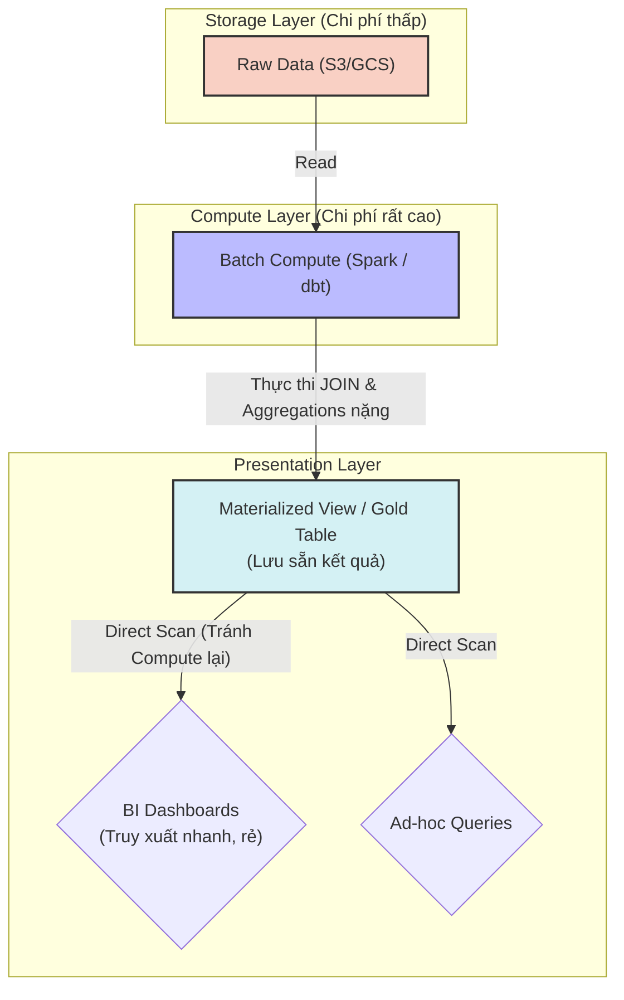

Trong môi trường Cloud Data Platform với mô hình *pay-as-you-go* (xài bao nhiêu trả bấy nhiêu), việc chỉ tập trung vào chức năng là chưa đủ. Một lỗi thiết kế nhỏ, chẳng hạn quên khóa partition trong truy vấn hoặc cấu hình sai thời gian auto-suspend của cụm máy chủ, có thể kích hoạt *Full Table Scan* trên dữ liệu rất lớn và làm hóa đơn tăng mạnh trong thời gian ngắn.

FinOps (Financial Operations) trong Data Engineering không phải là những đợt cắt giảm ngân sách thủ công hàng quý. Đó là cách đưa trách nhiệm chi phí vào thiết kế pipeline, lựa chọn storage format, cách partition dữ liệu, lịch chạy batch job và chính sách vận hành warehouse.

## 1. Sự đánh đổi hệ thống (Systemic Trade-offs)

Mọi quyết định thiết kế kiến trúc dữ liệu đều xoay quanh tam giác **Cost (Chi phí) - Latency (Độ trễ) - Throughput (Thông lượng)**.

### 1.1. Streaming vs. Batch (Độ trễ vs. Chi phí Idle)
Nhiều kỹ sư có xu hướng ưu tiên kiến trúc Real-time Streaming (ví dụ: dùng Kafka kết hợp Flink) với kỳ vọng dữ liệu luôn được cập nhật tức thì. Tuy nhiên, kiến trúc Streaming đòi hỏi các compute node phải chạy liên tục 24/7 để duy trì kết nối mạng và xử lý checkpointing.

**Trade-off:** Chấp nhận độ trễ vài giờ hoặc chạy theo lịch trình (Batching bằng Apache Airflow và Spark) cho phép hệ thống sử dụng **Spot Instances** (các phiên bản máy ảo dư thừa, giúp giảm tới 60-90% chi phí). Cụm máy chủ chỉ bật lên, tiêu thụ toàn bộ tài nguyên để xử lý dữ liệu trong 1 giờ, rồi tắt hoàn toàn. Cách làm này loại bỏ triệt để chi phí nhàn rỗi (Idle Cost). Trừ khi nghiệp vụ thực sự sinh lời lập tức (như phát hiện gian lận hay định giá động), Batch Processing vẫn là lựa chọn an toàn và tối ưu nhất về mặt FinOps.

### 1.2. Compute Cost vs. Storage Cost
Trong các mô hình Data Warehouse hiện đại (như Snowflake, BigQuery, Databricks), chi phí cho quá trình xử lý CPU (Compute) đắt đỏ hơn rất nhiều so với chi phí lưu trữ trên ổ đĩa (S3/GCS Storage). Duy trì dữ liệu ở dạng chuẩn hóa khắt khe (3NF) khiến hệ thống phải thực hiện hàng loạt lệnh `JOIN` đắt đỏ mỗi khi có truy vấn phân tích.


*Sơ đồ đánh đổi chi phí Compute và Storage: Đẩy tải tính toán nặng vào Batch Job ban đêm để giảm thiểu chi phí khi người dùng truy vấn.*

**Trade-off:** Staff Engineer có thể chủ động đánh đổi Storage (chấp nhận lưu trữ dữ liệu dư thừa) bằng cách phi chuẩn hóa (Denormalization) hoặc sử dụng **Materialized Views**. Việc tính toán trước kết quả và lưu sẵn dưới dạng vật lý thường rẻ hơn so với việc chạy lại cùng một chuỗi `JOIN` và aggregation mỗi khi người dùng mở dashboard.

## 2. FinOps thực chiến trên các Data Platform

Mỗi nền tảng dữ liệu có mô hình tính cước khác nhau, đòi hỏi những chiến thuật kiểm soát đặc thù.

### 2.1. Snowflake: Workload Isolation và Idle Cost
Snowflake sử dụng mô hình **Virtual Warehouses** (Cụm máy chủ ảo tách biệt compute và storage). Bạn trả tiền dựa trên thời gian cụm máy chủ đang bật, tính theo giây.

Lợi ích của mô hình này là sự cô lập workload: bạn có thể cấp riêng một Warehouse cấu hình lớn cho Data Engineering chạy ETL, và một Warehouse nhỏ hơn cho BI Dashboard để chúng không tranh giành tài nguyên. Điểm dễ sai nhất là cấu hình Warehouse quá to nhưng quên thiết lập `AUTO_SUSPEND`, khiến máy chủ chạy không tải nhiều giờ và sinh chi phí không phục vụ truy vấn nào.

**Cấu hình tối ưu:**
```sql
-- Tạo Warehouse chuyên dụng cho BI, tự động tắt nhanh để tiết kiệm chi phí
CREATE OR REPLACE WAREHOUSE BI_REPORTING_WH
WITH 
  WAREHOUSE_SIZE = 'MEDIUM'
  -- Tự động tắt sau 60 giây không có query (FinOps guardrail)
  AUTO_SUSPEND = 60 
  AUTO_RESUME = TRUE 
  -- Hủy ngay các query chạy quá 10 phút để tránh bị kẹt (runaway queries)
  STATEMENT_TIMEOUT_IN_SECONDS = 600;
```

### 2.2. BigQuery: Serverless và rủi ro Full Table Scan
Ở chế độ mặc định (On-demand pricing), BigQuery hoạt động theo cơ chế **True Serverless**: bạn không trả tiền cho thời gian bật máy, mà trả tiền cho **số byte dữ liệu bị quét (Bytes Scanned)**.

Điều này rất tiện cho các truy vấn bùng nổ, nhưng rủi ro cao nếu Data Analyst chạy `SELECT *` không có mệnh đề `WHERE` trên bảng lịch sử nhiều năm. Một lỗi phổ biến là **Cartesian Explosion**: khi `JOIN` hai bảng fact lớn nhưng viết sai hoặc thiếu điều kiện `ON`, engine tạo ra tập dữ liệu trung gian lớn hơn rất nhiều so với dữ liệu đầu vào, rồi timeout hoặc cạn quota.

**Cấu hình tối ưu:**
Bắt buộc người dùng phải sử dụng Partition Key (thường là cột thời gian) để BigQuery bỏ qua (prune) các thư mục không liên quan.

```sql
-- DDL tạo bảng trong BigQuery bắt buộc dùng Partition
CREATE TABLE `my_project.data_warehouse.fact_transactions` (
    transaction_id STRING,
    user_id INT64,
    amount FLOAT64,
    transaction_date DATE
)
PARTITION BY transaction_date 
CLUSTER BY user_id
OPTIONS (
    -- FINOPS GUARDRAIL CHÍNH: 
    -- Báo lỗi mọi câu query nếu không filter theo transaction_date
    require_partition_filter = TRUE 
);
```

## 3. Data Gravity và Thuế xuất mạng (Egress Tax)

Một công ty triển khai Kafka để nhận event từ Mobile App trên Google Cloud Platform (GCP), nhưng kho dữ liệu chính lại nằm ở AWS `us-east-1`. Việc đẩy 100TB dữ liệu thô (Raw) mỗi tháng xuyên qua mạng Internet từ GCP sang AWS sẽ vấp phải Egress Cost (khoảng \$0.09/GB). Họ sẽ mất gần \$9,000/tháng chỉ cho tiền "phí cầu đường" mạng, chưa tính phí tính toán và lưu trữ.

**Giải pháp:** Tuân thủ nguyên tắc **Data Gravity** (Lực hấp dẫn của dữ liệu): dữ liệu nằm ở đâu thì ưu tiên đưa compute đến đó. Nếu bắt buộc phải duy trì multi-cloud, hệ thống nên luân chuyển dữ liệu đã được làm sạch và tổng hợp nhỏ gọn (Gold Data), chỉ đẩy luồng sự kiện thô xuyên cloud khi có lý do rõ ràng về pháp lý, latency hoặc kiến trúc.

## 4. Quản trị hệ thống (Governance & Cost Attribution)

Các công ty có độ trưởng thành FinOps cao (theo mô hình *Crawl, Walk, Run* của Databricks) kiểm soát chi phí không phải qua việc giới hạn cứng (hard budget limit) mà thông qua tính minh bạch và sự chịu trách nhiệm.

1. **Resource Tagging (Gắn thẻ tài nguyên):** Mọi hạ tầng phải được gắn thẻ (Tags/Labels) bằng công cụ Infrastructure as Code như Terraform. Không có thẻ phân bổ phòng ban, CI/CD sẽ chặn không cho deploy.
2. **Chargeback / Showback:** Dựa vào Tags, hệ thống Billing gán trực tiếp chi phí cho từng bộ phận. Khi các kỹ sư thấy pipeline của mình tiêu tốn bao nhiêu compute, họ có cơ sở để refactor các đoạn query, lịch chạy hoặc cluster size gây lãng phí.

Cắt sập nguồn điện của các ETL Jobs giữa chừng vì chạm trần ngân sách thường mang lại rủi ro đứt gãy luồng dữ liệu nghiêm trọng hơn là chi phí dôi dư. Cung cấp khả năng quan sát (Cost Observability) để đội ngũ kỹ thuật tự điều chỉnh là cốt lõi của văn hóa FinOps.

## Thuật ngữ chính (Key terms)

| Term | Nghĩa ngắn |
| --- | --- |
| FinOps | Quy trình và văn hóa tích hợp trách nhiệm quản lý chi phí đám mây vào phát triển hệ thống. |
| Cartesian Explosion | Lỗi hiệu năng khi thực hiện CROSS JOIN hoặc JOIN thiếu điều kiện, tạo ra tích Đề-các lớn hơn nhiều so với dữ liệu đầu vào. |
| Egress Tax | Chi phí phát sinh khi chuyển dữ liệu ra khỏi một nhà cung cấp đám mây (Cloud Provider) hoặc ra khỏi một khu vực (Region). |
| Resource Tagging | Thực hành gắn nhãn metadata cho tài nguyên Cloud để phân bổ chi phí minh bạch. |
| Spot Instances | Phiên bản máy ảo dư thừa được bán rẻ (giảm 60-90%), có thể bị thu hồi bất cứ lúc nào, phù hợp cho Batch Processing. |

## Tài liệu tham khảo
- [Cost Optimization Pillar - AWS Well-Architected Framework](https://docs.aws.amazon.com/wellarchitected/latest/cost-optimization-pillar/welcome.html)
- [Estimate and control costs - Google Cloud](https://cloud.google.com/bigquery/docs/estimate-costs)
- [Understanding Cost Management - Snowflake](https://docs.snowflake.com/en/user-guide/cost-understanding)
- [A Crawl, Walk, Run Approach to Cloud FinOps - Databricks](https://www.databricks.com/blog/2023/04/13/crawl-walk-run-approach-cloud-finops.html)
