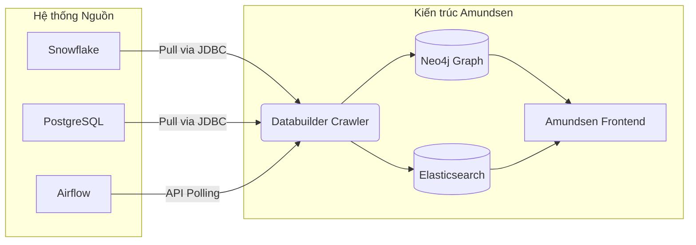
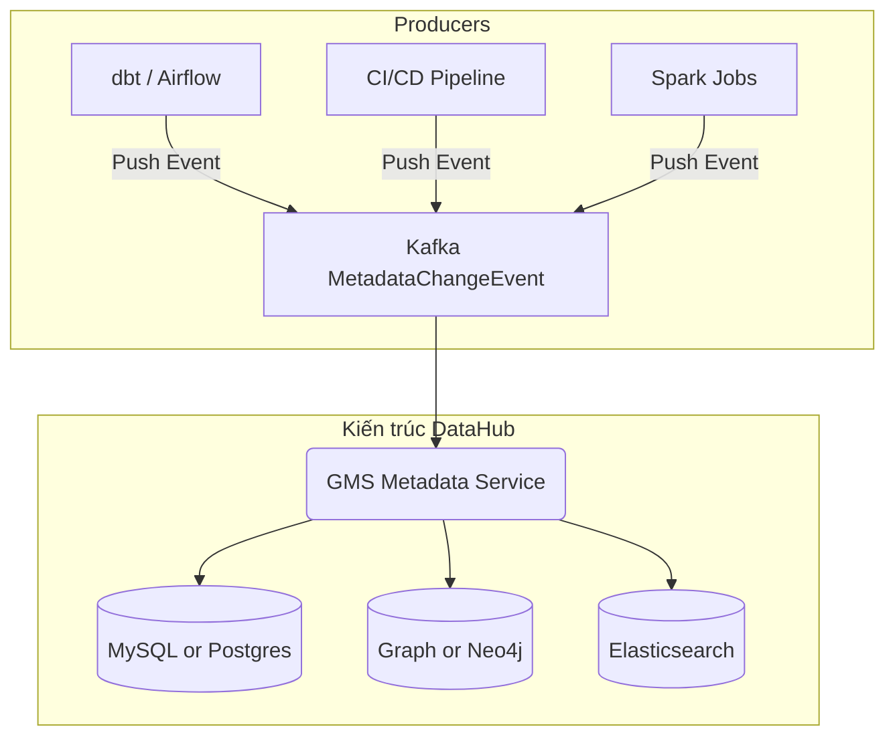

Vào một buổi sáng thứ Hai, dashboard tài chính của công ty bỗng nhiên báo số liệu doanh thu tụt giảm một nửa. Sau nhiều giờ debug, đội ngũ phát hiện ra nguyên nhân rất lãng xẹt: một kỹ sư phần mềm đã âm thầm đổi tên cột `total_amount` thành `gross_revenue` trong database gốc. Không có hệ thống cảnh báo, không có quy trình chặn (gatekeeping), và dữ liệu cứ thế vỡ vụn dọc theo luồng pipeline. Đây là điển hình của hiện tượng **Metadata Drift** và **Dark Data** – những hệ quả tất yếu khi tổ chức không có một công cụ quản lý siêu dữ liệu (metadata) hiệu quả.

Data Catalog ra đời để giải bài toán này. Tuy nhiên, Data Catalog không phải là một công cụ UI đơn giản để gõ từ khóa và tìm kiếm bảng. Ở quy mô Enterprise — nơi hàng nghìn pipelines chạy liên tục tạo ra hàng Petabyte dữ liệu mỗi ngày — Data Catalog là **Metadata Control Plane** trung tâm.

## Data Catalog như một Metadata Control Plane

Theo truyền thống, Data Catalog là tài liệu thụ động. Nó trả lời câu hỏi *"Bảng này nghĩa là gì?"* do con người tự nhập liệu. Tuy nhiên, kiến trúc dữ liệu hiện đại yêu cầu **Active Metadata** [DataHub docs](https://datahubproject.io/docs/architecture/architecture/).

Metadata Control Plane nâng cấp Catalog từ "từ điển" thành một tầng cơ sở hạ tầng (infrastructure layer) hoạt động liên tục:
- **Tự động hóa quản trị (Active Governance):** Nếu phát hiện cột mới có định dạng của số an sinh xã hội (SSN), Catalog lập tức phát tín hiệu cho hệ thống phân quyền để khóa bảng.
- **Data Lineage:** Vẽ ra biểu đồ phụ thuộc từ nguồn (PostgreSQL) qua pipeline (Airflow, dbt) tới tận đích (Báo cáo Tableau). Khi một nguồn sập, kỹ sư biết chính xác dashboard nào sẽ chết theo.
- **Vận hành (Operational Intelligence):** Lưu trữ lịch sử thực thi, số lượng hàng, và chất lượng dữ liệu. 

Hệ thống Data Catalog quy mô lớn thường cấu thành từ 4 lớp:
1. **Ingestion Layer:** Thu thập Metadata từ Source (Snowflake, BigQuery, Kafka, Airflow).
2. **Metadata Storage:** Thường kết hợp Relational Database cho giao dịch cơ bản và Graph Database để truy xuất Lineage.
3. **Search Index:** Cung cấp khả năng tìm kiếm Full-text tốc độ cao (thường là Elasticsearch).
4. **Serving Layer (API):** Cung cấp API (REST, GraphQL) cho Frontend và các hệ thống khác.

Cuộc chiến kiến trúc thú vị nhất nằm ở **Ingestion Layer**, với hai mô hình đại diện: **Pull-based (Batch)** và **Push-based (Event-Driven)**.

## Thế hệ 2 (Pull-Based / Batch): Kiến trúc của Lyft Amundsen

Ở mô hình Pull, Data Catalog là bên chủ động đọc metadata từ hệ thống nguồn. Các cron job định kỳ quét (crawl) qua hệ thống nguồn để "kéo" metadata về. Lyft Amundsen — dự án mã nguồn mở tiên phong về Data Discovery — sử dụng kiến trúc này [Lyft Engineering](https://eng.lyft.com/amundsen-lyfts-data-discovery-metadata-engine-62d27254fbb9).

Trong Amundsen, một thành phần gọi là `Databuilder` (thường chạy trên Airflow) sẽ lấy metadata, xử lý và đẩy vào Neo4j (cho Graph) và Elasticsearch (cho Search).

**Đánh đổi (Trade-offs):**
- **Sự đơn giản (Decoupling):** Hệ thống nguồn (Snowflake, Postgres) hoàn toàn "ngu ngơ" và không cần biết về sự tồn tại của Catalog. Bạn không cần sửa code ở nguồn.
- **Độ trễ cao (Staleness):** Metadata luôn bị trễ (out-of-sync) so với thực tế. Nếu schema thay đổi lúc 9h sáng, Catalog vẫn hiển thị schema cũ cho đến đợt quét đêm hôm sau.
- **Chi phí điện toán (Compute Cost):** Tại các công ty lớn có hàng trăm nghìn bảng, việc quét `INFORMATION_SCHEMA` liên tục sẽ đánh thức (wake up) các Warehouse đang ngủ, gây tốn compute credit (FinOps risk).

## Thế hệ 3 (Push-Based / Real-time): Kiến trúc LinkedIn DataHub

Để giải bài toán độ trễ, DataHub giới thiệu kiến trúc **Push-based** hướng sự kiện (Event-Driven) [DataHub docs](https://datahubproject.io/docs/architecture/architecture/).

Thay vì Catalog đi thu thập, các hệ thống nguồn (hoặc CI/CD pipeline) chủ động bắn metadata qua Kafka mỗi khi có sự kiện (tạo bảng, chạy xong task). DataHub lắng nghe Kafka và cập nhật Metadata Service theo thời gian thực. (Lưu ý: DataHub hiện đại hỗ trợ cả Pull thông qua module ingestion, nhưng linh hồn kiến trúc của nó là Push).

**Đánh đổi (Trade-offs):**
- **Real-time Metadata:** Cho phép Active Governance. Ngay khi schema vỡ, cảnh báo Slack có thể được kích hoạt ngay lập tức.
- **Độ phức tạp (Coupling & Overhead):** Yêu cầu vận hành hạ tầng Message Queue (Kafka). Mọi ETL engine hoặc ứng dụng gốc phải được cài đặt SDK (instrumented) để biết cách gửi gói tin đến Kafka hoặc DataHub REST API.

## Thiết kế Schema-First vs. JSON Blob

Khi thiết kế lõi lưu trữ cho Catalog, nhiều kỹ sư có xu hướng ném tất cả vào một cột JSON phi cấu trúc. Kết quả là hệ thống nhanh chóng biến thành bãi rác.

DataHub giải quyết việc này bằng **PDL (Pegasus Data Language)** và kiến trúc hướng Khía cạnh (Aspect-Oriented). Một Data Asset (ví dụ một Bảng) được cấu thành từ nhiều "Aspects" độc lập: `SchemaMetadata`, `Ownership`, `DatasetProfile`, `Lineage`. 

Việc module hóa này rất quan trọng: Nếu team Data Quality cập nhật `DatasetProfile` (ví dụ tỉ lệ null), thao tác này hoàn toàn độc lập và không ghi đè lên `Ownership` do team Governance quản lý.

## Rủi ro Vận hành và Failure Modes thực tế

Khi triển khai Data Catalog ở quy mô Enterprise, Data Engineer thường vấp phải các sự cố đặc thù:

### 1. Elasticsearch Mapping Explosion
Trong Amundsen hay DataHub, Elasticsearch phục vụ Search. Nếu hệ thống cho phép kỹ sư đẩy các Custom Properties linh tinh dưới dạng JSON động (dynamic key) vào metadata payload, Elasticsearch sẽ cố gắng tạo index (mapping) cho mỗi field mới. Khi số field vượt quá limit (mặc định 1000 fields/index), cluster sẽ từ chối ghi (Write Rejection) hoặc Crash do cạn kiệt Heap RAM để lưu meta-mapping.
**Giải pháp:** Bắt buộc đặt `dynamic: false` hoặc `dynamic: strict` trên Elasticsearch template, hoặc dùng kiểu dữ liệu `flattened` cho Custom JSON.

### 2. Cartesian Explosion trong Graph (Data Lineage)
Data Lineage thường dùng Graph Database. Giả sử bảng `Users_Core` được đọc bởi 10,000 bảng con (Downstream). Khi người dùng mở UI để xem Lineage, truy vấn Graph (Graph Traversal Query) sẽ kích hoạt bùng nổ tổ hợp chập. GraphDB ngốn 100% CPU, query timeout và sập luôn server GMS.
**Giải pháp:** Đặt Hard-limit độ sâu của traversal (ví dụ: tối đa 2 hops). Hỗ trợ Pagination (phân trang) trên UI khi mở rộng các super-nodes.

### 3. "Bãi rác có mục lục" (Garbage In, Garbage Out)
Đây là lỗi kiến trúc thông tin (Information Architecture). Kho dữ liệu có 500,000 bảng, trong đó 90% là bảng tạm (temp tables) do dbt sinh ra hoặc nháp của Data Scientist. Nếu đẩy tất cả vào Catalog, người dùng sẽ không tìm thấy bảng chuẩn.
**Giải pháp:** Cần hàng rào thu thập (Ingestion Filters). Chỉ lấy các bảng ở schema `PROD`. Đồng thời, khai thác tính toán PageRank dựa trên Audit Logs (bảng nào được query nhiều nhất) để đẩy lên đầu kết quả tìm kiếm (như cách Amundsen áp dụng [Lyft Engineering](https://eng.lyft.com/amundsen-lyfts-data-discovery-metadata-engine-62d27254fbb9)).

## Khi nào nên dùng kiến trúc nào?

- **Chọn mô hình Pull (như Amundsen):** Khi hạ tầng đang phân mảnh, bạn muốn một quick win để lập index nhanh cho Snowflake/BigQuery mà không cần chạm vào code của các data producers. Phù hợp cho Data Discovery thông thường.
- **Chọn mô hình Push (như DataHub):** Khi tổ chức muốn xây dựng Data Mesh hoặc Data Contracts có kiểm soát chặt, metadata cần đủ mới để tự động chặn các luồng dữ liệu lỗi ngay tại nguồn.

## Thuật ngữ chính (Key terms)

| Term | Nghĩa ngắn |
| --- | --- |
| **Metadata Drift** | Hiện tượng logic vật lý thay đổi (đổi cột, kiểu dữ liệu) nhưng tài liệu và downstream chưa cập nhật. |
| **Active Metadata** | Siêu dữ liệu được thu thập và tích hợp liên tục vào các công cụ vận hành để ra quyết định tự động. |
| **Pull-based Ingestion** | Hệ thống (Catalog) chủ động đi quét và thu thập thông tin theo chu kỳ. |
| **Push-based Ingestion** | Hệ thống Nguồn chủ động bắn thông tin dưới dạng sự kiện (Event) ngay khi có thay đổi. |
| **Graph Database** | Cơ sở dữ liệu chuyên lưu trữ thực thể và mối quan hệ (Nodes/Edges), lý tưởng để lưu Lineage. |

## References

- DataHub Architecture Overview. *DataHub*. [https://datahubproject.io/docs/architecture/architecture/](https://datahubproject.io/docs/architecture/architecture/)
- Amundsen — Lyft’s data discovery & metadata engine. *Lyft Engineering*. [https://eng.lyft.com/amundsen-lyfts-data-discovery-metadata-engine-62d27254fbb9](https://eng.lyft.com/amundsen-lyfts-data-discovery-metadata-engine-62d27254fbb9)
